# Service Communication Architecture

> **Purpose**: Comprehensive overview of how Mindler's 33 microservices communicate with each other
> 
> **Source**: Neo4j CodeGraph database analysis
> 
> **Last Updated**: 2025-01-06

---

## Table of Contents

1. [High-Level Architecture](#high-level-architecture)
2. [Communication Patterns](#communication-patterns)
3. [Core Services & Their Dependencies](#core-services--their-dependencies)
4. [Database Access Patterns](#database-access-patterns)
5. [Event-Driven Architecture](#event-driven-architecture)
6. [Service-to-Service Communication Map](#service-to-service-communication-map)

---

## High-Level Architecture

```mermaid
graph TB
    subgraph "Client Applications"
        WebApp[Web Frontend<br/>React]
        MobileApp[Mobile App<br/>React Native]
        BackOffice[Back Office<br/>React]
    end
    
    subgraph "API Gateway Layer"
        MindlerAPI[mindlerapi<br/>tRPC API<br/>Primary Gateway]
        B2BAPI[b2b-membership<br/>tRPC API<br/>Corporate Memberships]
        HealthAPI[health-profiles<br/>REST API<br/>Clinical Data]
        TestAPI[test-user-api<br/>Test User Management]
    end
    
    subgraph "Event Bus Layer"
        EventLoki[event-loki<br/>Central Event Bus<br/>Analytics & Logging]
        EventEmitter[event-emitter<br/>System Event Generator<br/>Cron-based]
    end
    
    subgraph "Authentication Services"
        BankID[bankid<br/>Swedish BankID]
        PasskeyAuth[passkey-auth<br/>WebAuthn]
        ThirdPartyAuth[third-party-auth<br/>OAuth Providers]
        VideocallAuth[videocall-auth<br/>Session Tokens]
    end
    
    subgraph "Core Business Services"
        Miami[miami<br/>Booking Management]
        Indianapolis[indianapolis<br/>iCBT Programs]
        SlotTemplates[slot-templates<br/>Calendar Templates]
        Reminders[reminders<br/>Notification Scheduler]
    end
    
    subgraph "Payment & Billing Services"
        Invoicing[invoicing<br/>Invoice Processing]
        Frikort[frikort<br/>Free Card System (SE)]
        Retargeting[retargeting<br/>Payment Recovery]
    end
    
    subgraph "Integration Services"
        WebdocHook[webdoc-hook<br/>External Journal Sync]
        MedicoreSync[medicore-sync<br/>Medical Records]
        SPAR[spar<br/>Swedish Registry]
        Consentry[consentry<br/>Consent Management]
    end
    
    subgraph "Data & Analytics Services"
        PNBReports[pnb-reports<br/>Business Reports]
        PNBExporter[pnb-data-exporter<br/>Data Export]
        Pseudonymizer[pseudonymizer<br/>Data Anonymization]
        PseudoSync[pseudo-sync<br/>Pseudonym Sync]
        GCPBackup[gcp-backup<br/>BigQuery Backup]
    end
    
    subgraph "Utility Services"
        SendEmail[send-email<br/>Email Dispatcher]
        Fileserve[fileserve<br/>File Storage]
        NoShowStatus[no-show-status<br/>Attendance Tracking]
        RemoveAccounts[remove-old-accounts<br/>GDPR Cleanup]
        MySQLStream[mysql-stream<br/>DB Change Stream]
    end
    
    subgraph "Databases"
        MindlerDB[(MindlerDB<br/>MySQL<br/>Primary Database)]
        HealthDB[(health_profiles_db<br/>PostgreSQL 14<br/>Clinical Data)]
        B2BDB[(b2b_membership_db<br/>PostgreSQL<br/>Corporate Data)]
        DynamoDB[(DynamoDB<br/>Various Tables)]
    end
    
    subgraph "External Systems"
        Webdoc[Webdoc Journal<br/>External EHR]
        Billogram[Billogram<br/>Invoice Provider]
        SPARRegistry[SPAR<br/>Swedish Registry]
        BigQuery[Google BigQuery<br/>Data Warehouse]
    end
    
    %% Client to API connections
    WebApp --> MindlerAPI
    WebApp --> B2BAPI
    MobileApp --> MindlerAPI
    BackOffice --> MindlerAPI
    BackOffice --> B2BAPI
    BackOffice --> HealthAPI
    BackOffice --> TestAPI
    
    %% API to Database connections
    MindlerAPI --> MindlerDB
    B2BAPI --> B2BDB
    HealthAPI --> HealthDB
    Miami --> MindlerDB
    Indianapolis --> MindlerDB
    SlotTemplates --> MindlerDB
    Reminders --> MindlerDB
    Invoicing --> MindlerDB
    Frikort --> MindlerDB
    WebdocHook --> MindlerDB
    NoShowStatus --> MindlerDB
    
    %% Event-driven connections
    MindlerAPI --> EventLoki
    HealthAPI --> EventLoki
    B2BAPI --> EventLoki
    EventEmitter --> EventLoki
    EventLoki --> PNBReports
    EventLoki --> GCPBackup
    EventLoki --> WebdocHook
    
    %% Service-to-Service tRPC connections
    PNBReports -.tRPC.-> B2BAPI
    BackOffice -.tRPC.-> MindlerAPI
    
    %% External integrations
    WebdocHook --> Webdoc
    Invoicing --> Billogram
    SPAR --> SPARRegistry
    GCPBackup --> BigQuery
    WebdocHook --> SPAR
    
    %% Authentication flows
    MindlerAPI --> BankID
    MindlerAPI --> PasskeyAuth
    MindlerAPI --> ThirdPartyAuth
    
    %% Data flow
    HealthAPI --> Pseudonymizer
    Pseudonymizer --> PseudoSync
    MySQLStream --> MindlerDB
    
    style MindlerAPI fill:#4CAF50
    style EventLoki fill:#FF9800
    style MindlerDB fill:#2196F3
    style HealthDB fill:#2196F3
    style B2BDB fill:#2196F3
```

---

## Communication Patterns

### 1. Synchronous Communication (tRPC)

**Primary Pattern**: Client applications communicate with backend services via tRPC (Type-safe RPC over HTTP)

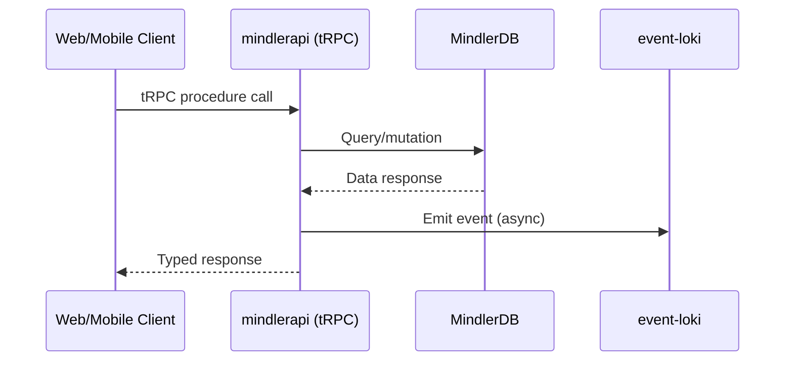

**Services Exposing tRPC**:
- `mindlerapi` - Main API (600+ procedures)
- `b2b-membership` - Corporate membership API

**Inter-Service tRPC Communication**:
```typescript
// Example: pnb-reports calling b2b-membership
import { createClient } from "@mindlercare/b2b-membership-client";

const client = createClient({ stage, region, jwtToken });
const memberships = await client.getMembershipBillingInfoByIds.query(membershipIds);
```

---

### 2. Event-Driven Communication (EventBridge + SQS)

**Pattern**: Services emit domain events to EventBridge, consumed via SQS queues

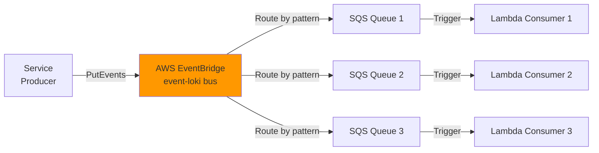

**Event Namespace Convention**:
- `se.mindler.raw.*` - Raw domain events
- Examples:
  - `se.mindler.raw.treatment.course.ended`
  - `se.mindler.raw.treatment.course.started`
  - `se.mindler.raw.program.requested`
  - `se.mindler.raw.icbt.feedback.published`
  - `se.mindler.raw.invoice.created`

**Key SQS Queues**:

| Queue Name | Purpose | Consumer |
|------------|---------|----------|
| `EntryQueue` | Health profile events entry point | health-profiles |
| `JournalQueue` | Journal entry processing | health-profiles |
| `DataWarehouseQueue` | Analytics data ingestion | health-profiles |
| `MdsQueue` | Medical data sync | health-profiles |
| `ConsentWithdrawalQueue.fifo` | GDPR consent withdrawal | health-profiles |
| `WebdocHealthProfiles.fifo` | Questionnaire sync to Webdoc | webdoc-hook |
| `WebdocIndianapolis.fifo` | iCBT completion sync | webdoc-hook |
| `WebdocInvoiceCreated` | Invoice sync to Webdoc | webdoc-hook |
| `WeeklyCheckinTopic.fifo` (SNS) | Weekly check-in reminders | health-profiles |

---

### 3. Database Access Patterns

```mermaid
graph TB
    subgraph "MindlerDB (MySQL) - Primary Database"
        mindlerapi[mindlerapi]
        miami[miami]
        indianapolis[indianapolis]
        slotTemplates[slot-templates]
        reminders[reminders]
        invoicing[invoicing]
        frikort[frikort]
        webdocHook[webdoc-hook]
        noShow[no-show-status]
        removeAccounts[remove-old-accounts]
        retargeting[retargeting]
        spar[spar]
        bankid[bankid]
        consentry[consentry]
        eventEmitter[event-emitter]
        medicore[medicore-sync]
        testAPI[test-user-api]
        videocallAuth[videocall-auth]
    end
    
    subgraph "health_profiles_db (PostgreSQL 14)"
        healthAPI[health-profiles API]
        storeOrphan[store-orphan-questionnaire]
    end
    
    subgraph "b2b_membership_db (PostgreSQL)"
        b2bAPI[b2b-membership API]
    end
    
    subgraph "DynamoDB Tables"
        webdocDDB[webdoc-hook<br/>WebdocMappings table]
        eventEmitterDDB[event-emitter<br/>Event deduplication]
    end
    
    MindlerDB[(MindlerDB<br/>MySQL)]
    HealthDB[(health_profiles_db<br/>PostgreSQL)]
    B2BDB[(b2b_membership_db<br/>PostgreSQL)]
    DDB[(DynamoDB)]
    
    mindlerapi --> MindlerDB
    miami --> MindlerDB
    indianapolis --> MindlerDB
    slotTemplates --> MindlerDB
    reminders --> MindlerDB
    invoicing --> MindlerDB
    frikort --> MindlerDB
    webdocHook --> MindlerDB
    noShow --> MindlerDB
    removeAccounts --> MindlerDB
    retargeting --> MindlerDB
    spar --> MindlerDB
    bankid --> MindlerDB
    consentry --> MindlerDB
    eventEmitter --> MindlerDB
    medicore --> MindlerDB
    testAPI --> MindlerDB
    videocallAuth --> MindlerDB
    
    healthAPI --> HealthDB
    storeOrphan --> HealthDB
    
    b2bAPI --> B2BDB
    
    webdocDDB --> DDB
    eventEmitterDDB --> DDB
```

**Database Access Summary**:

| Database | Services (Count) | Primary Purpose |
|----------|------------------|-----------------|
| **MindlerDB (MySQL)** | 18 services | Core business data (users, slots, payments) |
| **health_profiles_db (PostgreSQL)** | 2 services | Clinical questionnaires, health data |
| **b2b_membership_db (PostgreSQL)** | 1 service | Corporate memberships |
| **DynamoDB** | 2 services | Event deduplication, mapping tables |

---

### 4. HTTP/REST Communication

**Pattern**: External system integrations and legacy REST APIs

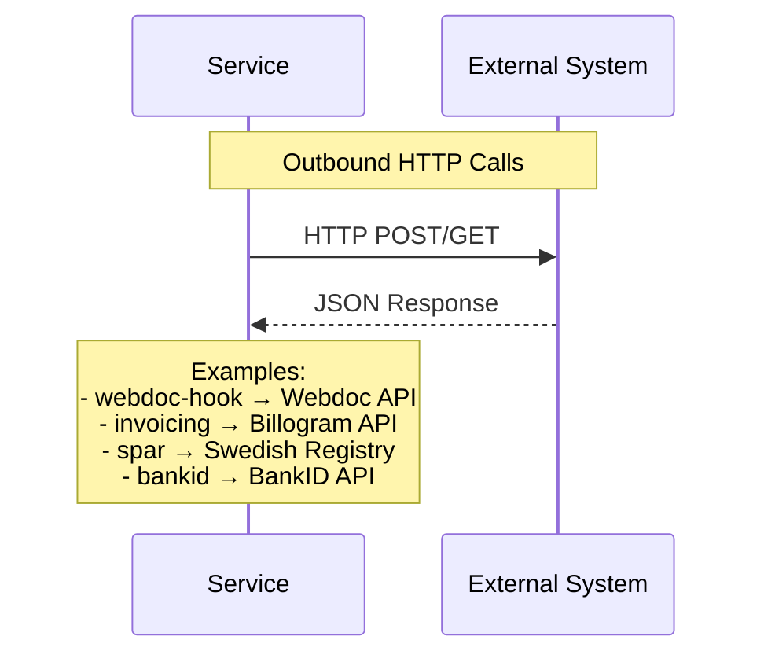

**External System Integrations**:

| Service | External System | Protocol | Purpose |
|---------|----------------|----------|---------|
| `webdoc-hook` | Webdoc Journal | REST | Sync clinical notes |
| `invoicing` | Billogram | REST | Invoice creation/management |
| `spar` | SPAR Registry | REST | Swedish population data |
| `bankid` | BankID | REST | Swedish authentication |
| `gcp-backup` | Google BigQuery | gRPC/REST | Analytics backup |
| `consentry` | Consentry API | REST | Consent management |

---

## Core Services & Their Dependencies

### 1. mindlerapi (Central API)

**Role**: Primary tRPC API gateway for all client applications

**Dependencies**:
- **Database**: MindlerDB (MySQL) via RDS Proxy
- **Events**: Emits to event-loki
- **Services Called**:
  - `bankid` (authentication)
  - `passkey-auth` (WebAuthn)
  - `third-party-auth` (OAuth)
  - `videocall-auth` (session tokens)
  - Log-washer client (event logging)

**Clients**:
- Web frontend (React)
- Mobile app (React Native)
- Back office (React)

**Communication Pattern**:
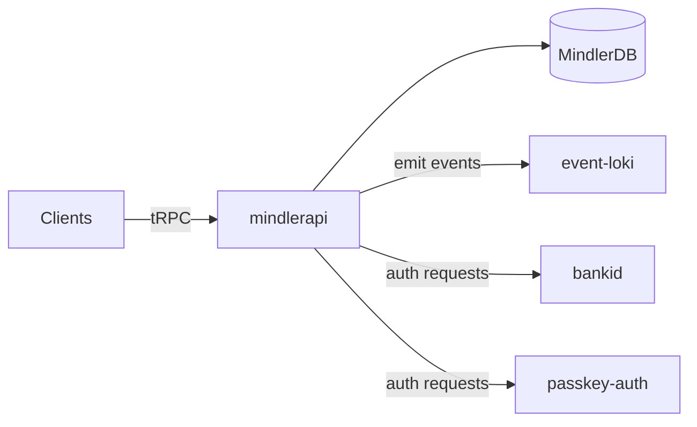

---

### 2. health-profiles (Clinical Data Service)

**Role**: Manage clinical questionnaires, health data, and iCBT programs

**Dependencies**:
- **Database**: health_profiles_db (PostgreSQL 14)
- **Events**: Emits and consumes via EventBridge
- **Queue Consumers**:
  - `EntryQueue` (main entry point)
  - `JournalQueue` (journal processing)
  - `DataWarehouseQueue` (analytics)
  - `MdsQueue` (medical data)
  - `ConsentWithdrawalQueue.fifo` (GDPR)

**Event Flow**:
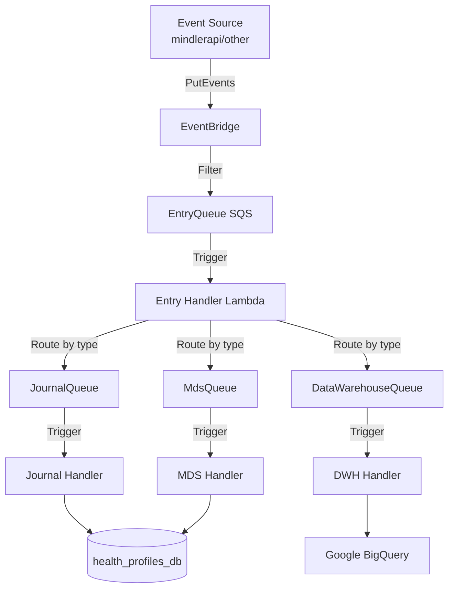

**Scheduler Integration** (EventBridge Scheduler):
- Manages iCBT due date reminders
- Schedules feedback publication
- Uses patient timezone resolution

---

### 3. b2b-membership (Corporate Membership Service)

**Role**: Manage corporate B2B memberships and eligibility

**Dependencies**:
- **Database**: b2b_membership_db (PostgreSQL)
- **Events**: Emits to event-loki
- **API**: Exposes tRPC endpoints

**Clients**:
- `pnb-reports` (via tRPC client)
- Back office applications

**CSV Import Pipeline**:
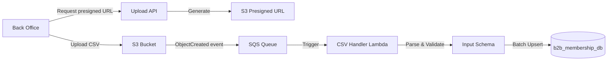

---

### 4. webdoc-hook (External Journal Integration)

**Role**: Sync clinical data to external Webdoc journal system

**Dependencies**:
- **Database**: MindlerDB (read-only for slots/users)
- **Queue Consumers**:
  - `WebdocHealthProfiles.fifo` (questionnaires from health-profiles)
  - `WebdocIndianapolis.fifo` (iCBT completions from indianapolis)
  - `WebdocInvoiceCreated` (invoice events from invoicing)
- **External API**: Webdoc REST API
- **DynamoDB**: WebdocMappings table (ID mapping)
- **Integration**: SPAR service (Swedish registry sync)

**Data Flow**:
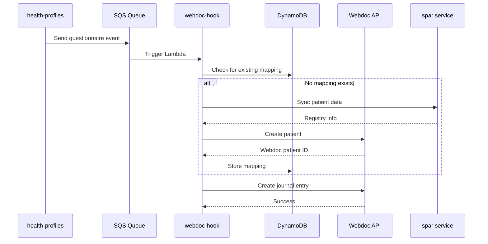

---

### 5. event-emitter (System Event Generator)

**Role**: Generate virtualized events based on database state changes

**Purpose**: Move from cron-based DB scanning to event-driven architecture

**Pattern**:
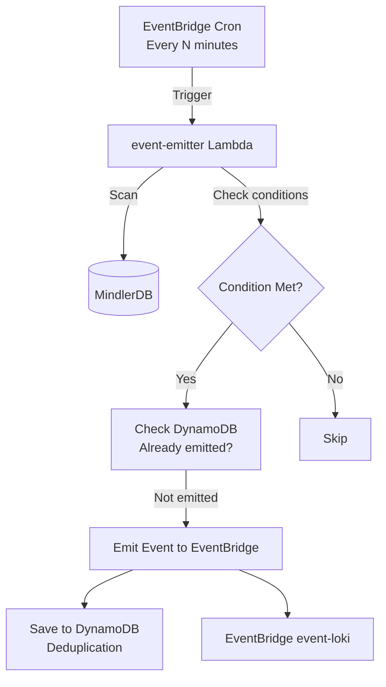

**Example Events Generated**:
- `MeetingEnded` - When a slot end time is reached
- `TreatmentCourseEnded` - When treatment period completes
- `SlotNoShow` - When patient doesn't join

---

### 6. event-loki (Central Event Bus)

**Role**: Central event bus for analytics, logging, and event distribution

**Architecture**:
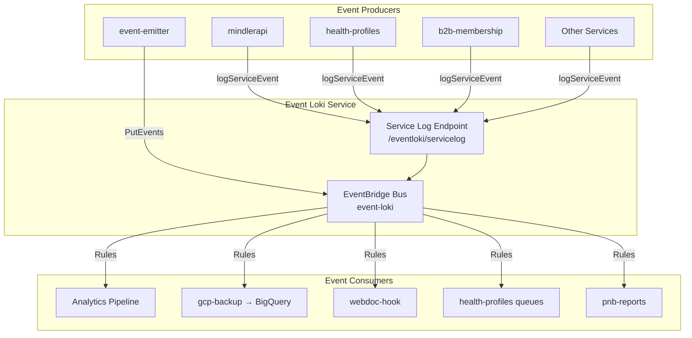

**Event Structure** (from @mindlercare/log-washer-client):
```typescript
interface MindlerEvent {
  name: string;                    // Event type
  event_version: number;           // Schema version
  properties: Record<string, any>; // Event payload
  timestamps: {
    originalTimestamp: string;
    sentAt: string;
  };
}
```

---

### 7. Payment & Billing Services

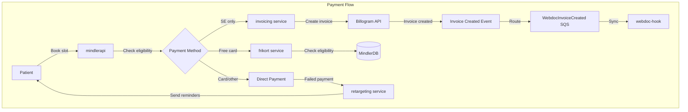

**invoicing Service**:
- **Database**: MindlerDB
- **External**: Billogram API (Swedish invoice provider)
- **Events**: Emits `se.mindler.raw.invoice.created`
- **Restrictions**: Sweden (SE) only

**frikort Service** (Free Card System):
- **Database**: MindlerDB
- **Purpose**: Government-subsidized mental health cards (Sweden)
- **Logic**: Track usage limits and eligibility

**retargeting Service**:
- **Database**: MindlerDB
- **Purpose**: Send payment reminder emails for failed transactions

---

### 8. Authentication Services

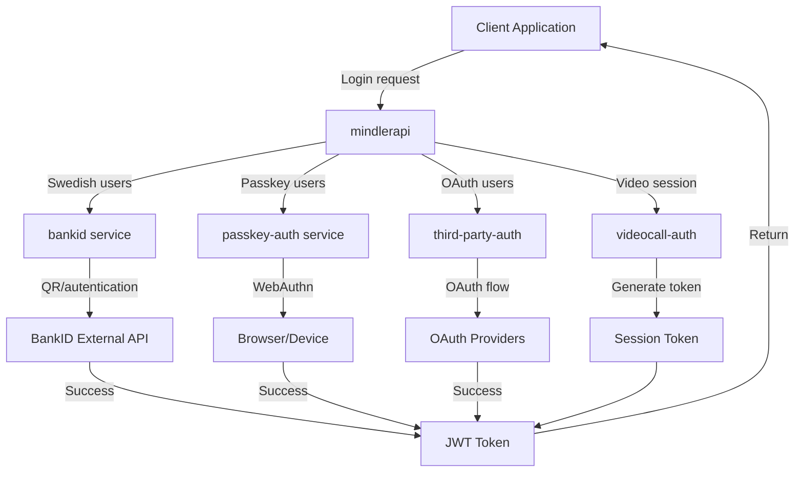

---

### 9. Data & Analytics Services

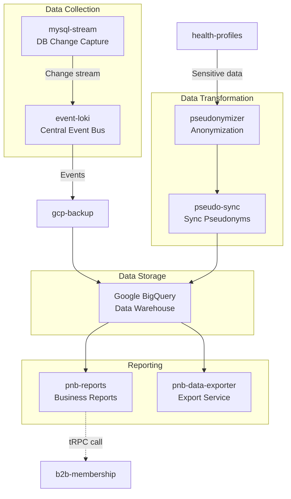

**Key Services**:

| Service | Purpose | Data Flow |
|---------|---------|-----------|
| `gcp-backup` | Stream events to BigQuery | event-loki → BigQuery |
| `pseudonymizer` | Anonymize sensitive health data | health-profiles → pseudonyms |
| `pseudo-sync` | Sync pseudonyms to data warehouse | pseudonyms → BigQuery |
| `pnb-reports` | Generate business reports | BigQuery + b2b-membership → Reports |
| `pnb-data-exporter` | Export data for analytics | BigQuery → Exports |

---

### 10. Utility Services

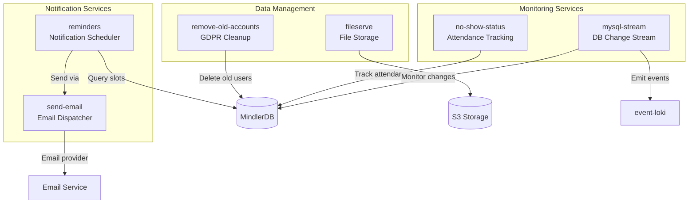

---

## Service-to-Service Communication Map

```mermaid
graph TB
    subgraph "Client Layer"
        Clients[Web/Mobile/BackOffice]
    end
    
    subgraph "API Gateway Services"
        MindlerAPI[mindlerapi<br/>tRPC]
        B2BAPI[b2b-membership<br/>tRPC]
        HealthAPI[health-profiles<br/>REST]
    end
    
    subgraph "Business Logic Services"
        Miami[miami]
        Indianapolis[indianapolis]
        SlotTemplates[slot-templates]
        Invoicing[invoicing]
        Frikort[frikort]
        Reminders[reminders]
    end
    
    subgraph "Integration Services"
        WebdocHook[webdoc-hook]
        SPAR[spar]
        Consentry[consentry]
        MedicoreSync[medicore-sync]
    end
    
    subgraph "Auth Services"
        BankID[bankid]
        PasskeyAuth[passkey-auth]
        ThirdPartyAuth[third-party-auth]
        VideocallAuth[videocall-auth]
    end
    
    subgraph "Event & Data Services"
        EventLoki[event-loki]
        EventEmitter[event-emitter]
        Pseudonymizer[pseudonymizer]
        GCPBackup[gcp-backup]
        PNBReports[pnb-reports]
    end
    
    subgraph "Utility Services"
        SendEmail[send-email]
        Fileserve[fileserve]
        NoShowStatus[no-show-status]
        RemoveAccounts[remove-old-accounts]
    end
    
    subgraph "Databases"
        MindlerDB[(MindlerDB<br/>MySQL)]
        HealthDB[(health_profiles_db<br/>PostgreSQL)]
        B2BDB[(b2b_membership_db<br/>PostgreSQL)]
    end
    
    %% Client connections
    Clients -->|tRPC| MindlerAPI
    Clients -->|tRPC| B2BAPI
    Clients -->|REST| HealthAPI
    
    %% API to database
    MindlerAPI --> MindlerDB
    B2BAPI --> B2BDB
    HealthAPI --> HealthDB
    
    %% API to auth services
    MindlerAPI --> BankID
    MindlerAPI --> PasskeyAuth
    MindlerAPI --> ThirdPartyAuth
    MindlerAPI --> VideocallAuth
    
    %% API to event bus
    MindlerAPI --> EventLoki
    B2BAPI --> EventLoki
    HealthAPI --> EventLoki
    
    %% Business services to database
    Miami --> MindlerDB
    Indianapolis --> MindlerDB
    SlotTemplates --> MindlerDB
    Invoicing --> MindlerDB
    Frikort --> MindlerDB
    Reminders --> MindlerDB
    
    %% Integration services
    WebdocHook --> MindlerDB
    WebdocHook --> SPAR
    WebdocHook <--> EventLoki
    SPAR --> MindlerDB
    Consentry --> MindlerDB
    MedicoreSync --> MindlerDB
    
    %% Event-driven
    EventEmitter --> EventLoki
    EventEmitter --> MindlerDB
    EventLoki --> GCPBackup
    EventLoki --> WebdocHook
    EventLoki --> HealthAPI
    
    %% Data services
    HealthAPI --> Pseudonymizer
    PNBReports -.tRPC.-> B2BAPI
    
    %% Utility services
    Reminders --> SendEmail
    NoShowStatus --> MindlerDB
    RemoveAccounts --> MindlerDB
    
    style MindlerAPI fill:#4CAF50
    style EventLoki fill:#FF9800
    style MindlerDB fill:#2196F3
```

---

## Key Takeaways

### Communication Protocols

1. **tRPC (Type-safe RPC)** - Primary API pattern
   - Used by: mindlerapi, b2b-membership
   - Clients: Web, Mobile, Back Office apps

2. **EventBridge + SQS** - Event-driven async communication
   - Central bus: event-loki
   - Pattern: Producer → EventBridge → SQS → Lambda Consumer

3. **REST/HTTP** - External integrations
   - Used for: Webdoc, Billogram, BankID, SPAR, BigQuery

4. **Direct Database Access** - Most services access MindlerDB directly
   - Pattern: Service → RDS Proxy → MindlerDB

### Service Categories

| Category | Services | Communication Pattern |
|----------|----------|----------------------|
| **API Gateways** | mindlerapi, b2b-membership, health-profiles | tRPC/REST exposed to clients |
| **Event Producers** | mindlerapi, health-profiles, event-emitter | Emit to event-loki EventBridge |
| **Event Consumers** | health-profiles, webdoc-hook, gcp-backup | Consume from SQS queues |
| **Database Services** | 18+ services | Direct MySQL/PostgreSQL access |
| **Integration Services** | webdoc-hook, spar, medicore-sync | HTTP to external systems |
| **Auth Services** | bankid, passkey-auth, third-party-auth | Stateless auth token generation |
| **Utility Services** | send-email, fileserve, reminders | Support other services |

### Architectural Principles

1. **Event-Driven First**: Moving from cron-based DB scanning to event-driven patterns
2. **Service Independence**: Most services have dedicated databases or schemas
3. **Type Safety**: tRPC ensures end-to-end type safety for API calls
4. **Async Communication**: EventBridge decouples producers from consumers
5. **External System Isolation**: Integration services (webdoc-hook, spar) isolate external APIs

---

## Recommended Practices

When building new services or features:

1. **API Communication**: Use tRPC for new APIs (follow mindlerapi pattern)
2. **Events**: Emit domain events to event-loki for analytics and cross-service communication
3. **Database**: Prefer dedicated schemas over shared database access
4. **Queues**: Use SQS with FIFO for ordered processing, standard for fan-out
5. **External Systems**: Isolate external integrations in dedicated services
6. **Monitoring**: Emit events to event-loki for observability

---

**Related Documentation**:
- [EventBridge Scheduler Guide](/docs/health-profiles-eventbridge-scheduler.md)
- [B2B Membership NL Guide](/docs/b2b-membership-nl-pending-guide.md)
- Service-specific READMEs in `/services/<service-name>/README.md`
