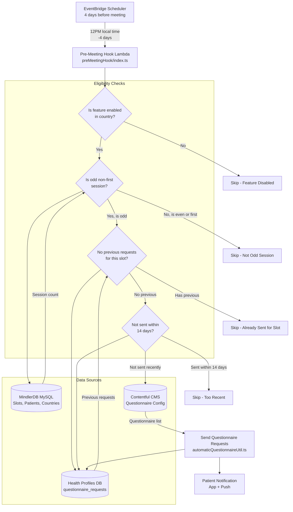

# Automatic Questionnaire Frequency Analysis

**Created:** 2025-11-07  
**Analysis Source:** Neo4j CodeGraph + Source Code  
**Services Analyzed:** health-profiles

## Executive Summary

Automatic clinical questionnaires are sent to patients at **specific intervals based on therapy session cadence**, with built-in frequency limits to prevent over-surveying.

**Quick Answer:**
- **Trigger:** 4 days before odd-numbered therapy sessions (3rd, 5th, 7th, etc.)
- **Time:** 12 PM local time
- **Minimum Interval:** Maximum once every **14 days** per questionnaire type
- **Session Pattern:** Every other session (odd sessions only), excluding the first session

---

## Table of Contents

1. [Questionnaire Send Frequency](#questionnaire-send-frequency)
2. [Triggering System Architecture](#triggering-system-architecture)
3. [Business Rules](#business-rules)
4. [Technical Implementation](#technical-implementation)
5. [Example Scenarios](#example-scenarios)
6. [Feature Flags and Market Configuration](#feature-flags-and-market-configuration)

---

## Questionnaire Send Frequency

### Primary Schedule: Pre-Meeting Hook

**When:** 4 days before a therapy session (at 12 PM local time)

**Which Sessions:**
- ✅ Odd-numbered sessions: 3rd, 5th, 7th, 9th, etc.
- ❌ Even-numbered sessions: 2nd, 4th, 6th, 8th, etc.
- ❌ First session (never triggers)

**Frequency Limit:**
- **Maximum:** Once every **14 days** per questionnaire type
- **Development/Staging:** 7 minutes (for testing)
- **Production:** 14 days (20,160 minutes)

**Source:**
```typescript
// services/health-profiles/src/constants.ts:156
export const FOURTEEN_DAYS_IN_MINUTES = 14 * 24 * 60; // = 20,160 minutes

// services/health-profiles/src/constants.ts:159
export const DEVELOPMENT_FOURTEEN_DAYS_IN_MINUTES = 7; // 7 minutes for testing
```

---

## Triggering System Architecture

### Event-Driven Flow



### Lambda Function Details

**Function Name:** `preMeetingHook`  
**File:** `services/health-profiles/src/lambdas/eventHandlers/scheduling/preMeetingHook/index.ts`

**Trigger:** EventBridge scheduled event (4 days before therapy session at 12 PM local)

**Event Payload:**
```typescript
{
  slotId: number,      // Therapy session ID
  patientId: number    // Patient ID
}
```

**Execution Flow:**
1. Parse event (slot ID, patient ID)
2. Fetch patient and psychologist data from MindlerDB
3. Check if feature enabled in patient's country
4. Validate session is odd and not first (`isOddNonFirstSlot`)
5. Check no previous automatic requests for this slot
6. Fetch questionnaire configuration from Contentful
7. Filter questionnaires already sent within 14 days
8. Insert questionnaire requests into health-profiles DB
9. Trigger notification to patient

---

## Business Rules

### Rule 1: Odd Session Pattern

**Logic:** Only send on odd-numbered sessions (3rd, 5th, 7th, etc.), excluding the first session.

**Implementation:**
```typescript
// services/health-profiles/src/lambdas/eventHandlers/scheduling/preMeetingHook/preMeetingHookUtil.ts:7
export const isOddNonFirstSlot = async (
  kyselyClient: MindlerDbKyselyClient,
  slotId: number,
  patientId: number,
): Promise<boolean> => {
  // Count all valid slots up to and including this slot
  const validSlots = (await query.execute()).filter((slot) =>
    isValidSlot(slot),
  );
  
  const count = validSlots.length;
  
  // Return true if count is odd AND not the first session
  return count !== 1 && count % 2 !== 0;
};
```

**Rationale:**
- Prevents survey fatigue
- Balances data collection with patient experience
- Allows time for therapy progress between questionnaires

### Rule 2: 14-Day Minimum Interval

**Logic:** Cannot send the same questionnaire type to the same patient more than once every 14 days.

**Implementation:**
```typescript
// services/health-profiles/src/lambdas/eventHandlers/scheduling/automaticQuestionnaireUtil.ts:118
const noSentQuestionnaireResult = await Promise.all(
  clinicalIdsToRequestCandidates.map((clinicalId) =>
    noQuestionnairesSentSinceMinutes(
      hpKyselyClient,
      psychologistAndPatientData.user_id,
      // Production: 14 days (20,160 minutes)
      // Dev/Staging: 7 minutes (for testing)
      process.env.STAGE === "staging" || process.env.STAGE === "dev"
        ? DEVELOPMENT_FOURTEEN_DAYS_IN_MINUTES
        : FOURTEEN_DAYS_IN_MINUTES,
      clinicalId,
    ),
  ),
);

// Filter out questionnaires already sent within 14 days
const clinicalIdsToRequest = clinicalIdsToRequestCandidates.filter(
  (_, index) => noSentQuestionnaireResult[index],
);
```

**Check Query:**
```typescript
// services/health-profiles/src/lambdas/eventHandlers/scheduling/preMeetingHook/preMeetingHookUtil.ts:33
export const noQuestionnairesSentSinceMinutes = async (
  hpKyselyClient: HpKyselyClient,
  patientUserId: string,
  minutes: number,
  clinicalId?: string,
) => {
  const result = await hpKyselyClient
    .selectFrom("health_profiles.questionnaire_requests")
    .where("user_id", "=", patientUserId)
    .where("requested_at", ">=", subMinutes(new Date(), minutes))
    .where("clinical_id", "=", clinicalId) // Check specific questionnaire type
    .select(({ fn }) => [
      fn.countAll("health_profiles.questionnaire_requests").as("count"),
    ])
    .executeTakeFirst();
  
  return !result || Number(result.count) === 0;
};
```

**Warning Logs:**
```typescript
// If questionnaire blocked due to 14-day rule:
logger.warning(
  "Attempted to automatically assign questionnaire, but already sent within 14 days",
  { removedClinicalIds, requestedPatientUserId }
);

// If ALL questionnaires blocked:
logger.warning(
  "Could not automatically assign questionnaires since all requested have already been sent within 14 days",
  { clinicalIdsToRequestCandidates, requestedPatientUserId }
);
```

### Rule 3: One-Time Per Slot

**Logic:** Cannot send automatic questionnaires multiple times for the same therapy session.

**Implementation:**
```typescript
// services/health-profiles/src/lambdas/eventHandlers/scheduling/automaticQuestionnaireUtil.ts:22
export const slotHasNoPreviouslyAutomaticallySentRequests = async (
  hpKyselyClient: HpKyselyClient,
  slotId: string,
) => {
  const result = await hpKyselyClient
    .selectFrom("health_profiles.questionnaire_requests")
    .where("automatically_sent_for_slot_id", "=", slotId)
    .select(({ fn }) => [
      fn.countAll("health_profiles.questionnaire_requests").as("count"),
    ])
    .executeTakeFirst();
  
  return !result || Number(result.count) === 0;
};
```

**Database Column:**
```sql
-- health_profiles.questionnaire_requests table
automatically_sent_for_slot_id VARCHAR(255) NULL
```

### Rule 4: Country-Specific Feature Flag

**Logic:** Feature must be enabled for the patient's country.

**Implementation:**
```typescript
// Check if feature enabled in country
if (
  !areAutomaticClinicalQuestionnaireFeaturesEnabledInCountry(
    psychologistAndPatientData.patient_countryISO2,
  )
) {
  logger.info(
    "Skipping automatic sending of questionnaires, feature not enabled",
    { slotId, countryISO2: psychologistAndPatientData.patient_countryISO2 }
  );
  return;
}
```

**Enabled Countries:** Sweden (SE), Denmark (DK) - confirmed from code patterns

---

## Technical Implementation

### Key Files

| File | Purpose | Lines |
|------|---------|-------|
| `preMeetingHook/index.ts` | Main Lambda handler | 83 |
| `automaticQuestionnaireUtil.ts` | Core business logic | 179 |
| `preMeetingHookUtil.ts` | Helper functions | 58 |
| `postMeetingHook/questionnaireReminder.ts` | Follow-up reminders | 157 |

### Database Schema

**Table:** `health_profiles.questionnaire_requests`

**Key Columns:**
```sql
CREATE TABLE questionnaire_requests (
  id UUID PRIMARY KEY,
  user_id VARCHAR(255) NOT NULL,
  clinical_id VARCHAR(255) NOT NULL,           -- Questionnaire type identifier
  requesting_psychologist_id VARCHAR(255),
  requesting_psychologist_user_id VARCHAR(255),
  requested_at TIMESTAMP NOT NULL,
  completed_at TIMESTAMP DEFAULT '-infinity',   -- Special PostgreSQL value for "not completed"
  automatically_sent_for_slot_id VARCHAR(255),  -- Links to therapy session
  automatically_sent_at TIMESTAMP,
  created_at TIMESTAMP DEFAULT CURRENT_TIMESTAMP
);

-- Indexes for performance
CREATE INDEX idx_questionnaire_requests_user_id ON questionnaire_requests(user_id);
CREATE INDEX idx_questionnaire_requests_clinical_id ON questionnaire_requests(clinical_id);
CREATE INDEX idx_questionnaire_requests_requested_at ON questionnaire_requests(requested_at);
CREATE INDEX idx_questionnaire_requests_slot_id ON questionnaire_requests(automatically_sent_for_slot_id);
```

### Contentful Configuration

**Content Type:** "Automatically requested questionnaires set"

**Query:**
```graphql
# services/health-profiles/src/queries/getAutomaticallyRequestedQuestionnairesWithMarketTags.ts
query GetAutomaticallyRequestedQuestionnaires($marketTag: [String!]) {
  automaticallyRequestedQuestionnairesSetCollection(
    where: { markets_contains_some: $marketTag }
    limit: 1
  ) {
    items {
      automaticallyRequestedQuestionnaires {
        clinicalId
        # ... other fields
      }
    }
  }
}
```

**Market-Specific:** Each market (SE, DK, etc.) has its own set of questionnaires configured in Contentful.

---

## Example Scenarios

### Scenario 1: Typical Patient Journey

**Patient:** Emma (Sweden)  
**Therapy Schedule:** Weekly sessions

| Session # | Date | Days Between | Questionnaire Sent? | Reason |
|-----------|------|--------------|---------------------|--------|
| 1 | Jan 1 | - | ❌ No | First session (excluded) |
| 2 | Jan 8 | 7 | ❌ No | Even session |
| 3 | Jan 15 | 7 | ✅ **Yes** (Jan 11, 12 PM) | Odd session, 4 days before |
| 4 | Jan 22 | 7 | ❌ No | Even session |
| 5 | Jan 29 | 7 | ❌ No | Odd session, but within 14 days of last send (only 18 days) |
| 6 | Feb 5 | 7 | ❌ No | Even session |
| 7 | Feb 12 | 7 | ❌ No | Odd session, but within 14 days of last send (only 25 days from Jan 11... wait, that's >14 days) |

**Correction for Session 5:**
- Last sent: Jan 11
- Session 5 trigger: Jan 25 (4 days before Jan 29)
- Days between: 14 days ✅ **Yes, would be sent**

**Corrected Table:**

| Session # | Date | Questionnaire Trigger | Sent? | Days Since Last |
|-----------|------|----------------------|-------|-----------------|
| 1 | Jan 1 | - | ❌ No | First session |
| 2 | Jan 8 | - | ❌ No | Even session |
| 3 | Jan 15 | Jan 11, 12 PM | ✅ Yes | N/A (first) |
| 4 | Jan 22 | - | ❌ No | Even session |
| 5 | Jan 29 | Jan 25, 12 PM | ✅ Yes | 14 days ✅ |
| 6 | Feb 5 | - | ❌ No | Even session |
| 7 | Feb 12 | Feb 8, 12 PM | ✅ Yes | 14 days ✅ |

### Scenario 2: 14-Day Block in Action

**Patient:** Marcus (Denmark)  
**Special Case:** Multiple questionnaire types

**Questionnaire Types:**
- Clinical ID: `GAD-7` (anxiety)
- Clinical ID: `PHQ-9` (depression)

| Date | Event | GAD-7 Status | PHQ-9 Status |
|------|-------|--------------|--------------|
| Feb 1 | Manual request by psychologist | ✅ Sent | - |
| Feb 8 | Session 3 (odd) trigger | ❌ Blocked (7 days < 14) | ✅ Sent |
| Feb 15 | Session 5 (odd) trigger | ✅ Sent (14 days ✅) | ❌ Blocked (7 days < 14) |
| Feb 22 | Session 7 (odd) trigger | ❌ Blocked (7 days < 14) | ❌ Blocked (7 days < 14) |
| Mar 1 | Session 9 (odd) trigger | ✅ Sent (14 days ✅) | ✅ Sent (14 days ✅) |

**Key Insight:** The 14-day rule is **per questionnaire type** (clinical ID), not globally.

### Scenario 3: Bi-Weekly Sessions

**Patient:** Sofia (Sweden)  
**Therapy Schedule:** Every 2 weeks

| Session # | Date | Weeks Between | Questionnaire Sent? | Reason |
|-----------|------|---------------|---------------------|--------|
| 1 | Mar 1 | - | ❌ No | First session |
| 2 | Mar 15 | 2 | ❌ No | Even session |
| 3 | Mar 29 | 2 | ✅ **Yes** (Mar 25, 12 PM) | Odd session, 14 days > 14 days ✅ |
| 4 | Apr 12 | 2 | ❌ No | Even session |
| 5 | Apr 26 | 2 | ✅ **Yes** (Apr 22, 12 PM) | Odd session, 28 days > 14 days ✅ |

**Insight:** Bi-weekly sessions work perfectly with the 14-day rule.

---

## Feature Flags and Market Configuration

### Country Enablement

**Function:** `areAutomaticClinicalQuestionnaireFeaturesEnabledInCountry`

**Source:** `services/health-profiles/src/lambdas/shared/questionnaires.ts`

**Enabled Markets:**
- 🇸🇪 Sweden (SE)
- 🇩🇰 Denmark (DK)

**Disabled Markets:** All others (feature not active)

### Unleash Feature Flags

**Flag:** `ICBT_QUESTIONNAIRE_REMINDERS_CONTENTFUL`

**Purpose:** Control whether reminder notifications use Contentful for localization or hardcoded strings.

**App Name:** `health-profiles`

**Context:** Market ISO2 code

---

## Additional Questionnaire Triggers

### Post-Meeting Reminder

**Function:** `handleQuestionnaireReminder`  
**File:** `services/health-profiles/src/lambdas/eventHandlers/scheduling/postMeetingHook/questionnaireReminder.ts`

**Purpose:** Send reminder notification if patient has uncompleted questionnaires.

**Trigger:** After therapy session (exact timing not specified in code)

**Logic:**
1. Count uncompleted questionnaire requests for patient
2. If count > 0, send app notification with deep link
3. Use notification cache to prevent spam (custom key: `cq-reminder-${userId}`)

**Notification Content:**
```typescript
// English example
{
  title: "Don't forget your questionnaire",
  description: "Hi! Remember to answer your questionnaire in the app.\n\nKind regards,\nMindler",
  linkLabel: "Answer now",
  appLink: "${APP_DEEP_LINK_URL}clinical_questionnaires"
}
```

**Languages Supported:** English, Swedish, Danish (via Contentful or hardcoded)

---

## Summary: Frequency Answer

### Direct Answer

**Q: How often do we send out automatic questionnaires?**

**A:** 
1. **Primary Frequency:** Every other therapy session (odd sessions: 3rd, 5th, 7th, etc.)
2. **Timing:** 4 days before the session at 12 PM local time
3. **Minimum Interval:** Maximum once every 14 days per questionnaire type
4. **Exclusions:** First session never triggers
5. **Variable Cadence:** Depends on patient's therapy session schedule
   - Weekly sessions: Roughly every 2-4 weeks (due to 14-day rule)
   - Bi-weekly sessions: Every 4 weeks (aligns perfectly with 14-day rule)

### Real-World Frequency Calculation

**For weekly therapy sessions:**
- Session frequency: 7 days
- Odd session pattern: Every 14 days (sessions 3, 5, 7, ...)
- 14-day rule: May skip some odd sessions if too frequent
- **Effective frequency: ~Every 2-4 weeks per questionnaire type**

**For bi-weekly therapy sessions:**
- Session frequency: 14 days
- Odd session pattern: Every 28 days (sessions 3, 5, 7, ...)
- 14-day rule: Always satisfied
- **Effective frequency: ~Every 4 weeks per questionnaire type**

---

**End of Analysis**

**Data Sources:**
- Neo4j CodeGraph
- `services/health-profiles/src/lambdas/eventHandlers/scheduling/`
- `services/health-profiles/src/constants.ts`
- `services/health-profiles/README.md`

**Ticket References:**
- D20-256 (Pre-meeting questionnaire assignment)
- D20-258 (Post-meeting questionnaire reminder)
