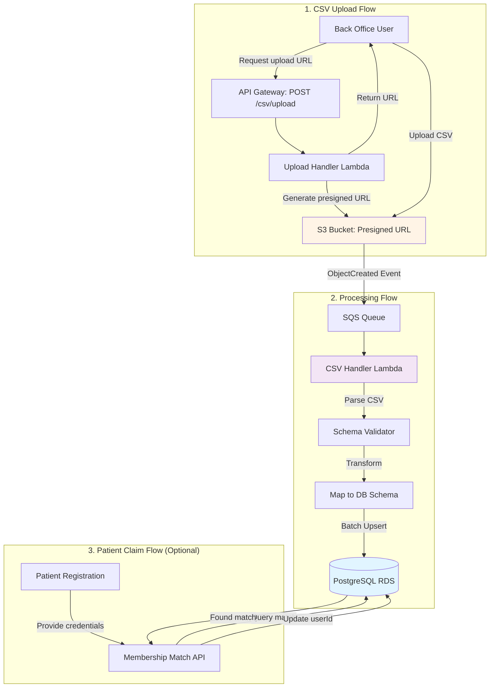
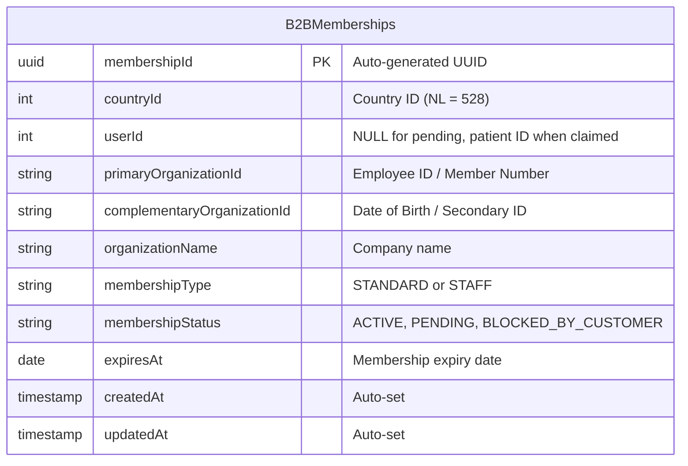
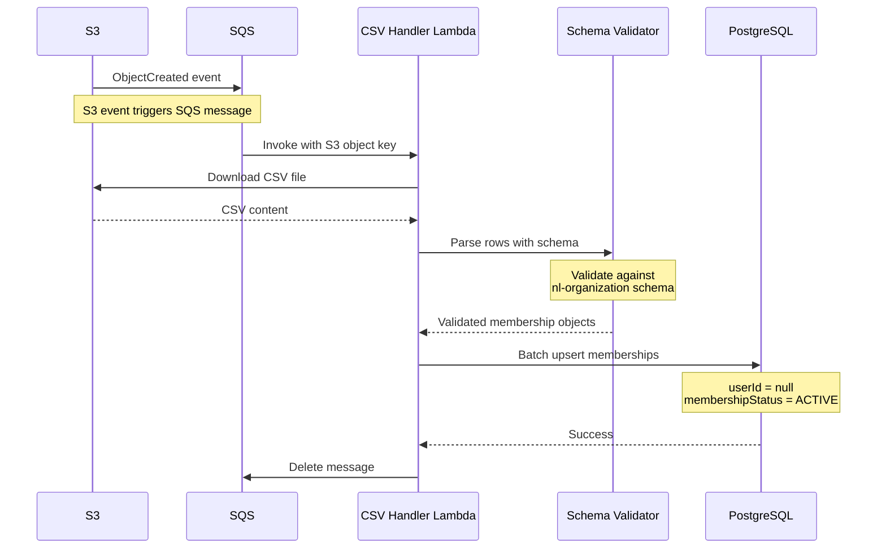
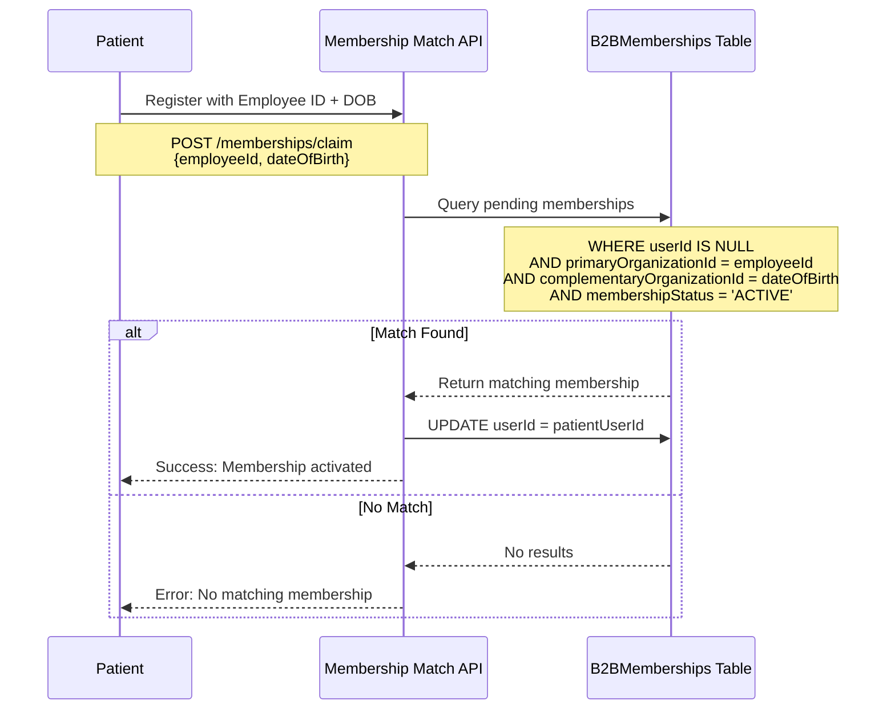

# B2B Membership: Adding Pending Memberships for Netherlands (NL)

> **Purpose**: Guide for adding pending corporate memberships for the Netherlands market
> 
> **Service**: `b2b-membership`
> 
> **Pattern**: CSV bulk upload with S3-triggered processing

---

## Overview

Pending memberships allow organizations to pre-populate employee eligibility before employees register. When an employee signs up and matches their credentials (e.g., employee ID + date of birth), the membership is claimed and the `userId` is populated.

---

## System Architecture



---

## Database Schema: B2BMemberships Table



**Key Fields for Pending Memberships**:
- `userId`: **NULL** = pending membership (not yet claimed by patient)
- `membershipStatus`: **"ACTIVE"** = eligible to claim
- `primaryOrganizationId`: Employee ID used for matching
- `complementaryOrganizationId`: Date of birth (YYYY-MM-DD) for verification

---

## Implementation Steps

### Step 1: Define NL Input Schema

Add to `/services/b2b-membership/src/csv/inputSchemas.ts`:

```typescript
export const sharedInputSchemaFields = {
  vitality: { /* ... existing ... */ },
  
  // Add NL organization config
  nlOrganization: {
    organizationName: "example-nl-company",
    staffOrganizationName: "example-nl-company-staff",
    countryId: Countries.NL, // NL country ID
  },
} as const;

export const inputSchemas: Record<B2BClients, InputToMembershipSchema> = {
  vitality: { /* ... existing ... */ },
  
  // Add NL organization schema
  "nl-organization": z.object({
    EMPLOYEE_ID: z.string().min(1, "Employee ID required"),
    DATE_OF_BIRTH: z.string().regex(/^\d{4}-\d{2}-\d{2}$/, "Format: YYYY-MM-DD"),
    MEMBERSHIP_EXPIRY: z.preprocess(
      (val) => (typeof val === "string" ? new Date(val) : val),
      z.date(),
    ),
    MEMBERSHIP_TYPE: z.enum(["STANDARD", "STAFF"]).default("STANDARD"),
  }).transform(({
    EMPLOYEE_ID,
    DATE_OF_BIRTH,
    MEMBERSHIP_EXPIRY,
    MEMBERSHIP_TYPE,
  }): MembershipDbInput => ({
    countryId: sharedInputSchemaFields.nlOrganization.countryId,
    userId: null, // Pending membership
    primaryOrganizationId: EMPLOYEE_ID,
    complementaryOrganizationId: DATE_OF_BIRTH,
    organizationName: MEMBERSHIP_TYPE === "STAFF" 
      ? sharedInputSchemaFields.nlOrganization.staffOrganizationName
      : sharedInputSchemaFields.nlOrganization.organizationName,
    membershipType: MEMBERSHIP_TYPE,
    membershipStatus: "ACTIVE", // Ready to be claimed
    expiresAt: MEMBERSHIP_EXPIRY,
  })),
};
```

### Step 2: Prepare CSV File

**Format**: `nl-organization.csv`

```csv
EMPLOYEE_ID,DATE_OF_BIRTH,MEMBERSHIP_EXPIRY,MEMBERSHIP_TYPE
EMP12345,1990-05-15,2025-12-31,STANDARD
EMP67890,1985-03-22,2025-12-31,STANDARD
STAFF001,1978-11-30,2025-12-31,STAFF
```

### Step 3: Upload CSV via API

```bash
# 1. Get presigned upload URL
curl -X POST https://api.mindler.com/b2b-membership/csv/upload \
  -H "Authorization: Bearer <token>" \
  -H "Content-Type: application/json" \
  -d '{"clientName": "nl-organization"}'

# Response: { "uploadUrl": "https://s3.amazonaws.com/...", "key": "..." }

# 2. Upload CSV to presigned URL
curl -X PUT "<uploadUrl>" \
  -H "Content-Type: text/csv" \
  --data-binary @nl-organization.csv
```

### Step 4: Automatic Processing



---

## Membership Claim Flow (When Patient Registers)



---

## Key Implementation Details

### Countries Enum (from existing code)
```typescript
export const Countries = {
  SE: 752,  // Sweden
  UK: 826,  // United Kingdom
  NL: 528,  // Netherlands
} as const;
```

### Database Query for Pending Memberships
```typescript
// Find pending membership for claiming
const pendingMembership = await db("B2BMemberships")
  .where({
    countryId: Countries.NL,
    primaryOrganizationId: employeeId,
    complementaryOrganizationId: dateOfBirth,
    membershipStatus: "ACTIVE",
  })
  .whereNull("userId")
  .first();

// Claim membership
if (pendingMembership) {
  await db("B2BMemberships")
    .where({ membershipId: pendingMembership.membershipId })
    .update({
      userId: patientUserId,
      updatedAt: new Date(),
    });
}
```

---

## Testing Checklist

- [ ] Schema validation works for NL CSV format
- [ ] CSV upload generates presigned S3 URL
- [ ] S3 ObjectCreated event triggers Lambda
- [ ] Lambda parses CSV and validates rows
- [ ] Database inserts with `userId = null` and `countryId = NL (528)`
- [ ] Patient registration can query and claim pending membership
- [ ] `userId` updates correctly when claimed
- [ ] Expired memberships (`expiresAt < NOW()`) are handled

---

## Common Issues

| Issue | Cause | Solution |
|-------|-------|----------|
| CSV upload fails | Invalid schema name | Ensure client name matches schema key: `"nl-organization"` |
| No memberships inserted | CSV format mismatch | Validate CSV headers match schema fields exactly |
| Patient can't claim | Wrong date format | `DATE_OF_BIRTH` must be `YYYY-MM-DD` string |
| Duplicate memberships | Re-uploading same CSV | Use upsert logic on `(countryId, primaryOrganizationId)` |

---

## Summary: Quick Start

1. **Add NL schema** to `inputSchemas.ts` with employee ID + DOB matching
2. **Prepare CSV** with columns: `EMPLOYEE_ID`, `DATE_OF_BIRTH`, `MEMBERSHIP_EXPIRY`, `MEMBERSHIP_TYPE`
3. **Upload CSV** via API → S3 presigned URL
4. **Lambda auto-processes** → Inserts rows with `userId = null` (pending)
5. **Patient claims** → Match on employee ID + DOB → `userId` populated

---

**Related Files**:
- Schema: `/services/b2b-membership/src/csv/inputSchemas.ts`
- CSV Handler: `/services/b2b-membership/src/csv/handler.ts`
- Upload API: `/services/b2b-membership/src/csv/upload/handler.ts`
- Database Migration: `/services/b2b-membership/infra/db/migrations/20221123084119_initialSetup.ts`
