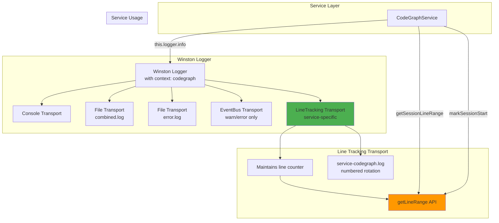
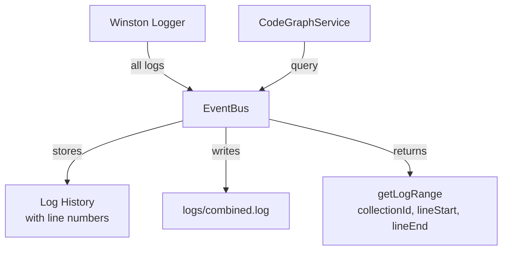

# Logging Architecture - Refined Plan

## Discovery: Round-Robin Logger Has Unique Value

After analyzing `codegraph-service.ts`, I discovered the round-robin logger serves a **critical audit function**:

### Current Round-Robin Logger Features
1. **Line range tracking** - Tracks which log lines belong to each collection
2. **Session markers** - `markSessionStart()` separates processing sessions  
3. **Neo4j integration** - Links collections to log file paths and line ranges
4. **Structured output** - Each log entry is one JSON line

**Example Neo4j relationship**:
```cypher
(Collection)-[:LOGGED_IN {startLine: 45, endLine: 128}]->(LogFile)
```

This allows querying: "Show me all logs for collection XYZ" by reading lines 45-128 from the log file.

## Problem: Two Separate Loggers

**Winston Logger** (global):
- Used by BaseService for general logging
- Writes to `logs/combined.log` and `logs/error.log`
- Console output for terminal
- No line tracking

**Round-Robin Logger** (service-specific):
- Used by CodeGraph for audit trail
- Writes to numbered files `001.log`, `002.log`
- Tracks line ranges per collection
- Links to Neo4j

**Result**: Same information logged twice in different formats!

## Solution: Unified Winston-Based Architecture

### Option A: Winston Transport with Line Tracking (Recommended)

Make round-robin logger a **Winston transport** that adds line tracking:



**Implementation**:
1. Create `LineTrackingTransport` extends `winston.Transport`
2. Keeps line counter per file
3. Provides `markSessionStart()`, `getLineRange()` methods
4. CodeGraphService uses same `this.logger` for all logging
5. Line tracking transport registered only for CodeGraph service

### Option B: Enhance EventBus with Line Tracking

Simpler - EventBus tracks line numbers automatically:



**Simpler but**:
- Loses per-service log files
- Line numbers reset on restart
- Can't link to specific rotated files

## Recommendation: Option A

**Why**:
1. ✅ Keeps valuable line tracking feature
2. ✅ No duplication - everything goes through Winston
3. ✅ Service uses standard `this.logger.info()` calls
4. ✅ Line tracking only for services that need it
5. ✅ Can still link Neo4j to specific log files

**Changes needed**:
- Create `LineTrackingTransport` class
- Register it for CodeGraph logger instance
- Remove round-robin logger instantiation
- Update Neo4j queries to use new log file paths

## Revised Implementation Plan

### Phase 1: Create Line Tracking Transport

**File**: `src/devac/web/line-tracking-transport.ts`

```typescript
import winston from 'winston';
import fs from 'fs/promises';
import path from 'path';

export interface LineTrackingOptions {
  dirname: string;
  filename: string;
  maxFileSize: number;
  maxFiles: number;
}

export class LineTrackingTransport extends winston.Transport {
  private currentFileNumber = 1;
  private currentLineCount = 0;
  private sessionStartLine = 0;
  
  log(info, callback) {
    // Write JSON line
    // Increment line counter
    // Handle rotation
    // Provide line range API
  }
  
  markSessionStart() { ... }
  getLineRange() { ... }
  getCurrentFilePath() { ... }
}
```

### Phase 2: Update CodeGraphService

Replace:
```typescript
this.roundRobinLogger = new RoundRobinLogger({...});
await this.roundRobinLogger.write({...});
```

With:
```typescript
// Logger already has line tracking transport
this.logger.info('Starting initial code scan', { collectionId, ... });

// Get line ranges from transport
const transport = this.getLineTrackingTransport();
const lineRange = transport.getSessionLineRange();
```

### Phase 3: Add EventBus Integration

Winston → EventBus transport (as originally planned)

### Phase 4: Add API & UI

Same as original plan

## Questions

1. Should line tracking be a Winston transport or separate utility?
2. Keep service-specific log files (`service-codegraph.log`) or use Winston context tags?
3. Is the Neo4j line-range linkage critical, or can we query by timestamp instead?

---

**My recommendation**: 
- Make line tracking a Winston transport (Option A)
- Keep the Neo4j linkage (it's valuable for debugging)
- Service developers don't need to know about line tracking - it's automatic
