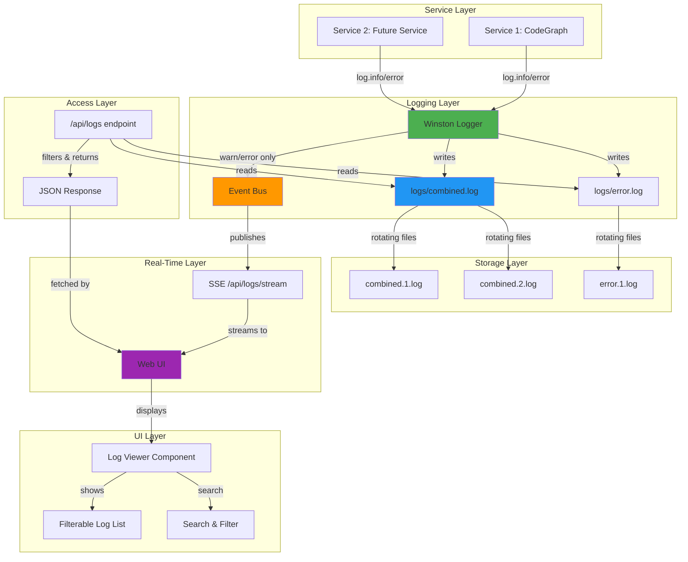
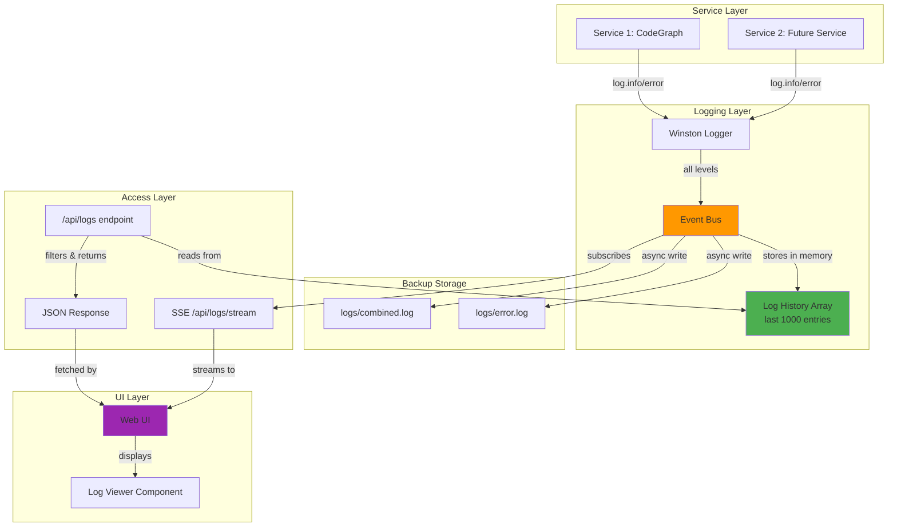
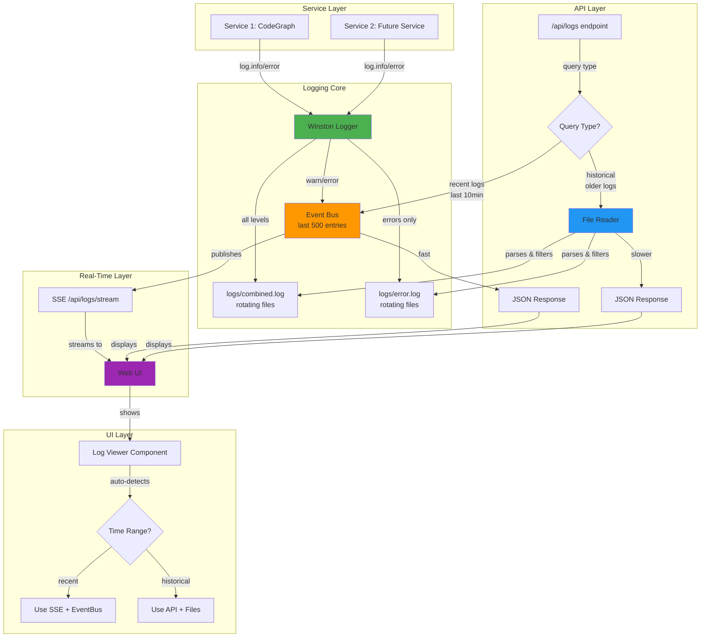
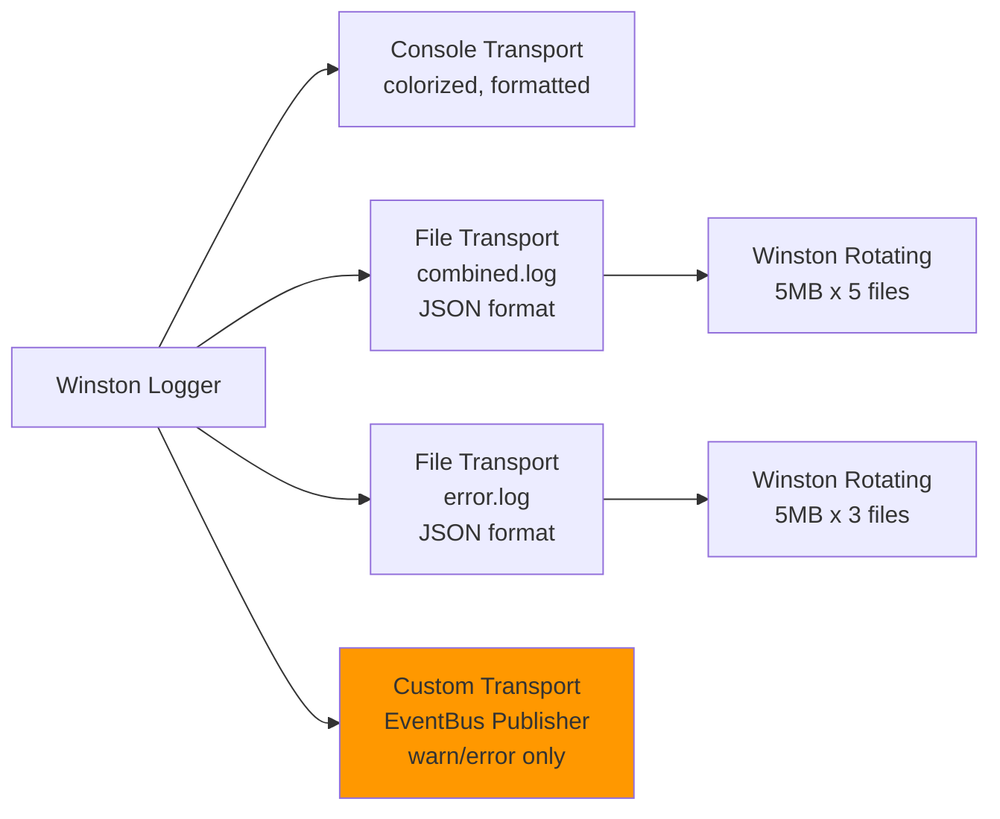
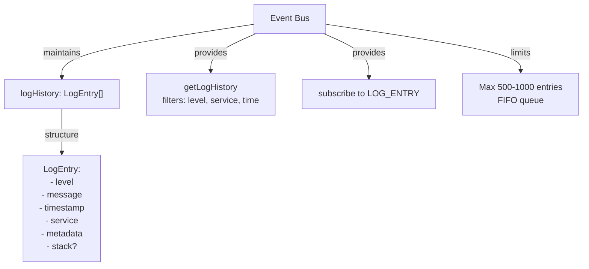
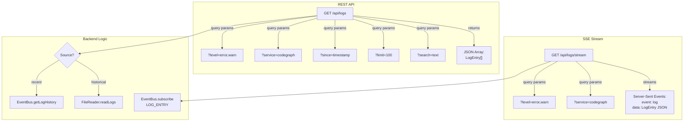

# Logging Architecture Options

## Current State: The Confusion

We currently have **two separate logging systems** that don't talk to each other:

1. **Winston Logger** (global) - writes to `logs/combined.log` and `logs/error.log`
2. **Round-Robin Logger** (service-specific) - writes to numbered files `001.log`, `002.log`, etc.

This creates confusion and duplication. Let's visualize options to unify this.

---

## Option 1: File-Based Architecture (Recommended)

**Principle**: Files are the source of truth. Everything reads from files.

**Pros:**
- ✅ Single source of truth (files)
- ✅ Logs persist across restarts
- ✅ Can use standard tools (tail, grep) on log files
- ✅ No duplication - Winston handles all file writing
- ✅ EventBus only for real-time updates (not storage)

**Cons:**
- ⚠️ API needs to read/parse log files (I/O overhead)
- ⚠️ Need to implement file reading & filtering logic

---

## Option 2: EventBus-First Architecture

**Principle**: EventBus is the source of truth. Files are just a backup.

**Pros:**
- ✅ Fast API responses (in-memory)
- ✅ No file I/O on API requests
- ✅ Real-time updates trivial (EventBus subscription)
- ✅ Unified architecture (one system)

**Cons:**
- ❌ Logs lost on restart (only last 1000 in memory)
- ❌ Can't view historical logs beyond memory limit
- ❌ Higher memory usage
- ❌ Files become "second class" backups

---

## Option 3: Hybrid Architecture (Best of Both)

**Principle**: EventBus for real-time, files for history. Smart caching.

**Pros:**
- ✅ Fast for recent logs (EventBus)
- ✅ Complete history available (files)
- ✅ Real-time updates work (SSE)
- ✅ Survives restarts
- ✅ Flexible - UI chooses source based on query

**Cons:**
- ⚠️ More complex implementation
- ⚠️ Need to implement file parsing logic
- ⚠️ UI needs logic to choose data source

---

## Detailed Component Breakdown

### Winston Logger Configuration

### EventBus Log Management

### API Endpoints Design

---

## Recommendation: Option 3 (Hybrid)

### Why Hybrid is Best

1. **Practical for your use case**:
   - You want to see errors immediately → EventBus + SSE
   - I need to access historical logs → File reading
   - Services restart → Files persist data

2. **Performance where it matters**:
   - Real-time monitoring is fast (no file I/O)
   - Historical analysis is available (reads files when needed)

3. **No duplication**:
   - Remove round-robin logger entirely
   - Winston handles all file writing
   - EventBus only stores recent logs for real-time

4. **Clean separation of concerns**:
   - Winston = log writing & formatting
   - EventBus = real-time pub/sub
   - API = intelligent routing
   - UI = displays regardless of source

### Implementation Steps (Hybrid)

1. **Remove Round-Robin Logger**
   - Delete `round-robin-logger.ts`
   - Services use only Winston contextLogger

2. **Enhance Winston**
   - Add custom EventBus transport
   - Only publishes warn/error to EventBus
   - Keeps all levels in files

3. **Enhance EventBus**
   - Add `logHistory` array (separate from events)
   - Add `getLogHistory(filters)` method
   - Limit to 500 entries (FIFO)

4. **Create API Endpoints**
   - `/api/logs` - GET with filters
   - `/api/logs/stream` - SSE endpoint
   - Logic: recent = EventBus, old = files

5. **Create File Reader**
   - Parses JSON log files
   - Filters by level, service, time, search
   - Returns as LogEntry array

6. **Update UI**
   - Add log viewer section
   - Subscribe to SSE for real-time
   - Fetch API for initial load
   - Add filters & search

---

## Questions for Clarification

1. **EventBus log history size**: 500 or 1000 entries?
2. **File reading frequency**: Should API cache parsed logs or read on every request?
3. **Log levels to stream**: Just warn/error, or include info?
4. **Service-specific log files**: Keep them or use Winston tags/context only?

---

## Next Steps

Once you approve Option 3 (Hybrid), I'll create detailed implementation tasks with code examples for each component.
