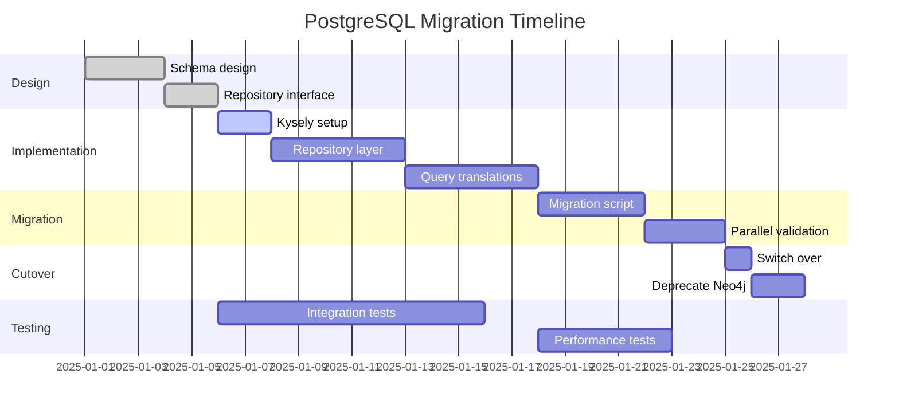

# DevAC/CodeGraph Database Redesign Analysis: PostgreSQL vs Neo4j

> **Version**: 1.0
> **Date**: 2025-12-11
> **Status**: Analysis Document
> **Context**: Response to v1.11 NodeIndexCache dual-source-of-truth concern
> **Author**: Architecture Review

---

## Table of Contents

1. [Executive Summary](#1-executive-summary)
2. [Current State Analysis](#2-current-state-analysis)
3. [PostgreSQL Alternative Analysis](#3-postgresql-alternative-analysis)
4. [Detailed Comparison](#4-detailed-comparison)
5. [Migration Path Options](#5-migration-path-options)
6. [Specific Query Rewrites](#6-specific-query-rewrites)
7. [Impact on v1.11 Spec](#7-impact-on-v111-spec)
8. [Recommendation](#8-recommendation)
9. [Appendix](#9-appendix)

---

## 1. Executive Summary

### 1.1 The Problem

DevAC Spec v1.11 introduces **NodeIndexCache** - an in-memory JavaScript cache that duplicates all parsed nodes from the Neo4j database. This creates a **dual source of truth** architecture:

```
┌─────────────────────┐       ┌─────────────────────┐
│   Neo4j Database    │       │  NodeIndexCache     │
│   (Primary Store)   │◄─────►│  (In-Memory Cache)  │
│                     │ SYNC? │                     │
│  - 68 node labels   │       │  - nodesByEntityId  │
│  - 32+ rel types    │       │  - nodesByFile      │
│  - Graph traversals │       │  - exportsByFile    │
└─────────────────────┘       └─────────────────────┘
```

**Issues with this approach:**
- **Synchronization complexity**: Cache must be updated on every graph write
- **Memory pressure**: All nodes in JavaScript heap (scales with codebase size)
- **Crash recovery**: Cache is lost on process restart, must rebuild from Neo4j
- **Maintenance burden**: Two systems tracking the same data

### 1.2 Key Finding

**PostgreSQL with extensions can handle this mixed workload** (graph queries + fast key-value lookups) in a single database, eliminating the need for NodeIndexCache entirely.

| Capability | Neo4j | PostgreSQL |
|------------|-------|------------|
| Graph storage | Native | Tables + relationships |
| Graph traversal | Excellent (unlimited hops) | Good (efficient up to ~6 hops) |
| Point lookups | Slow (~5-10ms) | Fast (~1-2ms with B-tree) |
| Key-value patterns | Not designed for it | Native (PRIMARY KEY lookup) |
| Batch writes | Good (UNWIND) | Excellent (COPY, unnest) |

**Critical observation**: Current CodeGraph queries rarely exceed 5 hops. The most common patterns are:
- `[:IMPORTS*1..3]` - Import chain resolution
- `[:CALLS*1..2]` - Call graph analysis
- `[:DEPENDS_ON*2..5]` - Dependency discovery

All of these are within PostgreSQL's efficient range.

### 1.3 Recommendation Preview

| Option | Recommendation | Rationale |
|--------|----------------|-----------|
| **Option A**: Stay with Neo4j | Not Recommended | NodeIndexCache complexity remains |
| **Option B**: PostgreSQL-only | **Recommended** | Eliminates dual source of truth |
| **Option C**: Hybrid | Fallback | If graph analytics (6+ hops) needed |

**Primary recommendation: Option B (PostgreSQL-only)**

- Eliminates NodeIndexCache entirely
- B-tree indexes provide O(log n) point lookups
- Recursive CTEs handle current traversal patterns
- Team familiarity with SQL
- Standard tooling and hosting options

---

## 2. Current State Analysis

### 2.1 Neo4j Architecture Deep Dive

#### 2.1.1 Schema Overview

**Location**: `src/database/schema.ts`

The current schema defines **68 node labels** across multiple language domains:

| Domain | Labels | Count |
|--------|--------|-------|
| Core | File, Directory, Package | 3 |
| TypeScript/JavaScript | Class, Interface, Function, Method, Variable, Parameter, TypeAlias, Import, Export, Component, JSXElement, JSXAttribute, TailwindClass | 13 |
| Python | PythonModule, PythonFunction, PythonClass, PythonMethod, PythonParameter, PythonVariable | 6 |
| C/C++ | CFunction, CppClass, CppMethod, IncludeDirective, MacroDefinition | 5 |
| Java | JavaClass, JavaInterface, JavaMethod, JavaField, PackageDeclaration, ImportDeclaration | 6 |
| C# | CSharpClass, CSharpInterface, CSharpStruct, CSharpMethod, Property, Field, NamespaceDeclaration, UsingDirective | 8 |
| Go | GoFunction, GoMethod, GoStruct, GoInterface, PackageClause, ImportSpec | 6 |
| SQL | SQLSchema, SQLTable, SQLView, SQLColumn, SQLSelectStatement, SQLInsertStatement, SQLUpdateStatement, SQLDeleteStatement, SQLFunction, SQLProcedure | 10 |
| ... | (additional labels) | 11 |

**Relationship types** (32+):
- Core: `CONTAINS`, `IMPORTS`, `EXPORTS`, `CALLS`, `EXTENDS`, `IMPLEMENTS`, `HAS_METHOD`, `HAS_PARAMETER`, `MUTATES_STATE`, `HANDLES_ERROR`
- React: `DEFINES_COMPONENT`, `RENDERS_ELEMENT`, `USES_COMPONENT`, `HAS_PROP`, `USES_TAILWIND_CLASS`
- Language-specific: `PYTHON_IMPORTS`, `PYTHON_CALLS`, `INCLUDES`, `DECLARES_PACKAGE`, etc.

**Constraints and Indexes**:
```cypher
-- Uniqueness constraint per label
CREATE CONSTRAINT File_entityid_unique IF NOT EXISTS
  FOR (n:File) REQUIRE n.entityId IS UNIQUE

-- Performance indexes
CREATE INDEX node_entityid_index IF NOT EXISTS FOR (n:Node) ON (n.entityId)
CREATE INDEX File_filePath_index IF NOT EXISTS FOR (n:File) ON (n.filePath)
CREATE INDEX File_name_index IF NOT EXISTS FOR (n:File) ON (n.name)
```

#### 2.1.2 Database Client Implementation

**Location**: `src/database/neo4j-client.ts`

```typescript
class Neo4jClient {
  private driver: Driver | null = null;

  // Lazy initialization - driver created on first use
  async initializeDriver(): Promise<void>

  // Session management with auto-close
  async runTransaction<T>(
    cypher: string,
    params: Record<string, unknown>,
    mode: "READ" | "WRITE",
    context: string
  ): Promise<QueryResult>

  // Multi-query transactions
  async runTransactionWork<T>(
    work: (tx: ManagedTransaction) => Promise<T>,
    mode: "READ" | "WRITE",
    context: string
  ): Promise<T>

  // Health checks and reconnection
  async isConnectionHealthy(): Promise<boolean>
  async reconnect(): Promise<void>
}
```

**Key patterns**:
- Lazy driver initialization (deferred until first query)
- Connection pooling via neo4j-driver native mechanism
- System suspend/wake event handling for reconnection
- Error wrapping in custom `Neo4jError` class

#### 2.1.3 Storage Manager Implementation

**Location**: `src/analyzer/storage-manager.ts`

**Batch processing approach**:
```typescript
// Default batch size: 100 nodes
// Adaptive sizing for large repos:
//   - < 10K files: 100 nodes/batch
//   - 10K-50K files: 75 nodes/batch
//   - > 50K files: 50 nodes/batch
```

**Node creation with dynamic labels**:
```cypher
UNWIND $batch AS nodeData
MERGE (n:Node { entityId: nodeData.entityId })
SET n = nodeData.properties
-- Dynamic label removal (all possible labels)
REMOVE n:File:Directory:Class:...
-- Dynamic label addition via FOREACH
WITH n, nodeData.kind AS kind
FOREACH (_ IN CASE kind WHEN 'File' THEN [1] ELSE [] END | SET n:File)
FOREACH (_ IN CASE kind WHEN 'Function' THEN [1] ELSE [] END | SET n:Function)
...
```

**Why FOREACH pattern?** APOC's `apoc.create.addLabels()` is faster but requires APOC plugin. The FOREACH fallback works with standard Neo4j but adds ~50-150ms per file.

#### 2.1.4 Current Query Patterns

**1. Point lookups by entityId**:
```cypher
MATCH (n:Node {entityId: $entityId})
RETURN n
```
**Performance**: ~5-10ms (requires index scan)

**2. Batch node creation (MERGE)**:
```cypher
UNWIND $batch AS nodeData
MERGE (n:Node { entityId: nodeData.entityId })
SET n = nodeData.properties
CALL apoc.create.addLabels(n, nodeData.labels) YIELD node
RETURN count(node) as created
```
**Performance**: ~50-100ms for 100 nodes

**3. Import chain traversal (1-3 hops)**:
```cypher
MATCH (f:File {filePath: $path})-[:IMPORTS*1..3]->(dep:File)
RETURN DISTINCT dep.filePath
```
**Performance**: ~10-30ms

**4. Dependency discovery (up to 5 hops)**:
```cypher
UNWIND $filePaths as filePath
MATCH path = (target:File {filePath: filePath})-[:IMPORTS*0..5]->(dep:File)
RETURN DISTINCT dep.filePath as depPath
LIMIT 100
```
**Performance**: ~50-100ms

**5. Atomic file update (delete + create)**:
```cypher
// Single transaction
MATCH (f:File {filePath: $path})-[:OWNS]->(n:Node)
DETACH DELETE n

MATCH (f:File {filePath: $path})
OPTIONAL MATCH (f)-[r]-()
DELETE r

MERGE (f:File {filePath: $path})
SET f.structuralComplete = true, ...
```

### 2.2 NodeIndexCache Design (The Problem)

**Location**: `src/devac/services/node-index-cache.ts` (v1.11)

```typescript
export class NodeIndexCache {
  // O(1) lookup by entityId
  private nodesByEntityId: Map<string, NodeIndexEntry> = new Map();

  // O(1) lookup of all nodes in a file
  private nodesByFile: Map<string, Set<string>> = new Map();

  // Fast import resolution: file → export name → entityId
  private exportsByFile: Map<string, Map<string, string>> = new Map();

  updateFile(filePath: string, nodes: AstNode[], exports: ExportedSymbol[]): void
  removeFile(filePath: string): void
  getNode(entityId: string): NodeIndexEntry | undefined
  getAllNodes(): NodeIndexEntry[]
  resolveImport(importPath: string, importName: string): string | undefined
}
```

**Why does NodeIndexCache exist?**

1. **RelationshipResolver needs ALL nodes** for cross-file resolution, not just single-file nodes
2. **Neo4j point lookups are slow** (~5-10ms each) - unacceptable for semantic resolution requiring thousands of lookups
3. **Semantic resolution is latency-sensitive** - must complete in 2-5s for large batches

**Memory footprint estimate**:
```
Per node: ~200 bytes (entityId, name, kind, filePath, export info)
100K nodes: ~20MB
500K nodes: ~100MB
1M nodes: ~200MB
```

For large monorepos with millions of nodes, this becomes significant.

### 2.3 What Works Well with Neo4j

| Capability | Rating | Notes |
|------------|--------|-------|
| Graph traversals | Excellent | Native support, unlimited depth |
| Cypher query language | Good | Expressive, graph-native syntax |
| ACID transactions | Excellent | Full transaction support |
| Relationship modeling | Excellent | First-class relationships |
| Schema flexibility | Good | Dynamic labels and properties |

### 2.4 What Doesn't Work Well

| Issue | Impact | Root Cause |
|-------|--------|------------|
| Slow point lookups | High | Index scan required, not O(1) |
| APOC dependency | Medium | Faster label ops require plugin |
| Memory usage | Medium | Native graph representation |
| Hosting options | Medium | Limited to Neo4j-specific hosting |
| Team familiarity | Medium | Cypher learning curve |

---

## 3. PostgreSQL Alternative Analysis

### 3.1 Architecture Overview

PostgreSQL can serve as a unified storage layer for CodeGraph, providing:
- **Relational storage** for nodes and relationships
- **Fast key-value lookups** via B-tree primary key indexes
- **Graph traversals** via recursive CTEs or Apache AGE extension
- **Flexible properties** via JSONB columns

```
┌─────────────────────────────────────────────────────────┐
│                    PostgreSQL                           │
│                                                         │
│  ┌─────────────┐  ┌──────────────────┐  ┌───────────┐  │
│  │   nodes     │  │  relationships   │  │  indexes  │  │
│  │  (table)    │◄─┤     (table)      │  │ (B-tree)  │  │
│  │             │  │                  │  │           │  │
│  │ entity_id   │  │ source_id        │  │ O(log n)  │  │
│  │ kind        │  │ target_id        │  │ lookups   │  │
│  │ properties  │  │ type             │  │           │  │
│  │ (JSONB)     │  │ properties       │  │           │  │
│  └─────────────┘  └──────────────────┘  └───────────┘  │
│                                                         │
│  ┌─────────────────────────────────────────────────┐   │
│  │              Recursive CTEs                      │   │
│  │     (Graph traversals up to ~6 hops)            │   │
│  └─────────────────────────────────────────────────┘   │
└─────────────────────────────────────────────────────────┘
```

### 3.2 Required Extensions

| Extension | Purpose | Required? |
|-----------|---------|-----------|
| **JSONB** (built-in) | Flexible property storage | Yes |
| **pg_trgm** | Text similarity search | Optional |
| **Apache AGE** | Cypher-compatible graph queries | Optional |
| **pgvector** | Vector similarity (AI features) | Optional |

**Minimal setup**: Just JSONB (built-in to PostgreSQL 9.4+)

**Enhanced setup**: Add Apache AGE for Cypher-like syntax if preferred

### 3.3 Schema Design Options

#### Option A: Relational Schema (Recommended)

```sql
-- Nodes table with JSONB for flexible properties
CREATE TABLE nodes (
  entity_id VARCHAR(500) PRIMARY KEY,  -- B-tree index, O(log n) lookup
  kind VARCHAR(50) NOT NULL,
  name VARCHAR(500),
  file_path VARCHAR(1000),
  start_line INTEGER,
  start_column INTEGER,
  end_line INTEGER,
  end_column INTEGER,
  language VARCHAR(20),
  created_at TIMESTAMP DEFAULT NOW(),
  properties JSONB DEFAULT '{}'::jsonb
);

-- Performance indexes
CREATE INDEX idx_nodes_file_path ON nodes(file_path);
CREATE INDEX idx_nodes_kind ON nodes(kind);
CREATE INDEX idx_nodes_name ON nodes(name);
CREATE INDEX idx_nodes_properties ON nodes USING GIN(properties);

-- Relationships table
CREATE TABLE relationships (
  id SERIAL PRIMARY KEY,
  source_id VARCHAR(500) NOT NULL REFERENCES nodes(entity_id) ON DELETE CASCADE,
  target_id VARCHAR(500) NOT NULL REFERENCES nodes(entity_id) ON DELETE CASCADE,
  type VARCHAR(50) NOT NULL,
  properties JSONB DEFAULT '{}'::jsonb,
  created_at TIMESTAMP DEFAULT NOW()
);

-- Relationship indexes
CREATE INDEX idx_rel_source ON relationships(source_id);
CREATE INDEX idx_rel_target ON relationships(target_id);
CREATE INDEX idx_rel_type ON relationships(type);
CREATE INDEX idx_rel_source_type ON relationships(source_id, type);

-- Unique constraint to prevent duplicate relationships
CREATE UNIQUE INDEX idx_rel_unique ON relationships(source_id, target_id, type);
```

**Advantages**:
- Simple, standard SQL
- Excellent tooling support
- Easy to understand and maintain
- No extensions required

#### Option B: JSONB-Heavy Schema

```sql
-- Single table with all data in JSONB
CREATE TABLE graph_nodes (
  entity_id VARCHAR(500) PRIMARY KEY,
  data JSONB NOT NULL,
  labels TEXT[] NOT NULL
);

CREATE INDEX idx_gin_labels ON graph_nodes USING GIN(labels);
CREATE INDEX idx_gin_data ON graph_nodes USING GIN(data);
CREATE INDEX idx_file_path ON graph_nodes((data->>'filePath'));
```

**Advantages**:
- Maximum flexibility
- Schema-less like Neo4j

**Disadvantages**:
- Harder to query
- Less type safety

#### Option C: Apache AGE Graph Schema

```sql
-- Create graph in AGE
SELECT create_graph('codegraph');

-- Nodes as AGE vertices
SELECT * FROM cypher('codegraph', $$
  CREATE (:File {entityId: 'file:/path/to/file.ts', filePath: '/path/to/file.ts'})
$$) as (v agtype);

-- Relationships as AGE edges
SELECT * FROM cypher('codegraph', $$
  MATCH (f:File {entityId: 'file:/path/to/file.ts'})
  MATCH (c:Class {entityId: 'class:/path/to/file.ts:MyClass:10'})
  CREATE (f)-[:CONTAINS]->(c)
$$) as (e agtype);
```

**Advantages**:
- Cypher syntax (familiar from Neo4j)
- Native graph operations

**Disadvantages**:
- Extension dependency
- Less mature than core PostgreSQL

### 3.4 Graph Traversal Strategies

#### 3.4.1 Recursive CTEs (Pure SQL)

**Import chain traversal (equivalent to `[:IMPORTS*1..3]`)**:
```sql
WITH RECURSIVE import_chain AS (
  -- Base case: direct imports from the starting file
  SELECT
    r.target_id as dep_id,
    1 as depth,
    ARRAY[r.source_id] as path
  FROM relationships r
  JOIN nodes n ON r.source_id = n.entity_id
  WHERE n.file_path = $1
    AND r.type = 'IMPORTS'

  UNION ALL

  -- Recursive case: follow imports from discovered files
  SELECT
    r.target_id,
    ic.depth + 1,
    ic.path || r.source_id
  FROM relationships r
  JOIN import_chain ic ON r.source_id = ic.dep_id
  WHERE r.type = 'IMPORTS'
    AND ic.depth < 3
    AND NOT r.target_id = ANY(ic.path)  -- Prevent cycles
)
SELECT DISTINCT
  n.file_path,
  n.entity_id
FROM import_chain ic
JOIN nodes n ON ic.dep_id = n.entity_id
WHERE n.kind = 'File';
```

**Performance characteristics**:
| Depth | Typical Time | Notes |
|-------|--------------|-------|
| 1-2 hops | 5-15ms | Very fast |
| 3-4 hops | 20-50ms | Good |
| 5-6 hops | 50-150ms | Acceptable |
| 7+ hops | 200ms+ | Degrades exponentially |

**Why 6-hop limit?** Recursive CTEs in PostgreSQL use iterative execution. Each iteration:
1. Executes the recursive term
2. Unions with previous results
3. Checks termination condition

At 7+ hops, the working set grows exponentially, causing:
- Memory pressure
- Index cache misses
- Query plan degradation

**Mitigation strategies**:
- Add `LIMIT` to cap result size
- Use materialized paths for frequently traversed graphs
- Pre-compute common traversals as materialized views

#### 3.4.2 Apache AGE (Cypher on PostgreSQL)

```sql
-- Direct port of Neo4j query
SELECT * FROM cypher('codegraph', $$
  MATCH (f:File)-[:IMPORTS*1..3]->(dep:File)
  WHERE f.filePath = $path
  RETURN DISTINCT dep.filePath
$$, '{"path": "/path/to/file.ts"}') as (file_path agtype);
```

**Performance**: Similar to recursive CTEs, with slight overhead for Cypher parsing.

### 3.5 Key-Value Patterns for Fast Lookups

**The NodeIndexCache replacement**: PostgreSQL's B-tree primary key index provides O(log n) lookups.

```sql
-- Point lookup by entityId (O(log n), ~1-2ms)
SELECT * FROM nodes WHERE entity_id = $1;

-- Batch lookup (efficient with ANY)
SELECT * FROM nodes WHERE entity_id = ANY($1::varchar[]);

-- All nodes for a file (uses file_path index)
SELECT * FROM nodes WHERE file_path = $1;

-- Export resolution
SELECT n.entity_id
FROM nodes n
WHERE n.file_path = $1
  AND n.properties->>'exportedAs' = $2;
```

**Comparison to Neo4j + NodeIndexCache**:

| Operation | Neo4j + NodeIndexCache | PostgreSQL |
|-----------|------------------------|------------|
| Point lookup | O(1) in memory | O(log n), ~1-2ms |
| Batch lookup (1000) | O(1000) in memory | O(log n * 1000), ~50-100ms |
| Memory usage | ~200 bytes/node | 0 (on disk) |
| Crash recovery | Rebuild from Neo4j | None needed |
| Consistency | Manual sync | Automatic |

**Key insight**: PostgreSQL is slightly slower for individual lookups (1-2ms vs <1ms in memory), but:
- No memory pressure
- No sync complexity
- Automatic consistency
- Crash-safe

For semantic resolution with ~10,000 lookups, the total overhead is ~10-20 seconds vs ~1 second with in-memory cache. However, this can be mitigated with batch queries.

---

## 4. Detailed Comparison

### 4.1 Complexity

| Aspect | Neo4j | PostgreSQL | Winner |
|--------|-------|------------|--------|
| **Driver setup** | neo4j-driver (mature, well-documented) | pg (mature, widely used) | Tie |
| **Schema management** | Dynamic labels, no migrations | Migrations (Kysely/Knex) | Neo4j |
| **Query language** | Cypher (graph-native, learning curve) | SQL (universally known) | PostgreSQL |
| **Dynamic properties** | Native support | JSONB (flexible) | Tie |
| **Transaction handling** | Explicit READ/WRITE modes | Standard SQL transactions | PostgreSQL |
| **Connection pooling** | Built into driver | pgbouncer or built-in | Tie |

**Overall**: PostgreSQL is simpler for teams with SQL experience.

### 4.2 Maintainability

| Aspect | Neo4j | PostgreSQL | Winner |
|--------|-------|------------|--------|
| **Single vs dual system** | Need NodeIndexCache | Can handle both | PostgreSQL |
| **Debugging** | Neo4j Browser (specialized) | pgAdmin, standard tools | PostgreSQL |
| **Migrations** | Schema-less (manual) | Standard migration tools | PostgreSQL |
| **Backup/Restore** | Neo4j-specific | pg_dump/restore (standard) | PostgreSQL |
| **Monitoring** | Neo4j metrics | pg_stat_*, Datadog, etc. | PostgreSQL |
| **Hosting options** | Neo4j Aura, self-hosted | AWS RDS, many options | PostgreSQL |
| **Team knowledge** | Specialized | Widely known | PostgreSQL |

**Overall**: PostgreSQL wins on maintainability due to standard tooling and elimination of NodeIndexCache.

### 4.3 Performance

| Operation | Neo4j | PostgreSQL | Winner |
|-----------|-------|------------|--------|
| **Point lookup (entityId)** | ~5-10ms (index) | ~1-2ms (B-tree) | PostgreSQL |
| **Batch insert (100 nodes)** | ~50-100ms | ~20-50ms | PostgreSQL |
| **2-hop traversal** | ~10ms | ~15ms (CTE) | Neo4j (slightly) |
| **5-hop traversal** | ~50ms | ~100ms (CTE) | Neo4j |
| **6+ hop traversal** | ~100ms | Degrades | Neo4j |
| **MERGE (upsert)** | Native MERGE | INSERT ON CONFLICT | Tie |
| **Bulk delete** | DETACH DELETE | DELETE with FK cascade | PostgreSQL |

**Overall**:
- PostgreSQL wins for point lookups and batch writes
- Neo4j wins for deep traversals (6+ hops)
- For CodeGraph's typical 1-5 hop queries, they're comparable

### 4.4 Scalability

| Aspect | Neo4j | PostgreSQL | Winner |
|--------|-------|------------|--------|
| **Memory usage** | Higher (native graph) | Lower (relational) | PostgreSQL |
| **Concurrent connections** | Limited pool | High (pgbouncer) | PostgreSQL |
| **Data volume** | Good | Excellent | PostgreSQL |
| **Horizontal scaling** | Enterprise only | Citus extension | PostgreSQL |
| **Cost efficiency** | Higher (specialized) | Lower (commodity) | PostgreSQL |

**Overall**: PostgreSQL scales better for typical workloads and is more cost-effective.

### 4.5 Summary Matrix

```
                    Complexity  Maintainability  Performance  Scalability  Total
Neo4j               ███░░ 3     ██░░░ 2          ████░ 4      ██░░░ 2      11/20
PostgreSQL          ████░ 4     █████ 5          ███░░ 3      █████ 5      17/20
```

**PostgreSQL scores higher overall**, primarily due to:
1. Eliminating NodeIndexCache (maintainability)
2. Better point lookup performance
3. Superior scalability and cost efficiency
4. Team familiarity with SQL

---

## 5. Migration Path Options

### 5.1 Option A: Stay with Neo4j + Improvements

**Strategy**: Keep Neo4j, optimize NodeIndexCache, add sync verification.

#### Changes Required

1. **Optimize Neo4j point lookups**
   - Add composite indexes
   - Use query hints
   - Consider connection pooling tuning

2. **Improve NodeIndexCache**
   - Add sync verification after writes
   - Implement cache invalidation on failures
   - Add monitoring for cache drift

3. **Memory management**
   - Implement cache size limits
   - Add LRU eviction for large codebases
   - Monitor heap usage

#### Implementation

```typescript
// Add sync verification
class NodeIndexCache {
  async updateFileWithVerification(
    filePath: string,
    nodes: AstNode[],
    neo4jClient: Neo4jClient
  ): Promise<void> {
    // Update cache
    this.updateFile(filePath, nodes, exports);

    // Verify against Neo4j
    const dbNodes = await neo4jClient.runTransaction(
      `MATCH (n:Node) WHERE n.filePath = $filePath RETURN n.entityId`,
      { filePath },
      "READ",
      "CacheVerification"
    );

    const dbEntityIds = new Set(dbNodes.records.map(r => r.get("entityId")));
    const cacheEntityIds = this.nodesByFile.get(filePath) || new Set();

    if (!setsEqual(dbEntityIds, cacheEntityIds)) {
      logger.warn(`Cache drift detected for ${filePath}, rebuilding...`);
      await this.rebuildFromDatabase(filePath, neo4jClient);
    }
  }
}
```

#### Effort Estimate

| Task | Days |
|------|------|
| Neo4j query optimization | 3-5 |
| Cache sync verification | 3-4 |
| Memory management (LRU) | 4-5 |
| Testing and monitoring | 3-4 |
| **Total** | **13-18 days** |

#### Pros

- No migration risk
- Keep existing Cypher queries
- Incremental improvements

#### Cons

- NodeIndexCache complexity remains
- Memory pressure not fully solved
- Dual system maintenance continues
- Still need sync logic

### 5.2 Option B: PostgreSQL-Only (Recommended)

**Strategy**: Replace Neo4j entirely with PostgreSQL, eliminate NodeIndexCache.

#### Changes Required

1. **Design PostgreSQL schema** (Section 3.3)
2. **Implement Kysely-based repository layer**
3. **Rewrite Cypher queries as SQL/CTEs**
4. **Build migration script (Neo4j → PostgreSQL)**
5. **Eliminate NodeIndexCache**

#### Architecture

```
┌──────────────────────────────────────────────────────────────────┐
│                         CodeGraph (New)                          │
│                                                                  │
│  ┌──────────────┐    ┌─────────────────┐    ┌────────────────┐  │
│  │  FileWatcher │───►│  StructuralParser│───►│  GraphRepository│ │
│  └──────────────┘    └─────────────────┘    │   (Kysely)      │  │
│                                              │                  │  │
│                                              │  - saveNodes()  │  │
│                                              │  - saveRels()   │  │
│                                              │  - getNode()    │  │
│                                              │  - traverse()   │  │
│                                              └────────┬───────┘  │
│                                                       │          │
│                                                       ▼          │
│  ┌────────────────────────────────────────────────────────────┐  │
│  │                      PostgreSQL                             │  │
│  │  ┌─────────┐  ┌──────────────┐  ┌────────────────────────┐ │  │
│  │  │  nodes  │  │ relationships│  │  B-tree indexes        │ │  │
│  │  └─────────┘  └──────────────┘  │  (O(log n) lookups)    │ │  │
│  │                                  └────────────────────────┘ │  │
│  └────────────────────────────────────────────────────────────┘  │
└──────────────────────────────────────────────────────────────────┘

                    NodeIndexCache: ELIMINATED
```

#### Repository Layer Design

```typescript
// src/database/graph-repository.ts

import { Kysely } from "kysely";

interface Database {
  nodes: NodesTable;
  relationships: RelationshipsTable;
}

interface NodesTable {
  entity_id: string;
  kind: string;
  name: string | null;
  file_path: string | null;
  start_line: number | null;
  start_column: number | null;
  end_line: number | null;
  end_column: number | null;
  language: string | null;
  created_at: Date;
  properties: Record<string, unknown>;
}

interface RelationshipsTable {
  id: number;
  source_id: string;
  target_id: string;
  type: string;
  properties: Record<string, unknown>;
  created_at: Date;
}

export class GraphRepository {
  constructor(private db: Kysely<Database>) {}

  // Point lookup - replaces NodeIndexCache.getNode()
  async getNode(entityId: string): Promise<NodesTable | undefined> {
    return this.db
      .selectFrom("nodes")
      .where("entity_id", "=", entityId)
      .selectAll()
      .executeTakeFirst();
  }

  // Batch lookup - replaces NodeIndexCache.getAllNodes()
  async getNodes(entityIds: string[]): Promise<NodesTable[]> {
    return this.db
      .selectFrom("nodes")
      .where("entity_id", "in", entityIds)
      .selectAll()
      .execute();
  }

  // Get all nodes for a file - replaces NodeIndexCache.nodesByFile
  async getFileNodes(filePath: string): Promise<NodesTable[]> {
    return this.db
      .selectFrom("nodes")
      .where("file_path", "=", filePath)
      .selectAll()
      .execute();
  }

  // Batch upsert - replaces StorageManager.saveNodes()
  async saveNodes(nodes: NodesTable[]): Promise<void> {
    await this.db
      .insertInto("nodes")
      .values(nodes)
      .onConflict((oc) =>
        oc.column("entity_id").doUpdateSet({
          kind: (eb) => eb.ref("excluded.kind"),
          name: (eb) => eb.ref("excluded.name"),
          file_path: (eb) => eb.ref("excluded.file_path"),
          properties: (eb) => eb.ref("excluded.properties"),
        })
      )
      .execute();
  }

  // Graph traversal - replaces Cypher [:IMPORTS*1..N]
  async getImportChain(filePath: string, maxDepth: number = 3): Promise<string[]> {
    const result = await sql<{ file_path: string }>`
      WITH RECURSIVE import_chain AS (
        SELECT r.target_id as dep_id, 1 as depth
        FROM relationships r
        JOIN nodes n ON r.source_id = n.entity_id
        WHERE n.file_path = ${filePath} AND r.type = 'IMPORTS'

        UNION ALL

        SELECT r.target_id, ic.depth + 1
        FROM relationships r
        JOIN import_chain ic ON r.source_id = ic.dep_id
        WHERE r.type = 'IMPORTS' AND ic.depth < ${maxDepth}
      )
      SELECT DISTINCT n.file_path
      FROM import_chain ic
      JOIN nodes n ON ic.dep_id = n.entity_id
      WHERE n.kind = 'File'
    `.execute(this.db);

    return result.rows.map(r => r.file_path);
  }

  // Atomic file update - replaces GraphUpdaterActor pattern
  async atomicFileUpdate(
    filePath: string,
    nodes: NodesTable[],
    relationships: RelationshipsTable[]
  ): Promise<void> {
    await this.db.transaction().execute(async (tx) => {
      // Delete old relationships
      await tx
        .deleteFrom("relationships")
        .where("source_id", "in",
          tx.selectFrom("nodes")
            .where("file_path", "=", filePath)
            .select("entity_id")
        )
        .execute();

      // Delete old nodes
      await tx
        .deleteFrom("nodes")
        .where("file_path", "=", filePath)
        .execute();

      // Insert new nodes
      if (nodes.length > 0) {
        await tx.insertInto("nodes").values(nodes).execute();
      }

      // Insert new relationships
      if (relationships.length > 0) {
        await tx.insertInto("relationships").values(relationships).execute();
      }
    });
  }
}
```

#### Migration Steps



#### Effort Estimate

| Task | Days |
|------|------|
| Schema design and Kysely setup | 3-5 |
| Repository layer implementation | 5-7 |
| Query translation (Cypher → SQL) | 5-7 |
| Migration script (Neo4j → PostgreSQL) | 4-5 |
| Integration tests | 5-7 |
| Performance testing and tuning | 3-5 |
| Parallel validation | 3-4 |
| Cutover and cleanup | 2-3 |
| **Total** | **30-43 days** |

#### Pros

- **Eliminates NodeIndexCache entirely**
- Single source of truth
- B-tree indexes provide fast lookups
- Standard SQL tooling
- Better hosting options (AWS RDS, etc.)
- Team familiarity with SQL
- Lower operational costs

#### Cons

- Significant migration effort
- Cypher queries need rewriting
- Deep traversals (6+ hops) less efficient
- Testing burden

### 5.3 Option C: Hybrid (PostgreSQL for KV, Neo4j for Graph)

**Strategy**: Use PostgreSQL for fast lookups (replacing NodeIndexCache), keep Neo4j for graph traversals.

#### Architecture

```
┌──────────────────────────────────────────────────────────────────┐
│                         CodeGraph (Hybrid)                       │
│                                                                  │
│  ┌──────────────────────────────────────────────────────────┐   │
│  │                      PostgreSQL                           │   │
│  │  ┌─────────────────────────────────────────────────────┐ │   │
│  │  │  node_index (replaces NodeIndexCache)               │ │   │
│  │  │  - entity_id (PK, B-tree)                           │ │   │
│  │  │  - kind, name, file_path                            │ │   │
│  │  │  - O(log n) lookups                                 │ │   │
│  │  └─────────────────────────────────────────────────────┘ │   │
│  └──────────────────────────────────────────────────────────┘   │
│                              │                                   │
│                              │ Sync                              │
│                              ▼                                   │
│  ┌──────────────────────────────────────────────────────────┐   │
│  │                        Neo4j                              │   │
│  │  - Full graph storage                                     │   │
│  │  - Graph traversals (any depth)                          │   │
│  │  - Relationship queries                                   │   │
│  └──────────────────────────────────────────────────────────┘   │
└──────────────────────────────────────────────────────────────────┘

                    NodeIndexCache: REPLACED by PostgreSQL
```

#### Sync Implementation

```typescript
// src/database/hybrid-store.ts

export class HybridStore {
  constructor(
    private pg: Kysely<Database>,
    private neo4j: Neo4jClient
  ) {}

  // Write to both databases in transaction
  async saveNodes(filePath: string, nodes: GraphNode[]): Promise<void> {
    // Step 1: Write to PostgreSQL (fast index)
    await this.pg.transaction().execute(async (tx) => {
      await tx.deleteFrom("node_index").where("file_path", "=", filePath).execute();
      await tx.insertInto("node_index").values(
        nodes.map(n => ({
          entity_id: n.entityId,
          kind: n.labels[1],
          name: n.properties.name,
          file_path: n.properties.filePath,
        }))
      ).execute();
    });

    // Step 2: Write to Neo4j (full graph)
    await this.neo4j.runTransactionWork(async (tx) => {
      // Delete old nodes
      await tx.run(
        `MATCH (n:Node {filePath: $filePath}) DETACH DELETE n`,
        { filePath }
      );
      // Create new nodes
      await tx.run(
        `UNWIND $nodes AS nodeData
         CREATE (n:Node)
         SET n = nodeData.properties`,
        { nodes }
      );
    }, "WRITE", "HybridStore-SaveNodes");
  }

  // Point lookup from PostgreSQL (fast)
  async getNode(entityId: string): Promise<NodeIndexEntry | undefined> {
    return this.pg
      .selectFrom("node_index")
      .where("entity_id", "=", entityId)
      .selectAll()
      .executeTakeFirst();
  }

  // Graph traversal from Neo4j (powerful)
  async getImportChain(filePath: string, maxDepth: number): Promise<string[]> {
    const result = await this.neo4j.runTransaction(
      `MATCH (f:File {filePath: $filePath})-[:IMPORTS*1..${maxDepth}]->(dep:File)
       RETURN DISTINCT dep.filePath as path`,
      { filePath },
      "READ",
      "HybridStore-ImportChain"
    );
    return result.records.map(r => r.get("path"));
  }
}
```

#### Effort Estimate

| Task | Days |
|------|------|
| PostgreSQL node_index table setup | 2-3 |
| Hybrid store implementation | 4-5 |
| Sync logic | 3-4 |
| Replace NodeIndexCache references | 3-4 |
| Testing | 4-5 |
| **Total** | **16-21 days** |

#### Pros

- Lower migration risk than full PostgreSQL
- Best of both worlds (fast KV + powerful graph)
- Preserves Cypher for complex queries
- Incremental migration possible

#### Cons

- Still dual system (PostgreSQL + Neo4j)
- Sync complexity remains (between PG and Neo4j)
- More infrastructure
- Doesn't fully simplify architecture

---

## 6. Specific Query Rewrites

### 6.1 Node MERGE Operations

#### Current Neo4j
```cypher
MERGE (n:Node { entityId: $entityId })
SET n = $properties
RETURN n
```

#### PostgreSQL (INSERT ON CONFLICT)
```sql
INSERT INTO nodes (entity_id, kind, name, file_path, properties)
VALUES ($1, $2, $3, $4, $5)
ON CONFLICT (entity_id) DO UPDATE SET
  kind = EXCLUDED.kind,
  name = EXCLUDED.name,
  file_path = EXCLUDED.file_path,
  properties = EXCLUDED.properties
RETURNING *;
```

#### Kysely
```typescript
await db
  .insertInto("nodes")
  .values({
    entity_id: entityId,
    kind: kind,
    name: name,
    file_path: filePath,
    properties: JSON.stringify(properties),
  })
  .onConflict((oc) =>
    oc.column("entity_id").doUpdateSet({
      kind: (eb) => eb.ref("excluded.kind"),
      name: (eb) => eb.ref("excluded.name"),
      file_path: (eb) => eb.ref("excluded.file_path"),
      properties: (eb) => eb.ref("excluded.properties"),
    })
  )
  .returningAll()
  .executeTakeFirst();
```

### 6.2 Batch Node Creation

#### Current Neo4j (with APOC)
```cypher
UNWIND $batch AS nodeData
MERGE (n:Node { entityId: nodeData.entityId })
SET n = nodeData.properties
CALL apoc.create.addLabels(n, [nodeData.kind]) YIELD node
RETURN count(node) as created
```

#### PostgreSQL (unnest)
```sql
INSERT INTO nodes (entity_id, kind, name, file_path, properties)
SELECT * FROM unnest(
  $1::varchar[],  -- entity_ids
  $2::varchar[],  -- kinds
  $3::varchar[],  -- names
  $4::varchar[],  -- file_paths
  $5::jsonb[]     -- properties
)
ON CONFLICT (entity_id) DO UPDATE SET
  kind = EXCLUDED.kind,
  name = EXCLUDED.name,
  file_path = EXCLUDED.file_path,
  properties = EXCLUDED.properties;
```

#### Kysely (batch insert)
```typescript
const nodes = batch.map(n => ({
  entity_id: n.entityId,
  kind: n.kind,
  name: n.name,
  file_path: n.filePath,
  properties: n.properties,
}));

await db
  .insertInto("nodes")
  .values(nodes)
  .onConflict((oc) =>
    oc.column("entity_id").doUpdateSet({
      kind: (eb) => eb.ref("excluded.kind"),
      name: (eb) => eb.ref("excluded.name"),
      file_path: (eb) => eb.ref("excluded.file_path"),
      properties: (eb) => eb.ref("excluded.properties"),
    })
  )
  .execute();
```

### 6.3 Graph Traversal (Import Chain)

#### Current Neo4j
```cypher
MATCH (f:File {filePath: $path})-[:IMPORTS*1..3]->(dep:File)
RETURN DISTINCT dep.filePath
```

#### PostgreSQL (Recursive CTE)
```sql
WITH RECURSIVE import_chain AS (
  -- Base case
  SELECT
    r.target_id as dep_id,
    1 as depth,
    ARRAY[r.source_id] as path
  FROM relationships r
  JOIN nodes n ON r.source_id = n.entity_id
  WHERE n.file_path = $1
    AND r.type = 'IMPORTS'

  UNION

  -- Recursive case
  SELECT
    r.target_id,
    ic.depth + 1,
    ic.path || r.source_id
  FROM relationships r
  JOIN import_chain ic ON r.source_id = ic.dep_id
  WHERE r.type = 'IMPORTS'
    AND ic.depth < 3
    AND NOT r.target_id = ANY(ic.path)
)
SELECT DISTINCT n.file_path
FROM import_chain ic
JOIN nodes n ON ic.dep_id = n.entity_id
WHERE n.kind = 'File';
```

#### Kysely (raw SQL for CTE)
```typescript
const result = await sql<{ file_path: string }>`
  WITH RECURSIVE import_chain AS (
    SELECT r.target_id as dep_id, 1 as depth
    FROM relationships r
    JOIN nodes n ON r.source_id = n.entity_id
    WHERE n.file_path = ${filePath} AND r.type = 'IMPORTS'

    UNION

    SELECT r.target_id, ic.depth + 1
    FROM relationships r
    JOIN import_chain ic ON r.source_id = ic.dep_id
    WHERE r.type = 'IMPORTS' AND ic.depth < ${maxDepth}
  )
  SELECT DISTINCT n.file_path
  FROM import_chain ic
  JOIN nodes n ON ic.dep_id = n.entity_id
  WHERE n.kind = 'File'
`.execute(db);

return result.rows.map(r => r.file_path);
```

### 6.4 Atomic File Update

#### Current Neo4j
```cypher
// Single transaction - delete then create
MATCH (f:File {filePath: $path})-[:OWNS]->(n:Node)
DETACH DELETE n

MATCH (f:File {filePath: $path})
OPTIONAL MATCH (f)-[r]-()
DELETE r

MERGE (f:File {filePath: $path})
SET f.structuralComplete = true,
    f.structuralInProgress = false

// Then create new nodes...
```

#### PostgreSQL
```sql
BEGIN;

-- Delete relationships first (FK constraint)
DELETE FROM relationships
WHERE source_id IN (
  SELECT entity_id FROM nodes WHERE file_path = $1
);

-- Delete nodes
DELETE FROM nodes WHERE file_path = $1;

-- Insert new nodes
INSERT INTO nodes (entity_id, kind, name, file_path, properties)
VALUES ...;

-- Insert new relationships
INSERT INTO relationships (source_id, target_id, type, properties)
VALUES ...;

COMMIT;
```

#### Kysely
```typescript
await db.transaction().execute(async (tx) => {
  // Delete relationships
  await tx
    .deleteFrom("relationships")
    .where("source_id", "in",
      tx.selectFrom("nodes")
        .where("file_path", "=", filePath)
        .select("entity_id")
    )
    .execute();

  // Delete nodes
  await tx
    .deleteFrom("nodes")
    .where("file_path", "=", filePath)
    .execute();

  // Insert new nodes
  await tx
    .insertInto("nodes")
    .values(newNodes)
    .execute();

  // Insert new relationships
  await tx
    .insertInto("relationships")
    .values(newRelationships)
    .execute();
});
```

### 6.5 Dependency Discovery

#### Current Neo4j
```cypher
UNWIND $filePaths as filePath
MATCH path = (target:File {filePath: filePath})-[:IMPORTS*0..5]->(dep:File)
RETURN DISTINCT dep.filePath as depPath
LIMIT 100
```

#### PostgreSQL
```sql
WITH RECURSIVE deps AS (
  -- Base case: the files themselves (depth 0)
  SELECT entity_id, file_path, 0 as depth
  FROM nodes
  WHERE file_path = ANY($1) AND kind = 'File'

  UNION

  -- Recursive case: follow imports
  SELECT n.entity_id, n.file_path, d.depth + 1
  FROM deps d
  JOIN relationships r ON d.entity_id = r.source_id
  JOIN nodes n ON r.target_id = n.entity_id
  WHERE r.type = 'IMPORTS'
    AND n.kind = 'File'
    AND d.depth < 5
)
SELECT DISTINCT file_path
FROM deps
LIMIT 100;
```

---

## 7. Impact on v1.11 Spec

### 7.1 If Option A (Keep Neo4j)

**NodeIndexCache remains as designed in v1.11**:
- All nodes cached in JavaScript memory
- Sync verification added after writes
- Memory management (LRU eviction) implemented
- Risk of cache drift on failures

**Changes to spec**:
- Add `NodeIndexCache.verifySync()` method
- Add memory monitoring and eviction
- Document crash recovery procedure

**Multi-package impact**:
- Each package still needs proper tsconfig isolation
- NodeIndexCache doesn't help with ts-morph project management
- Package context issues remain

### 7.2 If Option B (PostgreSQL-Only)

**NodeIndexCache is ELIMINATED**:
- All lookups go directly to PostgreSQL
- B-tree indexes provide O(log n) performance
- No in-memory state to sync
- Crash-safe by default

**Changes to spec**:

1. **Remove NodeIndexCache entirely**
   - Delete `src/devac/services/node-index-cache.ts`
   - Remove all NodeIndexCache references from actors

2. **Replace with GraphRepository**
   - New file: `src/database/graph-repository.ts`
   - Kysely-based implementation
   - Direct database queries for lookups

3. **Update SemanticResolverActor**
   ```typescript
   // Before (v1.11)
   const allNodes = this.nodeIndexCache.getAllNodes();

   // After (PostgreSQL)
   const allNodes = await this.graphRepo.getFileNodes(filePath);
   // Or for cross-file resolution:
   const relevantNodes = await this.graphRepo.getNodes(entityIds);
   ```

4. **Update GraphUpdaterActor**
   ```typescript
   // Before (v1.11)
   await updateNeo4j(input);
   this.nodeIndexCache.updateFile(filePath, nodes, exports);

   // After (PostgreSQL)
   await this.graphRepo.atomicFileUpdate(filePath, nodes, relationships);
   // No cache update needed!
   ```

5. **Performance adjustment**
   - Semantic resolution may be slightly slower (database vs memory)
   - Mitigate with batch queries
   - Consider connection pooling tuning

**Multi-package impact**:
- Database is package-agnostic (stores all nodes)
- ts-morph project management still needed separately
- But data consistency is simplified

### 7.3 If Option C (Hybrid)

**NodeIndexCache replaced by PostgreSQL table**:
- `node_index` table in PostgreSQL
- Fast B-tree lookups
- Still need sync with Neo4j

**Changes to spec**:

1. **Replace NodeIndexCache with PostgreSQL**
   - New table: `node_index`
   - Fast lookups via B-tree
   - Durable (survives crashes)

2. **Keep Neo4j for traversals**
   - Graph queries still use Cypher
   - Complex traversals unchanged

3. **Add sync layer**
   ```typescript
   // Write to both databases
   async saveNodes(filePath, nodes) {
     await this.pgClient.updateNodeIndex(filePath, nodes);
     await this.neo4jClient.updateGraph(filePath, nodes);
   }
   ```

**Multi-package impact**:
- Similar to Option B for data storage
- Still dual system complexity

---

## 8. Recommendation

### 8.1 Primary Recommendation: Option B (PostgreSQL-Only)

**Recommended approach**: Migrate entirely to PostgreSQL, eliminating both Neo4j and NodeIndexCache.

#### Rationale

1. **Eliminates dual source of truth**
   - No NodeIndexCache to maintain
   - Single database for all operations
   - Automatic consistency

2. **Addresses the core problem**
   - Fast point lookups via B-tree indexes
   - No memory pressure from in-memory cache
   - Crash-safe by default

3. **Traversal requirements are within limits**
   - Current queries: 1-5 hops
   - PostgreSQL efficient up to ~6 hops
   - No current use case for deeper traversals

4. **Team familiarity**
   - SQL is universally known
   - Kysely provides type-safe queries
   - Standard debugging tools

5. **Operational simplicity**
   - Standard PostgreSQL hosting (AWS RDS, etc.)
   - Standard backup/restore procedures
   - Standard monitoring (pg_stat_*, Datadog)

6. **Cost efficiency**
   - No Neo4j Enterprise license
   - Commodity PostgreSQL hosting
   - Lower operational overhead

#### Trade-offs Accepted

1. **Migration effort**: 30-43 days
2. **Cypher queries need rewriting**: ~10-15 complex queries
3. **Deep traversals less efficient**: 6+ hops (not currently used)
4. **Learning curve**: Recursive CTEs for graph queries

### 8.2 When to Choose Option A (Stay with Neo4j)

Choose Option A if:
- Migration risk is unacceptable
- Team strongly prefers Cypher
- Deep traversals (6+ hops) become common
- Graph analytics (Neo4j GDS) are needed

### 8.3 When to Choose Option C (Hybrid)

Choose Option C if:
- Gradual migration is preferred
- Need to preserve Cypher for complex queries
- Graph analytics are planned for future
- Lower initial risk is priority

### 8.4 Migration Decision Matrix

| Factor | Weight | Option A | Option B | Option C |
|--------|--------|----------|----------|----------|
| Eliminates dual source | 25% | 0 | 25 | 10 |
| Implementation effort | 20% | 18 | 10 | 15 |
| Performance (lookups) | 15% | 8 | 14 | 14 |
| Performance (traversals) | 15% | 15 | 11 | 15 |
| Maintainability | 15% | 5 | 15 | 8 |
| Team familiarity | 10% | 5 | 10 | 7 |
| **Total** | 100% | **51** | **85** | **69** |

**Option B (PostgreSQL-only) scores highest overall.**

---

## 9. Appendix

### 9.1 Full Query Examples

#### A. Complete Node Repository Implementation

```typescript
// src/database/graph-repository.ts

import { Kysely, sql } from "kysely";

interface Database {
  nodes: NodesTable;
  relationships: RelationshipsTable;
}

interface NodesTable {
  entity_id: string;
  kind: string;
  name: string | null;
  file_path: string | null;
  start_line: number | null;
  start_column: number | null;
  end_line: number | null;
  end_column: number | null;
  language: string | null;
  created_at: Date;
  properties: Record<string, unknown>;
}

interface RelationshipsTable {
  id: number;
  source_id: string;
  target_id: string;
  type: string;
  properties: Record<string, unknown>;
  created_at: Date;
}

export class GraphRepository {
  constructor(private db: Kysely<Database>) {}

  // ==================== NODE OPERATIONS ====================

  async getNode(entityId: string): Promise<NodesTable | undefined> {
    return this.db
      .selectFrom("nodes")
      .where("entity_id", "=", entityId)
      .selectAll()
      .executeTakeFirst();
  }

  async getNodes(entityIds: string[]): Promise<NodesTable[]> {
    if (entityIds.length === 0) return [];
    return this.db
      .selectFrom("nodes")
      .where("entity_id", "in", entityIds)
      .selectAll()
      .execute();
  }

  async getFileNodes(filePath: string): Promise<NodesTable[]> {
    return this.db
      .selectFrom("nodes")
      .where("file_path", "=", filePath)
      .selectAll()
      .execute();
  }

  async getAllNodes(): Promise<NodesTable[]> {
    return this.db
      .selectFrom("nodes")
      .selectAll()
      .execute();
  }

  async saveNode(node: Omit<NodesTable, "created_at">): Promise<void> {
    await this.db
      .insertInto("nodes")
      .values({ ...node, created_at: new Date() })
      .onConflict((oc) =>
        oc.column("entity_id").doUpdateSet({
          kind: node.kind,
          name: node.name,
          file_path: node.file_path,
          start_line: node.start_line,
          start_column: node.start_column,
          end_line: node.end_line,
          end_column: node.end_column,
          language: node.language,
          properties: node.properties,
        })
      )
      .execute();
  }

  async saveNodes(nodes: Omit<NodesTable, "created_at">[]): Promise<number> {
    if (nodes.length === 0) return 0;

    const result = await this.db
      .insertInto("nodes")
      .values(nodes.map(n => ({ ...n, created_at: new Date() })))
      .onConflict((oc) =>
        oc.column("entity_id").doUpdateSet({
          kind: (eb) => eb.ref("excluded.kind"),
          name: (eb) => eb.ref("excluded.name"),
          file_path: (eb) => eb.ref("excluded.file_path"),
          properties: (eb) => eb.ref("excluded.properties"),
        })
      )
      .execute();

    return Number(result.numInsertedOrUpdatedRows ?? 0);
  }

  async deleteFileNodes(filePath: string): Promise<number> {
    const result = await this.db
      .deleteFrom("nodes")
      .where("file_path", "=", filePath)
      .execute();

    return Number(result.numDeletedRows ?? 0);
  }

  // ==================== RELATIONSHIP OPERATIONS ====================

  async getRelationship(
    sourceId: string,
    targetId: string,
    type: string
  ): Promise<RelationshipsTable | undefined> {
    return this.db
      .selectFrom("relationships")
      .where("source_id", "=", sourceId)
      .where("target_id", "=", targetId)
      .where("type", "=", type)
      .selectAll()
      .executeTakeFirst();
  }

  async getOutgoingRelationships(
    sourceId: string,
    type?: string
  ): Promise<RelationshipsTable[]> {
    let query = this.db
      .selectFrom("relationships")
      .where("source_id", "=", sourceId);

    if (type) {
      query = query.where("type", "=", type);
    }

    return query.selectAll().execute();
  }

  async getIncomingRelationships(
    targetId: string,
    type?: string
  ): Promise<RelationshipsTable[]> {
    let query = this.db
      .selectFrom("relationships")
      .where("target_id", "=", targetId);

    if (type) {
      query = query.where("type", "=", type);
    }

    return query.selectAll().execute();
  }

  async saveRelationship(
    rel: Omit<RelationshipsTable, "id" | "created_at">
  ): Promise<void> {
    await this.db
      .insertInto("relationships")
      .values({ ...rel, created_at: new Date() })
      .onConflict((oc) =>
        oc.columns(["source_id", "target_id", "type"]).doUpdateSet({
          properties: rel.properties,
        })
      )
      .execute();
  }

  async saveRelationships(
    rels: Omit<RelationshipsTable, "id" | "created_at">[]
  ): Promise<number> {
    if (rels.length === 0) return 0;

    const result = await this.db
      .insertInto("relationships")
      .values(rels.map(r => ({ ...r, created_at: new Date() })))
      .onConflict((oc) =>
        oc.columns(["source_id", "target_id", "type"]).doNothing()
      )
      .execute();

    return Number(result.numInsertedOrUpdatedRows ?? 0);
  }

  async deleteFileRelationships(filePath: string): Promise<number> {
    const result = await this.db
      .deleteFrom("relationships")
      .where("source_id", "in",
        this.db
          .selectFrom("nodes")
          .where("file_path", "=", filePath)
          .select("entity_id")
      )
      .execute();

    return Number(result.numDeletedRows ?? 0);
  }

  // ==================== GRAPH TRAVERSAL ====================

  async getImportChain(
    filePath: string,
    maxDepth: number = 3
  ): Promise<string[]> {
    const result = await sql<{ file_path: string }>`
      WITH RECURSIVE import_chain AS (
        SELECT
          r.target_id as dep_id,
          1 as depth,
          ARRAY[r.source_id] as path
        FROM relationships r
        JOIN nodes n ON r.source_id = n.entity_id
        WHERE n.file_path = ${filePath}
          AND r.type = 'IMPORTS'

        UNION

        SELECT
          r.target_id,
          ic.depth + 1,
          ic.path || r.source_id
        FROM relationships r
        JOIN import_chain ic ON r.source_id = ic.dep_id
        WHERE r.type = 'IMPORTS'
          AND ic.depth < ${maxDepth}
          AND NOT r.target_id = ANY(ic.path)
      )
      SELECT DISTINCT n.file_path
      FROM import_chain ic
      JOIN nodes n ON ic.dep_id = n.entity_id
      WHERE n.kind = 'File'
    `.execute(this.db);

    return result.rows.map(r => r.file_path);
  }

  async getDependencies(
    filePaths: string[],
    maxDepth: number = 5
  ): Promise<string[]> {
    if (filePaths.length === 0) return [];

    const result = await sql<{ file_path: string }>`
      WITH RECURSIVE deps AS (
        SELECT entity_id, file_path, 0 as depth
        FROM nodes
        WHERE file_path = ANY(${filePaths}::varchar[])
          AND kind = 'File'

        UNION

        SELECT n.entity_id, n.file_path, d.depth + 1
        FROM deps d
        JOIN relationships r ON d.entity_id = r.source_id
        JOIN nodes n ON r.target_id = n.entity_id
        WHERE r.type = 'IMPORTS'
          AND n.kind = 'File'
          AND d.depth < ${maxDepth}
      )
      SELECT DISTINCT file_path
      FROM deps
      LIMIT 100
    `.execute(this.db);

    return result.rows.map(r => r.file_path);
  }

  async getCallGraph(
    entityId: string,
    maxDepth: number = 2
  ): Promise<{ sourceId: string; targetId: string; depth: number }[]> {
    const result = await sql<{ source_id: string; target_id: string; depth: number }>`
      WITH RECURSIVE call_chain AS (
        SELECT
          source_id,
          target_id,
          1 as depth
        FROM relationships
        WHERE source_id = ${entityId}
          AND type = 'CALLS'

        UNION

        SELECT
          r.source_id,
          r.target_id,
          cc.depth + 1
        FROM relationships r
        JOIN call_chain cc ON r.source_id = cc.target_id
        WHERE r.type = 'CALLS'
          AND cc.depth < ${maxDepth}
      )
      SELECT source_id, target_id, depth
      FROM call_chain
    `.execute(this.db);

    return result.rows;
  }

  // ==================== ATOMIC OPERATIONS ====================

  async atomicFileUpdate(
    filePath: string,
    nodes: Omit<NodesTable, "created_at">[],
    relationships: Omit<RelationshipsTable, "id" | "created_at">[]
  ): Promise<{ nodesCreated: number; relationshipsCreated: number }> {
    return this.db.transaction().execute(async (tx) => {
      // Delete old relationships first (FK constraint)
      await tx
        .deleteFrom("relationships")
        .where("source_id", "in",
          tx.selectFrom("nodes")
            .where("file_path", "=", filePath)
            .select("entity_id")
        )
        .execute();

      // Delete old nodes
      await tx
        .deleteFrom("nodes")
        .where("file_path", "=", filePath)
        .execute();

      // Insert new nodes
      let nodesCreated = 0;
      if (nodes.length > 0) {
        const result = await tx
          .insertInto("nodes")
          .values(nodes.map(n => ({ ...n, created_at: new Date() })))
          .execute();
        nodesCreated = Number(result.numInsertedOrUpdatedRows ?? 0);
      }

      // Insert new relationships
      let relationshipsCreated = 0;
      if (relationships.length > 0) {
        const result = await tx
          .insertInto("relationships")
          .values(relationships.map(r => ({ ...r, created_at: new Date() })))
          .execute();
        relationshipsCreated = Number(result.numInsertedOrUpdatedRows ?? 0);
      }

      return { nodesCreated, relationshipsCreated };
    });
  }

  // ==================== SCHEMA OPERATIONS ====================

  async resetDatabase(): Promise<void> {
    await this.db.transaction().execute(async (tx) => {
      await tx.deleteFrom("relationships").execute();
      await tx.deleteFrom("nodes").execute();
    });
  }

  async getStats(): Promise<{
    totalNodes: number;
    totalRelationships: number;
    nodesByKind: Record<string, number>;
  }> {
    const [nodeCount, relCount, kindCounts] = await Promise.all([
      this.db
        .selectFrom("nodes")
        .select((eb) => eb.fn.count<number>("entity_id").as("count"))
        .executeTakeFirst(),
      this.db
        .selectFrom("relationships")
        .select((eb) => eb.fn.count<number>("id").as("count"))
        .executeTakeFirst(),
      this.db
        .selectFrom("nodes")
        .select(["kind"])
        .select((eb) => eb.fn.count<number>("entity_id").as("count"))
        .groupBy("kind")
        .execute(),
    ]);

    const nodesByKind: Record<string, number> = {};
    for (const row of kindCounts) {
      nodesByKind[row.kind] = row.count;
    }

    return {
      totalNodes: nodeCount?.count ?? 0,
      totalRelationships: relCount?.count ?? 0,
      nodesByKind,
    };
  }
}
```

### 9.2 Benchmarks to Run

#### Benchmark Script

```typescript
// scripts/benchmark-database.ts

import { Kysely } from "kysely";
import { Neo4jClient } from "../src/database/neo4j-client";
import { GraphRepository } from "../src/database/graph-repository";

async function runBenchmarks() {
  const iterations = 100;
  const results: Record<string, { neo4j: number[]; postgres: number[] }> = {};

  // Benchmark 1: Point lookup
  results.pointLookup = { neo4j: [], postgres: [] };
  for (let i = 0; i < iterations; i++) {
    const entityId = sampleEntityIds[i % sampleEntityIds.length];

    // Neo4j
    const neo4jStart = performance.now();
    await neo4jClient.runTransaction(
      `MATCH (n:Node {entityId: $entityId}) RETURN n`,
      { entityId },
      "READ",
      "Benchmark"
    );
    results.pointLookup.neo4j.push(performance.now() - neo4jStart);

    // PostgreSQL
    const pgStart = performance.now();
    await graphRepo.getNode(entityId);
    results.pointLookup.postgres.push(performance.now() - pgStart);
  }

  // Benchmark 2: Batch insert (100 nodes)
  results.batchInsert = { neo4j: [], postgres: [] };
  for (let i = 0; i < iterations; i++) {
    const nodes = generateSampleNodes(100);

    // Neo4j
    const neo4jStart = performance.now();
    await neo4jClient.runTransaction(
      `UNWIND $nodes AS n
       MERGE (node:Node {entityId: n.entityId})
       SET node = n`,
      { nodes },
      "WRITE",
      "Benchmark"
    );
    results.batchInsert.neo4j.push(performance.now() - neo4jStart);

    // PostgreSQL
    const pgStart = performance.now();
    await graphRepo.saveNodes(nodes);
    results.batchInsert.postgres.push(performance.now() - pgStart);
  }

  // Benchmark 3: 2-hop traversal
  results.twoHopTraversal = { neo4j: [], postgres: [] };
  for (let i = 0; i < iterations; i++) {
    const filePath = sampleFilePaths[i % sampleFilePaths.length];

    // Neo4j
    const neo4jStart = performance.now();
    await neo4jClient.runTransaction(
      `MATCH (f:File {filePath: $path})-[:IMPORTS*1..2]->(dep:File)
       RETURN DISTINCT dep.filePath`,
      { path: filePath },
      "READ",
      "Benchmark"
    );
    results.twoHopTraversal.neo4j.push(performance.now() - neo4jStart);

    // PostgreSQL
    const pgStart = performance.now();
    await graphRepo.getImportChain(filePath, 2);
    results.twoHopTraversal.postgres.push(performance.now() - pgStart);
  }

  // Benchmark 4: 5-hop traversal
  results.fiveHopTraversal = { neo4j: [], postgres: [] };
  for (let i = 0; i < iterations; i++) {
    const filePath = sampleFilePaths[i % sampleFilePaths.length];

    // Neo4j
    const neo4jStart = performance.now();
    await neo4jClient.runTransaction(
      `MATCH (f:File {filePath: $path})-[:IMPORTS*1..5]->(dep:File)
       RETURN DISTINCT dep.filePath LIMIT 100`,
      { path: filePath },
      "READ",
      "Benchmark"
    );
    results.fiveHopTraversal.neo4j.push(performance.now() - neo4jStart);

    // PostgreSQL
    const pgStart = performance.now();
    await graphRepo.getImportChain(filePath, 5);
    results.fiveHopTraversal.postgres.push(performance.now() - pgStart);
  }

  // Print results
  console.log("\n=== BENCHMARK RESULTS ===\n");
  for (const [name, data] of Object.entries(results)) {
    const neo4jAvg = data.neo4j.reduce((a, b) => a + b) / data.neo4j.length;
    const pgAvg = data.postgres.reduce((a, b) => a + b) / data.postgres.length;
    const neo4jP95 = percentile(data.neo4j, 95);
    const pgP95 = percentile(data.postgres, 95);

    console.log(`${name}:`);
    console.log(`  Neo4j:     avg=${neo4jAvg.toFixed(2)}ms, p95=${neo4jP95.toFixed(2)}ms`);
    console.log(`  PostgreSQL: avg=${pgAvg.toFixed(2)}ms, p95=${pgP95.toFixed(2)}ms`);
    console.log(`  Winner: ${neo4jAvg < pgAvg ? "Neo4j" : "PostgreSQL"} (${Math.abs(neo4jAvg - pgAvg).toFixed(2)}ms faster)`);
    console.log();
  }
}

function percentile(arr: number[], p: number): number {
  const sorted = [...arr].sort((a, b) => a - b);
  const idx = Math.ceil((p / 100) * sorted.length) - 1;
  return sorted[idx];
}
```

### 9.3 Migration Checklist

#### Phase 1: Preparation (Week 1)
- [ ] Set up PostgreSQL development instance
- [ ] Install required extensions (JSONB built-in)
- [ ] Create schema migration files
- [ ] Set up Kysely with type definitions
- [ ] Create test database

#### Phase 2: Implementation (Weeks 2-4)
- [ ] Implement GraphRepository class
- [ ] Implement all node operations
- [ ] Implement all relationship operations
- [ ] Implement graph traversal with CTEs
- [ ] Implement atomic file update
- [ ] Write unit tests for all operations

#### Phase 3: Query Translation (Weeks 4-5)
- [ ] Identify all Cypher queries in codebase
- [ ] Translate each to SQL/Kysely
- [ ] Test query equivalence
- [ ] Performance test each query

#### Phase 4: Integration (Weeks 5-6)
- [ ] Replace Neo4jClient references with GraphRepository
- [ ] Remove NodeIndexCache references
- [ ] Update actor implementations
- [ ] Run integration tests

#### Phase 5: Migration Script (Week 6)
- [ ] Write Neo4j → PostgreSQL data migration
- [ ] Test with sample data
- [ ] Test with full production copy
- [ ] Document rollback procedure

#### Phase 6: Validation (Week 7)
- [ ] Run parallel environment
- [ ] Compare query results
- [ ] Compare performance metrics
- [ ] Stress test

#### Phase 7: Cutover (Week 8)
- [ ] Schedule maintenance window
- [ ] Run final migration
- [ ] Validate data integrity
- [ ] Switch application config
- [ ] Monitor for issues

#### Phase 8: Cleanup (Week 8+)
- [ ] Remove Neo4j code
- [ ] Remove neo4j-driver dependency
- [ ] Update documentation
- [ ] Archive Neo4j data

### 9.4 PostgreSQL Configuration Recommendations

```ini
# postgresql.conf for CodeGraph workload

# Memory
shared_buffers = 4GB                    # 25% of RAM
effective_cache_size = 12GB             # 75% of RAM
work_mem = 256MB                        # For CTEs
maintenance_work_mem = 1GB              # For VACUUM, CREATE INDEX

# Query Planning
random_page_cost = 1.1                  # SSD storage
effective_io_concurrency = 200          # SSD storage
default_statistics_target = 100         # Default sampling

# Write Ahead Log
wal_level = replica                     # For point-in-time recovery
max_wal_size = 4GB                      # Larger for batch writes

# Connections
max_connections = 200                   # Adjust based on load
idle_in_transaction_session_timeout = 30000  # 30 seconds

# Logging
log_min_duration_statement = 500        # Log slow queries (>500ms)
log_statement = 'ddl'                   # Log schema changes

# Autovacuum (for high-write workload)
autovacuum_vacuum_scale_factor = 0.1    # More frequent vacuum
autovacuum_analyze_scale_factor = 0.05  # More frequent analyze
autovacuum_max_workers = 4              # More vacuum workers
```

### 9.5 Kysely Migration Example

```typescript
// migrations/001_initial_schema.ts

import { Kysely, sql } from "kysely";

export async function up(db: Kysely<any>): Promise<void> {
  // Nodes table
  await db.schema
    .createTable("nodes")
    .addColumn("entity_id", "varchar(500)", (col) => col.primaryKey())
    .addColumn("kind", "varchar(50)", (col) => col.notNull())
    .addColumn("name", "varchar(500)")
    .addColumn("file_path", "varchar(1000)")
    .addColumn("start_line", "integer")
    .addColumn("start_column", "integer")
    .addColumn("end_line", "integer")
    .addColumn("end_column", "integer")
    .addColumn("language", "varchar(20)")
    .addColumn("created_at", "timestamp", (col) =>
      col.defaultTo(sql`NOW()`).notNull()
    )
    .addColumn("properties", "jsonb", (col) =>
      col.defaultTo(sql`'{}'::jsonb`).notNull()
    )
    .execute();

  // Nodes indexes
  await db.schema
    .createIndex("idx_nodes_file_path")
    .on("nodes")
    .column("file_path")
    .execute();

  await db.schema
    .createIndex("idx_nodes_kind")
    .on("nodes")
    .column("kind")
    .execute();

  await db.schema
    .createIndex("idx_nodes_name")
    .on("nodes")
    .column("name")
    .execute();

  await sql`CREATE INDEX idx_nodes_properties ON nodes USING GIN(properties)`.execute(db);

  // Relationships table
  await db.schema
    .createTable("relationships")
    .addColumn("id", "serial", (col) => col.primaryKey())
    .addColumn("source_id", "varchar(500)", (col) => col.notNull())
    .addColumn("target_id", "varchar(500)", (col) => col.notNull())
    .addColumn("type", "varchar(50)", (col) => col.notNull())
    .addColumn("properties", "jsonb", (col) =>
      col.defaultTo(sql`'{}'::jsonb`).notNull()
    )
    .addColumn("created_at", "timestamp", (col) =>
      col.defaultTo(sql`NOW()`).notNull()
    )
    .execute();

  // Foreign keys
  await db.schema
    .alterTable("relationships")
    .addForeignKeyConstraint(
      "fk_rel_source",
      ["source_id"],
      "nodes",
      ["entity_id"],
      (cb) => cb.onDelete("cascade")
    )
    .execute();

  await db.schema
    .alterTable("relationships")
    .addForeignKeyConstraint(
      "fk_rel_target",
      ["target_id"],
      "nodes",
      ["entity_id"],
      (cb) => cb.onDelete("cascade")
    )
    .execute();

  // Relationship indexes
  await db.schema
    .createIndex("idx_rel_source")
    .on("relationships")
    .column("source_id")
    .execute();

  await db.schema
    .createIndex("idx_rel_target")
    .on("relationships")
    .column("target_id")
    .execute();

  await db.schema
    .createIndex("idx_rel_type")
    .on("relationships")
    .column("type")
    .execute();

  await db.schema
    .createIndex("idx_rel_source_type")
    .on("relationships")
    .columns(["source_id", "type"])
    .execute();

  // Unique constraint for relationships
  await db.schema
    .createIndex("idx_rel_unique")
    .on("relationships")
    .columns(["source_id", "target_id", "type"])
    .unique()
    .execute();
}

export async function down(db: Kysely<any>): Promise<void> {
  await db.schema.dropTable("relationships").execute();
  await db.schema.dropTable("nodes").execute();
}
```

---

## Document Changelog

| Version | Date | Changes |
|---------|------|---------|
| 1.0 | 2025-12-11 | Initial analysis document |

---

*End of Database Redesign Analysis*
