# Federated CodeGraph Architecture

**System:** DevAC, CodeGraph, Vision-View-Effects  
**Version:** 3.0  
**Status:** Draft  
**Last Updated:** 2025-01-XX

---

## Overview

This specification describes a federated architecture for storing and querying code analysis data across multiple repositories and packages. The design optimizes for a single developer working on a laptop with multiple codebases.

> **Note on Examples:** This document uses abstract "nodes" and "relationships" as illustrative examples. These are intentionally generic and should not be interpreted as final schema definitions. Concrete data structures will be defined in separate, dedicated specifications.

---

## Core Concept

```
┌─────────────────────────────────────────────────────────────────────────────┐
│                                                                             │
│   SOURCE CODE          SEED FILES           CENTRAL DATABASE                │
│   (truth)              (portable)           (queryable)                     │
│                                                                             │
│   ┌─────────┐          ┌─────────┐          ┌─────────────────┐            │
│   │ .ts     │  analyze │  .csv   │   sync   │                 │            │
│   │ .tsx    │ ───────▶ │  files  │ ───────▶ │  PostgreSQL     │            │
│   │ .py     │          │         │          │                 │            │
│   │ ...     │          └─────────┘          └─────────────────┘            │
│   └─────────┘          in repo              on laptop                       │
│                                                                             │
│   Can always           Git-friendly         Full SQL queries                │
│   regenerate           Human-readable       Cross-repo JOINs                │
│                        Small files          Single instance                 │
│                                                                             │
└─────────────────────────────────────────────────────────────────────────────┘
```

**Key Insight:** Source code is the source of truth. Everything else is derived and can be regenerated. This removes durability concerns and enables aggressive caching strategies.

---

## Architecture Layers

### Three-Layer Hierarchy

```
┌─────────────────────────────────────────────────────────────────────────────┐
│                                                                             │
│  LAYER 3: CENTRAL (Query Layer)                                             │
│  └── Single embedded-postgres instance on developer's laptop                │
│      └── All data merged, all queries run here                              │
│                                                                             │
│                              ▲                                              │
│                              │ sync (COPY FROM)                             │
│                              │                                              │
│  LAYER 2: REPOSITORY (Organization Layer)                                   │
│  └── Manifest files describing what packages exist                          │
│      └── No database, just JSON metadata                                    │
│                                                                             │
│                              ▲                                              │
│                              │ references                                   │
│                              │                                              │
│  LAYER 1: PACKAGE (Analysis Layer)                                          │
│  └── Seed files (CSV) produced by language-specific analyzers               │
│      └── No database, just portable data files                              │
│                                                                             │
└─────────────────────────────────────────────────────────────────────────────┘
```

### What Lives Where

| Layer | Location | Contains | Format |
|-------|----------|----------|--------|
| Package | `{repo}/{package}/.devac/seed/` | Analysis results | CSV files |
| Repository | `{repo}/.devac/` | Package index | JSON files |
| Central | `~/.devac/pgdata/` | All merged data | PostgreSQL |

---

## Data Flow

### Analysis Flow (Code → Seeds)

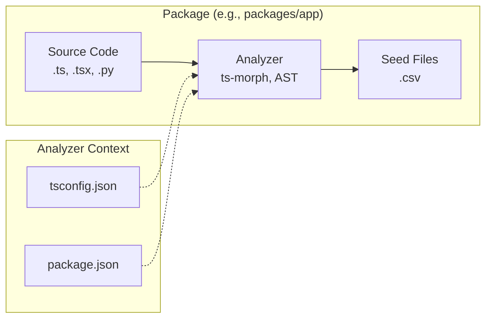

Each analyzer operates within its package's context (e.g., ts-morph uses the local tsconfig.json), producing seed files that describe the code structure.

### Sync Flow (Seeds → Central)

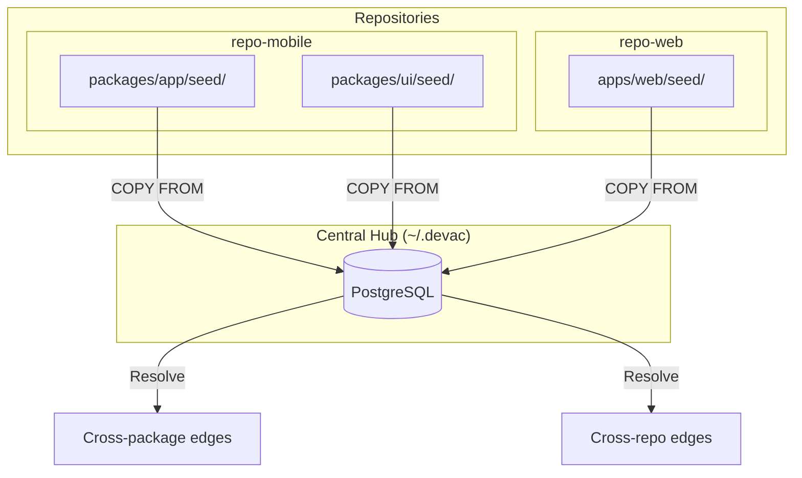

The central hub imports all seed files and resolves relationships that span package and repository boundaries.

---

## Sequence Diagrams

### Package Analysis Sequence

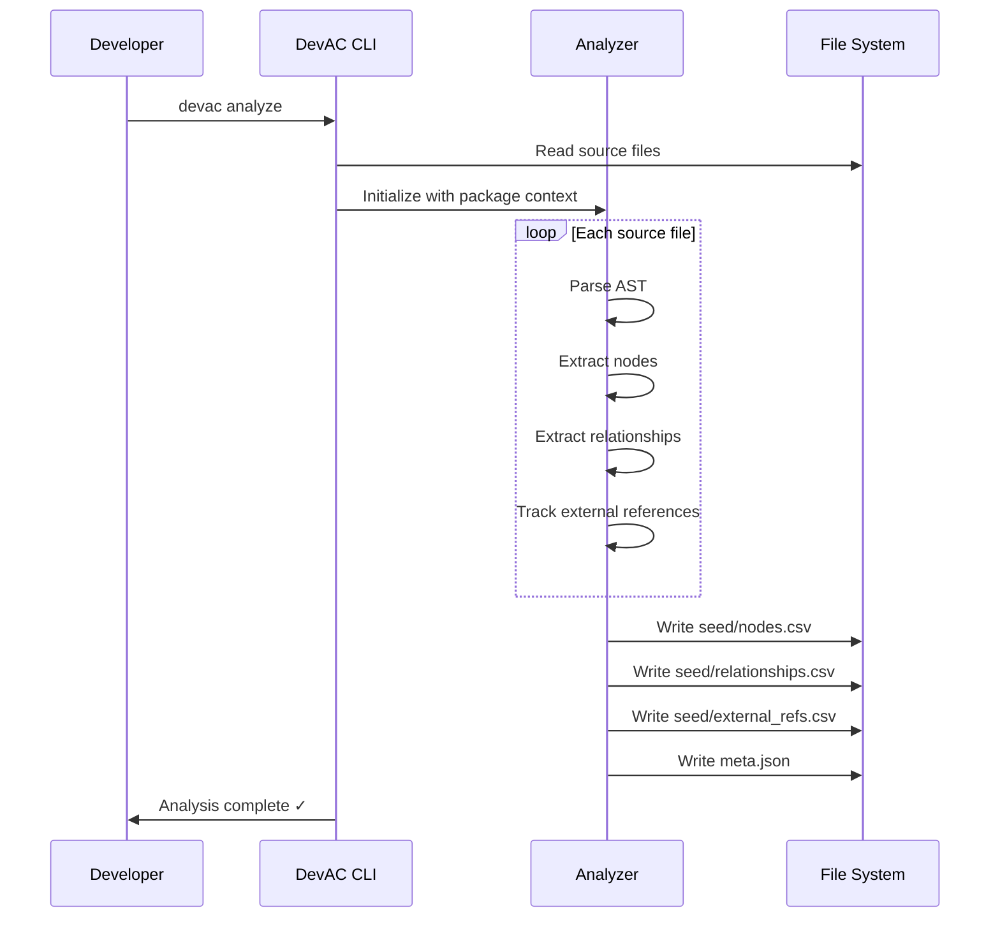

### Central Sync Sequence

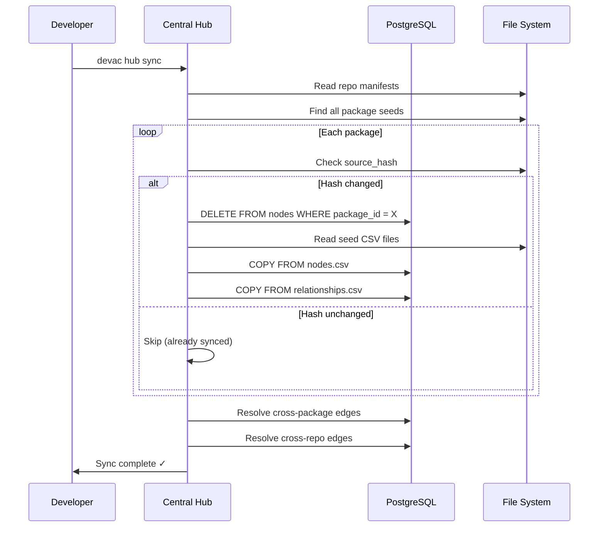

### Query Sequence

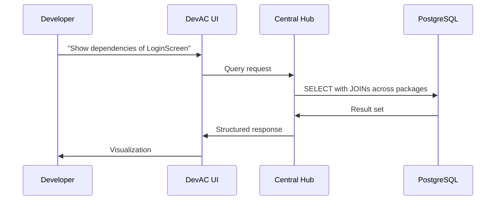

---

## State Diagrams

### Package State

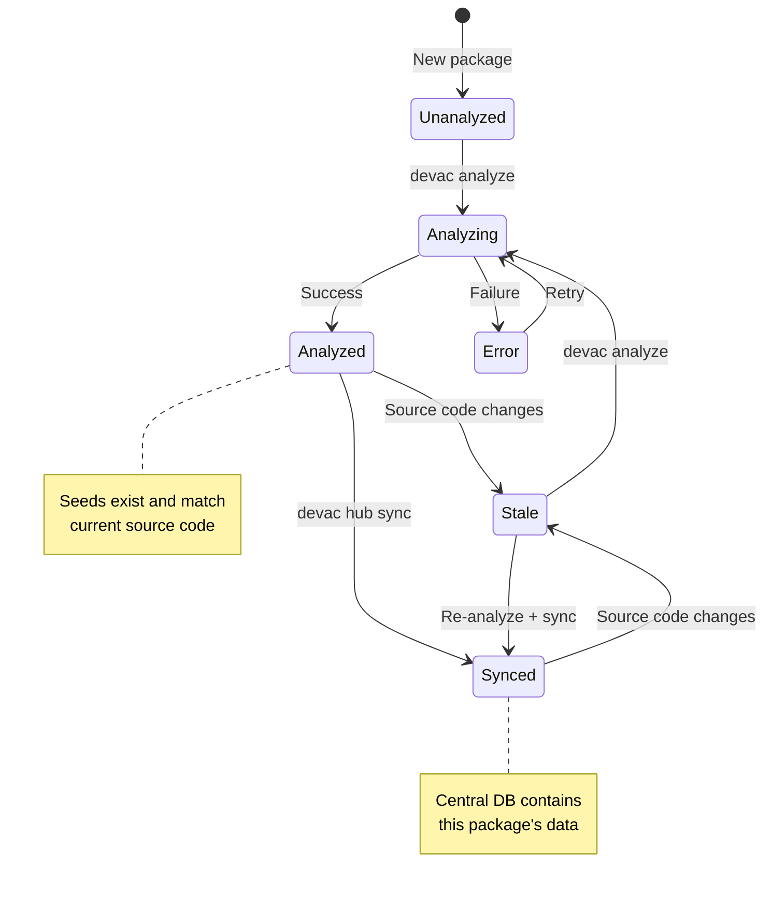

### Central Hub State

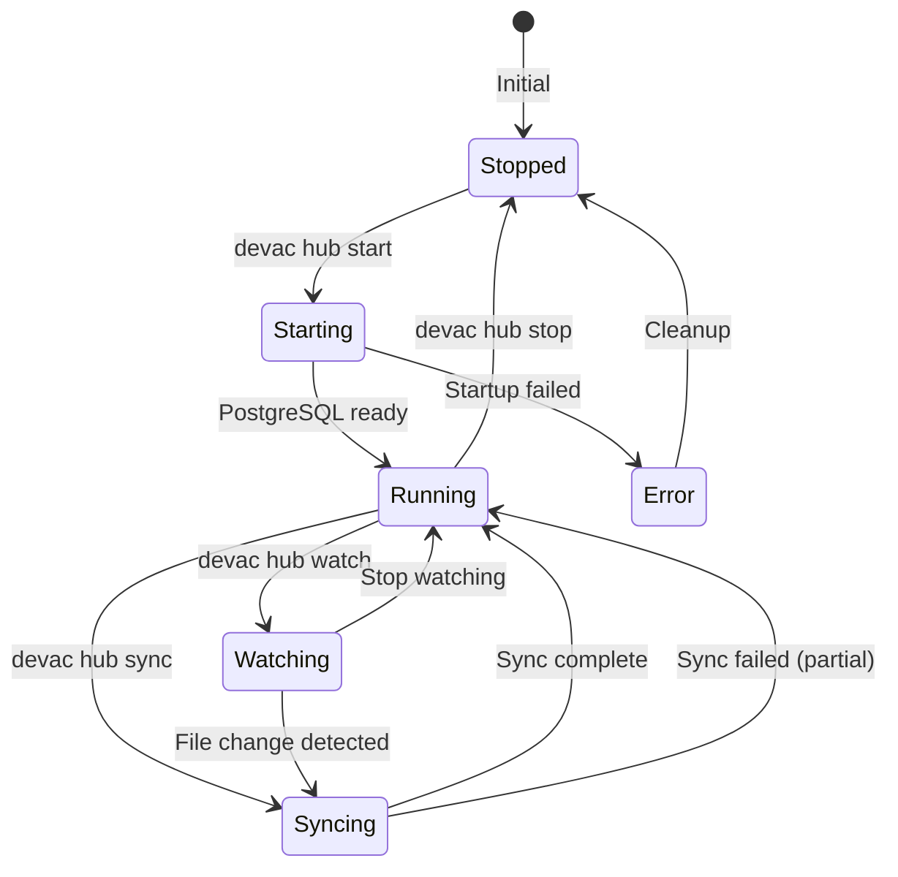

---

## Database Architecture

### Single Instance, Multiple Databases

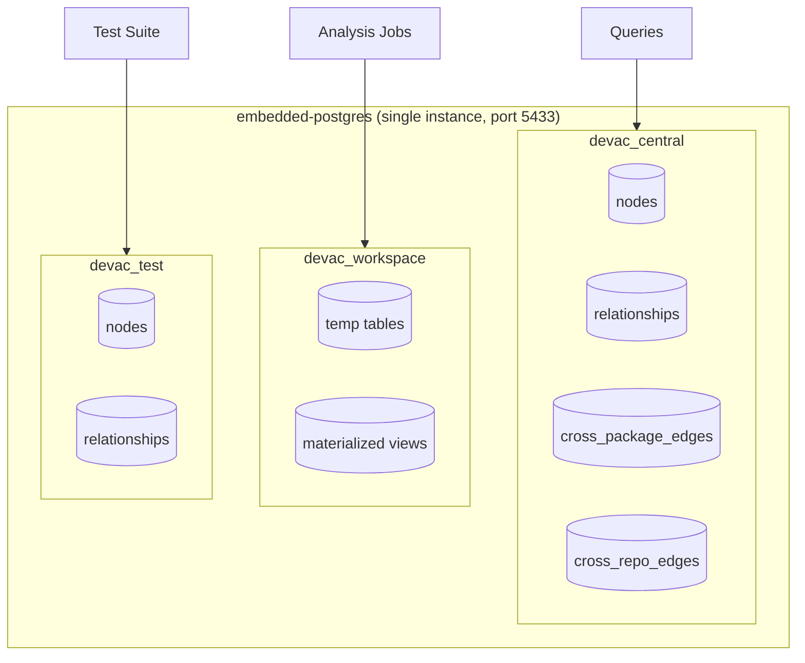

### Why This Structure?

| Database | Purpose | Lifecycle |
|----------|---------|-----------|
| `devac_central` | All production queries | Persistent, synced from seeds |
| `devac_workspace` | Heavy analysis, temp results | Can be cleared anytime |
| `devac_test` | Automated tests | Reset between test runs |

**Key Benefits:**
- Single postgres process (~100MB RAM)
- Native JOINs across all data (no federation complexity)
- Test isolation without instance overhead
- Simple mental model

---

## File Structure

### Package Level

```
packages/app/
├── src/                          # Source code (the truth)
│   └── ...
├── package.json
├── tsconfig.json
└── .devac/
    ├── meta.json                 # Analysis metadata
    └── seed/
        ├── nodes.csv             # Extracted code elements
        ├── relationships.csv     # Connections between elements
        └── external_refs.csv     # References to outside packages
```

### Repository Level

```
repo-mobile/
├── packages/
│   ├── app/.devac/seed/...
│   ├── ui/.devac/seed/...
│   └── hooks/.devac/seed/...
└── .devac/
    ├── manifest.json             # Repo metadata
    └── packages.json             # Index of all packages
```

### Central Level

```
~/.devac/
├── config.json                   # Global configuration
├── registry.json                 # Registered repositories
├── pgdata/                       # PostgreSQL data directory
│   └── ...
└── snapshots/                    # Point-in-time backups
    └── ...
```

---

## Sync Strategies

### Full Sync

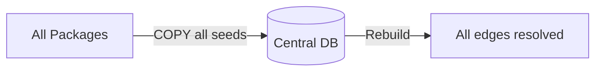

**When:** Initial setup, after major changes, recovery from corruption.

### Incremental Sync

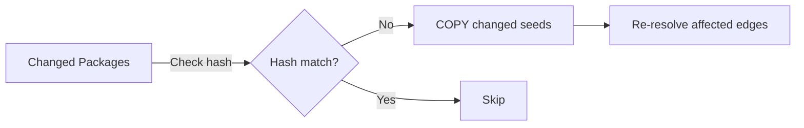

**When:** Normal development workflow. Only packages with changed `source_hash` are re-imported.

### Watch Mode

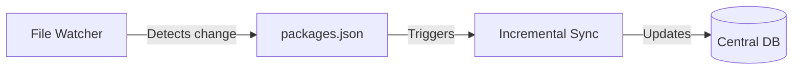

**When:** Active development. Central stays in sync automatically.

---

## Cross-Boundary Edge Resolution

### The Problem

Packages analyze in isolation but reference each other:

```
┌─────────────────┐         ┌─────────────────┐
│  packages/app   │         │  packages/ui    │
│                 │         │                 │
│  import {       │────?────│  export const   │
│    Button       │         │    Button = ... │
│  } from '../ui' │         │                 │
└─────────────────┘         └─────────────────┘

During analysis, packages/app doesn't know
Button's node ID in packages/ui
```

### The Solution

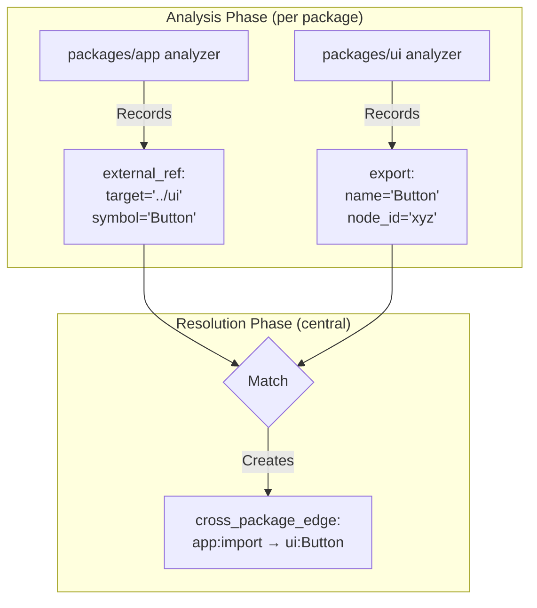

The central database has all the information needed to resolve these references after all packages are imported.

---

## Developer Experience

### Typical Workflow

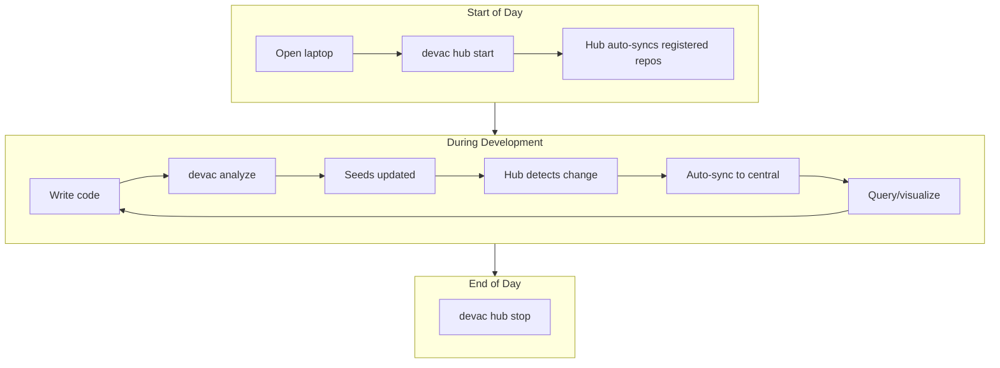

### CLI Commands

```bash
# Package operations
devac analyze                    # Analyze current package
devac analyze --all              # Analyze all packages in repo

# Hub operations  
devac hub start                  # Start PostgreSQL
devac hub stop                   # Stop PostgreSQL
devac hub sync                   # Sync all registered repos
devac hub watch                  # Watch and auto-sync

# Repository operations
devac hub register .             # Register current repo
devac hub register ~/code/other  # Register another repo

# Query operations
devac query "SELECT ..."         # Run SQL query
```

---

## Resource Usage

### Memory Footprint

```
┌─────────────────────────────────────────────────────┐
│  embedded-postgres instance                         │
│                                                     │
│  Baseline:           ~100 MB                        │
│  With typical data:  ~150-300 MB                    │
│  Maximum expected:   ~500 MB                        │
│                                                     │
│  Compare to alternatives:                           │
│  - Instance per repo (4 repos): ~400 MB baseline    │
│  - Instance per package (20 pkgs): ~2 GB baseline   │
└─────────────────────────────────────────────────────┘
```

### Startup Time

```
First start (initialization):  10-30 seconds
Subsequent starts:             2-5 seconds
Database creation:             < 1 second
Sync (incremental):            1-5 seconds typical
Sync (full, large repo):       10-30 seconds
```

---

## Testing Strategy

### Same Engine for Tests and Production

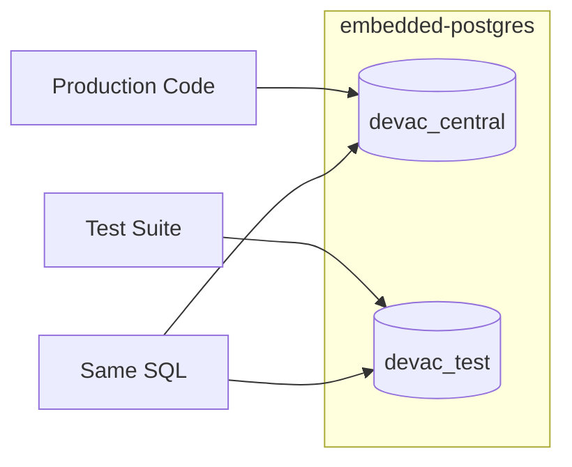

**Benefit:** No "works in tests, fails in production" surprises.

### Test Isolation

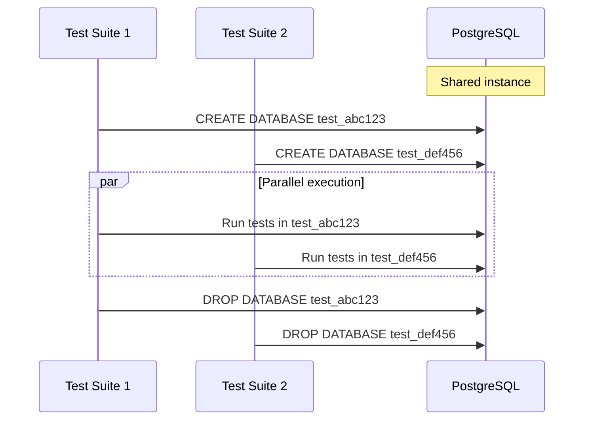

Each test suite gets its own database within the shared instance. Database creation is instant, providing isolation without instance startup overhead.

---

## Comparison: Why Not Alternatives?

### Why Not PGlite?

| Aspect | PGlite | embedded-postgres |
|--------|--------|-------------------|
| Size limit | ~50-200 MB practical | No practical limit |
| Performance | WASM overhead | Native speed |
| Extensions | Limited | Full PostgreSQL |
| Tooling | Custom only | psql, pg_dump, etc. |

**Decision:** embedded-postgres for production, with PGlite remaining an option for future browser-based features.

### Why Not Database per Package?

```
50 packages × ~5MB overhead = 250MB wasted
+ Cross-package queries require Foreign Data Wrappers
+ Connection pool per database
+ Complex lifecycle management

vs.

1 database with package_id column
+ Native JOINs
+ Single connection pool
+ Simple operations
```

### Why Not Instance per Repo?

```
4 repos × 100MB = 400MB baseline (just sitting idle)
+ 4 ports to manage
+ 4 processes to start/stop
+ Cross-repo queries need FDW

vs.

1 instance with repo_id column
+ Single 100MB baseline
+ 1 port
+ 1 process
+ Native JOINs
```

---

## Summary

```
┌─────────────────────────────────────────────────────────────────────────────┐
│                                                                             │
│  ARCHITECTURE SUMMARY                                                       │
│                                                                             │
│  ┌─────────────┐     ┌─────────────┐     ┌─────────────────────────────┐   │
│  │   Package   │     │ Repository  │     │          Central            │   │
│  │             │     │             │     │                             │   │
│  │  Analyzers  │────▶│  Manifests  │────▶│  embedded-postgres          │   │
│  │  → Seeds    │     │  (JSON)     │     │  ├── devac_central          │   │
│  │  (CSV)      │     │             │     │  ├── devac_workspace        │   │
│  │             │     │             │     │  └── devac_test             │   │
│  └─────────────┘     └─────────────┘     └─────────────────────────────┘   │
│                                                                             │
│  • 1 postgres instance (~100MB RAM)                                         │
│  • 3 databases (central, workspace, test)                                   │
│  • Seeds as portable CSV files                                              │
│  • Full SQL with native JOINs                                               │
│  • Same engine for dev and test                                             │
│                                                                             │
└─────────────────────────────────────────────────────────────────────────────┘
```

---

## Appendix: Abstract Data Model

> **Note:** The following is an abstract illustration of the data model. It uses generic "nodes" and "relationships" terminology to convey the concept without prescribing specific schema details. Concrete schemas will be defined in dedicated specifications.

### Conceptual Entities

```
┌─────────────────┐         ┌─────────────────┐
│      Node       │         │  Relationship   │
├─────────────────┤         ├─────────────────┤
│ id              │────────▶│ source_id       │
│ package_id      │◀────────│ target_id       │
│ type            │         │ type            │
│ name            │         │ metadata        │
│ location        │         └─────────────────┘
│ metadata        │
└─────────────────┘
         │
         │ references
         ▼
┌─────────────────┐
│  External Ref   │
├─────────────────┤
│ from_node_id    │
│ target_package  │
│ target_symbol   │
│ resolved_to     │ ← Populated during sync
└─────────────────┘
```

### Example Node Types (Illustrative)

- Function definitions
- Class definitions
- Component definitions
- Type definitions
- Import statements
- Export statements

### Example Relationship Types (Illustrative)

- Calls (function → function)
- Imports (file → symbol)
- Extends (class → class)
- Implements (class → interface)
- Renders (component → component)

These abstractions allow the architecture to support various analysis use cases (code structure, Vision-View-Effects, dependencies) without coupling to specific implementations.

---

## References

- [embedded-postgres npm package](https://www.npmjs.com/package/embedded-postgres)
- [PostgreSQL COPY documentation](https://www.postgresql.org/docs/current/sql-copy.html)
- [Mermaid diagram syntax](https://mermaid.js.org/syntax/flowchart.html)
