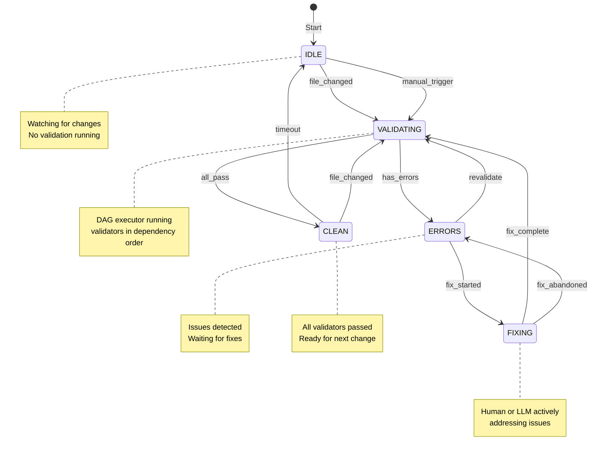
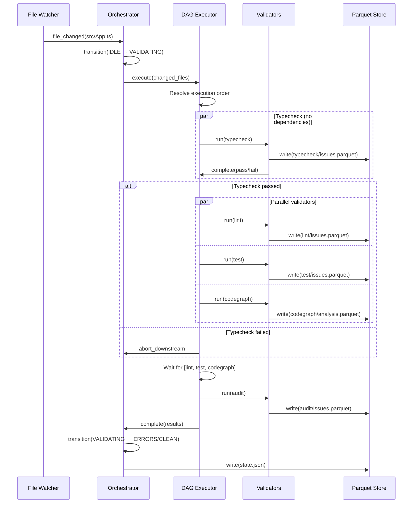

# DevAC Validation Pipeline Architecture

**System:** DevAC, Validation Pipeline, LLM Integration  
**Version:** 1.0  
**Status:** Draft  
**Last Updated:** 2025-01-XX

---

## Overview

This specification describes a unified validation pipeline that coordinates multiple code validators (type-checking, linting, testing, auditing, code analysis) and produces structured, prompt-ready output for both humans and LLMs.

> **Design Goal:** Enable seamless collaboration between developers, LLMs, and automated systems by providing consistent, queryable, and actionable validation feedback.

---

## Design Principles

```
┌─────────────────────────────────────────────────────────────────────────────┐
│                                                                             │
│  1. VALIDATORS ARE GENERIC                                                  │
│     Any tool that detects issues and produces output is a validator         │
│                                                                             │
│  2. OUTPUT IS PROMPT-READY                                                  │
│     Every issue includes context sufficient for LLM to fix without          │
│     additional tool calls (80% reduction target)                            │
│                                                                             │
│  3. ORCHESTRATION IS DETERMINISTIC                                          │
│     Validator execution order is explicit and reproducible                  │
│                                                                             │
│  4. STORAGE IS QUERYABLE                                                    │
│     Results stored in DuckDB/Parquet for filtering, aggregation, history    │
│                                                                             │
│  5. INTEGRATION IS BIDIRECTIONAL                                            │
│     LLMs can query status AND trigger validators                            │
│                                                                             │
└─────────────────────────────────────────────────────────────────────────────┘
```

---

## Architecture Overview

```
┌─────────────────────────────────────────────────────────────────────────────┐
│                                                                             │
│                              FILE SYSTEM                                    │
│                                 │                                           │
│                                 │ file changes                              │
│                                 ▼                                           │
│  ┌─────────────────────────────────────────────────────────────────────┐   │
│  │                         FILE WATCHER                                │   │
│  │                                                                     │   │
│  │  Detects: *.ts, *.tsx, *.js, *.json, package.json, etc.            │   │
│  └───────────────────────────────┬─────────────────────────────────────┘   │
│                                  │                                          │
│                                  ▼                                          │
│  ┌─────────────────────────────────────────────────────────────────────┐   │
│  │                        ORCHESTRATOR                                 │   │
│  │                                                                     │   │
│  │  ┌─────────────────────────────────────────────────────────────┐   │   │
│  │  │  State Machine (high-level flow control)                    │   │   │
│  │  │                                                             │   │   │
│  │  │  IDLE ──► VALIDATING ──► ERRORS ◄──► FIXING                │   │   │
│  │  │            │                           │                    │   │   │
│  │  │            └──► CLEAN ◄────────────────┘                    │   │   │
│  │  └─────────────────────────────────────────────────────────────┘   │   │
│  │                         │                                          │   │
│  │  ┌─────────────────────────────────────────────────────────────┐   │   │
│  │  │  DAG Executor (validator dependencies)                      │   │   │
│  │  │                                                             │   │   │
│  │  │           typecheck                                         │   │   │
│  │  │               │                                             │   │   │
│  │  │      ┌────────┼────────┐                                    │   │   │
│  │  │      ▼        ▼        ▼                                    │   │   │
│  │  │    lint     test   codegraph                                │   │   │
│  │  │      │        │        │                                    │   │   │
│  │  │      └────────┼────────┘                                    │   │   │
│  │  │               ▼                                             │   │   │
│  │  │            audit                                            │   │   │
│  │  └─────────────────────────────────────────────────────────────┘   │   │
│  └───────────────────────────────┬─────────────────────────────────────┘   │
│                                  │                                          │
│         ┌────────────────────────┼────────────────────────┐                │
│         ▼                        ▼                        ▼                │
│  ┌─────────────┐         ┌─────────────┐         ┌─────────────┐          │
│  │ Validators  │         │   Parquet   │         │ MCP Server  │          │
│  │  (plugins)  │────────►│   Store     │◄────────│             │          │
│  │             │         │             │         │  + Skill    │          │
│  └─────────────┘         └─────────────┘         └──────┬──────┘          │
│                                                         │                  │
│                                                         ▼                  │
│                                                  ┌─────────────┐          │
│                                                  │   Claude    │          │
│                                                  │   (LLM)     │          │
│                                                  └─────────────┘          │
│                                                                             │
└─────────────────────────────────────────────────────────────────────────────┘
```

---

## State Machine

### High-Level States



### State Transitions

| From | To | Trigger | Action |
|------|-----|---------|--------|
| IDLE | VALIDATING | file_changed | Start DAG executor |
| IDLE | VALIDATING | manual_trigger | Start DAG executor |
| VALIDATING | CLEAN | all_pass | Write success status |
| VALIDATING | ERRORS | has_errors | Write issues to Parquet |
| ERRORS | FIXING | fix_started | Lock issues being fixed |
| ERRORS | VALIDATING | revalidate | Restart DAG |
| FIXING | VALIDATING | fix_complete | Restart DAG |
| FIXING | ERRORS | fix_abandoned | Unlock issues |
| CLEAN | IDLE | timeout (30s) | Clear transient state |
| CLEAN | VALIDATING | file_changed | Start DAG executor |

### State Persistence

```json
{
  "current_state": "ERRORS",
  "entered_at": "2025-01-15T10:30:00Z",
  "last_transition": {
    "from": "VALIDATING",
    "to": "ERRORS",
    "trigger": "has_errors",
    "at": "2025-01-15T10:30:00Z"
  },
  "run_id": "run_abc123",
  "fixing": {
    "actor": "claude",
    "issues": ["ts-001", "ts-002"],
    "started_at": "2025-01-15T10:30:15Z"
  }
}
```

---

## DAG Executor

### Dependency Graph Definition

```yaml
# .devac/validation/pipeline.yaml

validators:
  typecheck:
    plugin: typescript
    dependencies: []
    config:
      command: tsc --noEmit --pretty false
      watch: true

  lint:
    plugin: eslint
    dependencies: [typecheck]
    config:
      command: eslint --format json
      cache: true

  test:
    plugin: vitest
    dependencies: [typecheck]
    config:
      command: vitest run
      watch: false

  codegraph:
    plugin: codegraph
    dependencies: [typecheck]
    config:
      output_dir: .devac/seed

  audit:
    plugin: yarn-audit
    dependencies: [lint, test, codegraph]
    config:
      severity_threshold: moderate

execution:
  parallel: true
  max_concurrent: 3
  fail_fast: false
  timeout_per_validator: 300
```

### Execution Flow



---

## Validator Plugin System

### Plugin Interface (Conceptual)

```
┌─────────────────────────────────────────────────────────────────────────────┐
│                                                                             │
│  ValidatorPlugin                                                            │
│  ───────────────                                                            │
│                                                                             │
│  Properties:                                                                │
│  • name: string              Unique identifier                              │
│  • description: string       Human-readable description                     │
│  • triggers: string[]        File patterns that trigger this validator      │
│  • dependencies: string[]    Other validators that must complete first      │
│                                                                             │
│  Methods:                                                                   │
│  • validate(context) → ValidationResult                                     │
│  • watch(context) → AsyncIterable<ValidationResult>   (optional)           │
│  • parseOutput(raw) → Issue[]                                               │
│  • enrichIssue(issue, context) → EnrichedIssue                             │
│                                                                             │
└─────────────────────────────────────────────────────────────────────────────┘
```

### Issue Schema

```
┌─────────────────────────────────────────────────────────────────────────────┐
│                                                                             │
│  Issue (base)                        EnrichedIssue (with context)           │
│  ────────────                        ─────────────────────────────          │
│                                                                             │
│  • id: string                        Everything from Issue, plus:           │
│  • validator: string                                                        │
│  • severity: error|warning|info      • surrounding_code: string             │
│  • file: string                      • related_context: RelatedContext[]    │
│  • line: number                      • codegraph_context: CodeGraphContext  │
│  • column: number                    • rule_docs: string                    │
│  • message: string                   • prompt_md: string  ← LLM-ready       │
│  • code: string (e.g., TS2322)       • created_at: timestamp                │
│  • category: string                  • resolved: boolean                    │
│  • fixable: boolean                  • resolved_by: human|llm|auto          │
│  • suggested_fix: string                                                    │
│                                                                             │
└─────────────────────────────────────────────────────────────────────────────┘
```

### Built-in Validators

| Validator | Plugin | Triggers | Dependencies | Output |
|-----------|--------|----------|--------------|--------|
| **typecheck** | typescript | `**/*.ts`, `**/*.tsx` | none | Type errors |
| **lint** | eslint | `**/*.ts`, `**/*.tsx`, `**/*.js` | typecheck | Lint violations |
| **test** | vitest | `**/*.ts`, `**/*.test.ts` | typecheck | Test failures |
| **codegraph** | codegraph | `**/*.ts`, `**/*.tsx` | typecheck | Architectural issues |
| **audit** | yarn-audit | `package.json`, `yarn.lock` | lint, test, codegraph | Security vulnerabilities |

---

## Issue Enrichment

### Context Sources

```
┌─────────────────────────────────────────────────────────────────────────────┐
│                                                                             │
│  Raw Issue                  Enrichment Sources              Enriched Issue  │
│  ─────────                  ──────────────────              ──────────────  │
│                                                                             │
│  ┌─────────────┐            ┌─────────────────┐            ┌─────────────┐ │
│  │ file: x.ts  │            │ Source Files    │            │ prompt_md:  │ │
│  │ line: 42    │ ─────────► │ (surrounding    │ ─────────► │             │ │
│  │ message:... │            │  code lines)    │            │ ## Error    │ │
│  └─────────────┘            └─────────────────┘            │             │ │
│                                                            │ **File:**   │ │
│                             ┌─────────────────┐            │ x.ts:42     │ │
│                             │ CodeGraph       │            │             │ │
│                      ──────►│ (callers,       │ ─────────► │ ### Code    │ │
│                             │  callees,       │            │ ```ts       │ │
│                             │  effect chain)  │            │ ...         │ │
│                             └─────────────────┘            │ ```         │ │
│                                                            │             │ │
│                             ┌─────────────────┐            │ ### Called  │ │
│                      ──────►│ Type Info       │ ─────────► │ by:         │ │
│                             │ (definitions,   │            │ - Foo.tsx   │ │
│                             │  declarations)  │            │ - Bar.tsx   │ │
│                             └─────────────────┘            │             │ │
│                                                            │ ### Impact  │ │
│                             ┌─────────────────┐            │ Changes     │ │
│                      ──────►│ Rule Docs       │ ─────────► │ affect 5    │ │
│                             │ (eslint rules,  │            │ components  │ │
│                             │  ts errors)     │            │             │ │
│                             └─────────────────┘            └─────────────┘ │
│                                                                             │
└─────────────────────────────────────────────────────────────────────────────┘
```

### Prompt Template

```markdown
## {Validator} {Severity}: {Code}

**File:** `{file}:{line}:{column}`
**Message:** {message}

### Surrounding Code

```{language}
{line-5} │ {code}
{line-4} │ {code}
{line-3} │ {code}
{line-2} │ {code}
{line-1} │ {code}
{line}   │ {code}  // ← error here
{line+1} │ {code}
{line+2} │ {code}
{line+3} │ {code}
```

### Related Type Definitions

```{language}
// From {related_file}:{related_line}
{type_definition}
```

### CodeGraph Context

**Called by:**
- `{caller_file}:{caller_line}` → `{caller_name}`
- ...

**Impact:** {impact_summary}

### Suggested Fix

{suggested_fix}

### Rule Documentation

{rule_docs_or_link}
```

---

## Storage Schema

### Directory Structure

```
{package}/.devac/validation/
├── state.json                    # Current state machine state
├── pipeline.yaml                 # Pipeline configuration
├── runs/
│   └── {run_id}.parquet          # Run history
├── typecheck/
│   └── issues.parquet
├── lint/
│   └── issues.parquet
├── test/
│   └── issues.parquet
├── codegraph/
│   └── issues.parquet
└── audit/
    └── issues.parquet
```

### Parquet Schema

```sql
-- Per-validator issues table
CREATE TABLE issues (
  -- Identity
  id VARCHAR PRIMARY KEY,
  run_id VARCHAR,
  validator VARCHAR,

  -- Location
  file VARCHAR,
  line INTEGER,
  column INTEGER,
  end_line INTEGER,
  end_column INTEGER,

  -- Classification
  severity VARCHAR,
  code VARCHAR,
  category VARCHAR,
  message VARCHAR,

  -- Fixability
  fixable BOOLEAN,
  suggested_fix VARCHAR,

  -- Context (for LLM)
  surrounding_code VARCHAR,
  related_context JSON,
  codegraph_context JSON,
  rule_docs VARCHAR,
  prompt_md VARCHAR,           -- Pre-generated prompt

  -- Resolution
  resolved BOOLEAN DEFAULT false,
  resolved_at TIMESTAMP,
  resolved_by VARCHAR,

  -- Metadata
  created_at TIMESTAMP,
  metadata JSON
);
```

### Common Queries

```sql
-- All unresolved errors
SELECT prompt_md
FROM read_parquet('.devac/validation/*/issues.parquet')
WHERE resolved = false AND severity = 'error'
ORDER BY validator, file, line;

-- Issue counts by validator
SELECT validator, severity, COUNT(*) as count
FROM read_parquet('.devac/validation/*/issues.parquet')
WHERE resolved = false
GROUP BY validator, severity;

-- Resolution metrics
SELECT 
  resolved_by,
  COUNT(*) as count,
  AVG(EPOCH(resolved_at - created_at)) as avg_seconds
FROM read_parquet('.devac/validation/*/issues.parquet')
WHERE resolved = true
GROUP BY resolved_by;
```

---

## MCP Server Integration

### Tools

| Tool | Description | Parameters |
|------|-------------|------------|
| `get_validation_status` | Get current pipeline state | none |
| `get_issues` | List issues with filters | validator?, severity?, file?, limit? |
| `get_issue_detail` | Get full issue with context | issue_id |
| `run_validator` | Run specific validator | validator, files? |
| `run_all_validators` | Run full pipeline | files? |
| `mark_issue_resolved` | Mark issue as fixed | issue_id, resolved_by |
| `start_fixing` | Lock issues being worked on | issue_ids[] |
| `get_codegraph_context` | Get code relationships | file, line |

### Resources

| URI | Description |
|-----|-------------|
| `validation://status` | Current state as JSON |
| `validation://issues/current` | All unresolved issues as markdown |
| `validation://issues/{validator}` | Issues for specific validator |
| `codegraph://node/{id}` | CodeGraph node with context |

---

## Skill Definition

```
┌─────────────────────────────────────────────────────────────────────────────┐
│                                                                             │
│  /mnt/skills/devac-validation/SKILL.md                                      │
│                                                                             │
│  # DevAC Validation Skill                                                   │
│                                                                             │
│  ## When to Use                                                              │
│  After making ANY code changes to TypeScript/JavaScript files.              │
│                                                                             │
│  ## Workflow                                                                 │
│                                                                             │
│  1. AFTER EDITING: Check validation status                                  │
│     → get_validation_status()                                               │
│                                                                             │
│  2. IF ERRORS: Get issue details                                            │
│     → get_issues(severity='error')                                          │
│     → Each issue has prompt_md with full context                            │
│                                                                             │
│  3. FIX IN ORDER:                                                           │
│     TypeScript errors → Lint errors → Test failures → Warnings              │
│                                                                             │
│  4. VERIFY: Run validators again                                            │
│     → run_all_validators() or run_validator(name)                           │
│                                                                             │
│  5. REPEAT until clean                                                      │
│                                                                             │
│  ## Key Insight                                                              │
│                                                                             │
│  The prompt_md field contains ALL context needed to fix most issues.        │
│  You typically don't need additional file reads.                            │
│                                                                             │
│  ## Tips                                                                     │
│                                                                             │
│  • Fix type errors first (lint depends on types)                            │
│  • Use get_codegraph_context to understand impact                           │
│  • Batch similar issues (same rule) together                                │
│                                                                             │
└─────────────────────────────────────────────────────────────────────────────┘
```

---

## Integration with CodeGraph

### CodeGraph as Validator

The CodeGraph analyzer runs as a validator, producing:
1. **Seeds:** nodes.parquet, edges.parquet, external_refs.parquet
2. **Issues:** Architectural problems (circular deps, orphan exports)

### CodeGraph Enhances Other Validators

```
┌─────────────────────────────────────────────────────────────────────────────┐
│                                                                             │
│  Type Error in useAuth.ts:42                                                │
│                                                                             │
│  Without CodeGraph:                  With CodeGraph:                        │
│  ──────────────────                  ───────────────                        │
│                                                                             │
│  ## Error TS2322                     ## Error TS2322                         │
│                                                                             │
│  Type 'string' not                   Type 'string' not                      │
│  assignable to 'number'              assignable to 'number'                 │
│                                                                             │
│  ```ts                               ```ts                                  │
│  const x: number = value;            const x: number = value;               │
│  ```                                 ```                                    │
│                                                                             │
│  (That's all)                        ### CodeGraph Context                  │
│                                                                             │
│                                      **Called by:**                         │
│                                      - LoginScreen.tsx:15                   │
│                                      - ProfileScreen.tsx:22                 │
│                                      - SettingsScreen.tsx:8                 │
│                                                                             │
│                                      **Impact:**                            │
│                                      Fixing this affects 3 screens.         │
│                                      Consider the return type contract.     │
│                                                                             │
└─────────────────────────────────────────────────────────────────────────────┘
```

### Vision-View-Effects Integration

For state management issues, CodeGraph provides effect chain context:

```markdown
### Effect Chain

```
UserInput (LoginScreen)
    │
    ▼
loginEffect
    │ writes: authState
    ▼
authState
    │ triggers
    ▼
fetchUserEffect
    │ writes: userState  ← Error occurs here
    ▼
userState
    │ renders
    ▼
ProfileScreen, SettingsScreen
```

The error in fetchUserEffect affects downstream state consumers.
```

---

## CLI Interface

```bash
# Status
devac validate status              # Show current state
devac validate issues              # List all issues
devac validate issues --errors     # Only errors
devac validate issues --validator lint

# Running validators
devac validate run                 # Run all (respects DAG)
devac validate run typecheck       # Run specific validator
devac validate run --changed       # Only for changed files

# Watch mode
devac validate watch               # Start watcher + orchestrator

# History
devac validate history             # Recent runs
devac validate history --run <id>  # Details for specific run

# Pipeline config
devac validate init                # Create pipeline.yaml
devac validate config              # Show current config
devac validate config --edit       # Edit config
```

---

## Metrics and Observability

### Tracked Metrics

| Metric | Description |
|--------|-------------|
| `validation_runs_total` | Total validation runs |
| `validation_duration_seconds` | Time per validator |
| `issues_detected_total` | Issues by validator, severity |
| `issues_resolved_total` | Resolutions by actor (human/llm/auto) |
| `time_to_resolution_seconds` | Time from detection to resolution |
| `fix_loop_iterations` | Iterations needed to reach CLEAN |

### Dashboard Queries

```sql
-- Average time to clean by hour
SELECT 
  DATE_TRUNC('hour', started_at) as hour,
  AVG(duration_ms) / 1000 as avg_seconds,
  COUNT(*) as runs
FROM read_parquet('.devac/validation/runs/*.parquet')
WHERE status = 'pass'
GROUP BY hour
ORDER BY hour DESC;

-- LLM vs Human resolution effectiveness
SELECT
  resolved_by,
  COUNT(*) as total,
  AVG(EPOCH(resolved_at - created_at)) as avg_resolution_time,
  COUNT(*) FILTER (WHERE reoccurred = false) as permanent_fixes
FROM read_parquet('.devac/validation/*/issues.parquet')
WHERE resolved = true
GROUP BY resolved_by;
```

---

## Future Considerations

### Auto-Fix Integration

```
┌─────────────────────────────────────────────────────────────────────────────┐
│                                                                             │
│  Issue detected                                                             │
│       │                                                                     │
│       ▼                                                                     │
│  Is auto-fixable? ───► Yes ───► Apply fix ───► Re-validate                 │
│       │                                              │                      │
│       │ No                                           │                      │
│       ▼                                              │                      │
│  Notify human/LLM ◄──────────────────────────────────┘                      │
│                                                                             │
│  Auto-fix sources:                                                          │
│  • ESLint --fix                                                             │
│  • TypeScript quick fixes                                                   │
│  • Prettier formatting                                                      │
│  • LLM-generated fixes (with confirmation)                                  │
│                                                                             │
└─────────────────────────────────────────────────────────────────────────────┘
```

### Learning from Fixes

```sql
-- Track which fixes work
CREATE TABLE fix_patterns (
  issue_code VARCHAR,         -- e.g., TS2322
  fix_pattern VARCHAR,        -- Normalized fix description
  success_count INTEGER,
  failure_count INTEGER,
  last_used TIMESTAMP
);

-- Suggest fixes based on history
SELECT fix_pattern, success_count
FROM fix_patterns
WHERE issue_code = $current_issue_code
ORDER BY success_count DESC
LIMIT 3;
```

### Multi-Package Orchestration

```yaml
# Monorepo pipeline
packages:
  - path: packages/app
    validators: [typecheck, lint, test, codegraph]
  - path: packages/ui
    validators: [typecheck, lint, test, codegraph]
  - path: packages/shared
    validators: [typecheck, lint, test]

dependencies:
  packages/app: [packages/shared, packages/ui]
  packages/ui: [packages/shared]

# Changes to shared trigger validation of app and ui
```

---

## Summary

```
┌─────────────────────────────────────────────────────────────────────────────┐
│                                                                             │
│  VALIDATION PIPELINE SUMMARY                                                │
│                                                                             │
│  Orchestration: State Machine + DAG                                         │
│  • State machine for high-level flow (IDLE → VALIDATING → ERRORS → ...)   │
│  • DAG executor for parallel validators with dependencies                   │
│                                                                             │
│  Output: Hybrid Structured + Prompt                                         │
│  • Queryable columns (file, line, severity, etc.)                          │
│  • prompt_md with full context for LLM (80% less tool calls)               │
│                                                                             │
│  Storage: DuckDB + Parquet                                                  │
│  • Partitioned by validator                                                 │
│  • History for metrics and learning                                         │
│                                                                             │
│  LLM Integration: MCP Server + Skill                                        │
│  • Tools for precise control                                                │
│  • Skill for workflow guidance                                              │
│  • Bidirectional (query AND trigger)                                        │
│                                                                             │
│  CodeGraph Integration:                                                     │
│  • CodeGraph is a validator (produces architectural issues)                 │
│  • CodeGraph enriches other validators (callers, impact)                    │
│  • Effect chains for state management issues                                │
│                                                                             │
└─────────────────────────────────────────────────────────────────────────────┘
```

---

## References

- [Federated CodeGraph Architecture v4.0](./federated-codegraph-architecture-v4.md)
- [XState (State Machines)](https://xstate.js.org/)
- [MCP Protocol](https://modelcontextprotocol.io/)
- [DuckDB Documentation](https://duckdb.org/docs/)
