# DevAC Validation Basics v2 - Foundation Specification

> **Purpose**: Define the minimum viable foundation needed for intelligent validation  
> **Scope**: Core infrastructure only - no features, no UI, no polish  
> **Timeline**: 1 week to validate, 1 week to implement  
> **Version**: 2.0 - Addresses CPU issues, watch modes, and adds visual diagrams

---

## Table of Contents

1. [Core Problem](#core-problem)
2. [Current Implementation Analysis](#current-implementation-analysis)
3. [Foundation Requirements](#foundation-requirements)
4. [Watch Mode Integration](#watch-mode-integration)
5. [CPU Issue Detection & Debugging](#cpu-issue-detection--debugging)
6. [Implementation Order](#implementation-order)
7. [Testing Requirements](#testing-requirements)
8. [Success Criteria](#success-criteria)

---

## Core Problem

**Current State**: Services validate entire repositories on every change (30-60 seconds)

**Desired State**: Services validate only affected files (2-5 seconds)

**Blocker**: Missing dependency graph relationships in Neo4j

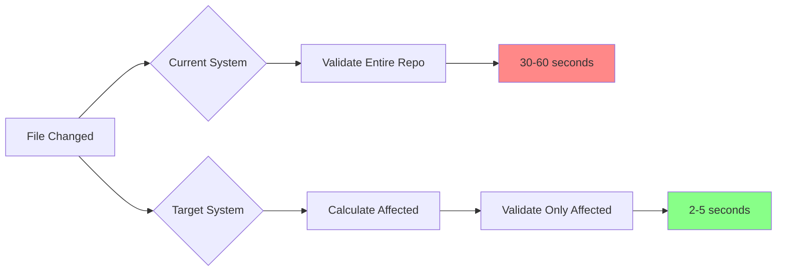

---

## Current Implementation Analysis

### Known CPU Issues

The analyzer can enter 100% CPU usage with no progress during file parsing. Based on code review:

**Problem Location**: `src/analyzer/parser.ts` - `_parseFilesOneByOne()` method

**Root Causes**:
1. **Infinite AST traversal** - Some TypeScript files cause ts-morph to hang
2. **No progress visibility** - Timeout occurs but we don't know which file caused it
3. **Missing cancellation** - No way to abort stuck file parsing
4. **Batch processing masks issues** - Problems only visible when isolated

**Current Timeout Protection**:
```typescript
// Line 703-710 in parser.ts
const FILE_PARSE_TIMEOUT_MS = 30000; // 30 seconds per file
const PROJECT_CREATE_TIMEOUT_MS = 10000; // 10 seconds to create Project + add file
const SLOW_FILE_THRESHOLD_MS = 5000; // Warn if file takes >5 seconds
```

**Improvements Needed**:
- Log which file is being processed BEFORE parsing starts
- Add --debug mode details for stuck files
- Expose current file path in service state
- Add ability to skip problematic files
- Better progress reporting during large batch processing

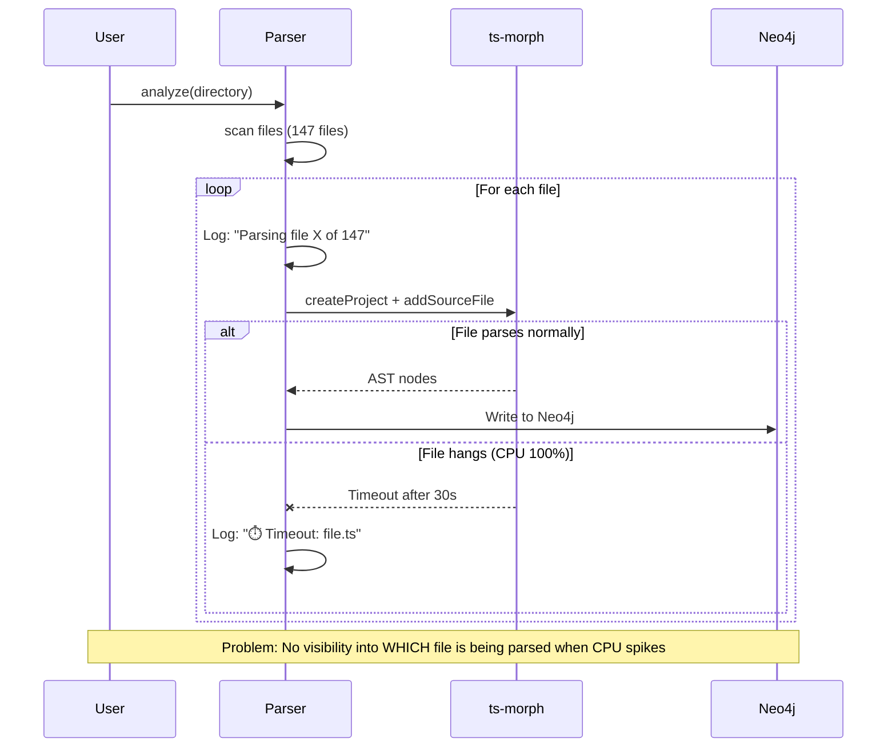

---

## Foundation Requirements

### 1. Graph Completeness

**Why**: Cannot calculate affected files without complete dependency graph

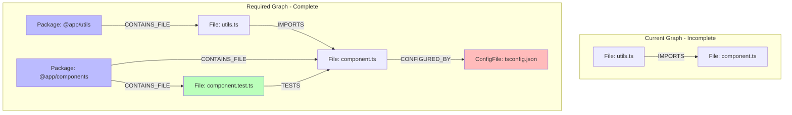

**What's Missing**:
1. ✅ Package nodes - **Already created** by PackageExtractor (line 27-28 in parser.ts)
2. ❌ CONTAINS_FILE relationships - **Not in Neo4j** (only used in memory)
3. ✅ IMPORTS relationships - **Already created** during Pass 2
4. ❌ TESTS relationships - **Not identified** (no test file detection)
5. ❌ ConfigFile nodes - **Not tracked** (tsconfig.json, eslintrc, etc.)
6. ❌ CONFIGURED_BY relationships - **Not tracked**

**Validation Queries**:
```cypher
// Check 1: Are packages in graph?
MATCH (p:Package) 
RETURN count(p) as packageCount

// Expected: Number of workspace packages (e.g., 32 for monorepo-3.0)

// Check 2: Are files linked to packages?
MATCH (p:Package)-[:CONTAINS_FILE]->(f:File) 
RETURN count(f) as linkedFiles

// Expected: All files should be linked (e.g., 147 files)

// Check 3: How many import relationships?
MATCH (f1:File)-[:IMPORTS]->(f2:File) 
RETURN count(*) as importCount

// Expected: > 0 (varies by codebase)

// Check 4: Are test files identified?
MATCH (t:File)-[:TESTS]->(s:File) 
RETURN count(*) as testCount

// Expected: Number of test files (e.g., 459 in CodeGraph)

// Check 5: Are config files tracked?
MATCH (c:ConfigFile)<-[:CONFIGURED_BY]-(f:File) 
RETURN count(*) as configuredFiles

// Expected: Files in packages with tsconfig.json
```

**How to Fix**:
1. **Add Package nodes to Neo4j** - Modify parser.ts to write Package nodes during Pass 1
2. **Create CONTAINS_FILE relationships** - Link each File to its Package
3. **Detect test files** - Check for `.test.`, `.spec.`, `__tests__/` patterns
4. **Create TESTS relationships** - Link test files to source files they test
5. **Track config files** - Create ConfigFile nodes for tsconfig.json, .eslintrc, etc.
6. **Create CONFIGURED_BY relationships** - Link files to their config files

---

### 2. Query Performance

**Why**: Affected calculation must complete in <500ms for acceptable UX

**Critical Indexes**:
```cypher
CREATE INDEX file_path_idx IF NOT EXISTS FOR (f:File) ON (f.path);
CREATE INDEX package_name_idx IF NOT EXISTS FOR (p:Package) ON (p.name);
CREATE CONSTRAINT file_path_unique IF NOT EXISTS FOR (f:File) REQUIRE f.path IS UNIQUE;
```

**Performance Tests**:
```cypher
// Test 1: Direct dependents (should be <50ms)
PROFILE
MATCH (f:File {path: $path})<-[:IMPORTS]-(dependent:File)
RETURN dependent.path
LIMIT 100

// Test 2: Transitive dependents depth 5 (should be <200ms)
PROFILE
MATCH path = (f:File {path: $path})<-[:IMPORTS*1..5]-(dependent:File)
RETURN DISTINCT dependent.path

// Test 3: Package files (should be <100ms)
PROFILE
MATCH (p:Package {name: $package})-[:CONTAINS_FILE]->(f:File)
RETURN f.path
```

**Benchmark Requirements**:
- Create test workspace with 1,000+ files
- Insert realistic import relationships (20-30% files import others)
- Run queries with PROFILE
- Measure execution time
- Add indexes if needed
- Re-test until <500ms threshold met

---

### 3. Service File-Scoped Execution

**Why**: Services must accept file lists, not just repository paths

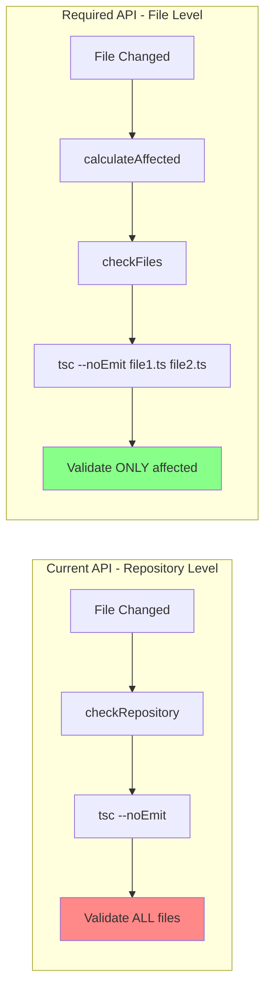

**Current API** (from typecheck-service.ts, test-service.ts):
```typescript
// TypeCheckService
async checkRepository(repositoryPath: string): Promise<void>

// LintService (similar pattern)
async lintRepository(repositoryPath: string): Promise<void>

// TestService
async testRepository(repositoryPath: string): Promise<void>
```

**Required API**:
```typescript
interface ValidationResult {
  success: boolean;
  errors: CommandError[];
  duration: number;
  filesChecked: number;
}

// TypeCheckService - NEW METHOD
async checkFiles(filePaths: string[]): Promise<ValidationResult> {
  const repoPath = this.getRepositoryPath(filePaths[0]);
  const command = `npx tsc --noEmit ${filePaths.join(' ')}`;
  const result = await this.runCommand(command, repoPath, repoPath);
  
  return {
    success: result.exitCode === 0,
    errors: this.parseErrors(result, repoPath),
    duration: result.duration,
    filesChecked: filePaths.length,
  };
}

// LintService - NEW METHOD
async lintFiles(filePaths: string[]): Promise<ValidationResult> {
  const repoPath = this.getRepositoryPath(filePaths[0]);
  const command = `npx eslint ${filePaths.join(' ')}`;
  const result = await this.runCommand(command, repoPath, repoPath);
  
  return {
    success: result.exitCode === 0,
    errors: this.parseErrors(result, repoPath),
    duration: result.duration,
    filesChecked: filePaths.length,
  };
}

// TestService - NEW METHOD
async runTests(testPaths: string[]): Promise<ValidationResult> {
  const repoPath = this.getRepositoryPath(testPaths[0]);
  // Use Vitest with specific files
  const command = `npx vitest run ${testPaths.join(' ')}`;
  const result = await this.runCommand(command, repoPath, repoPath);
  
  return {
    success: result.exitCode === 0,
    errors: this.parseErrors(result, repoPath),
    duration: result.duration,
    filesChecked: testPaths.length,
  };
}
```

**Validation Tests**:
- Create test file with known error
- Call `checkFiles([testFile])`
- Verify error is detected
- Verify execution time <5 seconds
- Verify other files not validated

---

### 4. Affected Calculation Core Algorithm

**Why**: Must reliably calculate which files need validation

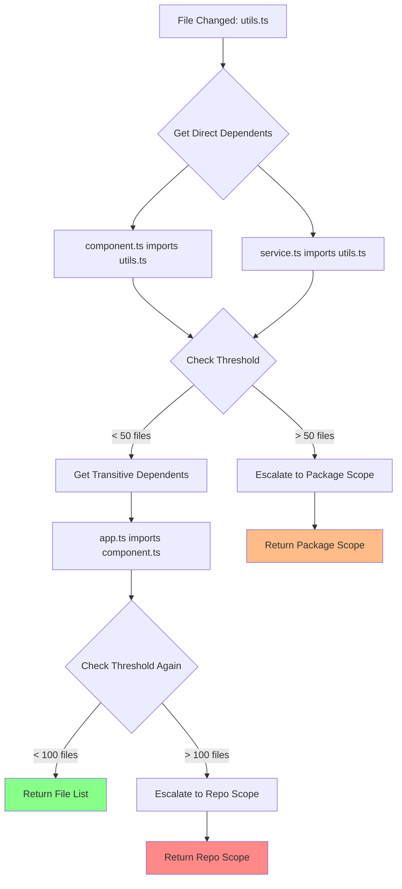

**Algorithm Implementation**:
```typescript
interface AffectedResult {
  scope: 'file' | 'package' | 'repo';
  files?: string[];
  package?: string;
  reason?: string;
}

async function calculateAffected(
  changedFilePath: string
): Promise<AffectedResult> {
  
  // Step 1: Get direct dependents
  const directDeps = await neo4j.run(`
    MATCH (changed:File {path: $path})<-[:IMPORTS]-(dependent:File)
    RETURN dependent.path as path
  `, { path: changedFilePath });
  
  const affected = new Set([changedFilePath]);
  directDeps.forEach(d => affected.add(d.path));
  
  // Step 2: Check if threshold exceeded
  if (affected.size > 50) {
    const pkg = await neo4j.run(`
      MATCH (f:File {path: $path})<-[:CONTAINS_FILE]-(p:Package)
      RETURN p.name as package
    `, { path: changedFilePath });
    
    return {
      scope: 'package',
      package: pkg[0]?.package,
      reason: `Too many direct dependents: ${affected.size}`,
    };
  }
  
  // Step 3: Get transitive dependents (limited depth)
  const transitiveDeps = await neo4j.run(`
    MATCH path = (changed:File {path: $path})<-[:IMPORTS*2..5]-(dependent:File)
    WHERE length(path) <= 5
    RETURN DISTINCT dependent.path as path
    LIMIT 100
  `, { path: changedFilePath });
  
  transitiveDeps.forEach(d => affected.add(d.path));
  
  // Step 4: Check threshold again
  if (affected.size > 100) {
    return { 
      scope: 'repo',
      reason: `Too many transitive dependents: ${affected.size}`,
    };
  }
  
  return {
    scope: 'file',
    files: Array.from(affected),
  };
}
```

**Performance Requirements**:
- Must complete in <500ms for typical cases
- Must handle edge cases (no deps, 1000+ deps)
- Must not cause Neo4j memory issues

**Test Cases**:
1. File with 0 dependents → Returns [file.ts]
2. File with 10 dependents → Returns [file.ts, ...10 deps]
3. File with 100 dependents → Escalates to package scope
4. Core utility file → Escalates to repo scope
5. Test file changed → Returns only that test file

---

### 5. Change Batching

**Why**: Rapid file saves must not trigger 10 validations

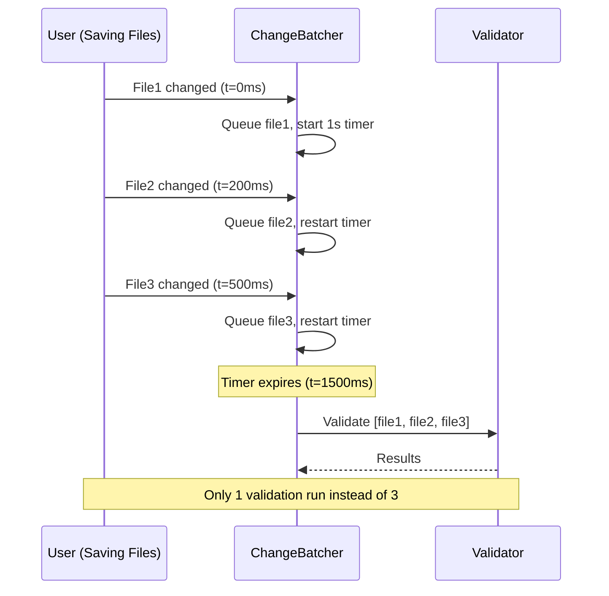

**Implementation**:
```typescript
class ChangeBatcher {
  private queue: string[] = [];
  private timer: NodeJS.Timeout | null = null;
  private readonly WINDOW_MS = 1000; // 1 second debounce
  
  queueChange(filePath: string): void {
    this.queue.push(filePath);
    
    // Reset timer on each change
    if (this.timer) {
      clearTimeout(this.timer);
    }
    
    this.timer = setTimeout(() => {
      this.flush();
    }, this.WINDOW_MS);
  }
  
  private async flush(): Promise<void> {
    if (this.queue.length === 0) return;
    
    const changes = [...this.queue];
    this.queue = [];
    
    // Calculate affected for all changes
    const allAffected = new Set<string>();
    
    for (const change of changes) {
      const affected = await calculateAffected(change);
      
      if (affected.scope === 'file' && affected.files) {
        affected.files.forEach(f => allAffected.add(f));
      } else if (affected.scope === 'package') {
        // Get all files in package
        const pkgFiles = await getPackageFiles(affected.package!);
        pkgFiles.forEach(f => allAffected.add(f));
      } else {
        // Repo scope - validate entire repo
        await validateRepository();
        return;
      }
    }
    
    // Trigger validation for accumulated files
    await validateFiles(Array.from(allAffected));
  }
}
```

**Validation Tests**:
- Trigger 5 changes within 500ms
- Verify only 1 validation runs
- Verify all 5 changes are included
- Trigger changes 2 seconds apart
- Verify 2 separate validations run

---

## Watch Mode Integration

### Native TypeScript Watch Mode

**Current Implementation**: TypeCheckService has watch mode stub (line 96 in typecheck-service.ts)

```typescript
private async startWatcher(repositoryPath: string): Promise<void> {
  // TODO: Implement watch mode in future iteration
  this.logger.info(`Watch mode would be enabled for ${repositoryPath} (not implemented yet)`);
}
```

**How tsc --watch Works**:
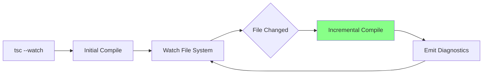

**Integration Strategy**:

1. **Package-Level Watch Mode** (Recommended):
   - Run `tsc --watch` per package in workspace
   - Each package has own tsconfig.json
   - Faster than repo-level (only recompiles affected files)
   - Already supported by TypeScript's project references

2. **Implementation**:
```typescript
async startPackageWatcher(packagePath: string, packageName: string): Promise<void> {
  const tsconfigPath = path.join(packagePath, 'tsconfig.json');
  
  if (!fs.existsSync(tsconfigPath)) {
    this.logger.warn(`No tsconfig.json found for package: ${packageName}`);
    return;
  }
  
  // Start tsc --watch for this package
  const watcher = spawn('npx', ['tsc', '--watch', '--noEmit'], {
    cwd: packagePath,
    stdio: 'pipe',
  });
  
  watcher.stdout.on('data', (data) => {
    const output = data.toString();
    
    // Parse tsc watch output for errors
    if (output.includes('error TS')) {
      const errors = this.parseErrors({ stdout: output, stderr: '', exitCode: 1 }, packagePath);
      this.emitTypeCheckErrors(packagePath, errors, { duration: 0 });
    } else if (output.includes('Found 0 errors')) {
      this.emitTypeCheckSuccess(packagePath, { duration: 0 });
    }
  });
  
  this.watchers.set(packageName, watcher);
  this.logger.info(`TypeScript watch mode started for package: ${packageName}`);
}
```

**Benefits**:
- ✅ Native TypeScript incremental compilation
- ✅ No custom file watching needed
- ✅ TypeScript handles dependency tracking
- ✅ Package isolation (errors in one package don't block others)

**Tradeoffs**:
- ❌ One tsc process per package (memory overhead for large monorepos)
- ✅ But: Each process is isolated and efficient
- ✅ And: Modern systems can handle 10-30 tsc watch processes

---

### Vitest Watch Mode

**Current Implementation**: TestService has watch mode stub (line 82 in test-service.ts)

**How Vitest Watch Mode Works**:
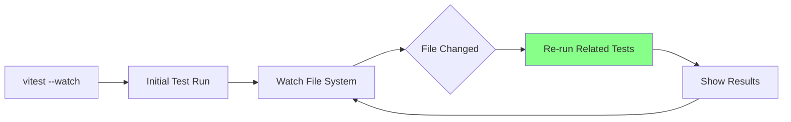

**Integration Levels**:

1. **Repository-Level Watch** (Simple):
   ```bash
   vitest --watch
   ```
   - Watches entire repository
   - Runs all tests on any change
   - Good for small projects

2. **Package-Level Watch** (Recommended for Monorepos):
   ```bash
   vitest --watch --project packages/my-package
   ```
   - Watches specific package
   - Only runs tests for that package
   - Faster feedback loop

**Implementation**:
```typescript
async startVitestPackageWatcher(packagePath: string, packageName: string): Promise<void> {
  const vitestConfigPath = path.join(packagePath, 'vitest.config.ts');
  
  // Start vitest --watch for this package
  const watcher = spawn('npx', ['vitest', '--watch', '--reporter=json'], {
    cwd: packagePath,
    stdio: 'pipe',
  });
  
  watcher.stdout.on('data', (data) => {
    try {
      const result = JSON.parse(data.toString());
      
      if (result.testResults) {
        const failures = result.testResults.filter(t => t.status === 'failed');
        
        if (failures.length > 0) {
          const errors = this.parseVitestFailures(failures);
          this.emitTestFailures(packagePath, errors, { duration: result.duration });
        } else {
          this.emitTestSuccess(packagePath, { duration: result.duration });
        }
      }
    } catch (error) {
      this.logger.warn('Failed to parse vitest output', { error });
    }
  });
  
  this.watchers.set(packageName, watcher);
  this.logger.info(`Vitest watch mode started for package: ${packageName}`);
}

async startVitestRepoWatcher(repositoryPath: string): Promise<void> {
  // Start vitest --watch for entire repository
  const watcher = spawn('npx', ['vitest', '--watch', '--reporter=json'], {
    cwd: repositoryPath,
    stdio: 'pipe',
  });
  
  // Similar handling as package-level
  this.watchers.set('repo', watcher);
  this.logger.info(`Vitest watch mode started for repository: ${repositoryPath}`);
}
```

**Benefits**:
- ✅ Vitest natively watches files and runs related tests
- ✅ No custom change detection needed
- ✅ Intelligent test selection based on imports
- ✅ Package-level isolation available

**Tradeoffs**:
- ❌ One vitest process per package (memory overhead)
- ✅ But: Vitest is lightweight and fast
- ✅ And: Package isolation prevents test interference

---

### Watch Mode Strategy Summary

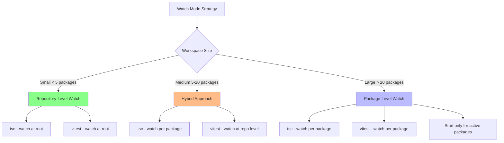

**Recommendation for CodeGraph**:
- **TypeCheck**: Package-level tsc --watch (32 packages in monorepo-3.0)
- **Test**: Repository-level vitest --watch (459 test files, but shared context)
- **Lint**: File-based (eslint doesn't have efficient watch mode)

---

## CPU Issue Detection & Debugging

### Enhanced Debug Mode

**Problem**: When analyzer hits 100% CPU, we don't know which file caused it.

**Solution**: Enhanced logging with --debug flag (already supported via verbosity)

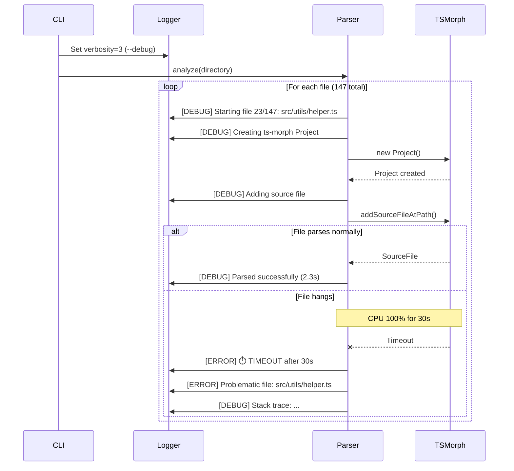

**Current Logging** (from parser.ts line 729-750):
```typescript
// Line 729: Log progress at intervals
if ((i + 1) % PROGRESS_LOG_INTERVAL === 0 || i + 1 === filePaths.length) {
  const percentComplete = Math.round(((i + 1) / filePaths.length) * 100);
  logger.info(
    `Progress: ${i + 1}/${filePaths.length} (${percentComplete}%) - ` +
    `Success: ${successCount}, Timeouts: ${timeoutCount}, Errors: ${errorCount}`
  );
}
```

**Enhanced Logging Needed**:
```typescript
private async _parseFilesOneByOne(filePaths: string[]): Promise<void> {
  const FILE_PARSE_TIMEOUT_MS = 30000;
  const PROJECT_CREATE_TIMEOUT_MS = 10000;
  const PROGRESS_LOG_INTERVAL = 10;
  const SLOW_FILE_THRESHOLD_MS = 5000;
  
  let successCount = 0;
  let timeoutCount = 0;
  let errorCount = 0;

  logger.info(
    `Parsing ${filePaths.length} files one-by-one with individual Projects...`
  );

  for (let i = 0; i < filePaths.length; i++) {
    const filePath = filePaths[i]!;
    const filePathNormalized = path.resolve(filePath).replace(/\\/g, '/');
    
    // 🆕 BEFORE parsing - log which file we're about to parse
    logger.debug(
      `[${i + 1}/${filePaths.length}] Starting parse: ${path.relative(this.workspaceRoot, filePath)}`
    );
    
    const startTime = Date.now();

    try {
      await withTimeout(
        (async () => {
          // 🆕 Log Project creation step
          logger.debug(`  Creating ts-morph Project for: ${path.basename(filePath)}`);
          
          const nearestTsConfig = await findNearestTsConfig(filePath, this.workspaceRoot);
          logger.debug(`  Using tsconfig: ${nearestTsConfig || 'none (default options)'}`);
          
          const fileProject = nearestTsConfig
            ? new Project({
                tsConfigFilePath: nearestTsConfig,
                skipAddingFilesFromTsConfig: true,
              })
            : new Project({
                compilerOptions: {
                  allowJs: true,
                  skipLibCheck: true,
                },
              });

          // 🆕 Log file addition step
          logger.debug(`  Adding source file to Project...`);
          fileProject.addSourceFileAtPath(filePath);

          const sourceFile = fileProject.getSourceFile(filePathNormalized);
          if (!sourceFile) {
            throw new Error(`Source file not found after adding: ${filePath}`);
          }

          // 🆕 Log parsing step
          logger.debug(`  Parsing AST for: ${path.basename(filePath)}`);
          await this._parseSingleSourceFile(sourceFile, filePathNormalized);

          fileProject.removeSourceFile(sourceFile);
          successCount++;
          
          // 🆕 Log success with timing
          const duration = Date.now() - startTime;
          logger.debug(`  ✅ Parsed successfully (${duration}ms)`);
        })(),
        PROJECT_CREATE_TIMEOUT_MS + FILE_PARSE_TIMEOUT_MS,
        `File processing timeout after ${PROJECT_CREATE_TIMEOUT_MS + FILE_PARSE_TIMEOUT_MS}ms: ${filePath}`
      );

      // Log timing for slow files
      const duration = Date.now() - startTime;
      if (duration > SLOW_FILE_THRESHOLD_MS) {
        logger.warn(
          `⏱️ Slow file: ${path.basename(filePath)} took ${Math.round(duration / 1000)}s`
        );
      }

    } catch (error: any) {
      if (error.message.includes('timeout')) {
        // 🆕 Enhanced timeout logging
        logger.error(
          `⏱️ TIMEOUT parsing file (${PROJECT_CREATE_TIMEOUT_MS + FILE_PARSE_TIMEOUT_MS}ms): ${filePath}`
        );
        logger.error(`  CPU likely spiked during this file's AST parsing`);
        logger.error(`  Consider adding to ignore patterns or fixing file syntax`);
        timeoutCount++;
      } else {
        logger.error(`❌ Error parsing file ${filePath}: ${error.message}`);
        logger.debug(`  Stack trace:`, { stack: error.stack });
        errorCount++;
      }
    }
  }

  logger.info(
    `Parsing complete: ${successCount} success, ${timeoutCount} timeouts, ${errorCount} errors`
  );
  
  // 🆕 List timeout files at end
  if (timeoutCount > 0) {
    logger.warn(
      `⚠️ ${timeoutCount} files timed out - consider adding ignore patterns or investigating syntax issues`
    );
  }
}
```

**Usage**:
```bash
# Enable debug logging
npm run devac -- analyze /path/to/repo -vvv  # verbosity=3 enables debug logs

# Or use --debug flag (if we add it)
npm run devac -- analyze /path/to/repo --debug
```

**Debug Output Example**:
```
2025-01-15T10:23:45.123Z [Parser] info: Parsing 147 files one-by-one with individual Projects...
2025-01-15T10:23:45.124Z [Parser] debug: [1/147] Starting parse: src/utils/helper.ts
2025-01-15T10:23:45.125Z [Parser] debug:   Creating ts-morph Project for: helper.ts
2025-01-15T10:23:45.126Z [Parser] debug:   Using tsconfig: /workspace/tsconfig.json
2025-01-15T10:23:45.200Z [Parser] debug:   Adding source file to Project...
2025-01-15T10:23:45.250Z [Parser] debug:   Parsing AST for: helper.ts
2025-01-15T10:23:47.543Z [Parser] debug:   ✅ Parsed successfully (2418ms)

... (continues for all 147 files) ...

2025-01-15T10:24:15.678Z [Parser] debug: [23/147] Starting parse: src/complex/types.ts
2025-01-15T10:24:15.679Z [Parser] debug:   Creating ts-morph Project for: types.ts
2025-01-15T10:24:15.680Z [Parser] debug:   Using tsconfig: /workspace/src/complex/tsconfig.json
2025-01-15T10:24:15.750Z [Parser] debug:   Adding source file to Project...
2025-01-15T10:24:15.800Z [Parser] debug:   Parsing AST for: types.ts

<<< CPU SPIKE TO 100% - NO OUTPUT FOR 30 SECONDS >>>

2025-01-15T10:24:45.800Z [Parser] error: ⏱️ TIMEOUT parsing file (40000ms): /workspace/src/complex/types.ts
2025-01-15T10:24:45.801Z [Parser] error:   CPU likely spiked during this file's AST parsing
2025-01-15T10:24:45.802Z [Parser] error:   Consider adding to ignore patterns or fixing file syntax
```

**Now the developer knows**:
1. **Exact file**: `src/complex/types.ts`
2. **Stage**: Parsing AST (after adding to Project)
3. **Action**: Add to `.codegraphignore` or investigate complex types

---

### Service State Exposure

**Problem**: When CodeGraph service is running and CPU spikes, no way to know current state.

**Solution**: Expose current file being processed in service state.

```typescript
// In codegraph-service.ts
export class CodeGraphService extends BaseService {
  private currentFile: string | null = null;
  
  async handleFileChange(filePath: string): Promise<void> {
    this.currentFile = filePath;
    
    try {
      // Parse file
      await this.analyzerService.parseFile(filePath);
    } finally {
      this.currentFile = null;
    }
  }
  
  getState(): ServiceState {
    return {
      status: this.status,
      currentFile: this.currentFile,  // 🆕 Expose current file
      // ... other state
    };
  }
}
```

**API Endpoint**:
```bash
# Get current service state
curl http://localhost:3000/api/services/codegraph/state

# Response when parsing:
{
  "status": "processing",
  "currentFile": "/workspace/src/complex/types.ts",
  "startedAt": "2025-01-15T10:24:15.800Z",
  "filesProcessed": 23,
  "filesTotal": 147
}

# Response when stuck (after 30s):
{
  "status": "processing",
  "currentFile": "/workspace/src/complex/types.ts",  # ← Same file for 30s!
  "startedAt": "2025-01-15T10:24:15.800Z",
  "filesProcessed": 23,
  "filesTotal": 147
}
```

---

### Problematic File Skip List

**Solution**: Add ability to skip known problematic files.

**Configuration**:
```json
// In devac.config.json
{
  "services": {
    "codegraph": {
      "skipFiles": [
        "**/types/complex-generics.ts",
        "**/generated/**/*.ts"
      ]
    }
  }
}
```

**Implementation**:
```typescript
// In parser.ts
async parseFiles(files: FileInfo[]): Promise<void> {
  const skipPatterns = config.services?.codegraph?.skipFiles || [];
  
  const filesToParse = files.filter(file => {
    const shouldSkip = skipPatterns.some(pattern => 
      micromatch.isMatch(file.path, pattern)
    );
    
    if (shouldSkip) {
      logger.info(`Skipping file (in skipFiles config): ${file.path}`);
    }
    
    return !shouldSkip;
  });
  
  logger.info(`Parsing ${filesToParse.length} files (${files.length - filesToParse.length} skipped)`);
  
  // Continue with parsing
}
```

---

## Implementation Order

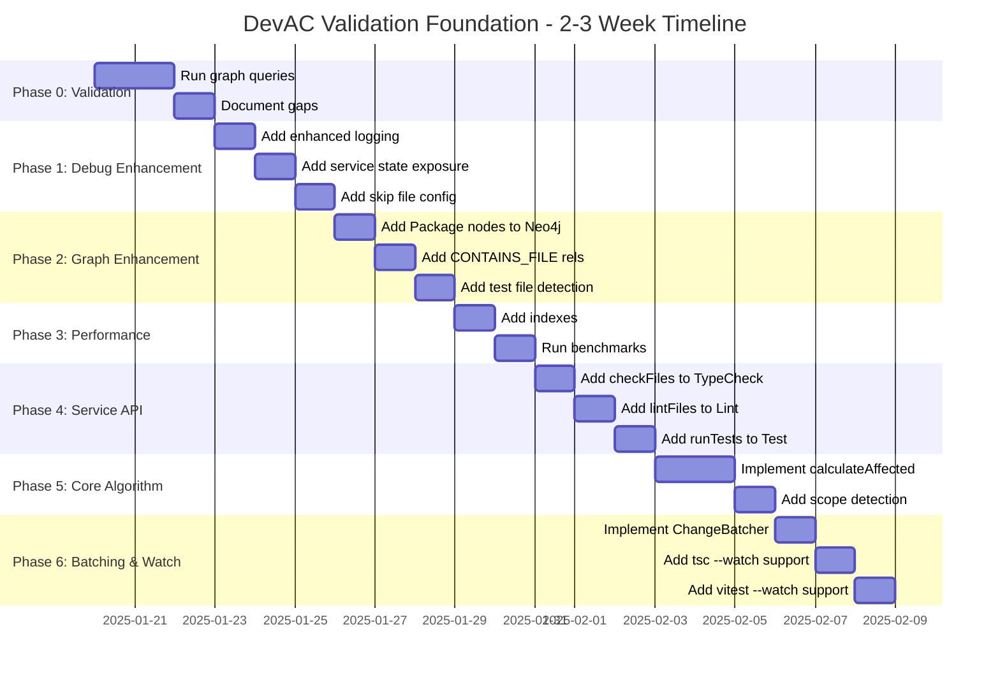

### Phase 0: Validation (3 days)

**Goal**: Understand current state and identify CPU issue root causes

**Tasks**:
1. ✅ Run graph completeness queries on Neo4j
2. ✅ Document what's missing (packages, relationships, etc.)
3. ✅ Run performance benchmarks on existing queries
4. 🆕 Enable --debug mode and analyze 10 random files
5. 🆕 Identify which files timeout (if any)
6. 🆕 Document timeout patterns (file size, complexity, imports)

**Output**: 
- Gap analysis document
- 🆕 CPU issue analysis report
- 🆕 List of problematic files (if any)

---

### Phase 1: Debug Enhancement (3 days)

**Goal**: Make CPU issues visible and debuggable

**Tasks**:
1. Add enhanced debug logging to parser
2. Add service state exposure (current file being processed)
3. Add skip file configuration option
4. Test with known problematic files
5. Verify debug output is actionable

**Output**: 
- Enhanced logging in parser.ts
- Service state API endpoint
- Skip file configuration support

**Success Criteria**:
- ✅ Can identify exact file causing CPU spike
- ✅ Can skip problematic files via config
- ✅ Debug mode provides clear visibility

---

### Phase 2: Graph Enhancement (3 days)

**Goal**: Make graph complete with all required relationships

**Tasks**:
1. Modify parser to write Package nodes to Neo4j during Pass 1
2. Create CONTAINS_FILE relationships for all files
3. Add test file detection (`.test.`, `.spec.`, `__tests__/` patterns)
4. Create TESTS relationships
5. Add ConfigFile node creation for tsconfig.json, .eslintrc, etc.
6. Create CONFIGURED_BY relationships
7. Re-analyze test workspace
8. Verify relationships exist with Cypher queries

**Output**: Complete graph with all relationships

**Validation**:
```cypher
MATCH (p:Package) RETURN count(p) as packages
MATCH (p:Package)-[:CONTAINS_FILE]->(f:File) RETURN count(f) as files
MATCH (t:File)-[:TESTS]->(s:File) RETURN count(*) as testRels
MATCH (c:ConfigFile)<-[:CONFIGURED_BY]-(f:File) RETURN count(*) as configuredFiles
```

---

### Phase 3: Performance (2 days)

**Goal**: Ensure queries are fast enough for real-time use

**Tasks**:
1. Add indexes to Neo4j (file_path, package_name)
2. Create test workspace with 1,000+ files
3. Insert realistic import relationships
4. Run benchmarks with PROFILE
5. Document query times
6. Optimize if needed (limit depth, add more indexes)
7. Re-test until <500ms threshold met

**Output**: Sub-500ms query performance

**Success Criteria**:
- Direct dependent query: <50ms
- Transitive query (depth 5): <200ms
- Package file query: <100ms

---

### Phase 4: Service API (3 days)

**Goal**: Enable file-scoped execution in services

**Tasks**:
1. Add `checkFiles()` to TypeCheckService
2. Add `lintFiles()` to LintService
3. Add `runTests()` to TestService
4. Write unit tests for each method
5. Write integration tests with real TypeScript/ESLint/Vitest
6. Verify execution time <5 seconds for single file
7. Verify other files not validated

**Output**: Services accept file lists

**Validation Tests**:
```typescript
describe('TypeCheckService.checkFiles', () => {
  it('should check only specified files', async () => {
    const result = await service.checkFiles(['/test/error.ts']);
    expect(result.filesChecked).toBe(1);
    expect(result.duration).toBeLessThan(5000);
  });
});
```

---

### Phase 5: Core Algorithm (3 days)

**Goal**: Reliably calculate affected files

**Tasks**:
1. Implement `calculateAffected()` function
2. Add direct dependent query
3. Add transitive dependent query with depth limit
4. Add scope detection logic (file/package/repo)
5. Add threshold checks (50 for package, 100 for repo)
6. Write comprehensive tests
7. Benchmark performance (<500ms)

**Output**: Working affected calculation

**Test Cases**:
- File with 0 dependents → [file.ts]
- File with 10 dependents → [file.ts, ...10 deps]
- File with 100 dependents → Package scope
- Core utility → Repo scope

---

### Phase 6: Batching & Watch Modes (3 days)

**Goal**: Prevent validation thrashing and support native watch modes

**Tasks**:
1. Implement ChangeBatcher class
2. Integrate with file watcher events
3. Test batching behavior (5 changes → 1 validation)
4. 🆕 Add `startPackageWatcher()` to TypeCheckService (tsc --watch)
5. 🆕 Add `startVitestPackageWatcher()` to TestService
6. 🆕 Add `startVitestRepoWatcher()` to TestService
7. 🆕 Test watch modes with real file changes
8. 🆕 Verify only affected tests re-run

**Output**: 
- Batched change handling
- 🆕 Native tsc --watch integration
- 🆕 Native vitest --watch integration

**Success Criteria**:
- ✅ Multiple rapid changes trigger 1 validation
- ✅ Separated changes trigger separate validations
- 🆕 tsc --watch emits errors via event bus
- 🆕 vitest --watch re-runs only related tests

---

## Testing Requirements

### Graph Completeness Tests

```typescript
describe('Graph Completeness', () => {
  it('should have Package nodes', async () => {
    const result = await neo4j.run('MATCH (p:Package) RETURN count(p) as count');
    expect(result[0].count).toBeGreaterThan(0);
  });
  
  it('should link files to packages via CONTAINS_FILE', async () => {
    const result = await neo4j.run(`
      MATCH (p:Package)-[:CONTAINS_FILE]->(f:File)
      RETURN count(f) as count
    `);
    expect(result[0].count).toBeGreaterThan(0);
  });
  
  it('should have IMPORTS relationships', async () => {
    const result = await neo4j.run(`
      MATCH ()-[:IMPORTS]->()
      RETURN count(*) as count
    `);
    expect(result[0].count).toBeGreaterThan(0);
  });
  
  it('should identify test files with TESTS relationships', async () => {
    const result = await neo4j.run(`
      MATCH (t:File)-[:TESTS]->(s:File)
      RETURN count(*) as count
    `);
    expect(result[0].count).toBeGreaterThan(0);
  });
});
```

### Performance Tests

```typescript
describe('Query Performance', () => {
  it('should find direct dependents in <50ms', async () => {
    const start = Date.now();
    await neo4j.run(`
      MATCH (f:File {path: $path})<-[:IMPORTS]-(d:File)
      RETURN d.path
    `, { path: '/test/file.ts' });
    const duration = Date.now() - start;
    
    expect(duration).toBeLessThan(50);
  });
  
  it('should find transitive dependents in <200ms', async () => {
    const start = Date.now();
    await neo4j.run(`
      MATCH path = (f:File {path: $path})<-[:IMPORTS*1..5]-(d:File)
      RETURN DISTINCT d.path
    `, { path: '/test/file.ts' });
    const duration = Date.now() - start;
    
    expect(duration).toBeLessThan(200);
  });
});
```

### Service API Tests

```typescript
describe('TypeCheckService', () => {
  it('should check single file', async () => {
    const result = await service.checkFiles(['/test/error.ts']);
    
    expect(result.errors.length).toBeGreaterThan(0);
    expect(result.duration).toBeLessThan(5000);
    expect(result.filesChecked).toBe(1);
  });
  
  it('should check multiple files', async () => {
    const result = await service.checkFiles([
      '/test/file1.ts',
      '/test/file2.ts',
    ]);
    
    expect(result).toBeDefined();
    expect(result.filesChecked).toBe(2);
    expect(result.duration).toBeLessThan(10000);
  });
});
```

### Algorithm Tests

```typescript
describe('calculateAffected', () => {
  it('should return file with no dependents', async () => {
    const result = await calculateAffected('/test/isolated.ts');
    
    expect(result.scope).toBe('file');
    expect(result.files).toEqual(['/test/isolated.ts']);
  });
  
  it('should return file + direct dependents', async () => {
    const result = await calculateAffected('/test/utils.ts');
    
    expect(result.scope).toBe('file');
    expect(result.files).toContain('/test/utils.ts');
    expect(result.files).toContain('/test/component.ts');
  });
  
  it('should escalate to package scope when > 50 dependents', async () => {
    const result = await calculateAffected('/test/core.ts');
    
    expect(result.scope).toBe('package');
    expect(result.package).toBeDefined();
  });
  
  it('should escalate to repo scope when > 100 dependents', async () => {
    const result = await calculateAffected('/test/shared-types.ts');
    
    expect(result.scope).toBe('repo');
  });
  
  it('should complete in <500ms', async () => {
    const start = Date.now();
    await calculateAffected('/test/utils.ts');
    const duration = Date.now() - start;
    
    expect(duration).toBeLessThan(500);
  });
});
```

### Batching Tests

```typescript
describe('ChangeBatcher', () => {
  it('should batch rapid changes', async () => {
    const batcher = new ChangeBatcher();
    const validateSpy = jest.fn();
    
    batcher.onFlush(validateSpy);
    
    // Trigger 5 changes rapidly
    batcher.queueChange('/test/file1.ts');
    batcher.queueChange('/test/file2.ts');
    batcher.queueChange('/test/file3.ts');
    batcher.queueChange('/test/file4.ts');
    batcher.queueChange('/test/file5.ts');
    
    // Wait for batch window
    await sleep(1100);
    
    // Should have called validate once with all files
    expect(validateSpy).toHaveBeenCalledTimes(1);
    expect(validateSpy).toHaveBeenCalledWith(
      expect.arrayContaining([
        '/test/file1.ts',
        '/test/file2.ts',
        '/test/file3.ts',
        '/test/file4.ts',
        '/test/file5.ts',
      ])
    );
  });
  
  it('should not batch separated changes', async () => {
    const batcher = new ChangeBatcher();
    const validateSpy = jest.fn();
    
    batcher.onFlush(validateSpy);
    
    batcher.queueChange('/test/file1.ts');
    await sleep(1100);
    
    batcher.queueChange('/test/file2.ts');
    await sleep(1100);
    
    // Should have called validate twice
    expect(validateSpy).toHaveBeenCalledTimes(2);
  });
});
```

### Watch Mode Tests

```typescript
describe('TypeCheckService Watch Mode', () => {
  it('should start tsc --watch for package', async () => {
    const service = new TypeCheckService(config, eventBus);
    
    await service.startPackageWatcher('/workspace/packages/utils', '@app/utils');
    
    // Verify watcher is running
    expect(service.watchers.has('@app/utils')).toBe(true);
  });
  
  it('should emit errors from tsc --watch output', async () => {
    const service = new TypeCheckService(config, eventBus);
    const errorSpy = jest.fn();
    
    eventBus.subscribe('typecheck', errorSpy);
    
    await service.startPackageWatcher('/workspace/packages/utils', '@app/utils');
    
    // Trigger file change that causes error
    await fs.writeFile('/workspace/packages/utils/error.ts', 'const x: number = "string";');
    
    // Wait for tsc --watch to detect and emit
    await sleep(2000);
    
    expect(errorSpy).toHaveBeenCalled();
    expect(errorSpy.mock.calls[0][0].metadata.errors.length).toBeGreaterThan(0);
  });
});

describe('TestService Watch Mode', () => {
  it('should start vitest --watch for package', async () => {
    const service = new TestService(config, eventBus);
    
    await service.startVitestPackageWatcher('/workspace/packages/utils', '@app/utils');
    
    expect(service.watchers.has('@app/utils')).toBe(true);
  });
  
  it('should re-run only related tests on file change', async () => {
    const service = new TestService(config, eventBus);
    const testSpy = jest.fn();
    
    eventBus.subscribe('test', testSpy);
    
    await service.startVitestPackageWatcher('/workspace/packages/utils', '@app/utils');
    
    // Change source file
    await fs.writeFile('/workspace/packages/utils/math.ts', 'export const add = (a, b) => a + b;');
    
    // Wait for vitest to detect and re-run
    await sleep(2000);
    
    // Should only run math.test.ts, not all tests
    expect(testSpy).toHaveBeenCalled();
    const testResults = testSpy.mock.calls[0][0].metadata;
    expect(testResults.filesChecked).toBeLessThan(10); // Not all test files
  });
});
```

---

## Success Criteria

Foundation is complete when all these checkboxes are ✅:

### 1. Graph Completeness
- [ ] Package nodes exist in Neo4j for all workspace packages
- [ ] CONTAINS_FILE relationships link all files to packages
- [ ] IMPORTS relationships exist for all file imports
- [ ] TESTS relationships link test files to source files
- [ ] ConfigFile nodes exist for tsconfig.json, .eslintrc, etc.
- [ ] CONFIGURED_BY relationships link files to config files

### 2. Performance
- [ ] Direct dependent query completes in <50ms
- [ ] Transitive dependent query (depth 5) completes in <200ms
- [ ] Package file query completes in <100ms
- [ ] Affected calculation completes in <500ms

### 3. Service Capabilities
- [ ] TypeCheckService.checkFiles() implemented and tested
- [ ] LintService.lintFiles() implemented and tested
- [ ] TestService.runTests() implemented and tested
- [ ] All return ValidationResult with errors
- [ ] All execute in <5 seconds for single file
- [ ] 🆕 TypeCheckService supports tsc --watch per package
- [ ] 🆕 TestService supports vitest --watch (repo and package level)

### 4. Core Algorithm
- [ ] calculateAffected() returns correct files for 0 dependents
- [ ] calculateAffected() returns correct files for 10 dependents
- [ ] Scope escalation works (file → package → repo)
- [ ] Performance <500ms for typical cases
- [ ] Handles edge cases (no deps, 1000+ deps)

### 5. Batching
- [ ] Changes within 1 second are batched
- [ ] Multiple rapid changes trigger single validation
- [ ] Changes outside window trigger separate validations

### 6. 🆕 CPU Issue Detection
- [ ] Debug mode logs file being processed BEFORE parsing
- [ ] Timeout errors include exact file path
- [ ] Service state exposes current file being processed
- [ ] Skip file configuration works
- [ ] Can identify which files cause CPU spikes

---

## What NOT to Build

Do not build until foundation is solid:

- ❌ Validation history in Neo4j
- ❌ SHA-256 file hashing
- ❌ ValidationRun nodes
- ❌ Cache invalidation logic beyond timestamp checks
- ❌ UI components
- ❌ Complex API endpoints
- ❌ SSE streaming (until watch modes are proven)
- ❌ Monitoring dashboards
- ❌ Custom file watching (use native tsc/vitest watch)

These are features, not foundation. Build them only after foundation is proven.

---

## Risk Mitigation

### Risk: Graph queries too slow

**Detection**: Benchmark shows >500ms  
**Mitigation**: Add indexes, limit depth, escalate to package scope  
**Fallback**: Skip affected calculation, validate package

### Risk: Services don't support file lists

**Detection**: tsc/eslint/vitest don't accept file arguments  
**Mitigation**: Use project references or workspace filtering  
**Fallback**: Validate at package level

### Risk: Too many affected files

**Detection**: calculateAffected returns 100+ files  
**Mitigation**: Escalate to package or repo scope  
**Fallback**: Full repository validation

### Risk: Graph becomes stale

**Detection**: File system changes not reflected in graph  
**Mitigation**: Compare file mtimes to graph timestamps  
**Fallback**: Full re-sync of codebase

### 🆕 Risk: CPU spikes continue despite fixes

**Detection**: Parser still hangs on specific files  
**Mitigation**: Use skip file configuration to exclude problematic files  
**Fallback**: Add entire directory patterns to ignore list

### 🆕 Risk: Watch modes consume too much memory

**Detection**: >20 tsc --watch processes running  
**Mitigation**: Only start watchers for active packages  
**Fallback**: Use repository-level watch for small projects

### 🆕 Risk: Native watch modes don't emit parseable output

**Detection**: Cannot parse tsc/vitest output for errors  
**Mitigation**: Use --reporter=json for vitest, parse tsc standard format  
**Fallback**: Fall back to file-based change detection

---

## Validation Commands

Run these to verify foundation:

```bash
# 1. Check graph completeness
npm run devac -- query "MATCH (p:Package) RETURN count(p)"
npm run devac -- query "MATCH ()-[:CONTAINS_FILE]->() RETURN count(*)"
npm run devac -- query "MATCH ()-[:IMPORTS]->() RETURN count(*)"
npm run devac -- query "MATCH (t:File)-[:TESTS]->(s:File) RETURN count(*)"

# 2. Benchmark queries
npm run devac -- benchmark affected-query

# 3. Test service APIs
npm test -- service-api.spec.ts

# 4. Test core algorithm
npm test -- affected-analyzer.spec.ts

# 5. Test batching
npm test -- change-batcher.spec.ts

# 6. 🆕 Test with debug mode
npm run devac -- analyze /path/to/repo -vvv

# 7. 🆕 Test watch modes
npm run devac -- watch --package @app/utils --service typecheck
npm run devac -- watch --service test

# 8. Full validation
npm run devac -- validate-foundation
```

---

## Next Steps After Foundation

Once foundation is solid (all checkboxes ✅):

1. Build ValidationCoordinator to orchestrate services
2. Add simple timestamp-based caching
3. Add minimal API endpoints for validation status
4. Test end-to-end workflow (change file → validate affected)
5. Measure actual performance improvement (before/after)
6. Iterate based on real usage
7. 🆕 Monitor watch mode memory usage
8. 🆕 Optimize watch mode startup time
9. 🆕 Add watch mode configuration (which packages to watch)

**Do not proceed to features until foundation is validated.**

---

## Summary

**Build**:
- ✅ Complete graph with all relationships (packages, files, tests, configs)
- ✅ Fast Cypher queries (<500ms)
- ✅ File-scoped service execution (checkFiles, lintFiles, runTests)
- ✅ Core affected calculation algorithm with scope escalation
- ✅ Change batching to prevent thrashing
- 🆕 Enhanced debug logging for CPU issue detection
- 🆕 Service state exposure (current file being processed)
- 🆕 Skip file configuration for problematic files
- 🆕 Native tsc --watch integration (package-level)
- 🆕 Native vitest --watch integration (repo and package-level)

**Validate**:
- ✅ Graph completeness (all nodes and relationships exist)
- ✅ Query performance (<50ms, <200ms, <100ms thresholds)
- ✅ Service execution time (<5s for single file)
- ✅ Algorithm correctness (0 deps, 10 deps, 100+ deps scenarios)
- ✅ Batching behavior (rapid changes → single validation)
- 🆕 CPU issue visibility (can identify stuck files)
- 🆕 Watch mode functionality (native tools handle file watching)

**Defer**:
- ❌ Validation history
- ❌ Complex caching
- ❌ UI components
- ❌ Monitoring
- ❌ Advanced features
- ❌ Custom file watching (use native instead)

**Timeline**: 2-3 weeks to build solid foundation

**Outcome**: Ready to build intelligent validation on top of proven base, with visibility into CPU issues and native watch mode support for fast feedback loops.

---

## Visual Summary

```mermaid
graph TB
    subgraph "Foundation Components"
        A[Complete Graph]
        B[Fast Queries]
        C[File-Scoped Services]
        D[Affected Calculator]
        E[Change Batcher]
        F[Debug Enhancement]
        G[Native Watch Modes]
    end
    
    subgraph "Complete Graph"
        A --> A1[Package Nodes]
        A --> A2[CONTAINS_FILE Relationships]
        A --> A3[TESTS Relationships]
        A --> A4[ConfigFile Nodes]
    end
    
    subgraph "Fast Queries"
        B --> B1[Indexes: path, name]
        B --> B2[Direct deps: <50ms]
        B --> B3[Transitive: <200ms]
    end
    
    subgraph "File-Scoped Services"
        C --> C1[checkFiles]
        C --> C2[lintFiles]
        C --> C3[runTests]
    end
    
    subgraph "Affected Calculator"
        D --> D1[Direct Dependents]
        D --> D2[Transitive Dependents]
        D --> D3[Scope Escalation]
    end
    
    subgraph "Change Batcher"
        E --> E1[1s Debounce]
        E --> E2[Accumulate Changes]
        E --> E3[Single Validation]
    end
    
    subgraph "Debug Enhancement"
        F --> F1[Enhanced Logging]
        F --> F2[Service State API]
        F --> F3[Skip File Config]
    end
    
    subgraph "Native Watch Modes"
        G --> G1[tsc --watch per package]
        G --> G2[vitest --watch repo]
        G --> G3[vitest --watch per package]
    end
    
    A & B & C & D & E & F & G --> H[Intelligent Validation System]
    
    H --> I[2-5 Second Feedback Loop]
    
    style A fill:#bbf
    style B fill:#bfb
    style C fill:#fbf
    style D fill:#ffb
    style E fill:#fbb
    style F fill:#bff
    style G fill:#fbf
    style H fill:#8f8
    style I fill:#ff8
```
