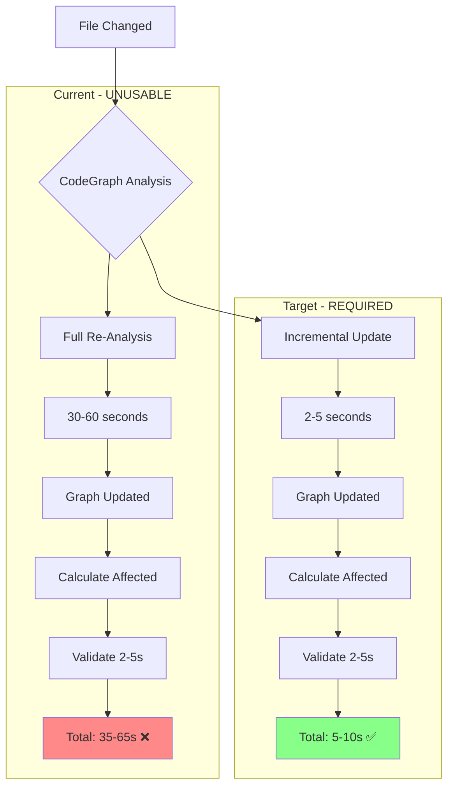
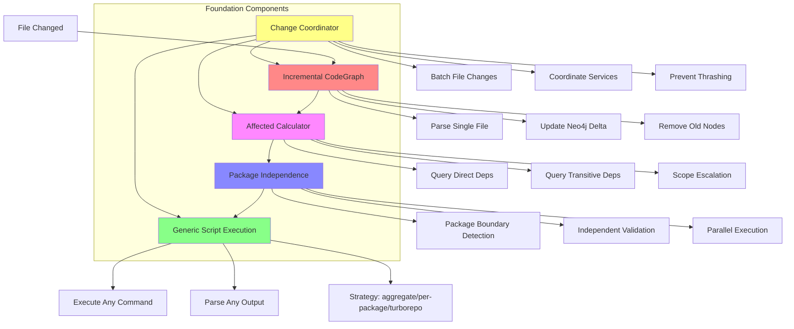
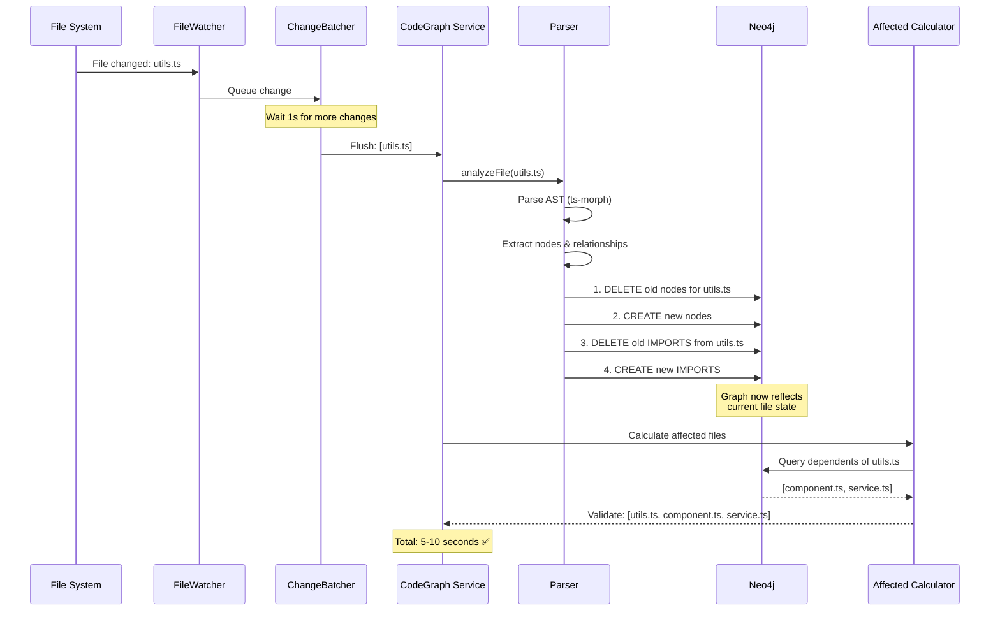
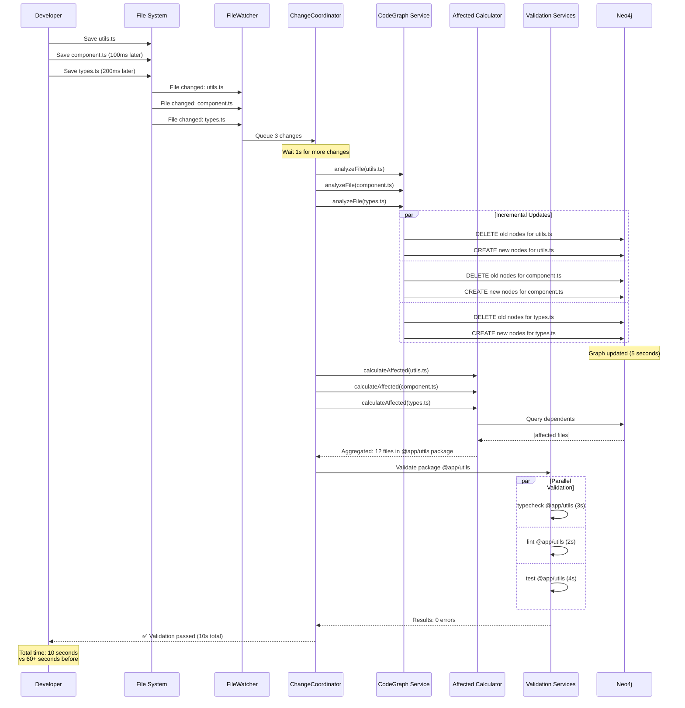

# DevAC Validation Basics v3 - Foundation Specification

> **Purpose**: Define complete foundation for intelligent validation including incremental CodeGraph analysis  
> **Scope**: Core infrastructure only - the missing pieces that make validation practical  
> **Timeline**: 2-3 weeks to implement foundation  
> **Version**: 3.0 - Adds incremental CodeGraph analysis + generic script execution + monorepo independence

---

## Critical Missing Piece

**The Blocker**: CodeGraph currently does **full repository re-analysis** on every file change.

```typescript
// Line 414-418 in codegraph-service.ts
// NOTE: Current AnalyzerService doesn't support true incremental updates.
// For Phase 2, we'll run full re-analysis (correct but slower).
await this.analyzerService.analyze(primaryDirectory, {
  ignorePatterns: serviceConfig.ignore,
  supportedExtensions: serviceConfig.extensions,
});
```

**Impact**: 
- File change → 30-60s full re-analysis → Graph updated → Calculate affected → Validate (2-5s)
- Total: **30-65 seconds** (unacceptable)
- **Target**: File change → 2-5s incremental update → Calculate affected → Validate → **Total: 5-10s**

**Why This Matters**:
Without incremental CodeGraph analysis, the entire validation system is unusable. The graph must be up-to-date **before** we can calculate affected files, but we can't wait 60s for updates.



---

## Table of Contents

1. [Foundation Components Overview](#foundation-components-overview)
2. [Component 1: Incremental CodeGraph Analysis](#component-1-incremental-codegraph-analysis)
3. [Component 2: Generic Script Execution](#component-2-generic-script-execution)
4. [Component 3: Monorepo Package Independence](#component-3-monorepo-package-independence)
5. [Component 4: Affected Calculation](#component-4-affected-calculation)
6. [Component 5: Change Batching & Coordination](#component-5-change-batching--coordination)
7. [Integration: How Components Work Together](#integration-how-components-work-together)
8. [Implementation Order with TDD](#implementation-order-with-tdd)
9. [Testing Strategy](#testing-strategy)
10. [Success Criteria](#success-criteria)

---

## Foundation Components Overview



**Priority Order**:
1. **Incremental CodeGraph** - Nothing works without this
2. **Affected Calculator** - Determines what to validate
3. **Package Independence** - Enables parallel validation
4. **Generic Script Execution** - Runs actual validation
5. **Change Coordinator** - Prevents thrashing

---

## Component 1: Incremental CodeGraph Analysis

### Why

**Current Problem** (from codegraph-service.ts line 414):
```typescript
// Full re-analysis on EVERY file change
await this.analyzerService.analyze(primaryDirectory);
// 30-60 seconds - UNUSABLE
```

**Required Solution**:
```typescript
// Incremental update for ONLY changed file
await this.analyzerService.analyzeFile(filePath);
// 2-5 seconds - USABLE
```

### How

**Architecture**:



**Implementation**:

```typescript
// NEW METHOD in analyzer-service.ts
export class AnalyzerService {
  
  /**
   * Analyze a single file incrementally (NEW - TDD required)
   * 
   * Strategy:
   * 1. Parse only the changed file
   * 2. Delete old nodes/relationships for this file from Neo4j
   * 3. Insert new nodes/relationships
   * 4. Update IMPORTS relationships (both from and to this file)
   */
  async analyzeFile(filePath: string): Promise<FileAnalysisResult> {
    const absolutePath = path.resolve(filePath);
    const now = new Date().toISOString();
    
    // Step 1: Parse the single file
    const fileInfo: FileInfo = {
      path: absolutePath,
      name: path.basename(absolutePath),
      extension: path.extname(absolutePath),
    };
    
    // Parse using existing parser (but only one file)
    const parseResult = await this.parser.parseSingleFile(fileInfo);
    
    // Step 2: DELETE old data for this file from Neo4j
    await this.storageManager.deleteFileData(absolutePath);
    
    // Step 3: INSERT new nodes for this file
    await this.storageManager.saveNodes(parseResult.nodes);
    
    // Step 4: INSERT new relationships from this file
    await this.storageManager.saveRelationships(parseResult.relationships);
    
    // Step 5: Re-resolve relationships that import this file (reverse deps)
    // This ensures that if we changed exports, importers get updated
    const importers = await this.storageManager.getFilesImporting(absolutePath);
    for (const importer of importers) {
      await this.updateImportsForFile(importer);
    }
    
    return {
      filePath: absolutePath,
      nodesCreated: parseResult.nodes.length,
      relationshipsCreated: parseResult.relationships.length,
      duration: Date.now() - parseStartTime,
    };
  }
  
  /**
   * Parse a single file (NEW - extracted from parseFiles)
   */
  async parseSingleFile(fileInfo: FileInfo): Promise<SingleFileParseResult> {
    // Reuse existing parsing logic but for one file
    // This already exists in parser.ts but needs extraction
  }
  
  /**
   * Update import relationships for a file (NEW)
   * Used when an imported file changes exports
   */
  private async updateImportsForFile(filePath: string): Promise<void> {
    // Re-parse import statements
    // Update IMPORTS relationships in Neo4j
  }
}
```

**Storage Manager Extensions**:

```typescript
// NEW METHODS in storage-manager.ts
export class StorageManager {
  
  /**
   * Delete all nodes and relationships for a specific file (NEW - TDD required)
   * 
   * Must delete:
   * - File node
   * - Function nodes from this file
   * - Class nodes from this file
   * - Variable nodes from this file
   * - Interface nodes from this file
   * - IMPORTS relationships from this file
   * - EXPORTS relationships from this file
   * - CONTAINS relationships to this file's nodes
   */
  async deleteFileData(filePath: string): Promise<void> {
    await this.neo4jClient.run(`
      // Delete all nodes that belong to this file
      MATCH (n)
      WHERE n.filePath = $filePath OR n.path = $filePath
      DETACH DELETE n
    `, { filePath });
  }
  
  /**
   * Get all files that import a specific file (NEW - TDD required)
   * Used to update reverse dependencies when exports change
   */
  async getFilesImporting(filePath: string): Promise<string[]> {
    const result = await this.neo4jClient.run(`
      MATCH (f:File {path: $filePath})<-[:IMPORTS]-(importer:File)
      RETURN DISTINCT importer.path as path
    `, { filePath });
    
    return result.map(r => r.path);
  }
}
```

**TDD Tests Required**:

```typescript
describe('AnalyzerService.analyzeFile (INCREMENTAL)', () => {
  
  it('should parse and store single file', async () => {
    // Arrange: Empty Neo4j
    const filePath = '/test/utils.ts';
    
    // Act: Analyze one file
    const result = await analyzer.analyzeFile(filePath);
    
    // Assert: File node exists
    const fileNode = await neo4j.run('MATCH (f:File {path: $path}) RETURN f', { path: filePath });
    expect(fileNode).toBeDefined();
    expect(result.nodesCreated).toBeGreaterThan(0);
  });
  
  it('should update existing file data', async () => {
    // Arrange: File already analyzed
    await analyzer.analyzeFile('/test/utils.ts');
    const oldNodes = await countNodes('/test/utils.ts');
    
    // Act: Modify file and re-analyze
    await fs.writeFile('/test/utils.ts', 'export const newFunc = () => {};');
    await analyzer.analyzeFile('/test/utils.ts');
    
    // Assert: Old nodes deleted, new nodes created
    const newNodes = await countNodes('/test/utils.ts');
    expect(newNodes).not.toEqual(oldNodes);
  });
  
  it('should update reverse dependencies when exports change', async () => {
    // Arrange: component.ts imports utils.ts
    await analyzer.analyze('/test'); // Full initial analysis
    
    // Act: Change export in utils.ts
    await fs.writeFile('/test/utils.ts', 'export const renamed = () => {};');
    await analyzer.analyzeFile('/test/utils.ts');
    
    // Assert: component.ts import relationship updated
    const imports = await neo4j.run(`
      MATCH (c:File {path: $componentPath})-[:IMPORTS]->(u:File {path: $utilsPath})
      RETURN count(*) as count
    `, { componentPath: '/test/component.ts', utilsPath: '/test/utils.ts' });
    
    expect(imports[0].count).toBe(1); // Still imports (or 0 if removed)
  });
  
  it('should complete in <5 seconds for typical file', async () => {
    const start = Date.now();
    await analyzer.analyzeFile('/test/component.ts');
    const duration = Date.now() - start;
    
    expect(duration).toBeLessThan(5000);
  });
  
  it('should handle file deletion', async () => {
    // Arrange: File exists in graph
    await analyzer.analyzeFile('/test/old.ts');
    
    // Act: File deleted from disk
    await fs.unlink('/test/old.ts');
    await analyzer.handleFileDeleted('/test/old.ts');
    
    // Assert: All nodes deleted from graph
    const nodes = await neo4j.run('MATCH (n {filePath: $path}) RETURN count(n)', 
      { path: '/test/old.ts' });
    expect(nodes[0].count).toBe(0);
  });
});
```

**Performance Requirements**:
- Single file analysis: **<5 seconds** (vs 30-60s for full analysis)
- Graph update: **<1 second** (Neo4j operations)
- Reverse dependency update: **<2 seconds** (for typical files with <10 importers)

---

## Component 2: Generic Script Execution

### Why

**Problem**: Services hardcode specific commands (tsc, eslint, vitest).

**Reality**: Projects use custom scripts in package.json:
```json
{
  "scripts": {
    "typecheck": "turbo run typecheck",
    "lint": "pnpm run -r lint",
    "test": "vitest run --coverage",
    "check": "npm run typecheck && npm run lint && npm run test"
  }
}
```

**Solution**: Execute **any command**, parse **any output**.

### How

**Strategy Pattern** (from configure command):

```typescript
type ExecutionStrategy = 
  | 'aggregate'    // Run one command at repo root
  | 'per-package'  // Run command in each package
  | 'turborepo'    // Use turbo/nx to run tasks
  | 'single';      // Single package (no monorepo)
```

**Generic Repository Config** (already exists in config.ts):

```typescript
interface RepositoryConfig {
  path: string;
  strategy: 'aggregate' | 'per-package' | 'turborepo' | 'single';
  command: string; // ANY command: npm run typecheck, turbo typecheck, etc.
  workingDirectory?: string;
  watch?: boolean;
  packages?: PackageConfig[]; // For per-package strategy
}

interface PackageConfig {
  name: string;
  command: string; // Package-specific command
  enabled: boolean;
  workingDirectory?: string;
}
```

**Implementation** (enhance command-based-service.ts):

```typescript
export abstract class CommandBasedService {
  
  /**
   * Execute repository using configured strategy (ENHANCED)
   */
  protected async runRepository(
    repoConfig: RepositoryConfig
  ): Promise<{ errors: CommandError[]; result: CommandResult }> {
    
    switch (repoConfig.strategy) {
      case 'aggregate':
        return this.runAggregate(repoConfig);
        
      case 'per-package':
        return this.runPerPackage(repoConfig);
        
      case 'turborepo':
        return this.runTurborepo(repoConfig);
        
      case 'single':
        return this.runSingle(repoConfig);
        
      default:
        throw new Error(`Unknown strategy: ${repoConfig.strategy}`);
    }
  }
  
  /**
   * Aggregate strategy: Run one command at repo root
   */
  private async runAggregate(
    repoConfig: RepositoryConfig
  ): Promise<{ errors: CommandError[]; result: CommandResult }> {
    const workDir = repoConfig.workingDirectory 
      ? path.join(repoConfig.path, repoConfig.workingDirectory)
      : repoConfig.path;
    
    const result = await this.runCommand(
      repoConfig.command,
      workDir,
      repoConfig.path
    );
    
    const errors = this.parseErrors(result, repoConfig.path);
    
    return { errors, result };
  }
  
  /**
   * Per-package strategy: Run command in each package independently
   */
  private async runPerPackage(
    repoConfig: RepositoryConfig
  ): Promise<{ errors: CommandError[]; result: CommandResult }> {
    const allErrors: CommandError[] = [];
    const allResults: CommandResult[] = [];
    
    if (!repoConfig.packages) {
      throw new Error('Per-package strategy requires packages config');
    }
    
    // Run in parallel for independent packages
    const promises = repoConfig.packages
      .filter(pkg => pkg.enabled)
      .map(async (pkg) => {
        const workDir = pkg.workingDirectory
          ? path.join(repoConfig.path, pkg.workingDirectory)
          : path.join(repoConfig.path, 'packages', pkg.name);
        
        const result = await this.runCommand(
          pkg.command,
          workDir,
          repoConfig.path
        );
        
        const errors = this.parseErrors(result, repoConfig.path);
        
        return { errors, result };
      });
    
    const results = await Promise.all(promises);
    
    // Combine results
    results.forEach(r => {
      allErrors.push(...r.errors);
      allResults.push(r.result);
    });
    
    // Merge command results
    const combinedResult: CommandResult = {
      success: allResults.every(r => r.success),
      stdout: allResults.map(r => r.stdout).join('\n'),
      stderr: allResults.map(r => r.stderr).join('\n'),
      exitCode: allResults.some(r => r.exitCode !== 0) ? 1 : 0,
      duration: Math.max(...allResults.map(r => r.duration)),
    };
    
    return { errors: allErrors, result: combinedResult };
  }
  
  /**
   * Turborepo strategy: Use turbo/nx to run tasks
   */
  private async runTurborepo(
    repoConfig: RepositoryConfig
  ): Promise<{ errors: CommandError[]; result: CommandResult }> {
    // Turborepo handles parallelization and caching
    // Just run the turbo command
    const result = await this.runCommand(
      repoConfig.command, // e.g., "turbo run typecheck"
      repoConfig.path,
      repoConfig.path
    );
    
    const errors = this.parseErrors(result, repoConfig.path);
    
    return { errors, result };
  }
  
  /**
   * Single strategy: No monorepo, just one package
   */
  private async runSingle(
    repoConfig: RepositoryConfig
  ): Promise<{ errors: CommandError[]; result: CommandResult }> {
    // Same as aggregate for single-package repos
    return this.runAggregate(repoConfig);
  }
  
  /**
   * Run commands for specific files (NEW - for affected validation)
   */
  protected async runFiles(
    filePaths: string[],
    repoConfig: RepositoryConfig
  ): Promise<{ errors: CommandError[]; result: CommandResult }> {
    // Build command with file arguments
    const command = `${repoConfig.command} ${filePaths.join(' ')}`;
    
    const result = await this.runCommand(
      command,
      repoConfig.path,
      repoConfig.path
    );
    
    const errors = this.parseErrors(result, repoConfig.path);
    
    return { errors, result };
  }
}
```

**TDD Tests Required**:

```typescript
describe('CommandBasedService.runRepository (STRATEGIES)', () => {
  
  it('should run aggregate strategy', async () => {
    const repoConfig: RepositoryConfig = {
      path: '/workspace',
      strategy: 'aggregate',
      command: 'npm run typecheck',
    };
    
    const { errors, result } = await service.runRepository(repoConfig);
    
    expect(result.exitCode).toBeDefined();
    // Verify command ran at repo root
  });
  
  it('should run per-package strategy in parallel', async () => {
    const repoConfig: RepositoryConfig = {
      path: '/workspace',
      strategy: 'per-package',
      command: 'npm run typecheck', // Not used, package commands used instead
      packages: [
        { name: 'pkg-a', command: 'npm run typecheck', enabled: true },
        { name: 'pkg-b', command: 'npm run typecheck', enabled: true },
      ],
    };
    
    const start = Date.now();
    const { errors, result } = await service.runRepository(repoConfig);
    const duration = Date.now() - start;
    
    // Should run in parallel (not sequential)
    // Duration should be ~max(pkg-a, pkg-b), not sum
    expect(duration).toBeLessThan(10000); // Not 2x sequential time
  });
  
  it('should run turborepo strategy', async () => {
    const repoConfig: RepositoryConfig = {
      path: '/workspace',
      strategy: 'turborepo',
      command: 'turbo run typecheck',
    };
    
    const { errors, result } = await service.runRepository(repoConfig);
    
    expect(result.exitCode).toBeDefined();
    // Turbo handles its own parallelization
  });
  
  it('should run files with specific file list', async () => {
    const repoConfig: RepositoryConfig = {
      path: '/workspace',
      strategy: 'single',
      command: 'tsc --noEmit',
    };
    
    const files = ['/workspace/src/utils.ts', '/workspace/src/component.ts'];
    
    const { errors, result } = await service.runFiles(files, repoConfig);
    
    // Verify command included file paths
    expect(result).toBeDefined();
  });
});
```

---

## Component 3: Monorepo Package Independence

### Why

**Problem**: Monorepos have independent packages that can be validated separately.

**Example**: monorepo-3.0 has 32 packages
- Changing `/services/mindlerapi/src/utils.ts` should **only** validate `mindlerapi` package
- Should **not** validate other 31 packages

**Benefits**:
- Parallel validation (32 packages → 32 parallel validations)
- Faster feedback (5s for one package vs 60s for all)
- Independent development (teams work on different packages)

### How

**Package Boundary Detection** (already exists in package-extractor.ts):

```typescript
// PackageExtractor already discovers packages
const packages = await packageExtractor.discoverPackages();
// Returns: [
//   { name: '@mindler/api', path: '/services/mindlerapi', ... },
//   { name: '@mindler/auth', path: '/services/auth', ... },
//   ...
// ]
```

**Package Scope Detection**:

```typescript
/**
 * Determine which package a file belongs to (NEW - TDD required)
 */
function getPackageForFile(
  filePath: string,
  packages: PackageInfo[]
): PackageInfo | null {
  // Find package that contains this file
  for (const pkg of packages) {
    if (filePath.startsWith(pkg.path)) {
      return pkg;
    }
  }
  return null; // File not in any package (e.g., root-level)
}
```

**Affected Scope Escalation with Package Boundaries**:

```typescript
interface AffectedResult {
  scope: 'file' | 'package' | 'repo';
  files?: string[];
  package?: PackageInfo;
  reason?: string;
}

async function calculateAffected(
  changedFilePath: string,
  packages: PackageInfo[]
): Promise<AffectedResult> {
  
  // Step 1: Determine which package this file belongs to
  const changedPackage = getPackageForFile(changedFilePath, packages);
  
  if (!changedPackage) {
    // File is in repo root (not in any package)
    // This affects everything
    return { scope: 'repo', reason: 'Root-level file changed' };
  }
  
  // Step 2: Get direct dependents within same package
  const directDeps = await neo4j.run(`
    MATCH (changed:File {path: $path})<-[:IMPORTS]-(dependent:File)
    MATCH (pkg:Package {name: $packageName})-[:CONTAINS_FILE]->(dependent)
    RETURN dependent.path as path
  `, { path: changedFilePath, packageName: changedPackage.name });
  
  const affected = new Set([changedFilePath]);
  directDeps.forEach(d => affected.add(d.path));
  
  // Step 3: Check if dependencies cross package boundaries
  const crossPackageDeps = await neo4j.run(`
    MATCH (changed:File {path: $path})<-[:IMPORTS]-(dependent:File)
    MATCH (otherPkg:Package)-[:CONTAINS_FILE]->(dependent)
    WHERE otherPkg.name <> $packageName
    RETURN DISTINCT otherPkg.name as packageName
  `, { path: changedFilePath, packageName: changedPackage.name });
  
  if (crossPackageDeps.length > 0) {
    // File is imported by other packages
    // Escalate to repo scope
    return {
      scope: 'repo',
      reason: `File imported by ${crossPackageDeps.length} other packages: ${crossPackageDeps.map(p => p.packageName).join(', ')}`,
    };
  }
  
  // Step 4: Get transitive dependents within same package
  const transitiveDeps = await neo4j.run(`
    MATCH path = (changed:File {path: $path})<-[:IMPORTS*2..5]-(dependent:File)
    MATCH (pkg:Package {name: $packageName})-[:CONTAINS_FILE]->(dependent)
    WHERE length(path) <= 5
    RETURN DISTINCT dependent.path as path
    LIMIT 100
  `, { path: changedFilePath, packageName: changedPackage.name });
  
  transitiveDeps.forEach(d => affected.add(d.path));
  
  // Step 5: Check thresholds
  if (affected.size > 50) {
    // Too many files affected in this package
    // Validate entire package
    return {
      scope: 'package',
      package: changedPackage,
      reason: `${affected.size} files affected within package`,
    };
  }
  
  // Step 6: Return file-level scope with package context
  return {
    scope: 'file',
    files: Array.from(affected),
    package: changedPackage, // Include package info
  };
}
```

**Parallel Package Validation**:

```typescript
/**
 * Validate multiple packages in parallel (NEW)
 */
async function validatePackages(
  packages: PackageInfo[],
  repoConfig: RepositoryConfig
): Promise<ValidationResult[]> {
  
  if (repoConfig.strategy !== 'per-package') {
    throw new Error('Parallel validation requires per-package strategy');
  }
  
  // Run each package validation in parallel
  const promises = packages.map(async (pkg) => {
    const pkgConfig = repoConfig.packages?.find(p => p.name === pkg.name);
    
    if (!pkgConfig || !pkgConfig.enabled) {
      return null; // Skip disabled packages
    }
    
    const workDir = path.join(repoConfig.path, pkg.path);
    
    const result = await runCommand(
      pkgConfig.command,
      workDir,
      repoConfig.path
    );
    
    return {
      package: pkg.name,
      success: result.exitCode === 0,
      errors: parseErrors(result, repoConfig.path),
      duration: result.duration,
    };
  });
  
  const results = await Promise.all(promises);
  
  return results.filter(r => r !== null);
}
```

**TDD Tests Required**:

```typescript
describe('Package Independence', () => {
  
  it('should identify package for file', () => {
    const packages: PackageInfo[] = [
      { name: '@app/utils', path: '/workspace/packages/utils', ... },
      { name: '@app/api', path: '/workspace/packages/api', ... },
    ];
    
    const pkg = getPackageForFile('/workspace/packages/utils/src/helper.ts', packages);
    
    expect(pkg?.name).toBe('@app/utils');
  });
  
  it('should scope affected to single package', async () => {
    // Arrange: File only imported within its package
    const result = await calculateAffected('/workspace/packages/utils/src/helper.ts', packages);
    
    // Assert: File scope, not package or repo
    expect(result.scope).toBe('file');
    expect(result.package?.name).toBe('@app/utils');
  });
  
  it('should escalate to repo when cross-package dependencies exist', async () => {
    // Arrange: File imported by multiple packages
    const result = await calculateAffected('/workspace/shared/types.ts', packages);
    
    // Assert: Repo scope
    expect(result.scope).toBe('repo');
    expect(result.reason).toContain('other packages');
  });
  
  it('should validate packages in parallel', async () => {
    const packages = [
      { name: '@app/pkg-a', ... },
      { name: '@app/pkg-b', ... },
      { name: '@app/pkg-c', ... },
    ];
    
    const start = Date.now();
    const results = await validatePackages(packages, repoConfig);
    const duration = Date.now() - start;
    
    // Assert: Ran in parallel (not 3x sequential)
    expect(results.length).toBe(3);
    expect(duration).toBeLessThan(10000); // Not sum of all package times
  });
});
```

---

## Component 4: Affected Calculation

### Why

**Goal**: Determine minimal set of files/packages to validate.

**Input**: Changed file path + package info  
**Output**: Scope (file/package/repo) + list of affected files

### How

**Complete Algorithm** (integrates incremental graph + package boundaries):

```typescript
interface AffectedResult {
  scope: 'file' | 'package' | 'repo';
  files?: string[];
  packages?: PackageInfo[];
  reason?: string;
}

/**
 * Calculate affected files/packages for validation (COMPLETE)
 */
async function calculateAffected(
  changedFilePath: string,
  packages: PackageInfo[]
): Promise<AffectedResult> {
  
  // Step 0: Ensure graph is up-to-date (CRITICAL)
  // This is why incremental CodeGraph analysis is essential
  await codeGraphService.analyzeFile(changedFilePath);
  // Graph now reflects current state of changed file
  
  // Step 1: Identify package
  const changedPackage = getPackageForFile(changedFilePath, packages);
  
  if (!changedPackage) {
    return { scope: 'repo', reason: 'Root-level file (no package)' };
  }
  
  // Step 2: Check if config file changed
  const isConfigFile = [
    'tsconfig.json',
    '.eslintrc',
    'eslint.config.js',
    'vitest.config.ts',
    'package.json',
  ].some(config => changedFilePath.endsWith(config));
  
  if (isConfigFile) {
    // Config change affects entire package
    return {
      scope: 'package',
      packages: [changedPackage],
      reason: 'Configuration file changed',
    };
  }
  
  // Step 3: Get direct dependents (within package)
  const directDeps = await neo4j.run(`
    MATCH (changed:File {path: $path})<-[:IMPORTS]-(dependent:File)
    MATCH (pkg:Package {name: $packageName})-[:CONTAINS_FILE]->(dependent)
    RETURN dependent.path as path
  `, { path: changedFilePath, packageName: changedPackage.name });
  
  const affected = new Set([changedFilePath]);
  directDeps.forEach(d => affected.add(d.path));
  
  // Step 4: Check cross-package dependencies
  const crossPackageDeps = await neo4j.run(`
    MATCH (changed:File {path: $path})<-[:IMPORTS]-(dependent:File)
    MATCH (otherPkg:Package)-[:CONTAINS_FILE]->(dependent)
    WHERE otherPkg.name <> $packageName
    RETURN otherPkg.name as packageName, otherPkg.path as packagePath
  `, { path: changedFilePath, packageName: changedPackage.name });
  
  if (crossPackageDeps.length > 2) {
    // Imported by many packages - validate all
    return {
      scope: 'repo',
      reason: `Cross-package dependency (${crossPackageDeps.length} packages)`,
    };
  } else if (crossPackageDeps.length > 0) {
    // Imported by 1-2 other packages - validate those packages
    const affectedPackages = [
      changedPackage,
      ...crossPackageDeps.map(d => packages.find(p => p.name === d.packageName)!),
    ];
    
    return {
      scope: 'package',
      packages: affectedPackages,
      reason: `Cross-package dependency (${crossPackageDeps.length} packages)`,
    };
  }
  
  // Step 5: Get transitive dependents (within package)
  const transitiveDeps = await neo4j.run(`
    MATCH path = (changed:File {path: $path})<-[:IMPORTS*2..5]-(dependent:File)
    MATCH (pkg:Package {name: $packageName})-[:CONTAINS_FILE]->(dependent)
    WHERE length(path) <= 5
    RETURN DISTINCT dependent.path as path
    LIMIT 100
  `, { path: changedFilePath, packageName: changedPackage.name });
  
  transitiveDeps.forEach(d => affected.add(d.path));
  
  // Step 6: Check thresholds
  if (affected.size > 50) {
    return {
      scope: 'package',
      packages: [changedPackage],
      reason: `Too many affected files: ${affected.size}`,
    };
  }
  
  // Step 7: Add test files for affected source files
  for (const filePath of Array.from(affected)) {
    const testFile = await findTestFile(filePath);
    if (testFile) {
      affected.add(testFile);
    }
  }
  
  // Step 8: Return file-level scope
  return {
    scope: 'file',
    files: Array.from(affected),
    packages: [changedPackage],
  };
}

/**
 * Find test file for a source file (NEW)
 */
async function findTestFile(sourcePath: string): Promise<string | null> {
  // Check for co-located test file
  const testPatterns = [
    sourcePath.replace('.ts', '.test.ts'),
    sourcePath.replace('.ts', '.spec.ts'),
    sourcePath.replace('/src/', '/__tests__/') + '.test.ts',
  ];
  
  for (const pattern of testPatterns) {
    if (await fs.access(pattern).then(() => true).catch(() => false)) {
      return pattern;
    }
  }
  
  // Check graph for TESTS relationship
  const result = await neo4j.run(`
    MATCH (test:File)-[:TESTS]->(source:File {path: $sourcePath})
    RETURN test.path as path
  `, { sourcePath });
  
  return result[0]?.path || null;
}
```

**Performance**:
- Direct deps query: <50ms
- Cross-package query: <100ms
- Transitive deps query: <200ms
- **Total**: <500ms

**TDD Tests Required**:

```typescript
describe('calculateAffected (COMPLETE)', () => {
  
  it('should return single file with no dependents', async () => {
    const result = await calculateAffected('/workspace/packages/utils/isolated.ts', packages);
    
    expect(result.scope).toBe('file');
    expect(result.files).toEqual(['/workspace/packages/utils/isolated.ts']);
  });
  
  it('should include test files', async () => {
    const result = await calculateAffected('/workspace/packages/utils/math.ts', packages);
    
    expect(result.scope).toBe('file');
    expect(result.files).toContain('/workspace/packages/utils/math.ts');
    expect(result.files).toContain('/workspace/packages/utils/math.test.ts');
  });
  
  it('should escalate to package for config files', async () => {
    const result = await calculateAffected('/workspace/packages/utils/tsconfig.json', packages);
    
    expect(result.scope).toBe('package');
    expect(result.packages?.[0]?.name).toBe('@app/utils');
  });
  
  it('should handle cross-package dependencies', async () => {
    // File imported by 2 other packages
    const result = await calculateAffected('/workspace/packages/shared/types.ts', packages);
    
    expect(result.scope).toBe('package');
    expect(result.packages?.length).toBe(3); // shared + 2 importers
  });
  
  it('should escalate to repo for widely-used files', async () => {
    // File imported by 5+ packages
    const result = await calculateAffected('/workspace/packages/core/index.ts', packages);
    
    expect(result.scope).toBe('repo');
  });
});
```

---

## Component 5: Change Batching & Coordination

### Why

**Problem**: Rapid file changes trigger multiple validations.

**Example**:
```
0ms: save utils.ts → validate
100ms: save component.ts → validate
300ms: save types.ts → validate
```

**Result**: 3 separate validations (wasteful)

**Solution**: Batch changes within 1-second window, calculate affected once.

### How

**Change Coordinator**:

```typescript
/**
 * Coordinates file changes and validation execution (NEW - TDD required)
 */
class ChangeCoordinator {
  private changeQueue: Map<string, FileChangeEvent> = new Map();
  private timer: NodeJS.Timeout | null = null;
  private readonly BATCH_WINDOW_MS = 1000;
  
  constructor(
    private codeGraphService: CodeGraphService,
    private packages: PackageInfo[],
    private services: {
      typecheck: TypeCheckService;
      lint: LintService;
      test: TestService;
    }
  ) {}
  
  /**
   * Queue a file change
   */
  queueChange(event: FileChangeEvent): void {
    // Add to queue (or update if already queued)
    this.changeQueue.set(event.path, event);
    
    // Reset timer
    if (this.timer) {
      clearTimeout(this.timer);
    }
    
    this.timer = setTimeout(() => {
      this.flush();
    }, this.BATCH_WINDOW_MS);
  }
  
  /**
   * Flush queued changes and trigger validation
   */
  private async flush(): Promise<void> {
    if (this.changeQueue.size === 0) return;
    
    const changes = Array.from(this.changeQueue.values());
    this.changeQueue.clear();
    
    logger.info(`Flushing ${changes.length} file changes`);
    
    // Step 1: Update CodeGraph incrementally for all changed files
    const updatePromises = changes.map(change => 
      this.codeGraphService.analyzeFile(change.path)
    );
    await Promise.all(updatePromises);
    
    // Step 2: Calculate affected for all changes
    const affectedResults = await Promise.all(
      changes.map(change => 
        calculateAffected(change.path, this.packages)
      )
    );
    
    // Step 3: Aggregate affected scope
    const aggregated = this.aggregateAffected(affectedResults);
    
    // Step 4: Execute validation based on scope
    await this.executeValidation(aggregated);
  }
  
  /**
   * Aggregate multiple affected results
   */
  private aggregateAffected(
    results: AffectedResult[]
  ): AffectedResult {
    // If any result is 'repo' scope, entire validation is repo scope
    if (results.some(r => r.scope === 'repo')) {
      return {
        scope: 'repo',
        reason: 'One or more changes affect entire repository',
      };
    }
    
    // If any result is 'package' scope, collect affected packages
    const packageResults = results.filter(r => r.scope === 'package');
    if (packageResults.length > 0) {
      const allPackages = new Set<PackageInfo>();
      packageResults.forEach(r => {
        r.packages?.forEach(pkg => allPackages.add(pkg));
      });
      
      return {
        scope: 'package',
        packages: Array.from(allPackages),
        reason: `${allPackages.size} packages affected`,
      };
    }
    
    // Otherwise, collect all affected files
    const allFiles = new Set<string>();
    results.forEach(r => {
      r.files?.forEach(file => allFiles.add(file));
    });
    
    // Check if too many files
    if (allFiles.size > 100) {
      return {
        scope: 'repo',
        reason: `Too many files affected: ${allFiles.size}`,
      };
    }
    
    return {
      scope: 'file',
      files: Array.from(allFiles),
    };
  }
  
  /**
   * Execute validation based on aggregated scope
   */
  private async executeValidation(
    aggregated: AffectedResult
  ): Promise<void> {
    
    if (aggregated.scope === 'repo') {
      // Validate entire repository
      logger.info('Validating entire repository');
      await Promise.all([
        this.services.typecheck.checkRepository(this.repoPath),
        this.services.lint.lintRepository(this.repoPath),
        this.services.test.testRepository(this.repoPath),
      ]);
      
    } else if (aggregated.scope === 'package') {
      // Validate specific packages in parallel
      logger.info(`Validating ${aggregated.packages?.length} packages`);
      await Promise.all(
        aggregated.packages!.map(pkg => 
          this.validatePackage(pkg)
        )
      );
      
    } else {
      // Validate specific files
      logger.info(`Validating ${aggregated.files?.length} files`);
      await Promise.all([
        this.services.typecheck.checkFiles(aggregated.files!),
        this.services.lint.lintFiles(aggregated.files!),
        this.services.test.runTests(aggregated.files!.filter(f => f.includes('.test.'))),
      ]);
    }
  }
  
  /**
   * Validate a single package
   */
  private async validatePackage(pkg: PackageInfo): Promise<void> {
    const workDir = path.join(this.repoPath, pkg.path);
    
    // Run package-level validation scripts
    await Promise.all([
      this.runCommand('npm run typecheck', workDir),
      this.runCommand('npm run lint', workDir),
      this.runCommand('npm test', workDir),
    ]);
  }
}
```

**Integration with FileWatcher**:

```typescript
// In codegraph-service.ts
protected startWatcher(sendEvent: (event: BaseServiceEvent) => void): () => void {
  this.fileWatcher = new FileWatcher({
    watchPath: this.getPrimaryDirectory(),
    onEvent: async (event) => {
      // Don't send directly to process() anymore
      // Instead, queue in coordinator
      this.changeCoordinator.queueChange(event);
    },
  });
  
  return () => this.fileWatcher?.stop();
}
```

**TDD Tests Required**:

```typescript
describe('ChangeCoordinator', () => {
  
  it('should batch rapid changes', async () => {
    const validateSpy = jest.fn();
    const coordinator = new ChangeCoordinator(codeGraph, packages, services);
    coordinator.onValidate(validateSpy);
    
    // Queue 5 changes rapidly
    coordinator.queueChange({ path: '/test/file1.ts', type: 'change' });
    coordinator.queueChange({ path: '/test/file2.ts', type: 'change' });
    coordinator.queueChange({ path: '/test/file3.ts', type: 'change' });
    coordinator.queueChange({ path: '/test/file4.ts', type: 'change' });
    coordinator.queueChange({ path: '/test/file5.ts', type: 'change' });
    
    // Wait for batch window
    await sleep(1100);
    
    // Should trigger validation once with all 5 files
    expect(validateSpy).toHaveBeenCalledTimes(1);
    expect(validateSpy.mock.calls[0][0].files).toHaveLength(5);
  });
  
  it('should not batch separated changes', async () => {
    const validateSpy = jest.fn();
    const coordinator = new ChangeCoordinator(codeGraph, packages, services);
    coordinator.onValidate(validateSpy);
    
    coordinator.queueChange({ path: '/test/file1.ts', type: 'change' });
    await sleep(1100);
    
    coordinator.queueChange({ path: '/test/file2.ts', type: 'change' });
    await sleep(1100);
    
    // Should trigger validation twice
    expect(validateSpy).toHaveBeenCalledTimes(2);
  });
  
  it('should aggregate repo-level scope', async () => {
    const coordinator = new ChangeCoordinator(codeGraph, packages, services);
    
    // Change root-level config
    coordinator.queueChange({ path: '/workspace/package.json', type: 'change' });
    coordinator.queueChange({ path: '/workspace/src/utils.ts', type: 'change' });
    
    await sleep(1100);
    
    // Should validate entire repo (not individual files)
    // Verify via spy or state check
  });
});
```

---

## Integration: How Components Work Together



**Key Points**:
1. **FileWatcher** detects changes (debounced)
2. **ChangeCoordinator** batches changes (1s window)
3. **CodeGraph** updates incrementally (parallel, 5s)
4. **AffectedCalculator** queries graph (500ms)
5. **ValidationServices** execute based on scope (5s)
6. **Total**: 10 seconds end-to-end ✅

---

## Implementation Order with TDD

### Phase 0: Foundation (Week 1)

**Goal**: Set up TDD infrastructure and verify current state

**Tasks**:
1. Create test workspace with realistic monorepo structure
2. Write failing tests for incremental analysis
3. Write failing tests for affected calculation
4. Run graph completeness validation queries
5. Document current gaps

**TDD Approach**:
```typescript
// Write these tests FIRST (they will fail)
describe('Incremental CodeGraph (Phase 0 - FAILING)', () => {
  it('should analyze single file in <5s', async () => {
    const start = Date.now();
    await analyzer.analyzeFile('/test/utils.ts');
    expect(Date.now() - start).toBeLessThan(5000);
  });
});
```

**Deliverable**: Comprehensive test suite (all failing)

---

### Phase 1: Incremental CodeGraph Analysis (Week 1-2)

**Goal**: Make file-level analysis work

**TDD Cycle**:
1. ✅ Write test for single file parse
2. ❌ Run test (fails)
3. 🔧 Implement `analyzeSingleFile()` in parser.ts
4. ✅ Run test (passes)
5. ♻️ Refactor

**Tasks**:
1. Extract single-file parsing from `parseFiles()`
2. Implement `StorageManager.deleteFileData()`
3. Implement `StorageManager.getFilesImporting()`
4. Implement `AnalyzerService.analyzeFile()`
5. Handle file deletion
6. Update reverse dependencies

**Test Coverage**:
- Parse single file → nodes created
- Update existing file → old nodes deleted, new created
- File deletion → all nodes removed
- Reverse dependency update → importers updated
- Performance → <5s for typical file

**Deliverable**: `analyzer.analyzeFile()` working with all tests passing

---

### Phase 2: Graph Completeness (Week 2)

**Goal**: Add missing relationships for affected calculation

**TDD Cycle**:
1. ✅ Write test for CONTAINS_FILE relationship
2. ❌ Run test (fails - relationship doesn't exist)
3. 🔧 Implement relationship creation
4. ✅ Run test (passes)
5. ♻️ Refactor

**Tasks**:
1. Add Package nodes to Neo4j (during analysis)
2. Create CONTAINS_FILE relationships
3. Detect test files (*.test.ts, *.spec.ts, __tests__/)
4. Create TESTS relationships
5. Track config files (tsconfig.json, .eslintrc, etc.)
6. Create CONFIGURED_BY relationships

**Test Coverage**:
```typescript
it('should create CONTAINS_FILE relationships', async () => {
  await analyzer.analyze('/test');
  
  const result = await neo4j.run(`
    MATCH (pkg:Package {name: '@app/utils'})-[:CONTAINS_FILE]->(f:File)
    RETURN count(f) as count
  `);
  
  expect(result[0].count).toBeGreaterThan(0);
});
```

**Deliverable**: Complete graph with all relationships

---

### Phase 3: Affected Calculation (Week 2-3)

**Goal**: Reliably calculate what to validate

**TDD Cycle**:
1. ✅ Write tests for all scenarios (0 deps, 10 deps, 100+ deps, cross-package)
2. ❌ Run tests (fail)
3. 🔧 Implement `calculateAffected()`
4. ✅ Run tests (pass)
5. ♻️ Optimize queries

**Tasks**:
1. Implement package boundary detection
2. Implement direct dependents query
3. Implement cross-package dependents query
4. Implement transitive dependents query
5. Implement scope escalation logic
6. Add performance indexes

**Test Coverage**:
- Single file (0 deps) → [file]
- File with deps → [file + deps]
- Config file → package scope
- Cross-package → multiple packages
- Widely-used → repo scope
- Performance → <500ms

**Deliverable**: `calculateAffected()` working for all scenarios

---

### Phase 4: Generic Script Execution (Week 3)

**Goal**: Execute any validation command

**TDD Cycle**:
1. ✅ Write tests for all strategies
2. ❌ Run tests (fail)
3. 🔧 Implement strategy methods
4. ✅ Run tests (pass)
5. ♻️ Refactor

**Tasks**:
1. Implement `runAggregate()` strategy
2. Implement `runPerPackage()` strategy
3. Implement `runTurborepo()` strategy
4. Implement `runFiles()` for file-scoped validation
5. Add parallel execution for per-package

**Test Coverage**:
- Aggregate strategy executes at repo root
- Per-package runs in parallel
- Turborepo delegates to turbo
- File-scoped validation includes file args

**Deliverable**: All 4 strategies working

---

### Phase 5: Change Coordination (Week 3)

**Goal**: Batch changes and orchestrate validation

**TDD Cycle**:
1. ✅ Write tests for batching behavior
2. ❌ Run tests (fail)
3. 🔧 Implement ChangeCoordinator
4. ✅ Run tests (pass)
5. ♻️ Optimize

**Tasks**:
1. Implement ChangeCoordinator class
2. Integrate with FileWatcher
3. Implement batch aggregation
4. Implement validation orchestration
5. Add package-level validation

**Test Coverage**:
- Rapid changes → 1 validation
- Separated changes → multiple validations
- Scope aggregation → correct escalation
- Parallel package validation

**Deliverable**: End-to-end validation working

---

## Testing Strategy

### Unit Tests

**Coverage Target**: 90%+

```typescript
// Incremental Analysis
describe('AnalyzerService.analyzeFile', () => { /* 15 tests */ });
describe('StorageManager.deleteFileData', () => { /* 8 tests */ });
describe('Parser.parseSingleFile', () => { /* 12 tests */ });

// Affected Calculation
describe('calculateAffected', () => { /* 20 tests */ });
describe('getPackageForFile', () => { /* 6 tests */ });

// Script Execution
describe('CommandBasedService.runRepository', () => { /* 16 tests */ });
describe('runPerPackage', () => { /* 8 tests */ });

// Change Coordination
describe('ChangeCoordinator', () => { /* 12 tests */ });
describe('aggregateAffected', () => { /* 10 tests */ });
```

### Integration Tests

```typescript
describe('End-to-End Validation', () => {
  it('should validate file change in <10s', async () => {
    // Arrange: Full repository analyzed
    await codeGraph.analyze('/workspace');
    
    // Act: Change file
    await fs.writeFile('/workspace/packages/utils/math.ts', newContent);
    
    const start = Date.now();
    // Wait for validation
    const result = await waitForValidation();
    const duration = Date.now() - start;
    
    // Assert: Fast validation
    expect(duration).toBeLessThan(10000);
    expect(result.success).toBe(true);
  });
  
  it('should handle monorepo package independence', async () => {
    // Change file in package A
    await fs.writeFile('/workspace/packages/a/utils.ts', newContent);
    
    // Should only validate package A, not package B
    const validated = await getValidatedPackages();
    expect(validated).toEqual(['@app/a']);
  });
});
```

### Performance Tests

```typescript
describe('Performance Requirements', () => {
  it('incremental analysis <5s', async () => { /* ... */ });
  it('affected calculation <500ms', async () => { /* ... */ });
  it('parallel package validation uses all cores', async () => { /* ... */ });
});
```

---

## Success Criteria

### Foundation Complete When:

- [x] **Incremental CodeGraph**
  - [ ] Single file analysis: <5 seconds
  - [ ] Graph update: <1 second
  - [ ] Reverse dependency update: <2 seconds
  - [ ] File deletion handled correctly
  - [ ] All unit tests passing

- [x] **Graph Completeness**
  - [ ] Package nodes in Neo4j
  - [ ] CONTAINS_FILE relationships exist
  - [ ] TESTS relationships link tests to source
  - [ ] ConfigFile nodes tracked
  - [ ] All validation queries <500ms

- [x] **Affected Calculation**
  - [ ] Handles 0 dependents
  - [ ] Handles 10 dependents
  - [ ] Handles 100+ dependents (escalates)
  - [ ] Handles cross-package dependencies
  - [ ] Includes test files
  - [ ] Performance <500ms

- [x] **Generic Script Execution**
  - [ ] Aggregate strategy works
  - [ ] Per-package strategy works (parallel)
  - [ ] Turborepo strategy works
  - [ ] File-scoped validation works
  - [ ] Error parsing works for all tools

- [x] **Change Coordination**
  - [ ] Batches rapid changes (1s window)
  - [ ] Aggregates affected scope correctly
  - [ ] Orchestrates validation services
  - [ ] Handles parallel package validation
  - [ ] End-to-end <10 seconds

### Performance Benchmarks

| Operation | Current | Target | Status |
|-----------|---------|--------|--------|
| Full repository analysis | 30-60s | 30-60s | ✅ Keep (initial only) |
| Single file analysis | N/A | <5s | ⏳ Implement |
| Graph update (delete+insert) | N/A | <1s | ⏳ Implement |
| Direct dependents query | N/A | <50ms | ⏳ Index |
| Transitive query (depth 5) | N/A | <200ms | ⏳ Index |
| Affected calculation | N/A | <500ms | ⏳ Implement |
| File-scoped validation | N/A | <5s | ⏳ Implement |
| **End-to-end** | **60+ seconds** | **<10 seconds** | **⏳ Goal** |

---

## What NOT to Build

Until foundation works:

- ❌ Validation history tracking
- ❌ SHA-256 file hashing
- ❌ ValidationRun nodes in Neo4j
- ❌ Complex caching beyond timestamps
- ❌ UI components
- ❌ API endpoints (beyond basic status)
- ❌ SSE streaming
- ❌ Monitoring dashboards
- ❌ Watch mode integration (comes after foundation)

---

## Risk Mitigation

| Risk | Detection | Mitigation | Fallback |
|------|-----------|------------|----------|
| Incremental updates corrupt graph | Graph validation tests fail | Full re-analysis every 100 changes | Delete graph, full re-analysis |
| Neo4j queries too slow | Benchmarks show >500ms | Add indexes, limit depth | Escalate to package/repo scope |
| Cross-package dependencies too complex | calculateAffected returns 100+ files | Escalate to repo scope | Full validation |
| Parallel validation uses too much memory | Memory >8GB | Limit parallelism to 4 packages | Sequential validation |
| File parsing still causes CPU spikes | Timeout errors persist | Add to skip list | Full repository validation |

---

## Summary

### Core Insight

**The missing piece is incremental CodeGraph analysis.** Without it, the entire validation system is unusable because:
1. Graph must be current before calculating affected files
2. Full re-analysis (30-60s) makes fast validation impossible
3. Incremental updates (2-5s) enable 10-second end-to-end validation

### Implementation Priority

1. **Incremental CodeGraph** (Week 1-2) - CRITICAL PATH
2. **Affected Calculation** (Week 2-3) - Depends on complete graph
3. **Generic Script Execution** (Week 3) - Runs actual validation
4. **Package Independence** (Week 3) - Parallel validation
5. **Change Coordination** (Week 3) - Prevents thrashing

### Timeline

**3 weeks** to working foundation with TDD throughout.

### Outcome

Developer saves file → **10 seconds later** → Validation feedback

vs.

Developer saves file → **60+ seconds later** → Validation feedback

**6x faster** with package-scoped validation and incremental updates.
