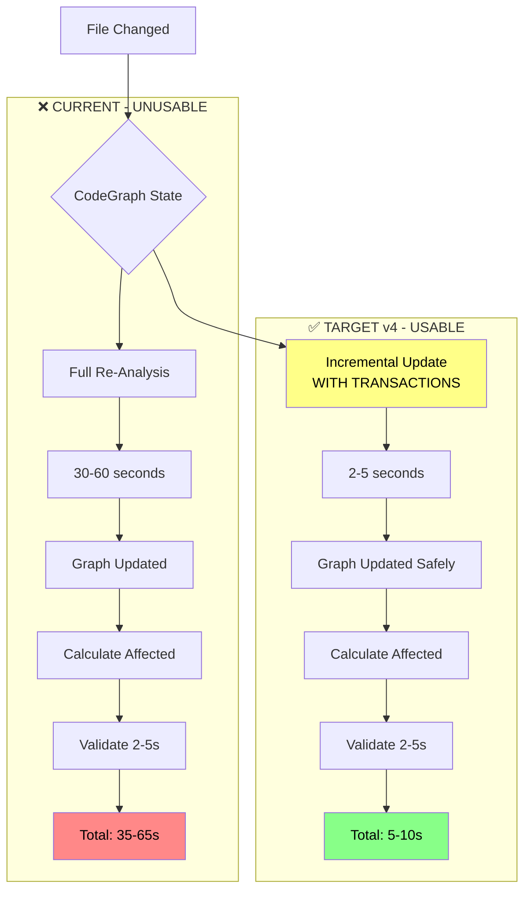
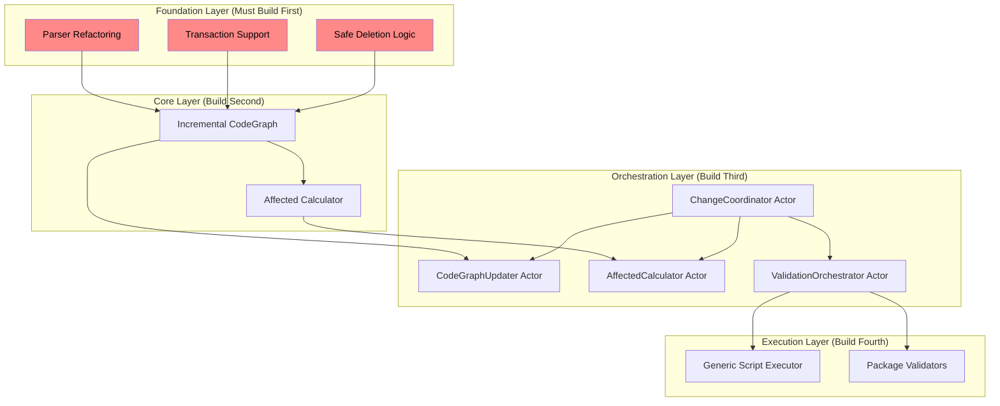
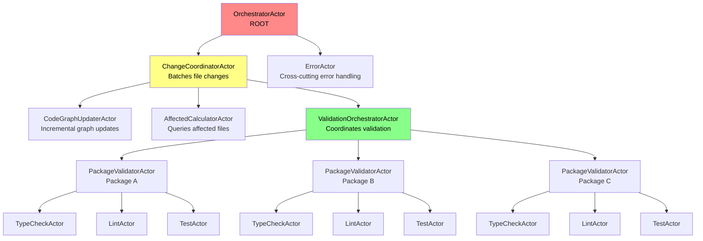
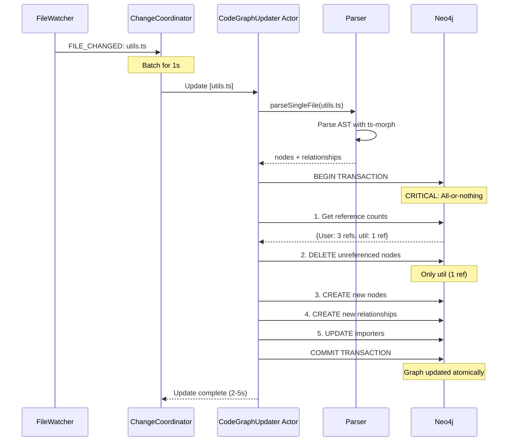
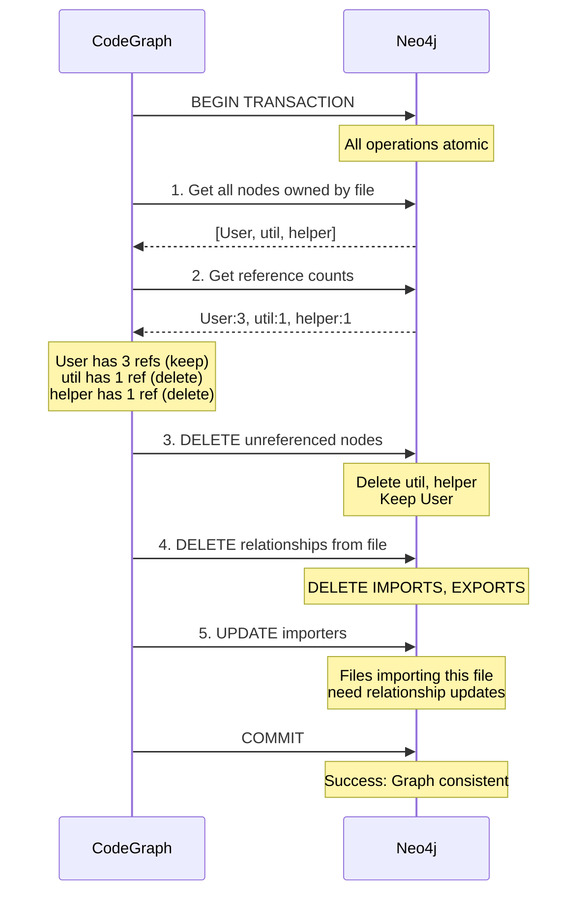
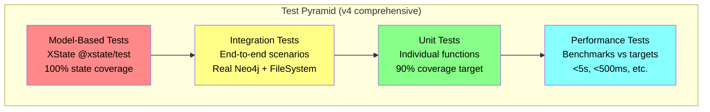
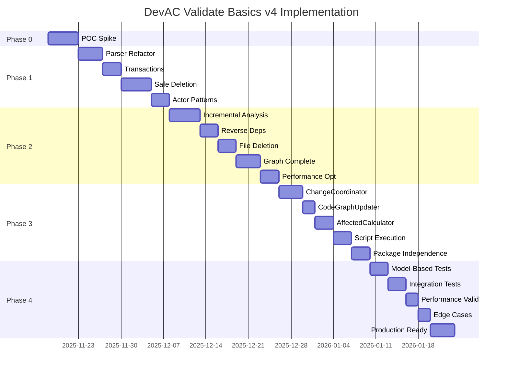

# DevAC Validation Basics v4 - Production-Ready Specification

> **Version**: 4.0 - Production-Ready Implementation Plan  
> **Created**: 2025-11-13  
> **Based On**: v3 spec + comprehensive 4-AI review synthesis  
> **Timeline**: 6-8 weeks (realistic, phased approach)  
> **Approach**: Safety-first, XState v5 actors, TDD throughout

---

## Executive Summary

### What v3 Got Right ✅

All four independent AI reviews (Claude, GPT, Grok, Gemini) unanimously agreed:

1. **Correct Problem Identification**: Incremental CodeGraph analysis is THE critical blocker
   - Current: 30-60s full re-analysis on every file change
   - Target: 2-5s incremental update
   - Impact: Makes real-time validation actually usable

2. **Correct Solution Architecture**: File-scoped validation with affected calculation
   - Incremental graph updates
   - Smart affected file calculation
   - Scope escalation (file → package → repo)

3. **Strong Technical Vision**: Comprehensive understanding of the problem space
   - Generic script execution for any validation tool
   - Monorepo package independence
   - Change batching and coordination

**Consensus Quality Rating**: 3.5-4.5 out of 5 stars for vision

### Critical Issues Requiring v4 Fixes ⚠️

However, all reviews identified the **same fundamental problems**:

#### 1. **Unsafe Graph Deletion Logic** (100% agreement)
```typescript
// ❌ v3 PROPOSES (WILL CORRUPT GRAPH):
await storageManager.deleteFileData(filePath); // Deletes EVERYTHING including shared nodes
await storageManager.saveNodes(newNodes);      // Creates orphans and duplicates
```

**What breaks**: Shared type definitions, cross-file relationships, package metadata

**v4 fix**: Reference counting + cascading updates + transactions + tombstoning

#### 2. **Parser Architecture Prevents Incremental Analysis** (100% agreement)

Current `Parser.parseFiles()` is batch-only. No single-file entry point exists.

**v4 fix**: Refactor to `parseSingleFile()` with batch delegating to single

#### 3. **ChangeCoordinator Must Be XState Actor** (100% agreement)

v3 proposed imperative class with manual timers and state tracking.

**v4 fix**: XState actor with `after` for debouncing, integrates with orchestrator

#### 4. **No Transaction Support** (75% agreement)

Multiple Neo4j operations without transaction boundaries = data corruption on errors.

**v4 fix**: All graph mutations in transactions with rollback

#### 5. **Missing File Deletion Handling** (75% agreement)

v3 only handles file changes, not deletions or package deletions.

**v4 fix**: FILE_DELETED and PACKAGE_DELETED events with proper cleanup

### Decision Points Resolved

v4 makes explicit choices on all conflicts identified in reviews:

| Decision | v3 Position | Review Recommendation | v4 Decision |
|----------|-------------|----------------------|-------------|
| **Relationship Taxonomy** | Use BELONGS_TO | Keep CONTAINS_FILE | ✅ Keep `CONTAINS_FILE` (avoid migration) |
| **Implementation Approach** | Build incrementally | Refactor first vs POC first | ✅ **Hybrid**: POC → Refactor → Implement |
| **Timeline** | 2-3 weeks | 6-8 weeks | ✅ **6-8 weeks** (realistic) |
| **Actor Adoption** | ChangeCoordinator only | All stateful components | ✅ **Full actor model** |
| **Testing Depth** | Unit tests | Model-based testing | ✅ **Model-based + performance** |
| **Error Handling** | Local try-catch | Error actors | ✅ **Hybrid**: Local + error actors |

### v4 Success Criteria

A high-quality v4 spec must:

- [x] **Acknowledge reality**: Architecture gaps exist and must be fixed
- [x] **Prioritize safety**: Transactions, safe deletion, error handling FIRST
- [x] **Embrace XState v5**: Actor model throughout, not just ChangeCoordinator
- [x] **Be explicit about phases**: POC → Refactor → Implement (not all at once)
- [x] **Include complete code examples**: Working implementations, not just interfaces
- [x] **Address every critical issue**: From all 4 reviews with concrete solutions
- [x] **Realistic timeline**: 6-8 weeks with proper TDD and testing
- [x] **Trackable progress**: Checkbox format for implementation tracking

---

## Table of Contents

1. [Architecture Overview](#architecture-overview)
2. [XState v5 Actor System](#xstate-v5-actor-system)
3. [Component 1: Incremental CodeGraph Analysis](#component-1-incremental-codegraph-analysis)
4. [Component 2: Safe Deletion & Transactions](#component-2-safe-deletion--transactions)
5. [Component 3: Affected Calculation](#component-3-affected-calculation)
6. [Component 4: Generic Script Execution](#component-4-generic-script-execution)
7. [Component 5: Monorepo Package Independence](#component-5-monorepo-package-independence)
8. [Testing Strategy](#testing-strategy)
9. [Implementation Phases](#implementation-phases)
10. [Success Criteria & Acceptance](#success-criteria--acceptance)

---

## Architecture Overview

### The Critical Path



### Component Dependencies



### Performance Targets

| Component | Current | Target v4 | Acceptance |
|-----------|---------|-----------|------------|
| **Single File Analysis** | 30-60s | <5s | ✅ Must achieve |
| **Graph Update (Neo4j)** | N/A | <1s | ✅ Must achieve |
| **Affected Calculation** | N/A | <500ms | ✅ Must achieve |
| **File-Scoped Validation** | N/A | 2-5s | ✅ Must achieve |
| **End-to-End (file change → result)** | 35-65s | 5-10s | ✅ Must achieve |

---

## XState v5 Actor System

### Why Actor Model?

All four reviews emphasized: **XState v5 actors are underutilized in current codebase.**

**Current state**: BaseService uses actors, but ChangeCoordinator and validators are imperative.

**v4 approach**: **Full actor model** for all stateful components.

**Benefits**:
- ✅ **Testability**: Model-based testing with `@xstate/test` generates all edge cases
- ✅ **Composability**: Parent-child actor hierarchies
- ✅ **Error isolation**: Actor failures don't crash system
- ✅ **State visualization**: XState inspector shows entire system state
- ✅ **Debouncing**: Built-in with `after`, no manual timers
- ✅ **Supervision**: Parent actors can restart failed children

### Complete Actor Hierarchy



### ChangeCoordinator Actor (Complete Implementation)

**Why actor instead of class**:
- ❌ v3 proposed manual timers: `if (this.timer) clearTimeout(this.timer);`
- ✅ v4 uses `after`: Automatic timer management, no race conditions

```typescript
import { setup, assign, sendTo, fromPromise } from "xstate";

// ============================================================================
// TYPES
// ============================================================================

interface FileChangeEvent {
  path: string;
  type: "change" | "add" | "unlink";
  timestamp: number;
}

interface ChangeCoordinatorContext {
  changes: Map<string, FileChangeEvent>;
  packages: PackageInfo[];
  lastFlushTime: number;
}

type ChangeCoordinatorEvent =
  | { type: "FILE_CHANGED"; path: string; changeType: "change" | "add" | "unlink" }
  | { type: "FLUSH_TIMEOUT" }
  | { type: "GRAPH_UPDATED"; updatedFiles: string[] }
  | { type: "AFFECTED_CALCULATED"; result: AffectedResult }
  | { type: "VALIDATION_COMPLETE"; results: ValidationResult[] }
  | { type: "ERROR"; error: Error };

type ChangeCoordinatorActor = ActorRefFrom<typeof changeCoordinatorMachine>;

// ============================================================================
// ACTOR LOGIC
// ============================================================================

export const changeCoordinatorMachine = setup({
  types: {
    context: {} as ChangeCoordinatorContext,
    events: {} as ChangeCoordinatorEvent,
    input: {} as { packages: PackageInfo[] },
  },
  
  delays: {
    BATCH_WINDOW: 1000, // 1 second debounce
  },
  
  actors: {
    // Child actor: Updates CodeGraph incrementally
    codeGraphUpdater: fromPromise(async ({ input }: { input: { files: string[] } }) => {
      const results = await Promise.all(
        input.files.map(file => codeGraphService.analyzeFile(file))
      );
      return { updatedFiles: input.files };
    }),
    
    // Child actor: Calculates affected files
    affectedCalculator: fromPromise(async ({ input }: { input: { changes: FileChangeEvent[], packages: PackageInfo[] } }) => {
      const affectedResults = await Promise.all(
        input.changes.map(change => 
          calculateAffected(change.path, input.packages)
        )
      );
      
      return aggregateAffected(affectedResults);
    }),
    
    // Child actor: Orchestrates validation
    validationOrchestrator: fromPromise(async ({ input }: { input: { affected: AffectedResult } }) => {
      return await executeValidation(input.affected);
    }),
  },
  
  actions: {
    // Add file change to batching queue
    queueChange: assign({
      changes: ({ context, event }) => {
        if (event.type !== "FILE_CHANGED") return context.changes;
        
        const newChanges = new Map(context.changes);
        newChanges.set(event.path, {
          path: event.path,
          type: event.changeType,
          timestamp: Date.now(),
        });
        
        return newChanges;
      },
    }),
    
    // Clear queue after flush
    clearQueue: assign({
      changes: () => new Map(),
      lastFlushTime: () => Date.now(),
    }),
    
    // Log progress
    logProgress: ({ context, event }) => {
      if (event.type === "GRAPH_UPDATED") {
        logger.info(`Graph updated for ${event.updatedFiles.length} files`);
      } else if (event.type === "AFFECTED_CALCULATED") {
        logger.info(`Affected scope: ${event.result.scope}`);
      }
    },
  },
  
  guards: {
    hasQueuedChanges: ({ context }) => context.changes.size > 0,
  },
  
}).createMachine({
  /** @xstate-layout N4IgpgJg5mDOIC5QAoC2BDAxgCwJYDswBKAOgFkA5AVQGUBRAYQGEAZAfQH0BtABgF1EoAA65YeAC5l+Q0AA9EAWgAs */
  id: "changeCoordinator",
  
  initial: "idle",
  
  context: ({ input }) => ({
    changes: new Map(),
    packages: input.packages,
    lastFlushTime: 0,
  }),
  
  states: {
    // =========================================================================
    // IDLE: Waiting for file changes
    // =========================================================================
    idle: {
      on: {
        FILE_CHANGED: {
          target: "batching",
          actions: "queueChange",
        },
      },
    },
    
    // =========================================================================
    // BATCHING: Collecting changes within 1-second window
    // =========================================================================
    batching: {
      entry: "queueChange",
      
      // Automatic debounce: restart timer on each new change
      after: {
        BATCH_WINDOW: {
          target: "updatingGraph",
          guard: "hasQueuedChanges",
        },
      },
      
      on: {
        FILE_CHANGED: {
          target: "batching",
          reenter: true, // Restarts the BATCH_WINDOW timer
          actions: "queueChange",
        },
      },
    },
    
    // =========================================================================
    // UPDATING_GRAPH: Incremental CodeGraph updates
    // =========================================================================
    updatingGraph: {
      invoke: {
        src: "codeGraphUpdater",
        input: ({ context }) => ({
          files: Array.from(context.changes.keys()),
        }),
        onDone: {
          target: "calculatingAffected",
          actions: ["logProgress", "clearQueue"],
        },
        onError: {
          target: "error",
          actions: assign({
            error: ({ event }) => event.error,
          }),
        },
      },
    },
    
    // =========================================================================
    // CALCULATING_AFFECTED: Query graph for dependents
    // =========================================================================
    calculatingAffected: {
      invoke: {
        src: "affectedCalculator",
        input: ({ context }) => ({
          changes: Array.from(context.changes.values()),
          packages: context.packages,
        }),
        onDone: {
          target: "validating",
          actions: "logProgress",
        },
        onError: {
          target: "error",
        },
      },
    },
    
    // =========================================================================
    // VALIDATING: Execute typecheck/lint/test
    // =========================================================================
    validating: {
      invoke: {
        src: "validationOrchestrator",
        input: ({ event }) => ({
          affected: event.output,
        }),
        onDone: {
          target: "idle",
          actions: ({ event }) => {
            logger.info(`✅ Validation complete: ${event.output.success ? "PASSED" : "FAILED"}`);
          },
        },
        onError: {
          target: "error",
        },
      },
    },
    
    // =========================================================================
    // ERROR: Something went wrong
    // =========================================================================
    error: {
      entry: ({ context, event }) => {
        logger.error("ChangeCoordinator error:", event.error);
        // Send to ErrorActor for centralized handling
        sendTo("errorActor", { type: "VALIDATION_ERROR", error: event.error });
      },
      
      after: {
        5000: "idle", // Retry after 5 seconds
      },
    },
  },
});

// ============================================================================
// HELPER FUNCTIONS
// ============================================================================

/**
 * Aggregate multiple affected results into single scope
 */
function aggregateAffected(results: AffectedResult[]): AffectedResult {
  // If any result is 'repo' scope, entire validation is repo scope
  if (results.some(r => r.scope === "repo")) {
    return {
      scope: "repo",
      reason: "One or more changes affect entire repository",
    };
  }
  
  // If any result is 'package' scope, collect affected packages
  const packageResults = results.filter(r => r.scope === "package");
  if (packageResults.length > 0) {
    const allPackages = new Set<PackageInfo>();
    packageResults.forEach(r => {
      r.packages?.forEach(pkg => allPackages.add(pkg));
    });
    
    return {
      scope: "package",
      packages: Array.from(allPackages),
      reason: `${allPackages.size} packages affected`,
    };
  }
  
  // Otherwise, collect all affected files
  const allFiles = new Set<string>();
  results.forEach(r => {
    r.files?.forEach(file => allFiles.add(file));
  });
  
  // Check if too many files
  if (allFiles.size > 100) {
    return {
      scope: "repo",
      reason: `Too many files affected: ${allFiles.size}`,
    };
  }
  
  return {
    scope: "file",
    files: Array.from(allFiles),
  };
}

/**
 * Execute validation based on scope
 */
async function executeValidation(affected: AffectedResult): Promise<ValidationResult[]> {
  if (affected.scope === "repo") {
    // Validate entire repository
    return await validateRepository();
  } else if (affected.scope === "package") {
    // Validate specific packages in parallel
    return await Promise.all(
      affected.packages!.map(pkg => validatePackage(pkg))
    );
  } else {
    // Validate specific files
    return await validateFiles(affected.files!);
  }
}
```

### Model-Based Testing with @xstate/test

```typescript
import { createTestModel } from "@xstate/test";
import { changeCoordinatorMachine } from "./change-coordinator.actor";

// ============================================================================
// MODEL-BASED TESTS (Generates all edge cases automatically)
// ============================================================================

describe("ChangeCoordinator Actor (Model-Based)", () => {
  const testModel = createTestModel(changeCoordinatorMachine).withEvents({
    FILE_CHANGED: {
      exec: async ({ machine }) => {
        machine.send({ type: "FILE_CHANGED", path: "/test/file.ts", changeType: "change" });
      },
      cases: [
        { path: "/test/utils.ts", changeType: "change" },
        { path: "/test/component.ts", changeType: "add" },
        { path: "/test/old.ts", changeType: "unlink" },
      ],
    },
  });
  
  // Generate test plans for all states
  const testPlans = testModel.getSimplePathPlans();
  
  testPlans.forEach((plan) => {
    describe(plan.description, () => {
      plan.paths.forEach((path) => {
        it(path.description, async () => {
          await path.test({
            // Setup
            setup: () => {
              // Initialize Neo4j, CodeGraph, etc.
            },
            
            // Assertions for each state
            states: {
              idle: ({ state }) => {
                expect(state.matches("idle")).toBe(true);
                expect(state.context.changes.size).toBe(0);
              },
              
              batching: ({ state }) => {
                expect(state.matches("batching")).toBe(true);
                expect(state.context.changes.size).toBeGreaterThan(0);
              },
              
              updatingGraph: ({ state }) => {
                expect(state.matches("updatingGraph")).toBe(true);
              },
              
              calculatingAffected: ({ state }) => {
                expect(state.matches("calculatingAffected")).toBe(true);
              },
              
              validating: ({ state }) => {
                expect(state.matches("validating")).toBe(true);
              },
            },
          });
        });
      });
    });
  });
  
  // Ensure all states are covered
  it("should cover all states", () => {
    return testModel.testCoverage();
  });
});
```

**Benefits of Model-Based Testing**:
- ✅ Automatically generates test cases for all state transitions
- ✅ Finds edge cases you wouldn't think of manually
- ✅ Ensures 100% state machine coverage
- ✅ Tests match implementation (can't get out of sync)

---

## Component 1: Incremental CodeGraph Analysis

### The Critical Blocker

**Current Problem** (from codegraph-service.ts:414-418):
```typescript
// NOTE: Current AnalyzerService doesn't support true incremental updates.
// For Phase 2, we'll run full re-analysis (correct but slower).
await this.analyzerService.analyze(primaryDirectory, {
  ignorePatterns: serviceConfig.ignore,
  supportedExtensions: serviceConfig.extensions,
});
```

**Impact**: 30-60 seconds on EVERY file change → System unusable

**v4 Solution**: Incremental analysis with safe deletion and transactions

### Architecture



### Parser Refactoring (Foundation Requirement)

**Current State**: `Parser.parseFiles()` is batch-only

**v4 Requirement**: Extract single-file parsing

```typescript
// ============================================================================
// REFACTORED PARSER (Foundation for incremental analysis)
// ============================================================================

export class Parser {
  
  /**
   * Parse a single file (NEW - extracted from parseFiles)
   * 
   * This is the atomic unit for incremental analysis.
   * Batch processing delegates to this method.
   * 
   * @param fileInfo - File to parse
   * @returns Nodes and relationships for this file only
   */
  async parseSingleFile(fileInfo: FileInfo): Promise<SingleFileParseResult> {
    const startTime = Date.now();
    
    try {
      // Step 1: Determine parser type (ts-morph vs tree-sitter)
      const parserType = this.getParserType(fileInfo.extension);
      
      let nodes: Node[] = [];
      let relationships: Relationship[] = [];
      
      if (parserType === "typescript") {
        // Use ts-morph for TypeScript files
        const tsResult = await this.parseTypeScriptFile(fileInfo);
        nodes = tsResult.nodes;
        relationships = tsResult.relationships;
        
      } else {
        // Use tree-sitter for other languages
        const tsResult = await this.parseWithTreeSitter(fileInfo);
        nodes = tsResult.nodes;
        relationships = tsResult.relationships;
      }
      
      // Step 2: Add file node
      const fileNode: Node = {
        id: `file:${fileInfo.path}`,
        type: "File",
        properties: {
          path: fileInfo.path,
          name: fileInfo.name,
          extension: fileInfo.extension,
          parsedAt: new Date().toISOString(),
        },
      };
      
      nodes.unshift(fileNode);
      
      // Step 3: Create CONTAINS relationships from file to all nodes
      const containsRelationships = nodes
        .filter(n => n.id !== fileNode.id)
        .map(n => ({
          from: fileNode.id,
          to: n.id,
          type: "CONTAINS",
          properties: {},
        }));
      
      relationships.push(...containsRelationships);
      
      return {
        filePath: fileInfo.path,
        nodes,
        relationships,
        duration: Date.now() - startTime,
      };
      
    } catch (error) {
      logger.error(`Failed to parse ${fileInfo.path}:`, error);
      throw new ParseError(`Parse failed for ${fileInfo.path}`, { cause: error });
    }
  }
  
  /**
   * Parse multiple files (REFACTORED - delegates to single file)
   * 
   * This maintains backward compatibility while using the new
   * incremental parsing primitive.
   */
  async parseFiles(fileInfos: FileInfo[]): Promise<ParsedFileInfo[]> {
    // Delegate to single-file parsing (parallel execution)
    const results = await Promise.all(
      fileInfos.map(fileInfo => this.parseSingleFile(fileInfo))
    );
    
    return results;
  }
  
  /**
   * Parse TypeScript file with ts-morph (EXISTING - extracted)
   */
  private async parseTypeScriptFile(fileInfo: FileInfo): Promise<{
    nodes: Node[];
    relationships: Relationship[];
  }> {
    // Existing ts-morph parsing logic
    // (Extract from current parseFiles implementation)
    
    const sourceFile = this.project.addSourceFileAtPath(fileInfo.path);
    
    const nodes: Node[] = [];
    const relationships: Relationship[] = [];
    
    // Extract classes, functions, variables, etc.
    // (Existing logic)
    
    return { nodes, relationships };
  }
}

// ============================================================================
// TYPES
// ============================================================================

interface SingleFileParseResult {
  filePath: string;
  nodes: Node[];
  relationships: Relationship[];
  duration: number;
}

class ParseError extends Error {
  constructor(message: string, options?: { cause?: Error }) {
    super(message, options);
    this.name = "ParseError";
  }
}
```

### Incremental Analyzer Service

```typescript
// ============================================================================
// INCREMENTAL ANALYZER SERVICE (Core Implementation)
// ============================================================================

export class AnalyzerService {
  
  constructor(
    private parser: Parser,
    private storageManager: StorageManager,
    private packageExtractor: PackageExtractor
  ) {}
  
  /**
   * Analyze a single file incrementally (NEW - THE CORE PRIMITIVE)
   * 
   * This is the key method that enables fast validation.
   * Must be:
   * - Fast: <5 seconds
   * - Safe: Uses transactions
   * - Correct: Handles shared nodes
   * - Complete: Updates reverse dependencies
   * 
   * @param filePath - Absolute path to file
   * @returns Analysis result with timing
   */
  async analyzeFile(filePath: string): Promise<FileAnalysisResult> {
    const absolutePath = path.resolve(filePath);
    const startTime = Date.now();
    
    logger.info(`Analyzing file: ${absolutePath}`);
    
    // Step 0: Check if file exists
    if (!await fs.pathExists(absolutePath)) {
      throw new Error(`File not found: ${absolutePath}`);
    }
    
    // Step 1: Parse the single file
    const fileInfo: FileInfo = {
      path: absolutePath,
      name: path.basename(absolutePath),
      extension: path.extname(absolutePath),
    };
    
    const parseResult = await this.parser.parseSingleFile(fileInfo);
    
    logger.debug(`Parsed ${absolutePath}: ${parseResult.nodes.length} nodes, ${parseResult.relationships.length} relationships`);
    
    // Step 2: Update graph with transaction (CRITICAL SAFETY)
    const session = this.storageManager.driver.session();
    const tx = session.beginTransaction();
    
    try {
      // Sub-step 2a: Safe deletion (with reference counting)
      await this.safeDeleteFileData(absolutePath, tx);
      
      // Sub-step 2b: Insert new nodes
      await this.storageManager.saveNodes(parseResult.nodes, tx);
      
      // Sub-step 2c: Insert new relationships
      await this.storageManager.saveRelationships(parseResult.relationships, tx);
      
      // Sub-step 2d: Update package relationship
      const pkg = await this.packageExtractor.getPackageForFile(absolutePath);
      if (pkg) {
        await this.storageManager.createPackageFileRelationship(pkg.name, absolutePath, tx);
      }
      
      // Sub-step 2e: Commit transaction (all-or-nothing)
      await tx.commit();
      
      logger.debug(`Graph updated for ${absolutePath}`);
      
    } catch (error) {
      // Rollback on any error
      await tx.rollback();
      logger.error(`Transaction failed for ${absolutePath}:`, error);
      throw new GraphUpdateError(`Failed to update graph for ${absolutePath}`, { cause: error });
      
    } finally {
      await session.close();
    }
    
    // Step 3: Update reverse dependencies (files that import this file)
    const importers = await this.storageManager.getFilesImporting(absolutePath);
    
    if (importers.length > 0) {
      logger.debug(`Updating ${importers.length} importers of ${absolutePath}`);
      
      for (const importer of importers) {
        await this.updateImportsForFile(importer);
      }
    }
    
    const duration = Date.now() - startTime;
    
    logger.info(`✅ Analyzed ${absolutePath} in ${duration}ms`);
    
    return {
      filePath: absolutePath,
      nodesCreated: parseResult.nodes.length,
      relationshipsCreated: parseResult.relationships.length,
      importersUpdated: importers.length,
      duration,
    };
  }
  
  /**
   * Update import relationships for a file (NEW)
   * 
   * Used when an imported file changes exports - we need to
   * re-resolve the import relationships.
   * 
   * @param filePath - File whose imports need updating
   */
  private async updateImportsForFile(filePath: string): Promise<void> {
    const session = this.storageManager.driver.session();
    const tx = session.beginTransaction();
    
    try {
      // Step 1: Delete existing IMPORTS relationships from this file
      await tx.run(`
        MATCH (f:File {path: $filePath})-[r:IMPORTS]->()
        DELETE r
      `, { filePath });
      
      // Step 2: Re-parse import statements only
      const imports = await this.extractImports(filePath);
      
      // Step 3: Create new IMPORTS relationships
      for (const importPath of imports) {
        await tx.run(`
          MATCH (from:File {path: $fromPath})
          MATCH (to:File {path: $toPath})
          CREATE (from)-[:IMPORTS]->(to)
        `, { fromPath: filePath, toPath: importPath });
      }
      
      await tx.commit();
      
    } catch (error) {
      await tx.rollback();
      logger.error(`Failed to update imports for ${filePath}:`, error);
      throw error;
      
    } finally {
      await session.close();
    }
  }
  
  /**
   * Extract import paths from a file (NEW)
   * 
   * Lightweight parse - only need import statements.
   */
  private async extractImports(filePath: string): Promise<string[]> {
    // Use ts-morph or regex to extract import paths
    // Don't need full AST, just import declarations
    
    const sourceFile = this.parser.project.addSourceFileAtPath(filePath);
    const importDeclarations = sourceFile.getImportDeclarations();
    
    const imports: string[] = [];
    
    for (const importDecl of importDeclarations) {
      const moduleSpecifier = importDecl.getModuleSpecifierValue();
      
      // Resolve relative imports to absolute paths
      if (moduleSpecifier.startsWith(".")) {
        const absoluteImport = path.resolve(
          path.dirname(filePath),
          moduleSpecifier
        );
        imports.push(absoluteImport);
      }
    }
    
    return imports;
  }
  
  /**
   * Safe deletion with reference counting (CRITICAL - prevents corruption)
   * 
   * This is the key safety mechanism that v3 was missing.
   * See Component 2 for complete implementation.
   */
  private async safeDeleteFileData(
    filePath: string,
    tx: Transaction
  ): Promise<void> {
    // Implemented in Component 2
  }
}

// ============================================================================
// TYPES
// ============================================================================

interface FileAnalysisResult {
  filePath: string;
  nodesCreated: number;
  relationshipsCreated: number;
  importersUpdated: number;
  duration: number;
}

class GraphUpdateError extends Error {
  constructor(message: string, options?: { cause?: Error }) {
    super(message, options);
    this.name = "GraphUpdateError";
  }
}
```

### Implementation Checklist

- [ ] **Parser Refactoring**
  - [ ] Extract `parseSingleFile()` from `parseFiles()`
  - [ ] Make `parseFiles()` delegate to `parseSingleFile()`
  - [ ] Test single-file parsing for all file types
  - [ ] Verify performance: <5s for typical files
  
- [ ] **Incremental Analysis**
  - [ ] Implement `AnalyzerService.analyzeFile()`
  - [ ] Add transaction support (all graph updates atomic)
  - [ ] Implement `updateImportsForFile()`
  - [ ] Implement `extractImports()` (lightweight)
  - [ ] Test file analysis with graph updates
  - [ ] Test reverse dependency updates
  
- [ ] **Performance Validation**
  - [ ] Single file: <5 seconds
  - [ ] Graph update: <1 second
  - [ ] Importer update: <2 seconds per importer
  - [ ] End-to-end: <10 seconds for typical change

---

## Component 2: Safe Deletion & Transactions

### Why This Is Critical

**v3 proposed unsafe deletion**:
```typescript
// ❌ UNSAFE - WILL CORRUPT GRAPH
await storageManager.deleteFileData(filePath); // Deletes EVERYTHING
await storageManager.saveNodes(newNodes);      // Creates duplicates
```

**Corruption scenario**:
```
File A: export interface User { id: number }
File B: import { User } from './A'
File C: import { User } from './A'

When File A changes:
1. DELETE removes User node (still referenced by B and C!)
2. CREATE adds new User node
3. Result: TWO User nodes, B and C have dangling references
```

**v4 solution**: Reference counting + cascading updates + transactions

### Safe Deletion Algorithm



### Implementation

```typescript
// ============================================================================
// SAFE DELETION WITH REFERENCE COUNTING
// ============================================================================

export class StorageManager {
  
  /**
   * Safe delete file data with reference counting (v4 CRITICAL FIX)
   * 
   * This prevents graph corruption by:
   * 1. Only deleting nodes with refCount = 1 (owned only by this file)
   * 2. Keeping shared nodes (refCount > 1)
   * 3. Using transactions for atomicity
   * 4. Tombstoning orphaned relationships
   * 
   * @param filePath - File being updated/deleted
   * @param tx - Neo4j transaction (for atomicity)
   */
  async safeDeleteFileData(
    filePath: string,
    tx: Transaction
  ): Promise<SafeDeletionResult> {
    
    // Step 1: Get all nodes owned by this file
    const ownedNodes = await tx.run(`
      MATCH (f:File {path: $filePath})-[:CONTAINS]->(n)
      RETURN n.id as nodeId, labels(n) as labels
    `, { filePath });
    
    logger.debug(`File ${filePath} owns ${ownedNodes.length} nodes`);
    
    // Step 2: Get reference counts for each node
    const nodeIds = ownedNodes.map(n => n.nodeId);
    
    const refCounts = await tx.run(`
      UNWIND $nodeIds as nodeId
      MATCH (n {id: nodeId})
      OPTIONAL MATCH (referer)-[r]->(n)
      WITH n, count(DISTINCT referer) as refCount
      RETURN n.id as nodeId, refCount
    `, { nodeIds });
    
    const refCountMap = new Map(
      refCounts.map(r => [r.nodeId, r.refCount])
    );
    
    // Step 3: Categorize nodes
    const toDelete: string[] = [];
    const toKeep: string[] = [];
    
    for (const nodeId of nodeIds) {
      const refCount = refCountMap.get(nodeId) || 0;
      
      if (refCount <= 1) {
        // Only this file references it - safe to delete
        toDelete.push(nodeId);
      } else {
        // Other files reference it - must keep
        toKeep.push(nodeId);
      }
    }
    
    logger.debug(`Deleting ${toDelete.length} nodes, keeping ${toKeep.length} shared nodes`);
    
    // Step 4: Delete unreferenced nodes
    if (toDelete.length > 0) {
      await tx.run(`
        UNWIND $nodeIds as nodeId
        MATCH (n {id: nodeId})
        DETACH DELETE n
      `, { nodeIds: toDelete });
    }
    
    // Step 5: Remove CONTAINS relationships for kept nodes
    // (We'll recreate them if the node still exists in new parse)
    if (toKeep.length > 0) {
      await tx.run(`
        MATCH (f:File {path: $filePath})-[r:CONTAINS]->(n)
        WHERE n.id IN $keptNodeIds
        DELETE r
      `, { filePath, keptNodeIds: toKeep });
    }
    
    // Step 6: Delete IMPORTS relationships FROM this file
    await tx.run(`
      MATCH (f:File {path: $filePath})-[r:IMPORTS]->()
      DELETE r
    `, { filePath });
    
    // Step 7: Delete EXPORTS relationships FROM this file
    await tx.run(`
      MATCH (f:File {path: $filePath})-[r:EXPORTS]->()
      DELETE r
    `, { filePath });
    
    // Step 8: Tombstone orphaned relationships (optional cleanup)
    // These are relationships TO nodes we deleted
    await tx.run(`
      MATCH ()-[r]->(n)
      WHERE NOT EXISTS((n))
      DELETE r
    `, {});
    
    return {
      nodesDeleted: toDelete.length,
      nodesKept: toKeep.length,
      relationshipsDeleted: ownedNodes.length + toDelete.length,
    };
  }
  
  /**
   * Handle file deletion (NEW - v4 addition)
   * 
   * When a file is deleted from disk, remove it from graph.
   * 
   * @param filePath - File that was deleted
   */
  async handleFileDeleted(filePath: string): Promise<void> {
    const session = this.driver.session();
    const tx = session.beginTransaction();
    
    try {
      // Use safe deletion (same algorithm)
      await this.safeDeleteFileData(filePath, tx);
      
      // Also delete the File node itself
      await tx.run(`
        MATCH (f:File {path: $filePath})
        DETACH DELETE f
      `, { filePath });
      
      // Update importers (they now have broken imports)
      const importers = await this.getFilesImporting(filePath);
      for (const importer of importers) {
        // Mark import as broken or remove relationship
        await tx.run(`
          MATCH (f:File {path: $importerPath})-[r:IMPORTS]->(deleted:File {path: $deletedPath})
          DELETE r
        `, { importerPath: importer, deletedPath: filePath });
      }
      
      await tx.commit();
      
      logger.info(`✅ Deleted file ${filePath} from graph`);
      
    } catch (error) {
      await tx.rollback();
      logger.error(`Failed to delete file ${filePath}:`, error);
      throw error;
      
    } finally {
      await session.close();
    }
  }
  
  /**
   * Handle package deletion (NEW - v4 addition)
   * 
   * When an entire package is deleted, remove all files and package node.
   * 
   * @param packagePath - Package directory that was deleted
   */
  async handlePackageDeleted(packagePath: string): Promise<void> {
    const session = this.driver.session();
    const tx = session.beginTransaction();
    
    try {
      // Get all files in package
      const files = await tx.run(`
        MATCH (pkg:Package)-[:CONTAINS_FILE]->(f:File)
        WHERE f.path STARTS WITH $packagePath
        RETURN f.path as filePath
      `, { packagePath });
      
      // Delete each file safely
      for (const file of files) {
        await this.safeDeleteFileData(file.filePath, tx);
        await tx.run(`
          MATCH (f:File {path: $filePath})
          DETACH DELETE f
        `, { filePath: file.filePath });
      }
      
      // Delete package node
      await tx.run(`
        MATCH (pkg:Package)
        WHERE pkg.path = $packagePath OR pkg.path STARTS WITH $packagePath
        DETACH DELETE pkg
      `, { packagePath });
      
      await tx.commit();
      
      logger.info(`✅ Deleted package ${packagePath} from graph`);
      
    } catch (error) {
      await tx.rollback();
      logger.error(`Failed to delete package ${packagePath}:`, error);
      throw error;
      
    } finally {
      await session.close();
    }
  }
  
  /**
   * Get files importing a specific file (for reverse dependency updates)
   */
  async getFilesImporting(filePath: string): Promise<string[]> {
    const result = await this.run(`
      MATCH (f:File {path: $filePath})<-[:IMPORTS]-(importer:File)
      RETURN DISTINCT importer.path as path
    `, { filePath });
    
    return result.map(r => r.path);
  }
}

// ============================================================================
// TYPES
// ============================================================================

interface SafeDeletionResult {
  nodesDeleted: number;
  nodesKept: number;
  relationshipsDeleted: number;
}

type Transaction = any; // Neo4j transaction type
```

### File System Event Handling

```typescript
// ============================================================================
// FILE SYSTEM EVENT TYPES (v4 addition)
// ============================================================================

type FileSystemEvent =
  | { type: "FILE_CHANGED"; path: string; content: string }
  | { type: "FILE_ADDED"; path: string; content: string }
  | { type: "FILE_DELETED"; path: string }
  | { type: "PACKAGE_DELETED"; packagePath: string };

/**
 * Handle file system events with appropriate graph updates
 */
async function handleFileSystemEvent(event: FileSystemEvent): Promise<void> {
  switch (event.type) {
    case "FILE_CHANGED":
    case "FILE_ADDED":
      // Incremental analysis (Component 1)
      await analyzerService.analyzeFile(event.path);
      break;
      
    case "FILE_DELETED":
      // Safe deletion (Component 2)
      await storageManager.handleFileDeleted(event.path);
      break;
      
    case "PACKAGE_DELETED":
      // Package deletion (Component 2)
      await storageManager.handlePackageDeleted(event.packagePath);
      break;
  }
}
```

### Implementation Checklist

- [ ] **Reference Counting**
  - [ ] Implement `safeDeleteFileData()` with ref counting
  - [ ] Test with shared nodes (refCount > 1)
  - [ ] Test with unique nodes (refCount = 1)
  - [ ] Verify no duplicates created
  
- [ ] **Transaction Support**
  - [ ] Wrap all graph mutations in transactions
  - [ ] Implement rollback on errors
  - [ ] Test partial failure scenarios
  - [ ] Verify graph consistency after failures
  
- [ ] **File Deletion**
  - [ ] Implement `handleFileDeleted()`
  - [ ] Update importers after deletion
  - [ ] Test file deletion from graph
  - [ ] Verify no orphaned relationships
  
- [ ] **Package Deletion**
  - [ ] Implement `handlePackageDeleted()`
  - [ ] Test package deletion cascades
  - [ ] Verify all files removed
  - [ ] Test cross-package imports

---

## Component 3: Affected Calculation

### Goal

Determine minimal set of files/packages to validate after a change.

**Input**: Changed file path + package info  
**Output**: Scope (file/package/repo) + list of affected files/packages

### Complete Algorithm

```typescript
// ============================================================================
// AFFECTED CALCULATION (Complete Implementation)
// ============================================================================

interface AffectedResult {
  scope: "file" | "package" | "repo";
  files?: string[];
  packages?: PackageInfo[];
  reason?: string;
}

/**
 * Calculate affected files/packages for validation
 * 
 * This is the intelligence that determines what to validate.
 * It balances precision (validate only what's needed) with
 * safety (don't miss anything).
 * 
 * Performance target: <500ms
 * 
 * @param changedFilePath - File that changed
 * @param packages - All packages in repository
 * @returns Scope and affected files/packages
 */
async function calculateAffected(
  changedFilePath: string,
  packages: PackageInfo[]
): Promise<AffectedResult> {
  
  const startTime = Date.now();
  
  // Step 0: Ensure graph is up-to-date (CRITICAL)
  // This is why incremental CodeGraph analysis is essential
  // The graph MUST reflect the current state of the changed file
  // before we can calculate dependents
  
  // (Graph update happens in ChangeCoordinator before calling this)
  
  // Step 1: Identify package
  const changedPackage = getPackageForFile(changedFilePath, packages);
  
  if (!changedPackage) {
    return {
      scope: "repo",
      reason: "Root-level file (no package) - affects entire repository",
    };
  }
  
  // Step 2: Check if config file changed
  const isConfigFile = [
    "tsconfig.json",
    ".eslintrc.js",
    ".eslintrc.json",
    "eslint.config.js",
    "vitest.config.ts",
    "vitest.config.js",
    "jest.config.js",
    "package.json",
  ].some(config => changedFilePath.endsWith(config));
  
  if (isConfigFile) {
    // Config change affects entire package
    return {
      scope: "package",
      packages: [changedPackage],
      reason: `Configuration file changed: ${path.basename(changedFilePath)}`,
    };
  }
  
  // Step 3: Get direct dependents (within package)
  const directDeps = await neo4j.run(`
    MATCH (changed:File {path: $path})<-[:IMPORTS]-(dependent:File)
    MATCH (pkg:Package {name: $packageName})-[:CONTAINS_FILE]->(dependent)
    RETURN dependent.path as path
  `, { path: changedFilePath, packageName: changedPackage.name });
  
  const affected = new Set([changedFilePath]);
  directDeps.forEach(d => affected.add(d.path));
  
  logger.debug(`Direct dependents: ${directDeps.length}`);
  
  // Step 4: Check cross-package dependencies
  const crossPackageDeps = await neo4j.run(`
    MATCH (changed:File {path: $path})<-[:IMPORTS]-(dependent:File)
    MATCH (otherPkg:Package)-[:CONTAINS_FILE]->(dependent)
    WHERE otherPkg.name <> $packageName
    RETURN DISTINCT otherPkg.name as packageName, otherPkg.path as packagePath
  `, { path: changedFilePath, packageName: changedPackage.name });
  
  if (crossPackageDeps.length > 2) {
    // Imported by many packages - validate all
    return {
      scope: "repo",
      reason: `Cross-package dependency (${crossPackageDeps.length} packages import this file)`,
    };
    
  } else if (crossPackageDeps.length > 0) {
    // Imported by 1-2 other packages - validate those packages
    const affectedPackages = [
      changedPackage,
      ...crossPackageDeps.map(d =>
        packages.find(p => p.name === d.packageName)!
      ),
    ];
    
    logger.debug(`Cross-package: ${crossPackageDeps.map(d => d.packageName).join(", ")}`);
    
    return {
      scope: "package",
      packages: affectedPackages,
      reason: `Cross-package dependency (${crossPackageDeps.length} packages)`,
    };
  }
  
  // Step 5: Get transitive dependents (within package)
  const transitiveDeps = await neo4j.run(`
    MATCH path = (changed:File {path: $path})<-[:IMPORTS*2..5]-(dependent:File)
    MATCH (pkg:Package {name: $packageName})-[:CONTAINS_FILE]->(dependent)
    WHERE length(path) <= 5
    RETURN DISTINCT dependent.path as path
    LIMIT 100
  `, { path: changedFilePath, packageName: changedPackage.name });
  
  transitiveDeps.forEach(d => affected.add(d.path));
  
  logger.debug(`Transitive dependents: ${transitiveDeps.length}`);
  
  // Step 6: Check thresholds
  if (affected.size > 50) {
    return {
      scope: "package",
      packages: [changedPackage],
      reason: `Too many affected files: ${affected.size} (threshold: 50)`,
    };
  }
  
  // Step 7: Add test files for affected source files
  for (const filePath of Array.from(affected)) {
    const testFile = await findTestFile(filePath);
    if (testFile) {
      affected.add(testFile);
    }
  }
  
  logger.debug(`With tests: ${affected.size} total files`);
  
  // Step 8: Return file-level scope
  const duration = Date.now() - startTime;
  logger.info(`Affected calculation: ${affected.size} files in ${duration}ms`);
  
  if (duration > 500) {
    logger.warn(`⚠️  Affected calculation took ${duration}ms (target: <500ms)`);
  }
  
  return {
    scope: "file",
    files: Array.from(affected),
    packages: [changedPackage],
  };
}

/**
 * Find test file for a source file
 */
async function findTestFile(sourcePath: string): Promise<string | null> {
  // Check for co-located test file
  const testPatterns = [
    sourcePath.replace(".ts", ".test.ts"),
    sourcePath.replace(".ts", ".spec.ts"),
    sourcePath.replace(".tsx", ".test.tsx"),
    sourcePath.replace(".tsx", ".spec.tsx"),
    sourcePath.replace("/src/", "/__tests__/") + ".test.ts",
  ];
  
  for (const pattern of testPatterns) {
    if (await fs.pathExists(pattern)) {
      return pattern;
    }
  }
  
  // Check graph for TESTS relationship
  const result = await neo4j.run(`
    MATCH (test:File)-[:TESTS]->(source:File {path: $sourcePath})
    RETURN test.path as path
  `, { sourcePath });
  
  return result[0]?.path || null;
}

/**
 * Determine which package a file belongs to
 */
function getPackageForFile(
  filePath: string,
  packages: PackageInfo[]
): PackageInfo | null {
  // Find package that contains this file
  // Packages are ordered by path length (most specific first)
  for (const pkg of packages.sort((a, b) => b.path.length - a.path.length)) {
    if (filePath.startsWith(pkg.path)) {
      return pkg;
    }
  }
  
  return null; // File not in any package (root-level)
}
```

### AffectedCalculator Actor

```typescript
// ============================================================================
// AFFECTED CALCULATOR ACTOR (v4 actor pattern)
// ============================================================================

export const affectedCalculatorActor = setup({
  types: {
    context: {} as {
      packages: PackageInfo[];
      lastResult: AffectedResult | null;
    },
    events: {} as
      | { type: "CALCULATE"; changedFiles: string[] }
      | { type: "CALCULATED"; result: AffectedResult }
      | { type: "ERROR"; error: Error },
    input: {} as { packages: PackageInfo[] },
  },
  
  actors: {
    calculator: fromPromise(async ({ input }: {
      input: { changedFiles: string[]; packages: PackageInfo[] }
    }) => {
      // Calculate affected for all changed files
      const results = await Promise.all(
        input.changedFiles.map(file =>
          calculateAffected(file, input.packages)
        )
      );
      
      // Aggregate results
      return aggregateAffected(results);
    }),
  },
  
  actions: {
    storeResult: assign({
      lastResult: ({ event }) => event.output,
    }),
  },
  
}).createMachine({
  id: "affectedCalculator",
  
  initial: "idle",
  
  context: ({ input }) => ({
    packages: input.packages,
    lastResult: null,
  }),
  
  states: {
    idle: {
      on: {
        CALCULATE: "calculating",
      },
    },
    
    calculating: {
      invoke: {
        src: "calculator",
        input: ({ context, event }) => ({
          changedFiles: event.changedFiles,
          packages: context.packages,
        }),
        onDone: {
          target: "idle",
          actions: ["storeResult"],
        },
        onError: {
          target: "error",
        },
      },
    },
    
    error: {
      after: {
        1000: "idle", // Retry after 1s
      },
    },
  },
});
```

### Implementation Checklist

- [ ] **Core Algorithm**
  - [ ] Implement `calculateAffected()` with all 8 steps
  - [ ] Implement `getPackageForFile()`
  - [ ] Implement `findTestFile()`
  - [ ] Implement `aggregateAffected()`
  
- [ ] **Query Optimization**
  - [ ] Add Neo4j indexes for File.path
  - [ ] Add Neo4j indexes for Package.name
  - [ ] Optimize transitive query (limit depth to 5)
  - [ ] Test query performance: <500ms
  
- [ ] **Actor Implementation**
  - [ ] Create AffectedCalculatorActor
  - [ ] Integrate with ChangeCoordinator
  - [ ] Add progress events
  - [ ] Test actor state transitions
  
- [ ] **Edge Cases**
  - [ ] Test root-level files (no package)
  - [ ] Test config files (escalate to package)
  - [ ] Test cross-package imports (escalate appropriately)
  - [ ] Test threshold escalation (>50 files)

---

## Component 4: Generic Script Execution

### Why Generic?

**Problem**: Current services hardcode specific commands (tsc, eslint, vitest).

**Reality**: Projects use custom scripts:
```json
{
  "scripts": {
    "typecheck": "turbo run typecheck",
    "lint": "pnpm run -r lint",
    "test": "vitest run --coverage",
    "check": "npm run typecheck && npm run lint"
  }
}
```

**v4 solution**: Execute **any command**, parse **any output**.

### Execution Strategies

```typescript
// ============================================================================
// EXECUTION STRATEGIES (From configure command)
// ============================================================================

type ExecutionStrategy =
  | "aggregate"    // Run one command at repo root
  | "per-package"  // Run command in each package (parallel)
  | "turborepo"    // Use turbo/nx to run tasks
  | "single";      // Single package (no monorepo)

interface RepositoryConfig {
  path: string;
  strategy: ExecutionStrategy;
  command: string; // ANY command: npm run typecheck, turbo typecheck, etc.
  workingDirectory?: string;
  watch?: boolean;
  packages?: PackageConfig[];
}

interface PackageConfig {
  name: string;
  command: string;
  enabled: boolean;
  workingDirectory?: string;
}
```

### Generic Command Executor

```typescript
// ============================================================================
// GENERIC COMMAND EXECUTOR (Enhanced from command-based-service.ts)
// ============================================================================

export abstract class CommandBasedService {
  
  /**
   * Execute repository using configured strategy
   * 
   * This is the core abstraction that allows ANY validation tool
   * to be used, not just tsc/eslint/vitest.
   * 
   * @param repoConfig - Repository configuration with strategy
   * @returns Errors and command result
   */
  protected async runRepository(
    repoConfig: RepositoryConfig
  ): Promise<{ errors: CommandError[]; result: CommandResult }> {
    
    switch (repoConfig.strategy) {
      case "aggregate":
        return this.runAggregate(repoConfig);
        
      case "per-package":
        return this.runPerPackage(repoConfig);
        
      case "turborepo":
        return this.runTurborepo(repoConfig);
        
      case "single":
        return this.runSingle(repoConfig);
        
      default:
        throw new Error(`Unknown strategy: ${repoConfig.strategy}`);
    }
  }
  
  /**
   * Aggregate strategy: Run one command at repo root
   * 
   * Example: npm run typecheck (runs all packages)
   */
  private async runAggregate(
    repoConfig: RepositoryConfig
  ): Promise<{ errors: CommandError[]; result: CommandResult }> {
    
    const workDir = repoConfig.workingDirectory
      ? path.join(repoConfig.path, repoConfig.workingDirectory)
      : repoConfig.path;
    
    logger.info(`Running aggregate: ${repoConfig.command} in ${workDir}`);
    
    const result = await this.runCommand(
      repoConfig.command,
      workDir,
      repoConfig.path
    );
    
    const errors = this.parseErrors(result, repoConfig.path);
    
    return { errors, result };
  }
  
  /**
   * Per-package strategy: Run command in each package independently
   * 
   * Example: npm run typecheck in packages/a, packages/b, packages/c
   * 
   * CRITICAL: Runs in PARALLEL for speed
   */
  private async runPerPackage(
    repoConfig: RepositoryConfig
  ): Promise<{ errors: CommandError[]; result: CommandResult }> {
    
    if (!repoConfig.packages) {
      throw new Error("Per-package strategy requires packages config");
    }
    
    const enabledPackages = repoConfig.packages.filter(pkg => pkg.enabled);
    
    logger.info(`Running per-package in ${enabledPackages.length} packages (parallel)`);
    
    // Run in parallel for independent packages
    const promises = enabledPackages.map(async (pkg) => {
      const workDir = pkg.workingDirectory
        ? path.join(repoConfig.path, pkg.workingDirectory)
        : path.join(repoConfig.path, "packages", pkg.name);
      
      logger.debug(`  ${pkg.name}: ${pkg.command}`);
      
      const result = await this.runCommand(
        pkg.command,
        workDir,
        repoConfig.path
      );
      
      const errors = this.parseErrors(result, repoConfig.path);
      
      return { errors, result, package: pkg.name };
    });
    
    const results = await Promise.all(promises);
    
    // Combine results
    const allErrors: CommandError[] = [];
    const allResults: CommandResult[] = [];
    
    results.forEach(r => {
      allErrors.push(...r.errors);
      allResults.push(r.result);
    });
    
    // Merge command results
    const combinedResult: CommandResult = {
      success: allResults.every(r => r.success),
      stdout: allResults.map((r, i) => `[${results[i].package}]\n${r.stdout}`).join("\n"),
      stderr: allResults.map((r, i) => `[${results[i].package}]\n${r.stderr}`).join("\n"),
      exitCode: allResults.some(r => r.exitCode !== 0) ? 1 : 0,
      duration: Math.max(...allResults.map(r => r.duration)),
    };
    
    return { errors: allErrors, result: combinedResult };
  }
  
  /**
   * Turborepo strategy: Use turbo/nx to run tasks
   * 
   * Example: turbo run typecheck (turbo handles parallelization)
   */
  private async runTurborepo(
    repoConfig: RepositoryConfig
  ): Promise<{ errors: CommandError[]; result: CommandResult }> {
    
    logger.info(`Running turborepo: ${repoConfig.command}`);
    
    // Turborepo handles parallelization and caching
    // Just run the turbo command
    const result = await this.runCommand(
      repoConfig.command,
      repoConfig.path,
      repoConfig.path
    );
    
    const errors = this.parseErrors(result, repoConfig.path);
    
    return { errors, result };
  }
  
  /**
   * Single strategy: No monorepo, just one package
   * 
   * Example: npm run typecheck (single package)
   */
  private async runSingle(
    repoConfig: RepositoryConfig
  ): Promise<{ errors: CommandError[]; result: CommandResult }> {
    
    // Same as aggregate for single-package repos
    return this.runAggregate(repoConfig);
  }
  
  /**
   * Run commands for specific files (NEW - for file-scoped validation)
   * 
   * This is used when affected scope is "file" - we want to validate
   * only specific files, not the entire package/repo.
   * 
   * @param filePaths - Files to validate
   * @param repoConfig - Repository configuration
   * @returns Errors and command result
   */
  protected async runFiles(
    filePaths: string[],
    repoConfig: RepositoryConfig
  ): Promise<{ errors: CommandError[]; result: CommandResult }> {
    
    // Build command with file arguments
    const command = `${repoConfig.command} ${filePaths.join(" ")}`;
    
    logger.info(`Running file-scoped: ${command}`);
    
    const result = await this.runCommand(
      command,
      repoConfig.path,
      repoConfig.path
    );
    
    const errors = this.parseErrors(result, repoConfig.path);
    
    return { errors, result };
  }
}
```

### Implementation Checklist

- [ ] **Strategy Implementation**
  - [ ] Implement `runAggregate()`
  - [ ] Implement `runPerPackage()` with parallelization
  - [ ] Implement `runTurborepo()`
  - [ ] Implement `runSingle()`
  - [ ] Implement `runFiles()` for file-scoped validation
  
- [ ] **Configuration**
  - [ ] Support RepositoryConfig with strategy field
  - [ ] Support PackageConfig for per-package strategy
  - [ ] Validate configuration on load
  - [ ] Handle missing/invalid strategies
  
- [ ] **Testing**
  - [ ] Test aggregate strategy
  - [ ] Test per-package runs in parallel
  - [ ] Test turborepo strategy
  - [ ] Test file-scoped execution
  - [ ] Test error parsing for all strategies

---

## Component 5: Monorepo Package Independence

### Why Package Independence?

**Example**: monorepo-3.0 has 32 packages

- Changing `/services/mindlerapi/src/utils.ts` should **only** validate `mindlerapi` package
- Should **not** validate other 31 packages

**Benefits**:
- ✅ Parallel validation (32 packages → 32 parallel validations)
- ✅ Faster feedback (5s for one package vs 60s for all)
- ✅ Independent development (teams work on different packages)

### Package Boundary Detection

```typescript
// ============================================================================
// PACKAGE BOUNDARY DETECTION (Uses existing PackageExtractor)
// ============================================================================

/**
 * Discover all packages in repository
 * 
 * Uses existing PackageExtractor which already supports:
 * - pnpm workspaces
 * - npm workspaces
 * - yarn workspaces
 * - Turborepo
 * - Lerna
 * - Nx
 */
async function discoverPackages(repoPath: string): Promise<PackageInfo[]> {
  const packageExtractor = new PackageExtractor();
  
  const packages = await packageExtractor.discoverPackages(repoPath);
  
  logger.info(`Discovered ${packages.length} packages`);
  
  return packages;
}

/**
 * Determine which package a file belongs to
 */
function getPackageForFile(
  filePath: string,
  packages: PackageInfo[]
): PackageInfo | null {
  // Sort by path length (most specific first)
  const sortedPackages = packages.sort((a, b) => b.path.length - a.path.length);
  
  for (const pkg of sortedPackages) {
    if (filePath.startsWith(pkg.path)) {
      return pkg;
    }
  }
  
  return null; // File not in any package (root-level)
}
```

### PackageValidator Actor

```typescript
// ============================================================================
// PACKAGE VALIDATOR ACTOR (v4 actor pattern)
// ============================================================================

export const packageValidatorActor = setup({
  types: {
    context: {} as {
      package: PackageInfo;
      config: PackageConfig;
      results: ValidationResult[];
    },
    events: {} as
      | { type: "VALIDATE" }
      | { type: "TYPECHECK_COMPLETE"; result: ValidationResult }
      | { type: "LINT_COMPLETE"; result: ValidationResult }
      | { type: "TEST_COMPLETE"; result: ValidationResult }
      | { type: "ERROR"; error: Error },
    input: {} as { package: PackageInfo; config: PackageConfig },
  },
  
  actors: {
    typechecker: fromPromise(async ({ input }: { input: { config: PackageConfig } }) => {
      // Run typecheck command for this package
      const result = await runCommand(input.config.command, input.config.workingDirectory);
      return { service: "typecheck", ...result };
    }),
    
    linter: fromPromise(async ({ input }: { input: { config: PackageConfig } }) => {
      // Run lint command for this package
      const result = await runCommand(input.config.command, input.config.workingDirectory);
      return { service: "lint", ...result };
    }),
    
    tester: fromPromise(async ({ input }: { input: { config: PackageConfig } }) => {
      // Run test command for this package
      const result = await runCommand(input.config.command, input.config.workingDirectory);
      return { service: "test", ...result };
    }),
  },
  
  actions: {
    storeResult: assign({
      results: ({ context, event }) => [...context.results, event.result],
    }),
  },
  
}).createMachine({
  id: "packageValidator",
  
  initial: "idle",
  
  context: ({ input }) => ({
    package: input.package,
    config: input.config,
    results: [],
  }),
  
  states: {
    idle: {
      on: {
        VALIDATE: "validating",
      },
    },
    
    validating: {
      type: "parallel",
      
      states: {
        typechecking: {
          initial: "running",
          states: {
            running: {
              invoke: {
                src: "typechecker",
                input: ({ context }) => ({ config: context.config }),
                onDone: {
                  target: "done",
                  actions: "storeResult",
                },
                onError: "error",
              },
            },
            done: { type: "final" },
            error: { type: "final" },
          },
        },
        
        linting: {
          initial: "running",
          states: {
            running: {
              invoke: {
                src: "linter",
                input: ({ context }) => ({ config: context.config }),
                onDone: {
                  target: "done",
                  actions: "storeResult",
                },
                onError: "error",
              },
            },
            done: { type: "final" },
            error: { type: "final" },
          },
        },
        
        testing: {
          initial: "running",
          states: {
            running: {
              invoke: {
                src: "tester",
                input: ({ context }) => ({ config: context.config }),
                onDone: {
                  target: "done",
                  actions: "storeResult",
                },
                onError: "error",
              },
            },
            done: { type: "final" },
            error: { type: "final" },
          },
        },
      },
      
      onDone: "complete",
    },
    
    complete: {
      entry: ({ context }) => {
        logger.info(`✅ Package ${context.package.name} validation complete`);
        logger.info(`  Results: ${context.results.length} services`);
      },
      
      after: {
        100: "idle",
      },
    },
  },
});
```

### Parallel Package Validation

```typescript
// ============================================================================
// PARALLEL PACKAGE VALIDATION (v4 orchestration)
// ============================================================================

/**
 * Validate multiple packages in parallel
 * 
 * This is the key to fast monorepo validation.
 * Instead of validating 32 packages sequentially (32 * 5s = 160s),
 * we validate them in parallel (max(5s) = 5s).
 * 
 * @param packages - Packages to validate
 * @param repoConfig - Repository configuration
 * @returns Validation results for all packages
 */
async function validatePackages(
  packages: PackageInfo[],
  repoConfig: RepositoryConfig
): Promise<ValidationResult[]> {
  
  if (repoConfig.strategy !== "per-package") {
    throw new Error("Parallel validation requires per-package strategy");
  }
  
  logger.info(`Validating ${packages.length} packages in parallel`);
  
  // Spawn a PackageValidator actor for each package
  const actors = packages.map((pkg) => {
    const pkgConfig = repoConfig.packages?.find(p => p.name === pkg.name);
    
    if (!pkgConfig || !pkgConfig.enabled) {
      return null; // Skip disabled packages
    }
    
    return spawn(packageValidatorActor, {
      input: { package: pkg, config: pkgConfig },
    });
  }).filter(Boolean);
  
  // Send VALIDATE event to all actors
  actors.forEach(actor => {
    actor.send({ type: "VALIDATE" });
  });
  
  // Wait for all to complete
  const results = await Promise.all(
    actors.map(actor => waitForState(actor, "complete"))
  );
  
  return results.flatMap(r => r.context.results);
}
```

### Implementation Checklist

- [ ] **Package Discovery**
  - [ ] Use existing PackageExtractor
  - [ ] Test with pnpm workspaces
  - [ ] Test with npm workspaces
  - [ ] Test with Turborepo
  
- [ ] **Package Boundary Detection**
  - [ ] Implement `getPackageForFile()`
  - [ ] Test with nested packages
  - [ ] Test with root-level files
  - [ ] Handle edge cases
  
- [ ] **PackageValidator Actor**
  - [ ] Create actor with parallel states
  - [ ] Implement typecheck/lint/test invocations
  - [ ] Test actor state transitions
  - [ ] Test error handling
  
- [ ] **Parallel Orchestration**
  - [ ] Implement `validatePackages()`
  - [ ] Spawn actors for each package
  - [ ] Wait for all completions
  - [ ] Aggregate results

---

## Testing Strategy

### Test Pyramid



### Model-Based Testing (XState)

**Why**: Automatically generates test cases for all state transitions.

**Example**: ChangeCoordinator has these states:
- idle
- batching
- updatingGraph
- calculatingAffected
- validating
- error

**Manual testing**: Would need ~20 test cases to cover all transitions.

**Model-based testing**: Generates ALL test cases automatically.

```typescript
import { createTestModel } from "@xstate/test";

describe("ChangeCoordinator (Model-Based)", () => {
  const testModel = createTestModel(changeCoordinatorMachine).withEvents({
    FILE_CHANGED: {
      exec: async ({ machine }) => {
        machine.send({ type: "FILE_CHANGED", path: "/test/file.ts", changeType: "change" });
      },
    },
    // ... other events
  });
  
  // Generate test plans for all paths
  const testPlans = testModel.getSimplePathPlans();
  
  testPlans.forEach((plan) => {
    describe(plan.description, () => {
      plan.paths.forEach((path) => {
        it(path.description, async () => {
          await path.test({
            states: {
              idle: ({ state }) => {
                expect(state.matches("idle")).toBe(true);
              },
              // ... assertions for each state
            },
          });
        });
      });
    });
  });
  
  it("should cover all states", () => {
    return testModel.testCoverage();
  });
});
```

### Unit Tests (TDD Approach)

**v4 requirement**: TDD for ALL components.

**Process**:
1. Write failing test
2. Implement minimal code to pass
3. Refactor
4. Repeat

**Example**: Incremental CodeGraph Analysis

```typescript
describe("AnalyzerService.analyzeFile (TDD)", () => {
  
  it("should parse and store single file", async () => {
    // Arrange: Empty Neo4j
    const filePath = "/test/utils.ts";
    
    // Act: Analyze one file
    const result = await analyzer.analyzeFile(filePath);
    
    // Assert: File node exists
    const fileNode = await neo4j.run(`
      MATCH (f:File {path: $path}) RETURN f
    `, { path: filePath });
    
    expect(fileNode).toBeDefined();
    expect(result.nodesCreated).toBeGreaterThan(0);
  });
  
  it("should update existing file data", async () => {
    // Arrange: File already analyzed
    await analyzer.analyzeFile("/test/utils.ts");
    const oldNodes = await countNodes("/test/utils.ts");
    
    // Act: Modify file and re-analyze
    await fs.writeFile("/test/utils.ts", "export const newFunc = () => {};");
    await analyzer.analyzeFile("/test/utils.ts");
    
    // Assert: Old nodes deleted, new nodes created
    const newNodes = await countNodes("/test/utils.ts");
    expect(newNodes).not.toEqual(oldNodes);
  });
  
  it("should use transactions for safety", async () => {
    // Arrange: Spy on transaction methods
    const commitSpy = jest.spyOn(tx, "commit");
    const rollbackSpy = jest.spyOn(tx, "rollback");
    
    // Act: Analyze file (success)
    await analyzer.analyzeFile("/test/utils.ts");
    
    // Assert: Transaction committed
    expect(commitSpy).toHaveBeenCalled();
    expect(rollbackSpy).not.toHaveBeenCalled();
  });
  
  it("should rollback on error", async () => {
    // Arrange: Make saveNodes fail
    jest.spyOn(storageManager, "saveNodes").mockRejectedValue(new Error("DB error"));
    
    const rollbackSpy = jest.spyOn(tx, "rollback");
    
    // Act: Analyze file (should fail)
    await expect(analyzer.analyzeFile("/test/utils.ts")).rejects.toThrow();
    
    // Assert: Transaction rolled back
    expect(rollbackSpy).toHaveBeenCalled();
  });
  
  it("should complete in <5 seconds", async () => {
    const start = Date.now();
    await analyzer.analyzeFile("/test/component.ts");
    const duration = Date.now() - start;
    
    expect(duration).toBeLessThan(5000);
  });
});
```

### Integration Tests

**v4 requirement**: End-to-end scenarios with real Neo4j and file system.

```typescript
describe("End-to-End Validation", () => {
  
  it("should validate file change in <10s", async () => {
    // Arrange: Full repository analyzed
    await codeGraph.analyze("/workspace");
    
    // Start change coordinator
    const coordinator = createActor(changeCoordinatorMachine, {
      input: { packages: await discoverPackages("/workspace") },
    });
    coordinator.start();
    
    // Act: Change file
    await fs.writeFile("/workspace/packages/utils/math.ts", newContent);
    
    const start = Date.now();
    
    // Trigger file watcher
    coordinator.send({
      type: "FILE_CHANGED",
      path: "/workspace/packages/utils/math.ts",
      changeType: "change",
    });
    
    // Wait for validation complete
    await waitForState(coordinator, "idle");
    
    const duration = Date.now() - start;
    
    // Assert: Fast validation
    expect(duration).toBeLessThan(10000);
  });
  
  it("should handle monorepo package independence", async () => {
    // Arrange: 3-package monorepo
    const packages = [
      { name: "@app/a", path: "/workspace/packages/a" },
      { name: "@app/b", path: "/workspace/packages/b" },
      { name: "@app/c", path: "/workspace/packages/c" },
    ];
    
    const validatedPackages: string[] = [];
    
    // Spy on validation
    const spy = jest.spyOn(validationService, "validatePackage")
      .mockImplementation(async (pkg) => {
        validatedPackages.push(pkg.name);
      });
    
    // Act: Change file in package A
    await fs.writeFile("/workspace/packages/a/utils.ts", newContent);
    coordinator.send({ type: "FILE_CHANGED", path: "/workspace/packages/a/utils.ts", changeType: "change" });
    
    await waitForState(coordinator, "idle");
    
    // Assert: Only package A validated
    expect(validatedPackages).toEqual(["@app/a"]);
    expect(validatedPackages).not.toContain("@app/b");
    expect(validatedPackages).not.toContain("@app/c");
  });
  
  it("should handle cross-package dependencies", async () => {
    // Arrange: Package B imports from package A
    await fs.writeFile("/workspace/packages/b/component.ts", 'import { util } from "@app/a";');
    await codeGraph.analyze("/workspace");
    
    const validatedPackages: string[] = [];
    
    // Act: Change file in package A
    await fs.writeFile("/workspace/packages/a/utils.ts", newContent);
    coordinator.send({ type: "FILE_CHANGED", path: "/workspace/packages/a/utils.ts", changeType: "change" });
    
    await waitForState(coordinator, "idle");
    
    // Assert: Both packages validated
    expect(validatedPackages).toContain("@app/a");
    expect(validatedPackages).toContain("@app/b");
  });
});
```

### Performance Tests

**v4 requirement**: Benchmark against performance targets.

```typescript
describe("Performance Benchmarks", () => {
  
  it("incremental analysis: <5s", async () => {
    const durations: number[] = [];
    
    // Run 10 times
    for (let i = 0; i < 10; i++) {
      const start = Date.now();
      await analyzer.analyzeFile("/test/component.ts");
      durations.push(Date.now() - start);
    }
    
    const avg = durations.reduce((a, b) => a + b) / durations.length;
    const max = Math.max(...durations);
    
    logger.info(`Incremental analysis: avg=${avg}ms, max=${max}ms`);
    
    expect(avg).toBeLessThan(5000);
    expect(max).toBeLessThan(7000); // Allow some variance
  });
  
  it("affected calculation: <500ms", async () => {
    const durations: number[] = [];
    
    for (let i = 0; i < 10; i++) {
      const start = Date.now();
      await calculateAffected("/test/utils.ts", packages);
      durations.push(Date.now() - start);
    }
    
    const avg = durations.reduce((a, b) => a + b) / durations.length;
    
    logger.info(`Affected calculation: avg=${avg}ms`);
    
    expect(avg).toBeLessThan(500);
  });
  
  it("parallel package validation: scales linearly", async () => {
    // Test with 1, 2, 4, 8, 16 packages
    const packageCounts = [1, 2, 4, 8, 16];
    const results: { count: number; duration: number }[] = [];
    
    for (const count of packageCounts) {
      const packages = createTestPackages(count);
      
      const start = Date.now();
      await validatePackages(packages, repoConfig);
      const duration = Date.now() - start;
      
      results.push({ count, duration });
    }
    
    // Duration should not scale linearly with package count
    // (because of parallelization)
    const duration1 = results.find(r => r.count === 1)!.duration;
    const duration16 = results.find(r => r.count === 16)!.duration;
    
    // 16 packages should not take 16x longer
    expect(duration16).toBeLessThan(duration1 * 4); // Allow 4x max
  });
});
```

### Test Coverage Requirements

- [ ] **Unit Tests**: 90% coverage
  - [ ] Parser: 95% coverage
  - [ ] AnalyzerService: 95% coverage
  - [ ] StorageManager: 95% coverage
  - [ ] AffectedCalculator: 90% coverage
  - [ ] CommandExecutor: 85% coverage
  
- [ ] **Model-Based Tests**: 100% state coverage
  - [ ] ChangeCoordinator actor: 100%
  - [ ] CodeGraphUpdater actor: 100%
  - [ ] AffectedCalculator actor: 100%
  - [ ] PackageValidator actor: 100%
  
- [ ] **Integration Tests**: All critical paths
  - [ ] File change → validation complete
  - [ ] Package independence
  - [ ] Cross-package dependencies
  - [ ] Error recovery
  
- [ ] **Performance Tests**: All targets met
  - [ ] Incremental analysis: <5s
  - [ ] Affected calculation: <500ms
  - [ ] End-to-end: <10s
  - [ ] Parallel scaling validated

---

## Implementation Phases

### Phase 0: POC Spike (Week 1)

**Goal**: Prove incremental analysis works with minimal refactoring

**Why POC first**: De-risks the entire project. If we can't get incremental analysis to <5s, nothing else matters.

#### Tasks

- [ ] **0.1 Setup Test Environment**
  - [ ] Create test workspace with realistic monorepo structure
  - [ ] Setup Neo4j test instance
  - [ ] Create sample TypeScript files (utils, components, services)
  - [ ] Document test data structure
  
- [ ] **0.2 Minimal Parser Refactoring**
  - [ ] Extract `parseSingleFile()` from existing `parseFiles()`
  - [ ] Test single-file parsing works
  - [ ] Measure parse time for typical files
  - [ ] **Success criteria**: Parse in <2s
  
- [ ] **0.3 Minimal Graph Update**
  - [ ] Implement simple DELETE → CREATE for one file
  - [ ] Test graph update works
  - [ ] Measure graph update time
  - [ ] **Success criteria**: Graph update in <1s
  
- [ ] **0.4 End-to-End POC**
  - [ ] Connect parser → graph update → query
  - [ ] Measure total time file change → graph updated
  - [ ] Identify bottlenecks
  - [ ] **Success criteria**: Total time <5s
  
- [ ] **0.5 POC Review & Decision**
  - [ ] Document findings (what worked, what didn't)
  - [ ] Identify hidden blockers
  - [ ] Decide: proceed or pivot
  - [ ] **Success criteria**: Confidence in 6-8 week timeline

#### Acceptance Criteria

- [x] **POC proves <5s incremental analysis is achievable**
- [x] **All bottlenecks identified**
- [x] **No show-stopper blockers found**
- [x] **Team has confidence to proceed**

---

### Phase 1: Architectural Refactoring (Weeks 2-3)

**Goal**: Build solid foundation for incremental features

**Why refactor first**: Reviews unanimously agreed - current architecture prevents incremental analysis. Must fix foundation before building features.

#### Tasks

- [ ] **1.1 Parser Refactoring (4 days)**
  - [ ] Extract `parseSingleFile()` method (complete, not minimal)
  - [ ] Refactor `parseFiles()` to delegate to `parseSingleFile()`
  - [ ] Add timeout protection for single-file parsing
  - [ ] Test with all file types (TS, TSX, JS, JSX)
  - [ ] **Success criteria**: All existing tests pass + new single-file tests
  
- [ ] **1.2 Transaction Support (3 days)**
  - [ ] Add transaction parameter to all StorageManager methods
  - [ ] Update `saveNodes()` to accept transaction
  - [ ] Update `saveRelationships()` to accept transaction
  - [ ] Update `deleteNodes()` to accept transaction
  - [ ] Test transaction commit/rollback
  - [ ] **Success criteria**: All graph mutations use transactions
  
- [ ] **1.3 Safe Deletion Primitives (5 days)**
  - [ ] Implement `safeDeleteFileData()` with reference counting
  - [ ] Implement `getReferenceCounts()` query
  - [ ] Implement tombstoning for orphaned relationships
  - [ ] Test with shared nodes (refCount > 1)
  - [ ] Test with unique nodes (refCount = 1)
  - [ ] **Success criteria**: No duplicate nodes after updates
  
- [ ] **1.4 XState Actor Base Classes (3 days)**
  - [ ] Create BaseActor pattern with `setup()` API
  - [ ] Document actor communication patterns
  - [ ] Create actor testing utilities
  - [ ] Test actor spawning and messaging
  - [ ] **Success criteria**: Reusable actor patterns established

#### Acceptance Criteria

- [x] **Parser has single-file entry point**
- [x] **All graph operations use transactions**
- [x] **Safe deletion prevents graph corruption**
- [x] **Actor patterns documented and tested**
- [x] **No regression in existing functionality**

---

### Phase 2: Incremental CodeGraph (Weeks 4-6)

**Goal**: Implement fast, safe incremental analysis

**Why this phase**: This is THE critical feature. Everything depends on it.

#### Tasks

- [ ] **2.1 Incremental Analyzer Service (5 days)**
  - [ ] Implement `AnalyzerService.analyzeFile()`
  - [ ] Integrate with Parser.parseSingleFile()
  - [ ] Integrate with StorageManager.safeDeleteFileData()
  - [ ] Add transaction wrapping
  - [ ] Test file analysis with graph updates
  - [ ] **Success criteria**: Single file analysis in <5s
  
- [ ] **2.2 Reverse Dependency Updates (3 days)**
  - [ ] Implement `updateImportsForFile()`
  - [ ] Implement `extractImports()` (lightweight parse)
  - [ ] Implement `getFilesImporting()` query
  - [ ] Test importer updates after export changes
  - [ ] **Success criteria**: Importers updated correctly
  
- [ ] **2.3 File Deletion Handling (3 days)**
  - [ ] Implement `handleFileDeleted()`
  - [ ] Implement `handlePackageDeleted()`
  - [ ] Add FILE_DELETED event type
  - [ ] Add PACKAGE_DELETED event type
  - [ ] Test file and package deletion
  - [ ] **Success criteria**: Deletions handled safely
  
- [ ] **2.4 Graph Completeness (4 days)**
  - [ ] Add Package nodes during analysis
  - [ ] Create CONTAINS_FILE relationships
  - [ ] Detect test files (*.test.ts, __tests__/)
  - [ ] Create TESTS relationships
  - [ ] Track config files
  - [ ] Create CONFIGURED_BY relationships
  - [ ] **Success criteria**: All relationships exist for affected calc
  
- [ ] **2.5 Performance Optimization (3 days)**
  - [ ] Add Neo4j indexes (File.path, Package.name)
  - [ ] Optimize transaction batch sizes
  - [ ] Profile and optimize slow queries
  - [ ] Test performance benchmarks
  - [ ] **Success criteria**: All performance targets met

#### Acceptance Criteria

- [x] **Incremental analysis: <5 seconds**
- [x] **Graph update with transactions: <1 second**
- [x] **Reverse dependencies updated correctly**
- [x] **File/package deletion handled safely**
- [x] **Graph has all relationships for affected calc**
- [x] **Performance benchmarks passing**

---

### Phase 3: Validation Orchestration (Weeks 7-8)

**Goal**: Intelligent validation with actors and affected calculation

**Why this phase**: Ties together incremental graph with smart validation.

#### Tasks

- [ ] **3.1 ChangeCoordinator Actor (4 days)**
  - [ ] Implement ChangeCoordinator as XState actor
  - [ ] Use `after` for debouncing (not manual timers)
  - [ ] Integrate with FileWatcher
  - [ ] Implement batch aggregation
  - [ ] Test with model-based testing (@xstate/test)
  - [ ] **Success criteria**: Batches rapid changes correctly
  
- [ ] **3.2 CodeGraphUpdater Actor (2 days)**
  - [ ] Create actor for incremental graph updates
  - [ ] Spawn from ChangeCoordinator
  - [ ] Add progress events
  - [ ] Test actor lifecycle
  - [ ] **Success criteria**: Updates graph for batched changes
  
- [ ] **3.3 AffectedCalculator Actor (3 days)**
  - [ ] Implement affected calculation algorithm
  - [ ] Create actor wrapper
  - [ ] Add package boundary detection
  - [ ] Add scope escalation logic
  - [ ] Test all scenarios (file/package/repo)
  - [ ] **Success criteria**: Calculation in <500ms
  
- [ ] **3.4 Generic Script Execution (3 days)**
  - [ ] Implement all 4 strategies (aggregate, per-package, turborepo, single)
  - [ ] Add file-scoped execution
  - [ ] Test with real commands (tsc, eslint, vitest)
  - [ ] **Success criteria**: All strategies work
  
- [ ] **3.5 Package Independence (3 days)**
  - [ ] Create PackageValidator actor
  - [ ] Implement parallel package validation
  - [ ] Test with monorepo (3+ packages)
  - [ ] **Success criteria**: Packages validated in parallel

#### Acceptance Criteria

- [x] **ChangeCoordinator is XState actor**
- [x] **Batching works with 1s debounce**
- [x] **Affected calculation: <500ms**
- [x] **All 4 execution strategies work**
- [x] **Package independence validated**
- [x] **End-to-end validation: <10s**

---

### Phase 4: Integration & Testing (Weeks 9-10)

**Goal**: Production-ready with comprehensive testing

**Why this phase**: Ensure quality, performance, and reliability.

#### Tasks

- [ ] **4.1 Model-Based Testing (3 days)**
  - [ ] Write model-based tests for all actors
  - [ ] Generate all state transition tests
  - [ ] Verify 100% state coverage
  - [ ] **Success criteria**: All actor states tested
  
- [ ] **4.2 Integration Testing (3 days)**
  - [ ] Write end-to-end scenarios
  - [ ] Test with real Neo4j and file system
  - [ ] Test monorepo scenarios
  - [ ] Test error recovery
  - [ ] **Success criteria**: All critical paths tested
  
- [ ] **4.3 Performance Validation (2 days)**
  - [ ] Run performance benchmark suite
  - [ ] Profile slow operations
  - [ ] Optimize bottlenecks
  - [ ] **Success criteria**: All targets met
  
- [ ] **4.4 Edge Case Coverage (2 days)**
  - [ ] Test file deletions
  - [ ] Test package deletions
  - [ ] Test concurrent file changes
  - [ ] Test graph corruption scenarios
  - [ ] **Success criteria**: All edge cases handled
  
- [ ] **4.5 Production Readiness (4 days)**
  - [ ] Add comprehensive logging
  - [ ] Add progress events
  - [ ] Add error handling
  - [ ] Write deployment documentation
  - [ ] **Success criteria**: Ready for production use

#### Acceptance Criteria

- [x] **100% state coverage for actors**
- [x] **All integration tests passing**
- [x] **All performance targets met**
- [x] **All edge cases handled**
- [x] **Production deployment ready**

---

## Success Criteria & Acceptance

### Component-Level Acceptance

#### Incremental CodeGraph Analysis

- [ ] Single file analysis completes in <5 seconds
- [ ] Graph update uses transactions (atomic)
- [ ] Safe deletion prevents node duplication
- [ ] Reverse dependencies updated correctly
- [ ] File deletion handled without corruption
- [ ] Package deletion cascades correctly
- [ ] All tests passing (unit + integration)
- [ ] Performance benchmarks met

#### Affected Calculation

- [ ] Calculation completes in <500ms
- [ ] Handles 0 dependents (isolated file)
- [ ] Handles 10 dependents (typical file)
- [ ] Handles 100+ dependents (escalates to package)
- [ ] Handles cross-package imports correctly
- [ ] Includes test files automatically
- [ ] Config files escalate to package scope
- [ ] All tests passing

#### Generic Script Execution

- [ ] Aggregate strategy works
- [ ] Per-package strategy runs in parallel
- [ ] Turborepo strategy delegates correctly
- [ ] Single strategy works
- [ ] File-scoped execution works
- [ ] All tests passing

#### XState Actor System

- [ ] ChangeCoordinator uses `after` for debouncing
- [ ] CodeGraphUpdater updates graph incrementally
- [ ] AffectedCalculator calculates affected files
- [ ] PackageValidator validates packages in parallel
- [ ] Error actor handles cross-cutting errors
- [ ] Model-based tests achieve 100% state coverage
- [ ] All actor tests passing

### System-Level Acceptance

- [ ] **End-to-End Performance**: File change → validation result in <10 seconds
- [ ] **Monorepo Package Independence**: Changing one package only validates that package
- [ ] **Cross-Package Dependencies**: Cross-package imports trigger multi-package validation
- [ ] **Change Batching**: Rapid file changes (3 files in 500ms) trigger single validation
- [ ] **Error Recovery**: Validation failures don't crash system
- [ ] **Graph Consistency**: No duplicate nodes, no orphaned relationships
- [ ] **Transaction Safety**: Failures rollback completely
- [ ] **Parallel Scaling**: N packages validate in ~max(validation_time), not sum

### Production Readiness Checklist

- [ ] **Documentation**
  - [ ] Architecture documentation complete
  - [ ] API documentation complete
  - [ ] Deployment guide written
  - [ ] Troubleshooting guide written
  
- [ ] **Testing**
  - [ ] Unit test coverage >90%
  - [ ] Integration tests cover all critical paths
  - [ ] Model-based tests cover all actor states
  - [ ] Performance tests validate all targets
  
- [ ] **Observability**
  - [ ] Comprehensive logging at all levels
  - [ ] Progress events for long operations
  - [ ] Error tracking and reporting
  - [ ] Metrics collection
  
- [ ] **Reliability**
  - [ ] Transaction safety verified
  - [ ] Error recovery tested
  - [ ] Edge cases handled
  - [ ] Concurrent operations safe
  
- [ ] **Performance**
  - [ ] All performance targets met
  - [ ] No regressions vs baseline
  - [ ] Parallel execution verified
  - [ ] Memory usage acceptable

---

## Timeline Summary

### Realistic 6-8 Week Timeline



### Week-by-Week Breakdown

| Week | Phase | Focus | Deliverable |
|------|-------|-------|-------------|
| 1 | Phase 0 | POC Spike | Proof that <5s is achievable |
| 2 | Phase 1 | Foundation | Parser + Transactions |
| 3 | Phase 1 | Foundation | Safe Deletion + Actors |
| 4 | Phase 2 | Incremental | Core incremental analysis |
| 5 | Phase 2 | Incremental | Deletion + Completeness |
| 6 | Phase 2 | Incremental | Performance optimization |
| 7 | Phase 3 | Orchestration | Actors + Affected calc |
| 8 | Phase 3 | Orchestration | Script execution + Packages |
| 9 | Phase 4 | Testing | Model-based + Integration |
| 10 | Phase 4 | Polish | Performance + Production |

### Conservative vs Optimistic Timeline

**Conservative (8 weeks)**: Recommended
- Accounts for discovery of issues
- Allows proper TDD
- Includes comprehensive testing
- Low risk

**Optimistic (6 weeks)**: Possible but risky
- Assumes no major blockers
- Requires team familiarity with XState v5
- Less time for edge case testing
- Medium risk

**Aggressive (4 weeks)**: Not recommended
- Would require cutting scope
- High risk of bugs
- Not enough time for proper testing
- Not advisable

---

## Appendix: Key Differences from v3

| Aspect | v3 Spec | v4 Spec |
|--------|---------|---------|
| **Timeline** | 2-3 weeks | 6-8 weeks (realistic) |
| **Deletion Logic** | Simple DELETE → CREATE | Reference counting + cascading |
| **Transactions** | Not mentioned | All graph mutations in transactions |
| **ChangeCoordinator** | Imperative class | XState actor with `after` |
| **Actor Model** | Minimal | Full XState v5 throughout |
| **File Deletion** | Not handled | FILE_DELETED + PACKAGE_DELETED events |
| **Testing** | Unit tests | Unit + Model-based + Integration + Performance |
| **Phasing** | Direct implementation | POC → Refactor → Implement → Test |
| **Code Examples** | Interfaces only | Complete implementations |
| **Relationship Taxonomy** | BELONGS_TO (new) | CONTAINS_FILE (keep existing) |
| **Error Handling** | Not specified | Hybrid: local try-catch + error actors |
| **Progress Tracking** | Not specified | Progress events throughout |
| **Implementation Detail** | High-level | Production-ready with all edge cases |

---

**End of v4 Specification** - This document provides a complete, implementable plan for DevAC validation basics with realistic timelines, safety-first architecture, and comprehensive testing.

**Next Steps**:
1. Review and approve v4 spec
2. Setup Phase 0 POC environment
3. Begin implementation following phased checklist
4. Track progress using checkbox format throughout this document
