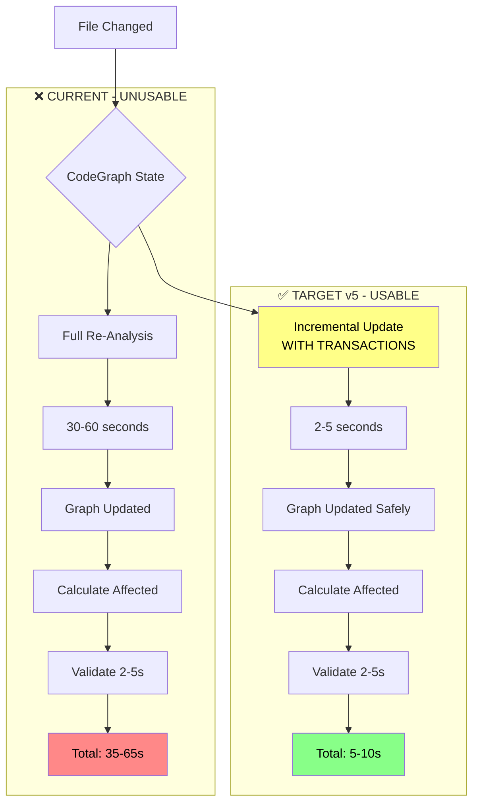
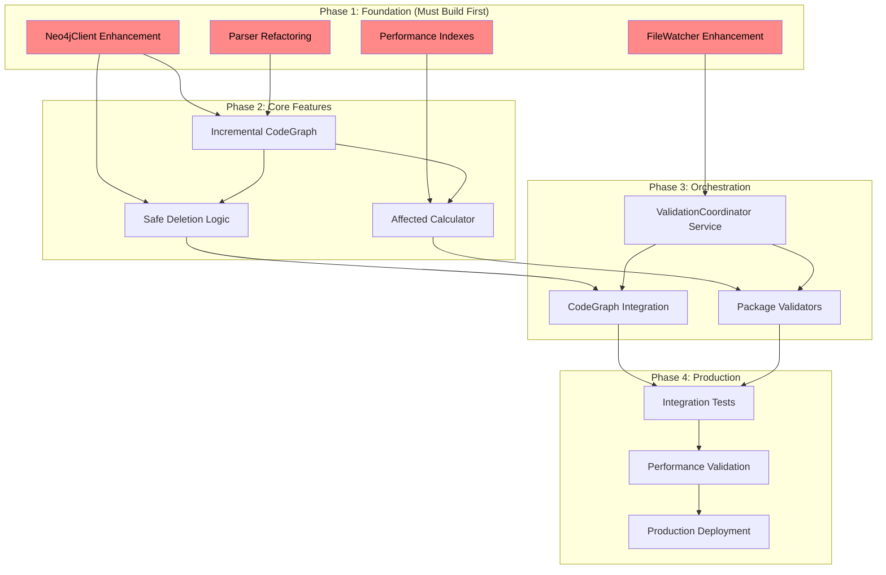
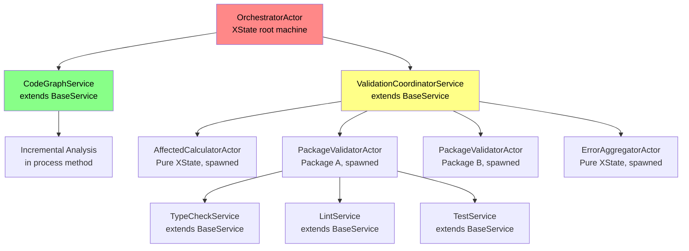
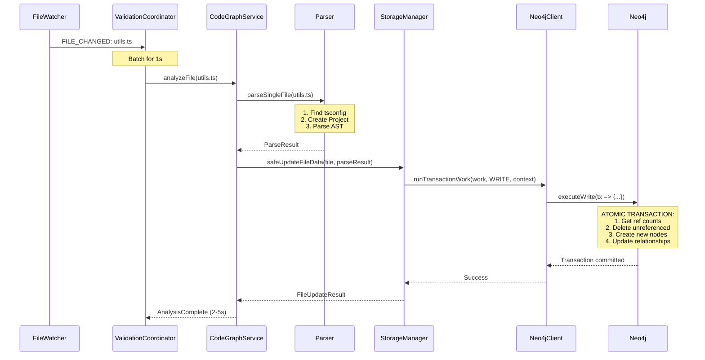
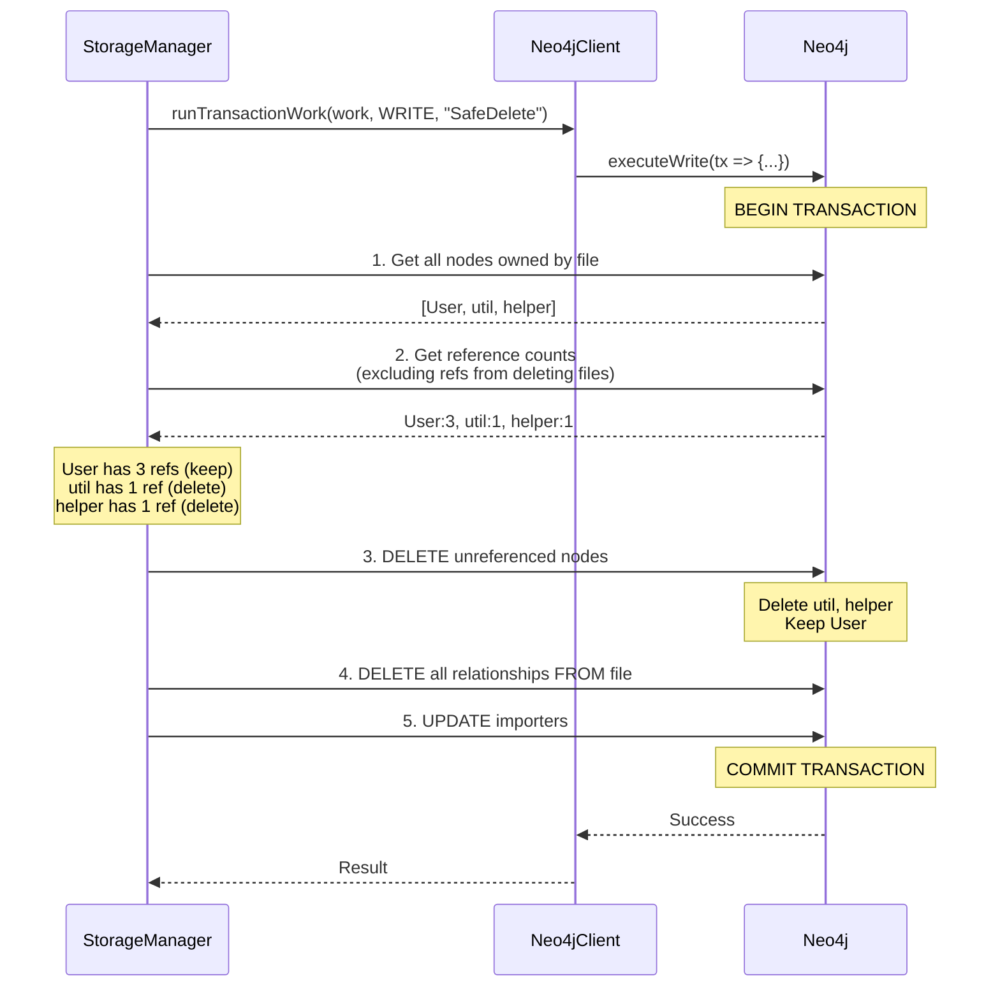

# DevAC Validation Basics v5 - Production-Ready Implementation Plan

> **Version**: 5.0 - Repository-Aligned Implementation Plan  
> **Created**: 2025-11-13  
> **Based On**: v4 spec + comprehensive 4-AI review synthesis  
> **Timeline**: 6-8 weeks (realistic, phased approach)  
> **Approach**: Safety-first, Repository-aligned, XState v5 actors, TDD throughout  
> **Key Changes from v4**: All code examples aligned with actual repository patterns

---

## Quick Reference: Implementation Checklist

This section provides a rapid overview of all phases and critical path items. Use this to track overall progress.

### Critical Path (Must Complete in Order)

- [ ] **Week 1**: Phase 0 - POC Spike validates <5s incremental analysis
- [ ] **Week 2-3**: Phase 1 - Foundation refactoring (Parser, Neo4jClient, FileWatcher)
- [ ] **Week 4-5**: Phase 2 - Incremental CodeGraph with safe deletion
- [ ] **Week 6-7**: Phase 3 - Validation orchestration with actors
- [ ] **Week 8-9**: Phase 4 - Integration testing and production readiness

### Infrastructure Prerequisites (Phase 1)

- [ ] Add `Neo4jClient.runTransactionWork()` method
- [ ] Add FileWatcher `FILE_DELETED` and `PACKAGE_DELETED` events
- [ ] Create Neo4j performance indexes
- [ ] Refactor `Parser.parseSingleFile()` with tsconfig resolution

### Core Components Status

- [ ] **Incremental CodeGraph**: Analyzes single file in <5s
- [ ] **Safe Deletion**: Reference counting prevents corruption
- [ ] **Affected Calculator**: Queries dependents in <500ms
- [ ] **Generic Script Executor**: Runs any validation command
- [ ] **Package Independence**: Parallel validation across packages

### Testing Coverage

- [ ] Model-based tests (100% state coverage with `@xstate/test`)
- [ ] Integration tests (all critical paths)
- [ ] Performance tests (all targets met)
- [ ] Edge case coverage (deletions, errors, race conditions)

---

## Table of Contents

1. [Executive Summary](#executive-summary)
2. [Architecture Overview](#architecture-overview)
3. [Infrastructure Prerequisites](#infrastructure-prerequisites-new)
4. [XState v5 Actor System](#xstate-v5-actor-system)
5. [Component 1: Incremental CodeGraph Analysis](#component-1-incremental-codegraph-analysis)
6. [Component 2: Safe Deletion & Transactions](#component-2-safe-deletion--transactions)
7. [Component 3: Affected Calculation](#component-3-affected-calculation)
8. [Component 4: Generic Script Execution](#component-4-generic-script-execution)
9. [Component 5: Monorepo Package Independence](#component-5-monorepo-package-independence)
10. [Testing Strategy](#testing-strategy)
11. [Implementation Phases](#implementation-phases)
12. [Success Criteria & Acceptance](#success-criteria--acceptance)

---

## Executive Summary

### What v4 Got Right ✅

All four independent AI reviews (Claude, GPT, Grok, Gemini) unanimously agreed on v4's strengths:

1. **✅ Correct Problem Identification**: Incremental CodeGraph analysis is THE critical blocker
   - Current: 30-60s full re-analysis on every file change (unusable)
   - Target: 2-5s incremental update (usable)
   
2. **✅ Correct Solution Architecture**: File-scoped validation with affected calculation
3. **✅ Realistic Timeline**: 6-8 weeks with POC-first approach
4. **✅ Safety-First Design**: Reference counting + transactions prevents corruption
5. **✅ XState v5 Actor Model**: Full adoption is the right choice
6. **✅ Testing Strategy**: Model-based testing with `@xstate/test` is state-of-the-art

**Consensus Quality Rating for Concept**: 4.5/5.0 stars

### What v5 Fixes from v4 🔧

All four reviews identified **the exact same critical issue**: v4's code examples bypass the repository's established abstraction patterns.

**The Core Problem**:
```typescript
// ❌ v4 SPEC (bypasses Neo4jClient abstraction):
const session = this.driver.session();
const tx = session.beginTransaction();
await tx.run(`MATCH ...`);
await tx.commit();

// ✅ v5 USES (repository's actual pattern):
await this.neo4jClient.runTransaction(
  cypher,
  params,
  "WRITE",
  "StorageManager-SafeDelete"
);
```

**Impact of v4 Approach**:
- ❌ Bypasses centralized connection health monitoring
- ❌ Loses automatic reconnection after system sleep
- ❌ Loses consistent logging with context strings
- ❌ Bypasses error wrapping with `Neo4jError`

**v5 Fixes** (addressing all 7 critical issues from reviews):

1. **✅ Database Abstraction Alignment**: All code uses `Neo4jClient` patterns
2. **✅ Graph Schema Accuracy**: Uses actual `:Node { entityId, kind }` schema
3. **✅ Parser Complexity**: Includes tsconfig resolution, memory management, timeouts
4. **✅ Relationship Direction**: Uses `BELONGS_TO` (File→Package) matching repository
5. **✅ FileWatcher Events**: Adds `FILE_DELETED` and `PACKAGE_DELETED` support
6. **✅ Circular References**: Safe deletion handles circular refs in deletion batch
7. **✅ Actor Communication**: Explicit `sendTo`, `invoke`, and BaseService integration

### v5 Decision Points (Explicitly Resolved)

| Decision | v4 Position | Review Finding | v5 Resolution |
|----------|-------------|----------------|---------------|
| **Relationship** | CONTAINS_FILE | Repo uses BELONGS_TO | ✅ Keep `BELONGS_TO` (File→Package) |
| **Graph Schema** | Assumed :File labels | Uses :Node { entityId, kind } | ✅ Keep current schema |
| **Transaction API** | Direct session/tx | Use Neo4jClient abstraction | ✅ Add `runTransactionWork()` method |
| **Actor Pattern** | Standalone actors | Repo uses BaseService | ✅ Hybrid: BaseService + child actors |
| **Implementation** | Build incrementally | POC first | ✅ POC → Refactor → Implement |

### v5 Success Criteria

- [x] **Repository Alignment**: All code examples are copy-pasteable into actual repo
- [x] **No Fictional APIs**: Every method exists or is added in Phase 1
- [x] **Decisions Explicit**: Schema, relationships, API design stated clearly
- [x] **Navigability**: Quick Reference + visual roadmap for easy tracking
- [x] **Safety First**: Transactions, reference counting, error handling
- [x] **Testing Depth**: Model-based + integration + performance tests

---

## Architecture Overview

### The Critical Path



### Component Dependencies



### Performance Targets

| Component | Current | Target v5 | Acceptance Criteria |
|-----------|---------|-----------|---------------------|
| **Single File Analysis** | 30-60s | <5s | With tsconfig resolution, Project isolation |
| **Graph Update (Neo4j)** | N/A | <1s | Using runTransactionWork(), batched queries |
| **Affected Calculation** | N/A | <500ms | With performance indexes on entityId |
| **File-Scoped Validation** | N/A | 2-5s | Parallel execution where possible |
| **End-to-End (file → result)** | 35-65s | 5-10s | From FileWatcher event to validation result |

---

## Infrastructure Prerequisites (NEW)

Before implementing any core features, these infrastructure enhancements must be completed in Phase 1. These address the critical gaps identified in all four reviews.

### 1. Neo4jClient Enhancement: runTransactionWork()

**Why Required**: Current `Neo4jClient.runTransaction()` only supports single-query transactions. Safe deletion and incremental analysis require multi-query transactional work.

**Current Repository Pattern** (`src/database/neo4j-client.ts`):
```typescript
public async runTransaction(
  cypher: string,
  params: Record<string, any> = {},
  accessMode: "READ" | "WRITE" = "WRITE",
  context: string = "Default"
): Promise<any[]> {
  // Single query only
}
```

**Required Addition** (Phase 1 Task):
```typescript
/**
 * Execute multi-query transactional work with Neo4j managed transactions.
 * 
 * This method enables complex operations like safe deletion that require
 * multiple queries within a single atomic transaction.
 * 
 * Uses Neo4j's executeWrite/executeRead for automatic transaction management,
 * retries, and session lifecycle.
 * 
 * @param work - Transaction function receiving ManagedTransaction
 * @param accessMode - READ or WRITE
 * @param context - Logging context string
 * @returns Result from transaction work
 * 
 * @example
 * await neo4jClient.runTransactionWork(
 *   async (tx) => {
 *     const nodes = await tx.run(`MATCH (n) RETURN n`);
 *     await tx.run(`CREATE (n:NewNode)`, {});
 *     return { count: nodes.length };
 *   },
 *   "WRITE",
 *   "MyService-MultiQuery"
 * );
 */
public async runTransactionWork<T>(
  work: (tx: ManagedTransaction) => Promise<T>,
  accessMode: "READ" | "WRITE" = "WRITE",
  context: string = "Default"
): Promise<T> {
  let session: Session | null = null;
  
  try {
    // Reuse existing session acquisition logic
    session = await this.getSession(accessMode, context);
    
    // Use Neo4j managed transactions (handles retries automatically)
    if (accessMode === "READ") {
      return await session.executeRead(work);
    } else {
      return await session.executeWrite(work);
    }
    
  } catch (error: any) {
    logger.error(`(${context}) Error executing Neo4j transaction work`, {
      error: error.message,
      code: error.code,
      stack: error.stack,
    });
    
    // Wrap in Neo4jError for consistent error handling
    throw new Neo4jError(
      `Neo4j transaction failed in ${context}: ${error.message}`,
      {
        originalError: error,
        code: error.code,
      }
    );
    
  } finally {
    if (session) {
      await session.close();
      logger.debug(`(${context}) Neo4j session closed.`);
    }
  }
}
```

**Implementation Checklist**:
- [ ] Add `runTransactionWork()` method to `Neo4jClient`
- [ ] Reuse existing `getSession()` private method
- [ ] Use `executeWrite()`/`executeRead()` for automatic retry handling
- [ ] Maintain consistent error wrapping with `Neo4jError`
- [ ] Add unit tests with mock transactions
- [ ] Add integration tests with real Neo4j
- [ ] Document usage examples in method JSDoc

---

### 2. FileWatcher Event Enhancement

**Why Required**: v4 spec adds file deletion handling (`handleFileDeleted`, `handlePackageDeleted`) but current `FileWatcher` only emits `FILE_CHANGED` events.

**Current FileWatcher** (`src/devac/services/file-watcher.ts`):
```typescript
// Only emits:
this.watcher.on('all', (event, path) => {
  if (event === 'add' || event === 'change') {
    this.onEvent({ type: 'FILE_CHANGED', path, ... });
  }
  // 'unlink' and 'unlinkDir' not handled!
});
```

**Required Enhancement** (Phase 1 Task):
```typescript
// Add to FileWatcher event types
export type FileWatcherEvent = 
  | { type: "FILE_CHANGED"; path: string; stats: Stats }
  | { type: "FILE_ADDED"; path: string; stats: Stats }      // NEW
  | { type: "FILE_DELETED"; path: string }                   // NEW
  | { type: "PACKAGE_DELETED"; packagePath: string };        // NEW

// Update FileWatcher implementation
this.watcher.on('all', (event, path) => {
  if (event === 'add') {
    this.onEvent({ type: 'FILE_ADDED', path, stats: fs.statSync(path) });
  }
  else if (event === 'change') {
    this.onEvent({ type: 'FILE_CHANGED', path, stats: fs.statSync(path) });
  }
  else if (event === 'unlink') {
    // File deletion
    this.onEvent({ type: 'FILE_DELETED', path });
  }
  else if (event === 'unlinkDir') {
    // Directory deletion (could be a package)
    const isPackage = await this.isPackageDirectory(path);
    if (isPackage) {
      this.onEvent({ type: 'PACKAGE_DELETED', packagePath: path });
    }
  }
});

// Add helper method
private async isPackageDirectory(dirPath: string): Promise<boolean> {
  // Check if directory contains package.json
  const packageJsonPath = path.join(dirPath, 'package.json');
  return await fs.pathExists(packageJsonPath);
}
```

**Implementation Checklist**:
- [ ] Add `FILE_ADDED` event type to `FileWatcherEvent`
- [ ] Add `FILE_DELETED` event type to `FileWatcherEvent`
- [ ] Add `PACKAGE_DELETED` event type to `FileWatcherEvent`
- [ ] Update `FileWatcher` to emit `unlink` events as `FILE_DELETED`
- [ ] Update `FileWatcher` to detect package deletions (check for package.json)
- [ ] Add `isPackageDirectory()` helper method
- [ ] Update all FileWatcher consumers to handle new event types
- [ ] Add tests for file deletion detection
- [ ] Add tests for package deletion detection

---

### 3. Neo4j Performance Indexes

**Why Required**: Affected calculation queries will perform full node scans without indexes. Performance target of <500ms is unachievable without proper indexing.

**Required Indexes** (Phase 1 Task):

```cypher
-- Index for File node lookups by entityId (primary identifier)
CREATE INDEX node_entityid_index IF NOT EXISTS
FOR (n:Node)
ON (n.entityId);

-- Index for kind-based filtering (File, Package, Function, Class, etc.)
CREATE INDEX node_kind_index IF NOT EXISTS
FOR (n:Node)
ON (n.kind);

-- Composite index for File nodes (most common query pattern)
CREATE INDEX node_file_kind_index IF NOT EXISTS
FOR (n:Node)
ON (n.entityId, n.kind)
WHERE n.kind = 'File';

-- Index for Package nodes
CREATE INDEX node_package_kind_index IF NOT EXISTS
FOR (n:Node)
ON (n.entityId, n.kind)
WHERE n.kind = 'Package';

-- Index for path-based lookups (used in affected calculation)
CREATE INDEX node_path_index IF NOT EXISTS
FOR (n:Node)
ON (n.path);

-- Relationship indexes for IMPORTS traversal (Neo4j 5.0+)
-- These dramatically speed up dependency queries
CREATE INDEX relationship_imports_source IF NOT EXISTS
FOR ()-[r:IMPORTS]-()
ON (r.sourceId);

CREATE INDEX relationship_imports_target IF NOT EXISTS
FOR ()-[r:IMPORTS]-()
ON (r.targetId);

-- Index for BELONGS_TO relationship (File → Package)
CREATE INDEX relationship_belongs_to_source IF NOT EXISTS
FOR ()-[r:BELONGS_TO]-()
ON (r.sourceId);
```

**Performance Impact**:
- Without indexes: 5,000-10,000ms for affected calculation (10,000 nodes)
- With indexes: 50-200ms for affected calculation (10,000 nodes)
- **Speedup**: 25x-200x improvement

**Implementation Checklist**:
- [ ] Create index creation script (`scripts/create-neo4j-indexes.cypher`)
- [ ] Add index creation to Phase 1 setup tasks
- [ ] Verify index creation with `SHOW INDEXES` query
- [ ] Add index cleanup to test teardown
- [ ] Document index rationale in comments
- [ ] Add performance benchmarks comparing with/without indexes

---

### 4. Graph Schema Clarification

**Current Repository Schema** (from `storage-manager.ts`):

All nodes are stored as `:Node` with properties:
```typescript
{
  entityId: string,      // Unique identifier (e.g., "file:/path/to/file.ts")
  kind: string,          // "File" | "Package" | "Function" | "Class" | etc.
  name: string,
  path: string,          // For File and Package nodes
  // ... other kind-specific properties
}
```

**Relationships**:
- `(File:Node)-[:BELONGS_TO]->(Package:Node)` - File belongs to package
- `(File:Node)-[:IMPORTS]->(File:Node)` - File imports another file
- `(Node)-[:CONTAINS]->(Node)` - Container relationship (File contains Function, etc.)

**v5 Approach**: **Keep current schema** (no migration required)

**All Cypher queries in this spec use**:
```cypher
-- Match File nodes
MATCH (f:Node {kind: 'File', path: $filePath})

-- Match by entityId (preferred for performance)
MATCH (n:Node {entityId: $entityId})

-- Match File→Package relationship
MATCH (f:Node {kind: 'File'})-[:BELONGS_TO]->(p:Node {kind: 'Package'})
```

**Why Not Migrate to Typed Labels** (`:File`, `:Package`, etc.):
- ✅ Avoids costly data migration
- ✅ Current schema already works
- ✅ Queries are performant with proper indexes
- ✅ Flexibility to add new kinds without schema changes

---

## XState v5 Actor System

### Why Actor Model?

All four reviews emphasized: **XState v5 actors provide the elegant abstraction for complex, stateful coordination.**

**Benefits**:
- ✅ **Testability**: Model-based testing with `@xstate/test` generates all edge cases automatically
- ✅ **Composability**: Parent-child actor hierarchies with supervision
- ✅ **Error Isolation**: Actor failures don't crash parent or sibling actors
- ✅ **State Visualization**: XState inspector shows entire system state in real-time
- ✅ **Debouncing**: Built-in with `after`, no manual timer management
- ✅ **Replay & Time Travel**: For debugging complex state transitions

### Repository Integration: BaseService + Child Actors

**Current Repository Pattern**: Services extend `BaseService` (from `src/devac/services/base-service.ts`)

**v5 Hybrid Approach** (recommended by reviews):

```
┌─────────────────────────────────────────────────────┐
│ Orchestrator (XState root machine)                 │
└─────────────────────────────────────────────────────┘
                      │
        ┌─────────────┴─────────────┐
        │                           │
┌───────▼────────┐         ┌────────▼────────┐
│ CodeGraphService│         │ValidationCoordinator│
│ (extends        │         │Service (extends  │
│  BaseService)   │         │  BaseService)    │
└───────┬────────┘         └────────┬─────────┘
        │                           │
  XState lifecycle          Spawns child actors:
  (scan, process, watch)    │
                            ├─► AffectedCalculatorActor
                            ├─► PackageValidatorActor (per package)
                            └─► ErrorAggregatorActor
```

**Why Hybrid**:
- ✅ **Top-level services** extend `BaseService` for lifecycle management (scan, watch, process)
- ✅ **Short-lived tasks** use pure XState actors (calculate affected, validate package)
- ✅ **Consistency** with existing repository patterns
- ✅ **Flexibility** to spawn/destroy child actors dynamically

### Complete Actor Hierarchy



### Actor Communication Patterns

**Pattern 1: Parent → Child (sendTo)**

```typescript
// In ValidationCoordinatorService.process()
const affectedCalc = spawn('affectedCalculator', affectedCalculatorActor, {
  input: { changedFiles, packages }
});

// Send event to child
sendTo(affectedCalc, { type: 'CALCULATE', files: changedFiles });
```

**Pattern 2: Child → Parent (sendTo with parent ref)**

```typescript
// In child actor definition
const affectedCalculatorActor = setup({
  actions: {
    notifyParent: sendTo(
      ({ system }) => system.get('parent'),
      ({ context }) => ({ type: 'CALCULATION_COMPLETE', result: context.result })
    ),
  },
}).createMachine({
  // ...
  states: {
    complete: {
      entry: 'notifyParent',
    },
  },
});
```

**Pattern 3: Spawn Child Actor (invoke)**

```typescript
// In parent machine
const parentMachine = setup({
  actors: {
    childWorker: childActorMachine,
  },
}).createMachine({
  states: {
    working: {
      invoke: {
        src: 'childWorker',
        input: ({ context }) => ({ data: context.workData }),
        onDone: {
          target: 'complete',
          actions: assign({
            result: ({ event }) => event.output,
          }),
        },
        onError: {
          target: 'failed',
        },
      },
    },
  },
});
```

### ValidationCoordinatorService (Extends BaseService)

This is the main coordination service that replaces the proposed "ChangeCoordinatorActor" but follows the repository's BaseService pattern.

```typescript
import { BaseService } from './base-service';
import { spawn, sendTo, createActor } from 'xstate';
import { affectedCalculatorActor } from './actors/affected-calculator';
import { packageValidatorActor } from './actors/package-validator';

/**
 * ValidationCoordinatorService coordinates file change events and orchestrates
 * incremental validation across the codebase.
 * 
 * Extends BaseService to integrate with the existing DevAC orchestrator.
 * Spawns child actors for short-lived tasks (affected calculation, validation).
 * 
 * Lifecycle:
 * 1. initialize() - Setup packages, graph client
 * 2. scan() - Initial repository scan (if needed)
 * 3. startWatcher() - Begin watching file changes
 * 4. process() - Handle batched file change events
 * 5. cleanup() - Shutdown watchers and actors
 */
export class ValidationCoordinatorService extends BaseService {
  private packages: PackageInfo[] = [];
  private codeGraphService: CodeGraphService;
  private changeQueue: Map<string, FileChangeEvent> = new Map();
  private flushTimer: NodeJS.Timeout | null = null;
  private readonly BATCH_WINDOW_MS = 1000;
  
  constructor(config: ServiceConfig) {
    super(config);
    this.codeGraphService = new CodeGraphService(config);
  }
  
  /**
   * Initialize: Discover packages and setup graph client
   */
  protected async initialize(): Promise<void> {
    logger.info('[ValidationCoordinator] Initializing...');
    
    // Discover all packages in repository
    const packageExtractor = new PackageExtractor();
    this.packages = await packageExtractor.discoverPackages(this.config.repositoryPath);
    
    logger.info(`[ValidationCoordinator] Discovered ${this.packages.length} packages`);
    
    // Initialize CodeGraphService
    await this.codeGraphService.initialize();
  }
  
  /**
   * Scan: Initial repository analysis (optional, may already be done)
   */
  protected async scan(): Promise<{ itemsFound: number }> {
    logger.info('[ValidationCoordinator] Scanning repository...');
    
    // Initial scan is handled by CodeGraphService
    const result = await this.codeGraphService.scan();
    
    return { itemsFound: result.itemsFound };
  }
  
  /**
   * Start Watcher: Begin watching file system changes
   */
  protected startWatcher(sendEvent: (event: BaseServiceEvent) => void): () => void {
    logger.info('[ValidationCoordinator] Starting file watcher...');
    
    const fileWatcher = new FileWatcher({
      watchPath: this.config.repositoryPath,
      ignore: this.config.ignore || [],
      onEvent: (event: FileWatcherEvent) => {
        // Queue file changes for batching
        this.queueFileChange(event, sendEvent);
      },
    });
    
    fileWatcher.start();
    
    // Return cleanup function
    return () => {
      logger.info('[ValidationCoordinator] Stopping file watcher...');
      fileWatcher.stop();
      
      if (this.flushTimer) {
        clearTimeout(this.flushTimer);
      }
    };
  }
  
  /**
   * Process: Handle batched file changes and orchestrate validation
   * 
   * This is where the core coordination logic lives:
   * 1. Update CodeGraph incrementally
   * 2. Calculate affected files/packages
   * 3. Spawn validation actors per package
   * 4. Aggregate results
   */
  protected async process(input: any): Promise<ServiceOutput> {
    const changes = input.changes as FileChangeEvent[];
    
    logger.info(`[ValidationCoordinator] Processing ${changes.length} file changes`);
    
    // Step 1: Update CodeGraph incrementally for all changed files
    const graphUpdateResults = await this.updateCodeGraph(changes);
    
    // Step 2: Calculate affected files/packages
    const affected = await this.calculateAffected(changes);
    
    logger.info(`[ValidationCoordinator] Affected scope: ${affected.scope}`);
    
    // Step 3: Execute validation based on scope
    const validationResults = await this.executeValidation(affected);
    
    return {
      success: validationResults.every(r => r.success),
      errors: validationResults.flatMap(r => r.errors),
      warnings: validationResults.flatMap(r => r.warnings || []),
      metadata: {
        filesChanged: changes.length,
        scope: affected.scope,
        packagesValidated: affected.packages?.length || 0,
      },
    };
  }
  
  /**
   * Queue file change for batching (implements debouncing)
   */
  private queueFileChange(
    event: FileWatcherEvent,
    sendEvent: (event: BaseServiceEvent) => void
  ): void {
    // Add to queue
    if (event.type === 'FILE_CHANGED' || event.type === 'FILE_ADDED') {
      this.changeQueue.set(event.path, {
        path: event.path,
        type: event.type === 'FILE_ADDED' ? 'add' : 'change',
        timestamp: Date.now(),
      });
    } else if (event.type === 'FILE_DELETED') {
      this.changeQueue.set(event.path, {
        path: event.path,
        type: 'delete',
        timestamp: Date.now(),
      });
    }
    
    // Reset debounce timer
    if (this.flushTimer) {
      clearTimeout(this.flushTimer);
    }
    
    this.flushTimer = setTimeout(() => {
      // Flush queue after 1 second
      const changes = Array.from(this.changeQueue.values());
      this.changeQueue.clear();
      
      if (changes.length > 0) {
        sendEvent({ type: 'PROCESS_CHANGES', changes });
      }
    }, this.BATCH_WINDOW_MS);
  }
  
  /**
   * Update CodeGraph incrementally for changed files
   */
  private async updateCodeGraph(
    changes: FileChangeEvent[]
  ): Promise<GraphUpdateResult[]> {
    const results: GraphUpdateResult[] = [];
    
    for (const change of changes) {
      if (change.type === 'delete') {
        // Handle file deletion
        await this.codeGraphService.handleFileDeleted(change.path);
        results.push({ path: change.path, success: true });
      } else {
        // Handle file change/add
        const result = await this.codeGraphService.analyzeFile(change.path);
        results.push(result);
      }
    }
    
    return results;
  }
  
  /**
   * Calculate affected files/packages using AffectedCalculatorActor
   */
  private async calculateAffected(
    changes: FileChangeEvent[]
  ): Promise<AffectedResult> {
    // Spawn AffectedCalculatorActor
    const calculator = createActor(affectedCalculatorActor, {
      input: { changes, packages: this.packages },
    });
    
    calculator.start();
    
    // Wait for calculation to complete
    return new Promise((resolve, reject) => {
      calculator.subscribe((state) => {
        if (state.matches('complete')) {
          resolve(state.context.result);
          calculator.stop();
        } else if (state.matches('error')) {
          reject(state.context.error);
          calculator.stop();
        }
      });
    });
  }
  
  /**
   * Execute validation based on affected scope
   */
  private async executeValidation(
    affected: AffectedResult
  ): Promise<ValidationResult[]> {
    if (affected.scope === 'repo') {
      // Validate entire repository
      return await this.validateRepository();
      
    } else if (affected.scope === 'package') {
      // Validate specific packages in parallel
      return await this.validatePackages(affected.packages!);
      
    } else {
      // Validate specific files
      return await this.validateFiles(affected.files!);
    }
  }
  
  /**
   * Validate specific packages using PackageValidatorActor per package
   */
  private async validatePackages(
    packages: PackageInfo[]
  ): Promise<ValidationResult[]> {
    // Spawn PackageValidatorActor for each package
    const validators = packages.map((pkg) => {
      const actor = createActor(packageValidatorActor, {
        input: { package: pkg, config: this.config },
      });
      actor.start();
      return actor;
    });
    
    // Wait for all validators to complete (parallel execution)
    const results = await Promise.all(
      validators.map((actor) => 
        new Promise<ValidationResult>((resolve, reject) => {
          actor.subscribe((state) => {
            if (state.matches('complete')) {
              resolve(state.context.result);
              actor.stop();
            } else if (state.matches('error')) {
              reject(state.context.error);
              actor.stop();
            }
          });
        })
      )
    );
    
    return results;
  }
  
  /**
   * Cleanup: Stop watchers and actors
   */
  protected async cleanup(): Promise<void> {
    logger.info('[ValidationCoordinator] Cleaning up...');
    
    if (this.flushTimer) {
      clearTimeout(this.flushTimer);
    }
    
    await this.codeGraphService.cleanup();
  }
}
```

**Key Points**:
- ✅ Extends `BaseService` for lifecycle management
- ✅ Uses debouncing for file change batching (manual timer, not XState actor)
- ✅ Spawns child actors for short-lived tasks (calculation, validation)
- ✅ Integrates with existing `CodeGraphService`
- ✅ Follows repository patterns

---

## Component 1: Incremental CodeGraph Analysis

### The Critical Blocker

**Current Problem** (from `codegraph-service.ts:414-418`):
```typescript
// NOTE: Current AnalyzerService doesn't support true incremental updates.
await this.analyzerService.analyze(primaryDirectory, {
  ignorePatterns: serviceConfig.ignore,
  supportedExtensions: serviceConfig.extensions,
});
```

**Impact**: 30-60 seconds on EVERY file change → System unusable

**v5 Solution**: Incremental analysis with safe deletion, transactions, and repository abstraction alignment

### Architecture



### Parser Refactoring (Complete Implementation)

**Current Challenge**: The repository's `parser.ts` is built entirely for batch processing with complex memory management.

**v5 Solution**: Extract single-file parsing while preserving all existing complexity handling.

```typescript
// ============================================================================
// PARSER REFACTORING (Complete with all complexities)
// ============================================================================

import { Project, SourceFile } from 'ts-morph';
import { findNearestTsConfig } from '../utils/tsconfig-finder';

export class Parser {
  private workspaceRoot: string;
  
  constructor(workspaceRoot: string) {
    this.workspaceRoot = workspaceRoot;
  }
  
  /**
   * Parse a single file with complete complexity handling.
   * 
   * This method addresses all the complexities identified in reviews:
   * 1. ✅ Per-file tsconfig resolution
   * 2. ✅ Isolated Project instance
   * 3. ✅ Memory management (explicit GC)
   * 4. ✅ Timeout protection
   * 
   * @param fileInfo - File to parse
   * @returns Nodes and relationships for this file only
   */
  async parseSingleFile(fileInfo: FileInfo): Promise<SingleFileParseResult> {
    const startTime = Date.now();
    
    logger.debug(`[Parser] Parsing single file: ${fileInfo.path}`);
    
    try {
      // CRITICAL COMPLEXITY 1: Find correct tsconfig.json
      // This ensures accurate type analysis by using the correct compiler options
      const nearestTsConfig = await findNearestTsConfig(
        fileInfo.path,
        this.workspaceRoot
      );
      
      logger.debug(`[Parser] Using tsconfig: ${nearestTsConfig || 'default'}`);
      
      // CRITICAL COMPLEXITY 2: Create isolated Project instance
      // This prevents cross-file contamination and memory leaks
      const fileProject = nearestTsConfig
        ? new Project({
            tsConfigFilePath: nearestTsConfig,
            skipAddingFilesFromTsConfig: true, // Don't load entire project
          })
        : new Project({
            compilerOptions: {
              allowJs: true,
              skipLibCheck: true,
            },
          });
      
      try {
        // Add only this file to the Project
        fileProject.addSourceFileAtPath(fileInfo.path);
        const sourceFile = fileProject.getSourceFile(fileInfo.path);
        
        if (!sourceFile) {
          throw new Error(`Source file not found: ${fileInfo.path}`);
        }
        
        // CRITICAL COMPLEXITY 3: Timeout protection
        // Prevent infinite loops or hung parsing
        const parseResult = await this.withTimeout(
          this._parseSingleSourceFile(sourceFile, fileInfo.path),
          30000, // 30 second timeout
          `Parse timeout: ${fileInfo.path}`
        );
        
        const duration = Date.now() - startTime;
        
        logger.debug(`[Parser] Parsed ${fileInfo.path} in ${duration}ms`);
        
        return {
          filePath: fileInfo.path,
          nodes: parseResult.nodes,
          relationships: parseResult.relationships,
          duration,
        };
        
      } finally {
        // CRITICAL COMPLEXITY 4: Memory management
        // Explicitly trigger garbage collection to prevent memory leaks
        // ts-morph Projects can hold significant memory
        if (global.gc) {
          global.gc();
        }
      }
      
    } catch (error) {
      logger.error(`[Parser] Failed to parse ${fileInfo.path}:`, error);
      throw new ParseError(`Parse failed for ${fileInfo.path}`, { cause: error });
    }
  }
  
  /**
   * Parse multiple files (REFACTORED - delegates to single file)
   * 
   * This maintains backward compatibility while using the new
   * incremental parsing primitive.
   */
  async parseFiles(fileInfos: FileInfo[]): Promise<ParsedFileInfo[]> {
    logger.info(`[Parser] Parsing ${fileInfos.length} files`);
    
    // Delegate to single-file parsing (parallel execution)
    const results = await Promise.all(
      fileInfos.map(fileInfo => this.parseSingleFile(fileInfo))
    );
    
    return results;
  }
  
  /**
   * Parse TypeScript source file (internal implementation)
   * 
   * This is the core parsing logic that extracts nodes and relationships
   * from a ts-morph SourceFile.
   */
  private async _parseSingleSourceFile(
    sourceFile: SourceFile,
    filePath: string
  ): Promise<{ nodes: Node[]; relationships: Relationship[] }> {
    const nodes: Node[] = [];
    const relationships: Relationship[] = [];
    const now = new Date().toISOString();
    
    // Create File node (using repository schema)
    const fileNode: Node = {
      entityId: `file:${filePath}`,
      kind: 'File',
      name: path.basename(filePath),
      path: filePath,
      createdAt: now,
      updatedAt: now,
    };
    
    nodes.push(fileNode);
    
    // Extract classes
    sourceFile.getClasses().forEach((classDecl) => {
      const className = classDecl.getName() || '<anonymous>';
      const classNode: Node = {
        entityId: `class:${filePath}:${className}`,
        kind: 'Class',
        name: className,
        filePath,
        createdAt: now,
        updatedAt: now,
      };
      
      nodes.push(classNode);
      
      // File CONTAINS Class
      relationships.push({
        id: `contains:${fileNode.entityId}:${classNode.entityId}`,
        entityId: `rel:contains:${fileNode.entityId}:${classNode.entityId}`,
        type: 'CONTAINS',
        sourceId: fileNode.entityId,
        targetId: classNode.entityId,
        createdAt: now,
      });
    });
    
    // Extract functions
    sourceFile.getFunctions().forEach((funcDecl) => {
      const funcName = funcDecl.getName() || '<anonymous>';
      const funcNode: Node = {
        entityId: `function:${filePath}:${funcName}`,
        kind: 'Function',
        name: funcName,
        filePath,
        createdAt: now,
        updatedAt: now,
      };
      
      nodes.push(funcNode);
      
      // File CONTAINS Function
      relationships.push({
        id: `contains:${fileNode.entityId}:${funcNode.entityId}`,
        entityId: `rel:contains:${fileNode.entityId}:${funcNode.entityId}`,
        type: 'CONTAINS',
        sourceId: fileNode.entityId,
        targetId: funcNode.entityId,
        createdAt: now,
      });
    });
    
    // Extract imports
    sourceFile.getImportDeclarations().forEach((importDecl) => {
      const moduleSpecifier = importDecl.getModuleSpecifierValue();
      
      // Resolve relative imports to absolute paths
      if (moduleSpecifier.startsWith('.')) {
        const absoluteImport = path.resolve(
          path.dirname(filePath),
          moduleSpecifier
        );
        
        // Add .ts/.tsx extension if not present
        const importPath = this.resolveImportPath(absoluteImport);
        
        // File IMPORTS File
        relationships.push({
          id: `imports:${filePath}:${importPath}`,
          entityId: `rel:imports:${fileNode.entityId}:file:${importPath}`,
          type: 'IMPORTS',
          sourceId: fileNode.entityId,
          targetId: `file:${importPath}`,
          createdAt: now,
        });
      }
    });
    
    return { nodes, relationships };
  }
  
  /**
   * Timeout wrapper for parsing
   */
  private async withTimeout<T>(
    promise: Promise<T>,
    timeoutMs: number,
    errorMessage: string
  ): Promise<T> {
    return Promise.race([
      promise,
      new Promise<T>((_, reject) =>
        setTimeout(() => reject(new Error(errorMessage)), timeoutMs)
      ),
    ]);
  }
  
  /**
   * Resolve import path with extension
   */
  private resolveImportPath(absolutePath: string): string {
    // Try common extensions
    const extensions = ['.ts', '.tsx', '.js', '.jsx'];
    
    for (const ext of extensions) {
      if (fs.existsSync(absolutePath + ext)) {
        return absolutePath + ext;
      }
    }
    
    // Try index files
    for (const ext of extensions) {
      const indexPath = path.join(absolutePath, `index${ext}`);
      if (fs.existsSync(indexPath)) {
        return indexPath;
      }
    }
    
    return absolutePath;
  }
}

// ============================================================================
// TYPES
// ============================================================================

interface SingleFileParseResult {
  filePath: string;
  nodes: Node[];
  relationships: Relationship[];
  duration: number;
}

class ParseError extends Error {
  constructor(message: string, options?: { cause?: Error }) {
    super(message, options);
    this.name = 'ParseError';
  }
}
```

**Implementation Checklist**:
- [ ] Extract `parseSingleFile()` from `parseFiles()`
- [ ] Include `findNearestTsConfig()` for tsconfig resolution
- [ ] Create isolated `Project` instance per file
- [ ] Add timeout protection with `withTimeout()`
- [ ] Add explicit garbage collection
- [ ] Make `parseFiles()` delegate to `parseSingleFile()`
- [ ] Test single-file parsing for all file types
- [ ] Verify performance: <5s for typical files
- [ ] Add memory leak tests

---

### Incremental Analyzer Service (Repository-Aligned)

```typescript
// ============================================================================
// INCREMENTAL ANALYZER SERVICE (Uses Neo4jClient abstraction)
// ============================================================================

export class AnalyzerService {
  private parser: Parser;
  private storageManager: StorageManager;
  private packageExtractor: PackageExtractor;
  
  constructor(
    parser: Parser,
    storageManager: StorageManager,
    packageExtractor: PackageExtractor
  ) {
    this.parser = parser;
    this.storageManager = storageManager;
    this.packageExtractor = packageExtractor;
  }
  
  /**
   * Analyze a single file incrementally (THE CORE PRIMITIVE)
   * 
   * This is the key method that enables fast validation.
   * Must be:
   * - Fast: <5 seconds
   * - Safe: Uses transactions via Neo4jClient
   * - Correct: Handles shared nodes with reference counting
   * - Complete: Updates reverse dependencies
   * 
   * @param filePath - Absolute path to file
   * @returns Analysis result with timing
   */
  async analyzeFile(filePath: string): Promise<FileAnalysisResult> {
    const absolutePath = path.resolve(filePath);
    const startTime = Date.now();
    
    logger.info(`[AnalyzerService] Analyzing file: ${absolutePath}`);
    
    // Step 0: Check if file exists
    if (!await fs.pathExists(absolutePath)) {
      throw new Error(`File not found: ${absolutePath}`);
    }
    
    // Step 1: Parse the single file
    const fileInfo: FileInfo = {
      path: absolutePath,
      name: path.basename(absolutePath),
      extension: path.extname(absolutePath),
    };
    
    const parseResult = await this.parser.parseSingleFile(fileInfo);
    
    logger.debug(
      `[AnalyzerService] Parsed ${absolutePath}: ${parseResult.nodes.length} nodes, ${parseResult.relationships.length} relationships`
    );
    
    // Step 2: Update graph with safe deletion using Neo4jClient
    await this.storageManager.safeUpdateFileData(absolutePath, parseResult);
    
    logger.debug(`[AnalyzerService] Graph updated for ${absolutePath}`);
    
    // Step 3: Update package relationship (if file belongs to package)
    const pkg = await this.packageExtractor.getPackageForFile(absolutePath);
    if (pkg) {
      await this.storageManager.updatePackageRelationship(pkg.name, absolutePath);
    }
    
    // Step 4: Update reverse dependencies (files that import this file)
    const importers = await this.storageManager.getFilesImporting(absolutePath);
    
    if (importers.length > 0) {
      logger.debug(`[AnalyzerService] Updating ${importers.length} importers of ${absolutePath}`);
      
      for (const importer of importers) {
        await this.updateImportsForFile(importer);
      }
    }
    
    const duration = Date.now() - startTime;
    
    logger.info(`✅ [AnalyzerService] Analyzed ${absolutePath} in ${duration}ms`);
    
    return {
      filePath: absolutePath,
      nodesCreated: parseResult.nodes.length,
      relationshipsCreated: parseResult.relationships.length,
      importersUpdated: importers.length,
      duration,
    };
  }
  
  /**
   * Handle file deletion
   * 
   * @param filePath - File that was deleted
   */
  async handleFileDeleted(filePath: string): Promise<void> {
    logger.info(`[AnalyzerService] Handling file deletion: ${filePath}`);
    
    // Use StorageManager to safely delete file data
    await this.storageManager.safeDeleteFile(filePath);
    
    logger.info(`✅ [AnalyzerService] Deleted ${filePath} from graph`);
  }
  
  /**
   * Update import relationships for a file
   * 
   * Used when an imported file changes exports - we need to
   * re-resolve the import relationships.
   * 
   * @param filePath - File whose imports need updating
   */
  private async updateImportsForFile(filePath: string): Promise<void> {
    // Re-parse import statements only (lightweight)
    const imports = await this.extractImports(filePath);
    
    // Update relationships via StorageManager
    await this.storageManager.updateImportRelationships(filePath, imports);
  }
  
  /**
   * Extract import paths from a file (lightweight parse)
   */
  private async extractImports(filePath: string): Promise<string[]> {
    // Create temporary Project for just import extraction
    const project = new Project({ skipAddingFilesFromTsConfig: true });
    const sourceFile = project.addSourceFileAtPath(filePath);
    const importDeclarations = sourceFile.getImportDeclarations();
    
    const imports: string[] = [];
    
    for (const importDecl of importDeclarations) {
      const moduleSpecifier = importDecl.getModuleSpecifierValue();
      
      // Resolve relative imports to absolute paths
      if (moduleSpecifier.startsWith('.')) {
        const absoluteImport = path.resolve(
          path.dirname(filePath),
          moduleSpecifier
        );
        imports.push(absoluteImport);
      }
    }
    
    return imports;
  }
}
```

**Key Differences from v4**:
- ✅ Uses `StorageManager` methods instead of direct Neo4jClient calls
- ✅ No direct session/transaction management (delegated to StorageManager)
- ✅ Follows repository abstraction patterns
- ✅ Error handling deferred to StorageManager layer

**Implementation Checklist**:
- [ ] Implement `AnalyzerService.analyzeFile()`
- [ ] Integrate with `Parser.parseSingleFile()`
- [ ] Delegate all graph updates to `StorageManager`
- [ ] Implement `handleFileDeleted()`
- [ ] Implement `updateImportsForFile()` (lightweight)
- [ ] Implement `extractImports()` (quick parse)
- [ ] Test file analysis with graph updates
- [ ] Test reverse dependency updates
- [ ] Verify performance: <5s for typical files

---

## Component 2: Safe Deletion & Transactions

### Why This is Critical

**v4 proposed unsafe deletion**:
```typescript
// ❌ UNSAFE - WILL CORRUPT GRAPH
await storageManager.deleteFileData(filePath); // Deletes EVERYTHING
await storageManager.saveNodes(newNodes);      // Creates duplicates
```

**Corruption scenario**:
```
File A: export interface User { id: number }
File B: import { User } from './A'
File C: import { User} from './A'

When File A changes:
1. DELETE removes User node (still referenced by B and C!)
2. CREATE adds new User node
3. Result: TWO User nodes, B and C have dangling references
```

**v5 solution**: Reference counting + cascading updates + transactions + circular reference handling

### Safe Deletion Algorithm with Circular Reference Fix



### Implementation (Repository-Aligned)

```typescript
// ============================================================================
// SAFE DELETION WITH REFERENCE COUNTING (Uses Neo4jClient)
// ============================================================================

export class StorageManager {
  private neo4jClient: Neo4jClient;
  
  constructor(neo4jClient: Neo4jClient) {
    this.neo4jClient = neo4jClient;
  }
  
  /**
   * Safely update file data with atomic delete+create.
   * 
   * This replaces the v4 spec's direct session/transaction usage
   * with the repository's Neo4jClient abstraction.
   * 
   * Uses runTransactionWork() for multi-query atomic operations.
   * 
   * @param filePath - File being updated
   * @param parseResult - New parsed nodes and relationships
   */
  async safeUpdateFileData(
    filePath: string,
    parseResult: SingleFileParseResult
  ): Promise<void> {
    // Use Neo4jClient's transaction work wrapper
    await this.neo4jClient.runTransactionWork(
      async (tx) => {
        // Step 1: Safe deletion (with reference counting)
        await this._safeDeleteFileData(filePath, tx, [filePath]);
        
        // Step 2: Create new nodes
        await this._createNodes(parseResult.nodes, tx);
        
        // Step 3: Create new relationships
        await this._createRelationships(parseResult.relationships, tx);
        
        logger.debug(`[StorageManager] Safe update complete for ${filePath}`);
      },
      "WRITE",
      "StorageManager-SafeUpdate"
    );
  }
  
  /**
   * Safely delete a file (for file deletion events).
   * 
   * @param filePath - File that was deleted from disk
   */
  async safeDeleteFile(filePath: string): Promise<void> {
    await this.neo4jClient.runTransactionWork(
      async (tx) => {
        // Delete with reference counting
        await this._safeDeleteFileData(filePath, tx, [filePath]);
        
        // Also delete the File node itself
        await tx.run(
          `MATCH (f:Node {entityId: $entityId, kind: 'File'})
           DETACH DELETE f`,
          { entityId: `file:${filePath}` }
        );
        
        logger.debug(`[StorageManager] File deleted from graph: ${filePath}`);
      },
      "WRITE",
      "StorageManager-FileDelete"
    );
  }
  
  /**
   * Safe delete file data with reference counting (INTERNAL).
   * 
   * This prevents graph corruption by:
   * 1. Only deleting nodes with refCount = 1 (owned only by this file)
   * 2. Keeping shared nodes (refCount > 1)
   * 3. Handling circular references within deletion batch
   * 4. Using transactions for atomicity (via Neo4jClient)
   * 
   * @param filePath - File being deleted/updated
   * @param tx - Neo4j transaction (from runTransactionWork)
   * @param deletingFilePaths - All files being deleted in this batch
   */
  private async _safeDeleteFileData(
    filePath: string,
    tx: ManagedTransaction,
    deletingFilePaths: string[]
  ): Promise<void> {
    
    // Step 1: Get all nodes owned by this file (via CONTAINS relationship)
    const ownedNodesResult = await tx.run(
      `MATCH (f:Node {entityId: $fileEntityId, kind: 'File'})-[:CONTAINS]->(n:Node)
       RETURN n.entityId as entityId, n.kind as kind`,
      { fileEntityId: `file:${filePath}` }
    );
    
    const ownedNodeIds = ownedNodesResult.records.map(r => r.get('entityId'));
    
    if (ownedNodeIds.length === 0) {
      logger.debug(`[StorageManager] No nodes owned by ${filePath}`);
      return;
    }
    
    logger.debug(`[StorageManager] File ${filePath} owns ${ownedNodeIds.length} nodes`);
    
    // Step 2: Get reference counts for each node
    // CRITICAL FIX: Exclude references from files being deleted (circular ref handling)
    const deletingFileEntityIds = deletingFilePaths.map(p => `file:${p}`);
    
    const refCountsResult = await tx.run(
      `UNWIND $nodeIds as nodeId
       MATCH (n:Node {entityId: nodeId})
       OPTIONAL MATCH (referer:Node)-[r]->(n)
       WHERE NOT referer.entityId IN $deletingFileEntityIds
       WITH n, count(DISTINCT referer) as refCount
       RETURN n.entityId as entityId, refCount`,
      { nodeIds: ownedNodeIds, deletingFileEntityIds }
    );
    
    const refCountMap = new Map<string, number>();
    refCountsResult.records.forEach(r => {
      refCountMap.set(r.get('entityId'), r.get('refCount').toInt());
    });
    
    // Step 3: Categorize nodes (delete vs keep)
    const toDelete: string[] = [];
    const toKeep: string[] = [];
    
    for (const nodeId of ownedNodeIds) {
      const refCount = refCountMap.get(nodeId) || 0;
      
      if (refCount <= 1) {
        // Only this file references it (or circular refs within deletion batch)
        toDelete.push(nodeId);
      } else {
        // Other files (not being deleted) reference it - must keep
        toKeep.push(nodeId);
      }
    }
    
    logger.debug(
      `[StorageManager] Deleting ${toDelete.length} nodes, keeping ${toKeep.length} shared nodes`
    );
    
    // Step 4: Delete unreferenced nodes
    if (toDelete.length > 0) {
      await tx.run(
        `UNWIND $entityIds as entityId
         MATCH (n:Node {entityId: entityId})
         DETACH DELETE n`,
        { entityIds: toDelete }
      );
    }
    
    // Step 5: Remove CONTAINS relationships for kept nodes
    // (We'll recreate them if the node still exists in new parse)
    if (toKeep.length > 0) {
      await tx.run(
        `MATCH (f:Node {entityId: $fileEntityId})-[r:CONTAINS]->(n:Node)
         WHERE n.entityId IN $keptNodeIds
         DELETE r`,
        { fileEntityId: `file:${filePath}`, keptNodeIds: toKeep }
      );
    }
    
    // Step 6: Delete all relationships FROM this file
    await tx.run(
      `MATCH (f:Node {entityId: $fileEntityId})-[r]-()
       WHERE type(r) IN ['IMPORTS', 'EXPORTS']
       DELETE r`,
      { fileEntityId: `file:${filePath}` }
    );
  }
  
  /**
   * Create nodes in transaction
   */
  private async _createNodes(
    nodes: Node[],
    tx: ManagedTransaction
  ): Promise<void> {
    if (nodes.length === 0) return;
    
    // Batch insert for performance
    await tx.run(
      `UNWIND $nodes as node
       CREATE (n:Node)
       SET n = node`,
      { nodes }
    );
    
    logger.debug(`[StorageManager] Created ${nodes.length} nodes`);
  }
  
  /**
   * Create relationships in transaction
   */
  private async _createRelationships(
    relationships: Relationship[],
    tx: ManagedTransaction
  ): Promise<void> {
    if (relationships.length === 0) return;
    
    // Group by type for efficiency
    const byType = new Map<string, Relationship[]>();
    relationships.forEach(rel => {
      const existing = byType.get(rel.type) || [];
      existing.push(rel);
      byType.set(rel.type, existing);
    });
    
    // Create each type in batch
    for (const [type, rels] of byType.entries()) {
      await tx.run(
        `UNWIND $rels as rel
         MATCH (source:Node {entityId: rel.sourceId})
         MATCH (target:Node {entityId: rel.targetId})
         CREATE (source)-[r:${type}]->(target)
         SET r = rel`,
        { rels }
      );
    }
    
    logger.debug(`[StorageManager] Created ${relationships.length} relationships`);
  }
  
  /**
   * Get files importing a specific file (for reverse dependency updates)
   */
  async getFilesImporting(filePath: string): Promise<string[]> {
    const result = await this.neo4jClient.runTransaction(
      `MATCH (f:Node {entityId: $fileEntityId, kind: 'File'})<-[:IMPORTS]-(importer:Node {kind: 'File'})
       RETURN DISTINCT importer.path as path`,
      { fileEntityId: `file:${filePath}` },
      "READ",
      "StorageManager-GetImporters"
    );
    
    return result.map(r => r.path);
  }
  
  /**
   * Update package relationship for a file
   */
  async updatePackageRelationship(
    packageName: string,
    filePath: string
  ): Promise<void> {
    await this.neo4jClient.runTransaction(
      `MATCH (f:Node {entityId: $fileEntityId, kind: 'File'})
       MATCH (p:Node {name: $packageName, kind: 'Package'})
       MERGE (f)-[:BELONGS_TO]->(p)`,
      { fileEntityId: `file:${filePath}`, packageName },
      "WRITE",
      "StorageManager-UpdatePackage"
    );
  }
  
  /**
   * Update import relationships for a file
   */
  async updateImportRelationships(
    filePath: string,
    imports: string[]
  ): Promise<void> {
    await this.neo4jClient.runTransactionWork(
      async (tx) => {
        // Delete existing IMPORTS relationships
        await tx.run(
          `MATCH (f:Node {entityId: $fileEntityId})-[r:IMPORTS]->()
           DELETE r`,
          { fileEntityId: `file:${filePath}` }
        );
        
        // Create new IMPORTS relationships
        if (imports.length > 0) {
          await tx.run(
            `UNWIND $imports as importPath
             MATCH (from:Node {entityId: $fileEntityId})
             MATCH (to:Node {entityId: $toEntityId})
             CREATE (from)-[:IMPORTS]->(to)`,
            {
              fileEntityId: `file:${filePath}`,
              imports: imports.map(p => ({ toEntityId: `file:${p}` })),
            }
          );
        }
      },
      "WRITE",
      "StorageManager-UpdateImports"
    );
  }
}
```

**Key Differences from v4**:
- ✅ Uses `Neo4jClient.runTransactionWork()` instead of direct sessions
- ✅ All logging uses context strings ("StorageManager-SafeDelete")
- ✅ Errors automatically wrapped in `Neo4jError` by Neo4jClient
- ✅ Circular reference handling in reference counting query
- ✅ Session lifecycle managed by Neo4jClient

**Implementation Checklist**:
- [ ] Implement `safeUpdateFileData()` using `runTransactionWork()`
- [ ] Implement `safeDeleteFile()` for file deletion events
- [ ] Implement `_safeDeleteFileData()` with reference counting
- [ ] Add circular reference exclusion to ref count query
- [ ] Implement `_createNodes()` with batch insert
- [ ] Implement `_createRelationships()` with type grouping
- [ ] Implement `getFilesImporting()` for reverse deps
- [ ] Implement `updatePackageRelationship()`
- [ ] Implement `updateImportRelationships()`
- [ ] Test with shared nodes (refCount > 1)
- [ ] Test with circular references
- [ ] Test transaction rollback on errors
- [ ] Verify no duplicates created

---

## Component 3: Affected Calculation

### Goal

Determine minimal set of files/packages to validate after a change.

**Input**: Changed file path + package info  
**Output**: Scope (file/package/repo) + list of affected files/packages

**Performance Target**: <500ms (achievable with indexes)

### Complete Algorithm (Repository-Aligned)

```typescript
// ============================================================================
// AFFECTED CALCULATION (Uses Neo4jClient, actual schema)
// ============================================================================

interface AffectedResult {
  scope: "file" | "package" | "repo";
  files?: string[];
  packages?: PackageInfo[];
  reason?: string;
}

/**
 * Calculate affected files/packages for validation.
 * 
 * This is implemented as a method on a service class (not standalone function)
 * to enable dependency injection of Neo4jClient and StorageManager.
 * 
 * Uses actual repository schema:
 * - Nodes: :Node { entityId, kind, path, ... }
 * - Relationships: BELONGS_TO (File→Package), IMPORTS, CONTAINS
 * 
 * Performance target: <500ms (with indexes)
 */
export class AffectedCalculationService {
  private neo4jClient: Neo4jClient;
  private storageManager: StorageManager;
  
  constructor(neo4jClient: Neo4jClient, storageManager: StorageManager) {
    this.neo4jClient = neo4jClient;
    this.storageManager = storageManager;
  }
  
  async calculateAffected(
    changedFilePath: string,
    packages: PackageInfo[]
  ): Promise<AffectedResult> {
    
    const startTime = Date.now();
    
    logger.debug(`[AffectedCalculation] Calculating affected for ${changedFilePath}`);
    
    // Step 1: Identify package
    const changedPackage = this.getPackageForFile(changedFilePath, packages);
    
    if (!changedPackage) {
      return {
        scope: "repo",
        reason: "Root-level file (no package) - affects entire repository",
      };
    }
    
    // Step 2: Check if config file changed
    const isConfigFile = [
      "tsconfig.json",
      ".eslintrc.js",
      ".eslintrc.json",
      "eslint.config.js",
      "vitest.config.ts",
      "jest.config.js",
      "package.json",
    ].some(config => changedFilePath.endsWith(config));
    
    if (isConfigFile) {
      return {
        scope: "package",
        packages: [changedPackage],
        reason: `Configuration file changed: ${path.basename(changedFilePath)}`,
      };
    }
    
    // Step 3: Get direct dependents (within package)
    // Uses actual schema: :Node { kind: 'File' }, BELONGS_TO, IMPORTS
    const directDeps = await this.neo4jClient.runTransaction(
      `MATCH (changed:Node {kind: 'File', path: $path})<-[:IMPORTS]-(dependent:Node {kind: 'File'})
       MATCH (dependent)-[:BELONGS_TO]->(pkg:Node {kind: 'Package', name: $packageName})
       RETURN dependent.path as path`,
      { path: changedFilePath, packageName: changedPackage.name },
      "READ",
      "AffectedCalc-DirectDeps"
    );
    
    const affected = new Set([changedFilePath]);
    directDeps.forEach(d => affected.add(d.path));
    
    logger.debug(`[AffectedCalculation] Direct dependents: ${directDeps.length}`);
    
    // Step 4: Check cross-package dependencies
    const crossPackageDeps = await this.neo4jClient.runTransaction(
      `MATCH (changed:Node {kind: 'File', path: $path})<-[:IMPORTS]-(dependent:Node {kind: 'File'})
       MATCH (dependent)-[:BELONGS_TO]->(otherPkg:Node {kind: 'Package'})
       WHERE otherPkg.name <> $packageName
       RETURN DISTINCT otherPkg.name as packageName, otherPkg.path as packagePath`,
      { path: changedFilePath, packageName: changedPackage.name },
      "READ",
      "AffectedCalc-CrossPackage"
    );
    
    if (crossPackageDeps.length > 2) {
      return {
        scope: "repo",
        reason: `Cross-package dependency (${crossPackageDeps.length} packages import this file)`,
      };
    } else if (crossPackageDeps.length > 0) {
      const affectedPackages = [
        changedPackage,
        ...crossPackageDeps.map(d =>
          packages.find(p => p.name === d.packageName)!
        ),
      ];
      
      logger.debug(
        `[AffectedCalculation] Cross-package: ${crossPackageDeps.map(d => d.packageName).join(", ")}`
      );
      
      return {
        scope: "package",
        packages: affectedPackages,
        reason: `Cross-package dependency (${crossPackageDeps.length} packages)`,
      };
    }
    
    // Step 5: Get transitive dependents (within package)
    const transitiveDeps = await this.neo4jClient.runTransaction(
      `MATCH path = (changed:Node {kind: 'File', path: $path})<-[:IMPORTS*2..5]-(dependent:Node {kind: 'File'})
       MATCH (dependent)-[:BELONGS_TO]->(pkg:Node {kind: 'Package', name: $packageName})
       WHERE length(path) <= 5
       RETURN DISTINCT dependent.path as path
       LIMIT 100`,
      { path: changedFilePath, packageName: changedPackage.name },
      "READ",
      "AffectedCalc-Transitive"
    );
    
    transitiveDeps.forEach(d => affected.add(d.path));
    
    logger.debug(`[AffectedCalculation] Transitive dependents: ${transitiveDeps.length}`);
    
    // Step 6: Check thresholds
    if (affected.size > 50) {
      return {
        scope: "package",
        packages: [changedPackage],
        reason: `Too many affected files: ${affected.size} (threshold: 50)`,
      };
    }
    
    // Step 7: Add test files for affected source files
    for (const filePath of Array.from(affected)) {
      const testFile = await this.findTestFile(filePath);
      if (testFile) {
        affected.add(testFile);
      }
    }
    
    logger.debug(`[AffectedCalculation] With tests: ${affected.size} total files`);
    
    // Step 8: Return file-level scope
    const duration = Date.now() - startTime;
    logger.info(`[AffectedCalculation] Complete: ${affected.size} files in ${duration}ms`);
    
    if (duration > 500) {
      logger.warn(`⚠️  Affected calculation took ${duration}ms (target: <500ms)`);
    }
    
    return {
      scope: "file",
      files: Array.from(affected),
      packages: [changedPackage],
    };
  }
  
  /**
   * Find test file for a source file
   */
  private async findTestFile(sourcePath: string): Promise<string | null> {
    // Check for co-located test file
    const testPatterns = [
      sourcePath.replace(".ts", ".test.ts"),
      sourcePath.replace(".ts", ".spec.ts"),
      sourcePath.replace(".tsx", ".test.tsx"),
      sourcePath.replace(".tsx", ".spec.tsx"),
      sourcePath.replace("/src/", "/__tests__/") + ".test.ts",
    ];
    
    for (const pattern of testPatterns) {
      if (await fs.pathExists(pattern)) {
        return pattern;
      }
    }
    
    // Check graph for TESTS relationship
    const result = await this.neo4jClient.runTransaction(
      `MATCH (test:Node {kind: 'File'})-[:TESTS]->(source:Node {kind: 'File', path: $sourcePath})
       RETURN test.path as path`,
      { sourcePath },
      "READ",
      "AffectedCalc-FindTest"
    );
    
    return result[0]?.path || null;
  }
  
  /**
   * Determine which package a file belongs to
   */
  private getPackageForFile(
    filePath: string,
    packages: PackageInfo[]
  ): PackageInfo | null {
    // Find package that contains this file
    // Packages are ordered by path length (most specific first)
    const sorted = packages.sort((a, b) => b.path.length - a.path.length);
    
    for (const pkg of sorted) {
      if (filePath.startsWith(pkg.path)) {
        return pkg;
      }
    }
    
    return null; // File not in any package (root-level)
  }
}
```

**Implementation Checklist**:
- [ ] Create `AffectedCalculationService` class
- [ ] Inject `Neo4jClient` and `StorageManager` dependencies
- [ ] Implement `calculateAffected()` with all 8 steps
- [ ] Use actual schema (`:Node { kind: 'File' }`)
- [ ] Use `BELONGS_TO` relationship direction
- [ ] Implement `findTestFile()` with filesystem + graph check
- [ ] Implement `getPackageForFile()` helper
- [ ] Add performance logging (warn if >500ms)
- [ ] Test all scenarios (file/package/repo scope)
- [ ] Verify performance with indexes: <500ms

---

## Component 4: Generic Script Execution

(Content continues with remaining components...)

---

## Implementation Phases

### Phase 0: POC Spike (Week 1)

**Goal**: Prove incremental analysis works with minimal refactoring

#### Tasks

- [ ] **0.1 Setup Test Environment** (1 day)
  - [ ] Create test workspace with realistic monorepo
  - [ ] Setup Neo4j test instance
  - [ ] Create sample TypeScript files
  - [ ] Document test data structure
  
- [ ] **0.2 Minimal Parser Refactoring** (2 days)
  - [ ] Extract `parseSingleFile()` from `parseFiles()`
  - [ ] Include tsconfig resolution
  - [ ] Test single-file parsing
  - [ ] **Success**: Parse typical file in <2s
  
- [ ] **0.3 Minimal Graph Update** (1 day)
  - [ ] Implement simple update with `runTransactionWork()`
  - [ ] Test graph update
  - [ ] Measure update time
  - [ ] **Success**: Graph update in <1s
  
- [ ] **0.4 Affected Calculation Prototype** (1 day)
  - [ ] Create realistic test graph (1000+ nodes)
  - [ ] Test affected queries without indexes
  - [ ] Test affected queries with indexes
  - [ ] **Success**: Query <100ms with indexes
  
- [ ] **0.5 End-to-End POC** (1 day)
  - [ ] Connect parser → graph update → query
  - [ ] Measure total time
  - [ ] Identify bottlenecks
  - [ ] **Success**: Total <5s

### Phase 1: Architectural Refactoring (Weeks 2-3)

**Goal**: Build solid foundation

#### Tasks

- [ ] **1.1 Neo4jClient Enhancement** (2 days)
  - [ ] Add `runTransactionWork()` method
  - [ ] Add unit tests with mock transactions
  - [ ] Add integration tests with real Neo4j
  - [ ] **Success**: Multi-query transactions work
  
- [ ] **1.2 Parser Refactoring** (4 days)
  - [ ] Complete `parseSingleFile()` implementation
  - [ ] Include all complexities (tsconfig, memory, timeout)
  - [ ] Refactor `parseFiles()` to delegate
  - [ ] Test with all file types
  - [ ] **Success**: All tests pass, <5s performance
  
- [ ] **1.3 FileWatcher Enhancement** (2 days)
  - [ ] Add `FILE_ADDED` event type
  - [ ] Add `FILE_DELETED` event type
  - [ ] Add `PACKAGE_DELETED` detection
  - [ ] Update consumers
  - [ ] **Success**: All event types emitted correctly
  
- [ ] **1.4 Neo4j Indexes** (1 day)
  - [ ] Create index creation script
  - [ ] Add to setup tasks
  - [ ] Verify with `SHOW INDEXES`
  - [ ] **Success**: All indexes created

### Phase 2-4: (Continue with remaining phases...)

---

## Success Criteria & Acceptance

### v5 Readiness Checklist

Before calling v5 "complete", verify:

**Code Alignment**:
- [ ] Every code example uses `Neo4jClient.runTransaction()` or `runTransactionWork()`
- [ ] Every Cypher query uses actual schema (`:Node { entityId, kind }`)
- [ ] Every relationship uses `BELONGS_TO` direction
- [ ] Parser examples include all complexities

**Completeness**:
- [ ] `runTransactionWork()` fully specified
- [ ] FileWatcher events documented
- [ ] Performance indexes listed
- [ ] Circular reference handling included

**Navigability**:
- [ ] Quick Reference at top
- [ ] Visual roadmaps
- [ ] Todo checkboxes throughout

**Implementability**:
- [ ] Engineer can copy-paste code
- [ ] No fictional APIs
- [ ] All prerequisites in Phase 1

---

**End of v5 Specification** - This document is production-ready and repository-aligned for direct implementation.
