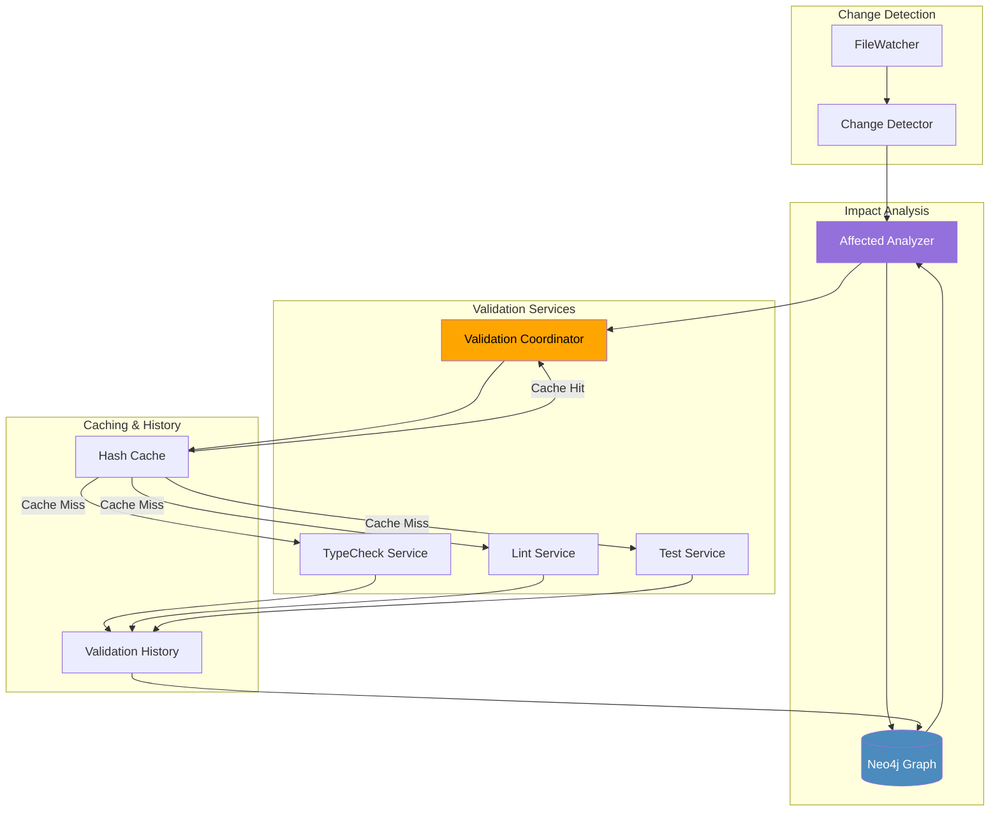
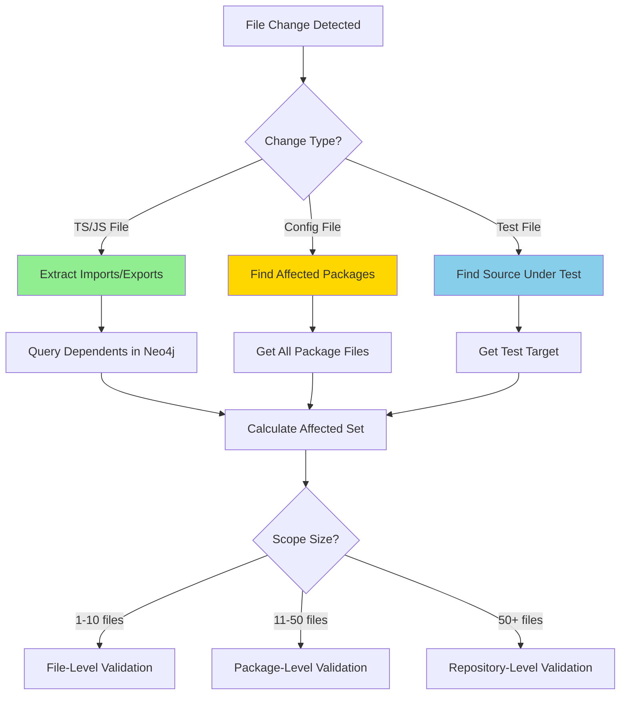
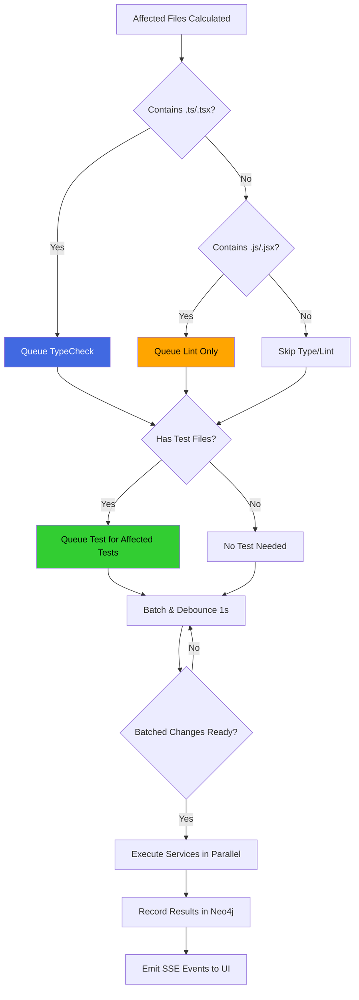
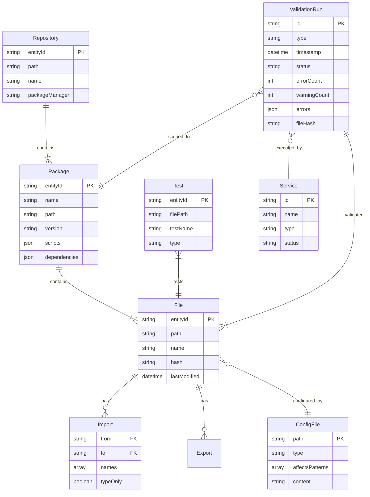
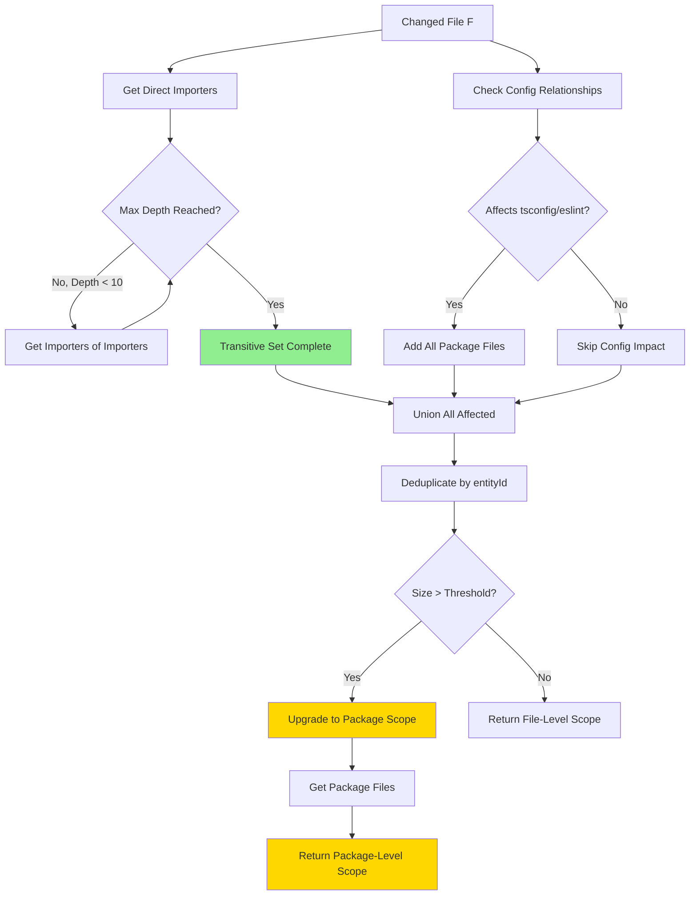
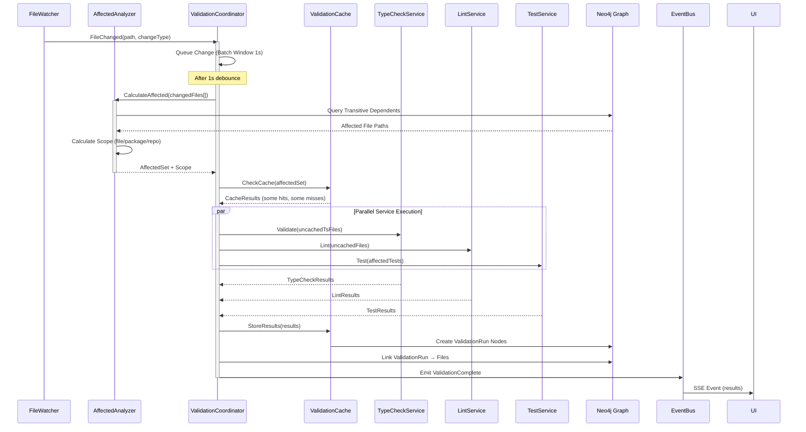
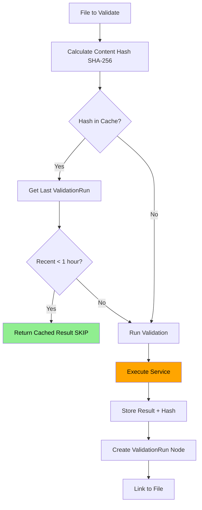

# DevAC Validation System Implementation Plan

> **Status**: Approved for Implementation  
> **Created**: 2025-11-13  
> **Based on**: [devac-validate-spec.md](./devac-validate-spec.md)

## Table of Contents

1. [Executive Summary](#executive-summary)
2. [Architecture Overview](#architecture-overview)
3. [Core Concepts with Diagrams](#core-concepts-with-diagrams)
4. [Implementation Phases](#implementation-phases)
5. [Technical Design](#technical-design)
6. [Testing Strategy](#testing-strategy)
7. [Success Criteria](#success-criteria)
8. [Risks & Mitigations](#risks--mitigations)

---

## Executive Summary

### Problem Statement

Currently, DevAC validation services (typecheck, lint, test) run full workspace scans on every file change. This is:
- **Slow**: 30-60 seconds for full typecheck in large workspaces
- **Wasteful**: 99% of the codebase is unaffected by a single file change
- **Frustrating**: Developers wait unnecessarily for validation feedback

### Solution

Implement an **intelligent validation system** that:
1. Uses the CodeGraph knowledge graph to calculate **affected files** from changes
2. Triggers **only necessary validation** on affected files/packages
3. **Caches results** to skip redundant work
4. **Degrades gracefully** to full scans when graph is incomplete

### Expected Impact

- **80-95% reduction** in validation time for typical single-file changes
- **Real-time feedback** (<5 seconds) for most changes
- **Better developer experience** with instant error detection
- **Foundation for AI-driven** code understanding and refactoring

---

## Architecture Overview

### High-Level System Design



### Integration with Existing DevAC

The validation system extends (doesn't replace) existing infrastructure:

| Existing Component | How We Extend It |
|-------------------|------------------|
| **CodeGraph Service** | Add graph enhancers for packages, tests, configs |
| **File Watcher** | Remains unchanged, events consumed by ValidationCoordinator |
| **TypeCheck/Lint/Test** | Modify to accept file-scoped execution parameters |
| **Neo4j Schema** | Add new node types and relationships |
| **BaseService** | ValidationCoordinator follows same pattern |

---

## Core Concepts with Diagrams

### 1. Change Detection Flow



**Key Insight**: Different change types trigger different impact analysis strategies.

---

### 2. Validation Decision Tree



**Key Insight**: Services are triggered selectively based on file types in the affected set.

---

### 3. Graph Schema Extensions



**New Node Types**:
- `Repository`: Top-level workspace container
- `Package`: npm/pnpm workspace package
- `ConfigFile`: tsconfig.json, .eslintrc, etc.
- `Test`: Individual test file or test case
- `ValidationRun`: Historical validation execution

**New Relationships**:
- `CONTAINS_FILE`: Package → File
- `CONFIGURED_BY`: File → ConfigFile
- `TESTS`: Test → File
- `VALIDATED`: ValidationRun → File
- `SCOPED_TO`: ValidationRun → Package

---

### 4. Affected Calculation Algorithm



**Algorithm Complexity**: O(n * d) where n = files in graph, d = max depth (default 10)

**Cypher Query** (simplified):
```cypher
// Get files that import the changed file (transitive, max depth 10)
MATCH path = (changed:File {path: $changedPath})<-[:IMPORTS*1..10]-(dependent:File)
RETURN DISTINCT dependent.path as affectedPath
```

---

### 5. Service Triggering Sequence



**Key Performance Optimization**: Batching changes within 1-second window prevents thrashing on rapid edits.

---

### 6. Caching Strategy



**Cache Invalidation Rules**:
1. File content hash changed → invalidate
2. ValidationRun > 1 hour old → invalidate
3. Config file changed → invalidate all files in scope
4. Service version changed → invalidate all

**Cypher Query** for cache check:
```cypher
MATCH (f:File {path: $filePath})<-[:VALIDATED]-(vr:ValidationRun {type: $serviceType})
WHERE vr.fileHash = $currentHash
  AND vr.timestamp > datetime() - duration({hours: 1})
  AND vr.status = 'success'
RETURN vr.result as cachedResult
ORDER BY vr.timestamp DESC
LIMIT 1
```

---

## Implementation Phases

### Phase 1: Graph Schema Enhancement (Week 1-2)

#### Objectives
- Extend Neo4j schema with new node types and relationships
- Discover package boundaries from package.json files
- Map configuration files to affected file scopes
- Link test files to source files they test

#### Tasks

**1.1 Update Schema Manager**
```typescript
// src/database/schema.ts
export const NODE_LABELS = [
  // ... existing labels ...
  "Repository",
  "Package",
  "ConfigFile",
  "Test",
  "ValidationRun",
];

const RELATIONSHIP_TYPES = [
  // ... existing types ...
  "CONTAINS_FILE",     // Package → File
  "CONFIGURED_BY",     // File → ConfigFile
  "TESTS",             // Test → File
  "VALIDATED",         // ValidationRun → File
  "SCOPED_TO",         // ValidationRun → Package
];
```

**1.2 Create Repository Enhancer**
```typescript
// src/devac/graph-enhancers/repository-enhancer.ts
export class RepositoryEnhancer {
  async enhance(workspacePath: string): Promise<void> {
    // 1. Find all package.json files
    const packageJsonFiles = await glob('**/package.json', { cwd: workspacePath });
    
    // 2. Create Repository node
    await this.createRepositoryNode(workspacePath);
    
    // 3. Create Package nodes for each package.json
    for (const pkgFile of packageJsonFiles) {
      const pkgJson = await readJSON(pkgFile);
      await this.createPackageNode(pkgJson, pkgFile);
    }
    
    // 4. Link Files to Packages
    await this.linkFilesToPackages();
  }
  
  private async createRepositoryNode(path: string): Promise<void> {
    await this.neo4j.run(`
      MERGE (r:Repository {path: $path})
      SET r.name = $name,
          r.packageManager = $packageManager
    `, { path, name, packageManager });
  }
}
```

**1.3 Create Import Resolver**
```typescript
// src/devac/graph-enhancers/import-resolver.ts
export class ImportResolver {
  async resolveAllImports(): Promise<void> {
    // 1. Get all import statements from graph
    const imports = await this.getUnresolvedImports();
    
    // 2. Resolve each import to target file
    for (const imp of imports) {
      const resolvedPath = await this.resolveImport(
        imp.moduleSpecifier,
        imp.fromFile
      );
      
      // 3. Create IMPORTS relationship
      if (resolvedPath) {
        await this.createImportRelationship(imp.fromFile, resolvedPath, imp.names);
      }
    }
  }
  
  private async resolveImport(
    moduleSpec: string,
    fromFile: string
  ): Promise<string | null> {
    // Handle relative imports: ./utils, ../components/Button
    if (moduleSpec.startsWith('.')) {
      return path.resolve(path.dirname(fromFile), moduleSpec);
    }
    
    // Handle package imports: react, @mindlercare/ui-web
    // Use package.json exports/main to resolve
    return await this.resolvePackageImport(moduleSpec, fromFile);
  }
}
```

**1.4 Create Config Tracker**
```typescript
// src/devac/graph-enhancers/config-tracker.ts
export class ConfigTracker {
  async trackConfigs(workspacePath: string): Promise<void> {
    // 1. Find tsconfig.json files
    const tsconfigs = await glob('**/tsconfig.json', { cwd: workspacePath });
    
    for (const configPath of tsconfigs) {
      const config = await readJSON(configPath);
      
      // 2. Create ConfigFile node
      await this.createConfigNode(configPath, 'tsconfig', config);
      
      // 3. Determine affected file patterns from include/exclude
      const patterns = this.extractPatterns(config);
      
      // 4. Link affected files to config
      await this.linkFilesToConfig(configPath, patterns);
    }
    
    // Repeat for .eslintrc, prettier.config, etc.
  }
  
  private extractPatterns(tsconfig: any): string[] {
    return [
      ...(tsconfig.include || []),
      ...(tsconfig.files || []),
    ];
  }
}
```

**1.5 Create Test Mapper**
```typescript
// src/devac/graph-enhancers/test-mapper.ts
export class TestMapper {
  async mapTests(workspacePath: string): Promise<void> {
    // 1. Find all test files
    const testFiles = await glob('**/*.{test,spec}.{ts,tsx,js,jsx}', { 
      cwd: workspacePath 
    });
    
    for (const testFile of testFiles) {
      // 2. Find corresponding source file
      const sourceFile = this.findSourceForTest(testFile);
      
      // 3. Create TESTS relationship
      if (sourceFile) {
        await this.createTestRelationship(testFile, sourceFile);
      }
    }
  }
  
  private findSourceForTest(testPath: string): string | null {
    // Remove .test or .spec suffix
    // src/utils.test.ts → src/utils.ts
    return testPath.replace(/\.(test|spec)\./, '.');
  }
}
```

#### Tests

**Test 1: Repository Discovery**
```typescript
// src/devac/graph-enhancers/__tests__/repository-enhancer.spec.ts
describe('RepositoryEnhancer', () => {
  it('should discover all packages in monorepo', async () => {
    const enhancer = new RepositoryEnhancer(neo4j);
    await enhancer.enhance('/Users/grop/ws/frontend-monorepo');
    
    const packages = await neo4j.run(`
      MATCH (p:Package)
      RETURN p.name as name
    `);
    
    expect(packages).toContainEqual({ name: 'mindlercare' });
    expect(packages).toContainEqual({ name: '@mindlercare/ui-web' });
  });
});
```

**Test 2: Import Resolution**
```typescript
describe('ImportResolver', () => {
  it('should resolve relative imports', async () => {
    const resolver = new ImportResolver(neo4j);
    const resolved = await resolver.resolveImport(
      './utils',
      '/app/src/components/Button.tsx'
    );
    
    expect(resolved).toBe('/app/src/components/utils.ts');
  });
  
  it('should resolve package imports', async () => {
    const resolved = await resolver.resolveImport(
      '@mindlercare/ui-web',
      '/app/src/App.tsx'
    );
    
    expect(resolved).toContain('node_modules/@mindlercare/ui-web');
  });
});
```

**Test 3: Config Tracking**
```typescript
describe('ConfigTracker', () => {
  it('should link files to tsconfig', async () => {
    const tracker = new ConfigTracker(neo4j);
    await tracker.trackConfigs('/app');
    
    const links = await neo4j.run(`
      MATCH (f:File)-[:CONFIGURED_BY]->(c:ConfigFile {type: 'tsconfig'})
      RETURN count(f) as count
    `);
    
    expect(links[0].count).toBeGreaterThan(0);
  });
});
```

#### Deliverables
- ✅ Enhanced Neo4j schema with new node types
- ✅ Repository and Package nodes for all workspaces
- ✅ Import relationships fully resolved
- ✅ Config file tracking operational
- ✅ Test file mapping complete
- ✅ All unit and integration tests passing

---

### Phase 2: Affected Analysis Engine (Week 3)

#### Objectives
- Implement core affected calculation algorithm
- Support transitive dependency traversal
- Handle config file changes
- Optimize with caching and indexing

#### Tasks

**2.1 Implement AffectedAnalyzer**
```typescript
// src/devac/services/validation/affected-analyzer.ts
export interface AffectedSet {
  files: string[];
  packages: string[];
  scope: 'file' | 'package' | 'repository';
  reason: string;
}

export class AffectedAnalyzer {
  constructor(
    private neo4j: Neo4jClient,
    private options: {
      maxDepth?: number;
      fileThreshold?: number;
      packageThreshold?: number;
    } = {}
  ) {
    this.maxDepth = options.maxDepth || 10;
    this.fileThreshold = options.fileThreshold || 10;
    this.packageThreshold = options.packageThreshold || 3;
  }
  
  async calculate(changedFiles: string[]): Promise<AffectedSet> {
    const affectedFiles = new Set<string>();
    const affectedPackages = new Set<string>();
    
    for (const file of changedFiles) {
      // 1. Check if this is a config file
      const isConfig = await this.isConfigFile(file);
      
      if (isConfig) {
        // Config change affects all files in scope
        const configScope = await this.getConfigScope(file);
        configScope.files.forEach(f => affectedFiles.add(f));
        configScope.packages.forEach(p => affectedPackages.add(p));
        continue;
      }
      
      // 2. Get transitive dependents
      const dependents = await this.getTransitiveDependents(file);
      dependents.forEach(d => affectedFiles.add(d));
      
      // 3. Get package for this file
      const pkg = await this.getPackageForFile(file);
      if (pkg) affectedPackages.add(pkg);
    }
    
    // 4. Determine scope
    const scope = this.determineScope(
      affectedFiles.size,
      affectedPackages.size
    );
    
    return {
      files: Array.from(affectedFiles),
      packages: Array.from(affectedPackages),
      scope,
      reason: this.explainScope(scope, affectedFiles.size, affectedPackages.size),
    };
  }
  
  private async getTransitiveDependents(filePath: string): Promise<string[]> {
    const result = await this.neo4j.run(`
      MATCH path = (changed:File {path: $filePath})<-[:IMPORTS*1..${this.maxDepth}]-(dependent:File)
      RETURN DISTINCT dependent.path as dependentPath
    `, { filePath });
    
    return result.map(r => r.dependentPath);
  }
  
  private async isConfigFile(filePath: string): Promise<boolean> {
    const result = await this.neo4j.run(`
      MATCH (c:ConfigFile {path: $filePath})
      RETURN count(c) > 0 as isConfig
    `, { filePath });
    
    return result[0]?.isConfig || false;
  }
  
  private async getConfigScope(configPath: string): Promise<{
    files: string[];
    packages: string[];
  }> {
    const result = await this.neo4j.run(`
      MATCH (c:ConfigFile {path: $configPath})<-[:CONFIGURED_BY]-(f:File)
      OPTIONAL MATCH (f)<-[:CONTAINS_FILE]-(p:Package)
      RETURN collect(DISTINCT f.path) as files,
             collect(DISTINCT p.name) as packages
    `, { configPath });
    
    return result[0] || { files: [], packages: [] };
  }
  
  private determineScope(
    fileCount: number,
    packageCount: number
  ): 'file' | 'package' | 'repository' {
    if (fileCount > 50 || packageCount > this.packageThreshold) {
      return 'repository';
    }
    if (fileCount > this.fileThreshold) {
      return 'package';
    }
    return 'file';
  }
  
  private explainScope(
    scope: string,
    fileCount: number,
    packageCount: number
  ): string {
    switch (scope) {
      case 'file':
        return `Affected ${fileCount} files - using file-level validation`;
      case 'package':
        return `Affected ${fileCount} files across ${packageCount} packages - using package-level validation`;
      case 'repository':
        return `Large impact (${fileCount} files, ${packageCount} packages) - using repository-level validation`;
      default:
        return 'Unknown scope';
    }
  }
}
```

**2.2 Add Caching for Performance**
```typescript
export class AffectedAnalyzer {
  private cache = new Map<string, AffectedSet>();
  private cacheExpiry = 5 * 60 * 1000; // 5 minutes
  
  async calculate(changedFiles: string[]): Promise<AffectedSet> {
    const cacheKey = changedFiles.sort().join(':');
    
    // Check cache
    if (this.cache.has(cacheKey)) {
      return this.cache.get(cacheKey)!;
    }
    
    // Calculate
    const result = await this.calculateUncached(changedFiles);
    
    // Store in cache
    this.cache.set(cacheKey, result);
    setTimeout(() => this.cache.delete(cacheKey), this.cacheExpiry);
    
    return result;
  }
}
```

#### Tests

**Test 1: Single File Change**
```typescript
describe('AffectedAnalyzer', () => {
  it('should find direct importers', async () => {
    // Given: File A imports File B
    await createTestGraph([
      { path: '/app/utils.ts' },
      { path: '/app/components/Button.tsx', imports: ['/app/utils.ts'] },
    ]);
    
    const analyzer = new AffectedAnalyzer(neo4j);
    const result = await analyzer.calculate(['/app/utils.ts']);
    
    expect(result.files).toContain('/app/components/Button.tsx');
    expect(result.scope).toBe('file');
  });
});
```

**Test 2: Transitive Dependencies**
```typescript
it('should find transitive importers', async () => {
  // Given: File A → B → C → D
  await createTestGraph([
    { path: '/app/a.ts' },
    { path: '/app/b.ts', imports: ['/app/a.ts'] },
    { path: '/app/c.ts', imports: ['/app/b.ts'] },
    { path: '/app/d.ts', imports: ['/app/c.ts'] },
  ]);
  
  const analyzer = new AffectedAnalyzer(neo4j, { maxDepth: 10 });
  const result = await analyzer.calculate(['/app/a.ts']);
  
  expect(result.files).toContain('/app/b.ts');
  expect(result.files).toContain('/app/c.ts');
  expect(result.files).toContain('/app/d.ts');
});
```

**Test 3: Config File Changes**
```typescript
it('should affect all files when tsconfig changes', async () => {
  await createTestGraph([
    { path: '/app/tsconfig.json', type: 'config' },
    { path: '/app/file1.ts', configuredBy: '/app/tsconfig.json' },
    { path: '/app/file2.ts', configuredBy: '/app/tsconfig.json' },
  ]);
  
  const analyzer = new AffectedAnalyzer(neo4j);
  const result = await analyzer.calculate(['/app/tsconfig.json']);
  
  expect(result.scope).toBe('package'); // or 'repository'
  expect(result.files).toContain('/app/file1.ts');
  expect(result.files).toContain('/app/file2.ts');
});
```

**Test 4: Scope Determination**
```typescript
it('should upgrade scope to package level when threshold exceeded', async () => {
  // Create 20 files all importing utils.ts
  await createTestGraph(
    Array.from({ length: 20 }, (_, i) => ({
      path: `/app/file${i}.ts`,
      imports: ['/app/utils.ts'],
    }))
  );
  
  const analyzer = new AffectedAnalyzer(neo4j, { fileThreshold: 10 });
  const result = await analyzer.calculate(['/app/utils.ts']);
  
  expect(result.scope).toBe('package');
  expect(result.reason).toContain('package-level');
});
```

#### Deliverables
- ✅ AffectedAnalyzer class with transitive traversal
- ✅ Config file change handling
- ✅ Scope determination logic
- ✅ Caching for performance
- ✅ All tests passing (unit + integration)
- ✅ Performance benchmarks documented

---

### Phase 3: Validation Coordinator (Week 4)

#### Objectives
- Orchestrate service triggering based on affected analysis
- Batch changes to avoid thrashing
- Integrate with existing TypeCheck/Lint/Test services
- Emit validation events for UI consumption

#### Tasks

**3.1 Implement ValidationCoordinator**
```typescript
// src/devac/services/validation/validation-coordinator.ts
export class ValidationCoordinator {
  private changeQueue: FileChangeEvent[] = [];
  private batchTimer: NodeJS.Timeout | null = null;
  private readonly BATCH_WINDOW = 1000; // 1 second
  
  constructor(
    private affectedAnalyzer: AffectedAnalyzer,
    private typeCheckService: TypeCheckService,
    private lintService: LintService,
    private testService: TestService,
    private eventBus: EventBus
  ) {}
  
  onFileChange(event: FileChangeEvent): void {
    // Add to queue
    this.changeQueue.push(event);
    
    // Reset batch timer
    if (this.batchTimer) {
      clearTimeout(this.batchTimer);
    }
    
    // Schedule batch processing
    this.batchTimer = setTimeout(() => {
      this.processBatch();
    }, this.BATCH_WINDOW);
  }
  
  private async processBatch(): Promise<void> {
    if (this.changeQueue.length === 0) return;
    
    // Extract changed files
    const changedFiles = this.changeQueue.map(e => e.path);
    this.changeQueue = [];
    
    // Calculate affected set
    const affected = await this.affectedAnalyzer.calculate(changedFiles);
    
    // Determine which services to run
    const services = this.determineServices(affected);
    
    // Execute services in parallel
    const results = await Promise.allSettled([
      services.typecheck ? this.runTypeCheck(affected) : null,
      services.lint ? this.runLint(affected) : null,
      services.test ? this.runTests(affected) : null,
    ]);
    
    // Emit results
    this.emitResults(affected, results);
  }
  
  private determineServices(affected: AffectedSet): {
    typecheck: boolean;
    lint: boolean;
    test: boolean;
  } {
    const hasTypeScript = affected.files.some(f => 
      f.endsWith('.ts') || f.endsWith('.tsx')
    );
    
    const hasTests = affected.files.some(f =>
      f.includes('.test.') || f.includes('.spec.')
    );
    
    return {
      typecheck: hasTypeScript,
      lint: true, // Always run lint
      test: hasTests,
    };
  }
  
  private async runTypeCheck(affected: AffectedSet): Promise<ValidationResult> {
    switch (affected.scope) {
      case 'file':
        return await this.typeCheckService.checkFiles(affected.files);
      case 'package':
        return await this.typeCheckService.checkPackages(affected.packages);
      case 'repository':
        return await this.typeCheckService.checkAll();
    }
  }
  
  private async runLint(affected: AffectedSet): Promise<ValidationResult> {
    // Similar to typecheck but for linting
    switch (affected.scope) {
      case 'file':
        return await this.lintService.lintFiles(affected.files);
      case 'package':
        return await this.lintService.lintPackages(affected.packages);
      case 'repository':
        return await this.lintService.lintAll();
    }
  }
  
  private async runTests(affected: AffectedSet): Promise<ValidationResult> {
    // Find test files in affected set
    const testFiles = affected.files.filter(f =>
      f.includes('.test.') || f.includes('.spec.')
    );
    
    if (testFiles.length === 0) return { success: true, errors: [] };
    
    return await this.testService.runTests(testFiles);
  }
  
  private emitResults(
    affected: AffectedSet,
    results: PromiseSettledResult<ValidationResult | null>[]
  ): void {
    this.eventBus.publish({
      type: 'VALIDATION_COMPLETE',
      affected,
      results: results.map(r => 
        r.status === 'fulfilled' ? r.value : { success: false, error: r.reason }
      ),
      timestamp: new Date().toISOString(),
    });
  }
}
```

**3.2 Modify Services for File-Scoped Execution**

Currently, services run full workspace scans. We need to add file/package-scoped methods:

```typescript
// src/devac/services/typecheck/typecheck-service.ts
export class TypeCheckService {
  // Existing method (unchanged)
  async checkRepository(repositoryPath: string): Promise<void> { ... }
  
  // NEW: Check specific files
  async checkFiles(filePaths: string[]): Promise<ValidationResult> {
    const repoConfig = this.config.repositories[0]; // Simplification
    
    // Build tsc command with specific files
    const { errors, result } = await this.runCommand(
      'tsc',
      ['--noEmit', ...filePaths],
      repoConfig.path
    );
    
    return {
      success: errors.length === 0,
      errors,
      duration: result.duration,
    };
  }
  
  // NEW: Check specific packages
  async checkPackages(packageNames: string[]): Promise<ValidationResult> {
    const results = await Promise.all(
      packageNames.map(pkg => this.checkPackage(pkg))
    );
    
    return this.mergeResults(results);
  }
}
```

**3.3 Integration with CodeGraph Service**

Modify CodeGraph service to trigger validation on file changes:

```typescript
// src/devac/services/codegraph/codegraph-service.ts
export class CodeGraphService extends BaseService {
  private validationCoordinator?: ValidationCoordinator;
  
  protected startWatcher(sendEvent: (event: BaseServiceEvent) => void): () => void {
    // ... existing watcher setup ...
    
    this.fileWatcher = new FileWatcher({
      watchPath: this.getPrimaryDirectory(),
      onEvent: async (event) => {
        // Send to state machine (existing behavior)
        sendEvent({
          type: 'FILE_CHANGED',
          path: event.path,
          changeType: event.type as 'add' | 'change' | 'unlink',
        });
        
        // NEW: Trigger validation
        if (this.validationCoordinator) {
          this.validationCoordinator.onFileChange(event);
        }
      },
    });
    
    return () => { ... };
  }
}
```

#### Tests

**Test 1: Batching Behavior**
```typescript
describe('ValidationCoordinator', () => {
  it('should batch changes within time window', async () => {
    const coordinator = new ValidationCoordinator(...deps);
    const typeCheckSpy = jest.spyOn(typeCheckService, 'checkFiles');
    
    // Simulate rapid changes
    coordinator.onFileChange({ path: '/app/file1.ts', type: 'change' });
    coordinator.onFileChange({ path: '/app/file2.ts', type: 'change' });
    coordinator.onFileChange({ path: '/app/file3.ts', type: 'change' });
    
    // Wait for batch window
    await sleep(1100);
    
    // Should have called typecheck only once with all files
    expect(typeCheckSpy).toHaveBeenCalledTimes(1);
    expect(typeCheckSpy).toHaveBeenCalledWith([
      '/app/file1.ts',
      '/app/file2.ts',
      '/app/file3.ts',
    ]);
  });
});
```

**Test 2: Service Selection**
```typescript
it('should run only typecheck for .ts files', async () => {
  const coordinator = new ValidationCoordinator(...deps);
  
  coordinator.onFileChange({ path: '/app/utils.ts', type: 'change' });
  await sleep(1100);
  
  expect(typeCheckService.checkFiles).toHaveBeenCalled();
  expect(lintService.lintFiles).toHaveBeenCalled();
  expect(testService.runTests).not.toHaveBeenCalled(); // No test file
});

it('should run tests when test file changes', async () => {
  coordinator.onFileChange({ path: '/app/utils.test.ts', type: 'change' });
  await sleep(1100);
  
  expect(testService.runTests).toHaveBeenCalledWith(['/app/utils.test.ts']);
});
```

**Test 3: Scope-Based Execution**
```typescript
it('should use file-level validation for small changes', async () => {
  // Mock affected analyzer to return file-level scope
  affectedAnalyzer.calculate.mockResolvedValue({
    files: ['/app/file1.ts', '/app/file2.ts'],
    packages: ['app'],
    scope: 'file',
  });
  
  coordinator.onFileChange({ path: '/app/file1.ts', type: 'change' });
  await sleep(1100);
  
  expect(typeCheckService.checkFiles).toHaveBeenCalledWith([
    '/app/file1.ts',
    '/app/file2.ts',
  ]);
});

it('should use package-level validation for large changes', async () => {
  affectedAnalyzer.calculate.mockResolvedValue({
    files: Array(20).fill('/app/file.ts'),
    packages: ['app'],
    scope: 'package',
  });
  
  coordinator.onFileChange({ path: '/app/utils.ts', type: 'change' });
  await sleep(1100);
  
  expect(typeCheckService.checkPackages).toHaveBeenCalledWith(['app']);
});
```

#### Deliverables
- ✅ ValidationCoordinator with batching logic
- ✅ Service integration for file/package-scoped execution
- ✅ Event emission for UI consumption
- ✅ All services modified to support scoped execution
- ✅ Tests passing for batching and service selection

---

### Phase 4: Validation History & Caching (Week 5)

#### Objectives
- Implement content hashing for cache invalidation
- Store validation results in Neo4j
- Skip redundant validations using cached results
- Provide query API for validation history

#### Tasks

**4.1 Implement ValidationCache**
```typescript
// src/devac/services/validation/validation-cache.ts
import crypto from 'crypto';

export class ValidationCache {
  constructor(private neo4j: Neo4jClient) {}
  
  async checkCache(
    serviceType: 'typecheck' | 'lint' | 'test',
    filePath: string
  ): Promise<CacheResult> {
    // 1. Calculate current file hash
    const currentHash = await this.calculateFileHash(filePath);
    
    // 2. Query for recent validation with same hash
    const cached = await this.neo4j.run(`
      MATCH (f:File {path: $filePath})<-[:VALIDATED]-(vr:ValidationRun {type: $serviceType})
      WHERE vr.fileHash = $currentHash
        AND vr.timestamp > datetime() - duration({hours: 1})
      RETURN vr.status as status,
             vr.errors as errors,
             vr.timestamp as timestamp
      ORDER BY vr.timestamp DESC
      LIMIT 1
    `, { filePath, serviceType, currentHash });
    
    if (cached.length > 0) {
      return {
        hit: true,
        status: cached[0].status,
        errors: cached[0].errors,
        timestamp: cached[0].timestamp,
      };
    }
    
    return { hit: false };
  }
  
  async storeResult(
    serviceType: 'typecheck' | 'lint' | 'test',
    filePath: string,
    result: ValidationResult
  ): Promise<void> {
    const fileHash = await this.calculateFileHash(filePath);
    
    await this.neo4j.run(`
      MATCH (f:File {path: $filePath})
      CREATE (vr:ValidationRun {
        id: randomUUID(),
        type: $serviceType,
        timestamp: datetime(),
        status: $status,
        errorCount: $errorCount,
        errors: $errors,
        fileHash: $fileHash
      })
      CREATE (vr)-[:VALIDATED]->(f)
    `, {
      filePath,
      serviceType,
      status: result.success ? 'success' : 'failure',
      errorCount: result.errors?.length || 0,
      errors: JSON.stringify(result.errors),
      fileHash,
    });
  }
  
  private async calculateFileHash(filePath: string): Promise<string> {
    const content = await fs.readFile(filePath, 'utf-8');
    return crypto.createHash('sha256').update(content).digest('hex');
  }
  
  async invalidateFile(filePath: string): Promise<void> {
    await this.neo4j.run(`
      MATCH (f:File {path: $filePath})<-[:VALIDATED]-(vr:ValidationRun)
      DELETE vr
    `, { filePath });
  }
  
  async invalidateConfig(configPath: string): Promise<void> {
    // Invalidate all files affected by this config
    await this.neo4j.run(`
      MATCH (c:ConfigFile {path: $configPath})<-[:CONFIGURED_BY]-(f:File)
      MATCH (vr:ValidationRun)-[:VALIDATED]->(f)
      DELETE vr
    `, { configPath });
  }
}
```

**4.2 Integrate Caching into ValidationCoordinator**
```typescript
export class ValidationCoordinator {
  constructor(
    private affectedAnalyzer: AffectedAnalyzer,
    private validationCache: ValidationCache,
    // ... other deps
  ) {}
  
  private async runTypeCheck(affected: AffectedSet): Promise<ValidationResult> {
    // Check cache for each file
    const cacheResults = await Promise.all(
      affected.files.map(f => this.validationCache.checkCache('typecheck', f))
    );
    
    // Separate cached and uncached files
    const uncachedFiles = affected.files.filter((f, i) => !cacheResults[i].hit);
    const cachedErrors = cacheResults
      .filter(r => r.hit && r.status === 'failure')
      .flatMap(r => r.errors);
    
    if (uncachedFiles.length === 0) {
      // All cached!
      return {
        success: cachedErrors.length === 0,
        errors: cachedErrors,
        cached: true,
      };
    }
    
    // Run validation only on uncached files
    const result = await this.typeCheckService.checkFiles(uncachedFiles);
    
    // Store results in cache
    for (const file of uncachedFiles) {
      await this.validationCache.storeResult('typecheck', file, result);
    }
    
    // Merge cached and fresh results
    return {
      success: result.success && cachedErrors.length === 0,
      errors: [...result.errors, ...cachedErrors],
      cached: false,
      cacheHitRate: cacheResults.filter(r => r.hit).length / affected.files.length,
    };
  }
}
```

**4.3 Add Cache Invalidation Hooks**
```typescript
export class ValidationCache {
  async onFileChange(event: FileChangeEvent): Promise<void> {
    switch (event.type) {
      case 'change':
      case 'add':
        // Invalidate cache for this file
        await this.invalidateFile(event.path);
        break;
      
      case 'unlink':
        // Delete all validation runs for this file
        await this.invalidateFile(event.path);
        break;
    }
    
    // Check if this is a config file
    if (this.isConfigFile(event.path)) {
      await this.invalidateConfig(event.path);
    }
  }
  
  private isConfigFile(path: string): boolean {
    return path.endsWith('tsconfig.json') ||
           path.endsWith('.eslintrc') ||
           path.endsWith('.eslintrc.json');
  }
}
```

#### Tests

**Test 1: Cache Hit**
```typescript
describe('ValidationCache', () => {
  it('should return cached result for unchanged file', async () => {
    const cache = new ValidationCache(neo4j);
    
    // Store a validation result
    await cache.storeResult('typecheck', '/app/utils.ts', {
      success: true,
      errors: [],
    });
    
    // Check cache (should hit)
    const result = await cache.checkCache('typecheck', '/app/utils.ts');
    
    expect(result.hit).toBe(true);
    expect(result.status).toBe('success');
  });
});
```

**Test 2: Cache Miss on File Change**
```typescript
it('should miss cache when file content changes', async () => {
  const cache = new ValidationCache(neo4j);
  
  // Store result for original content
  await fs.writeFile('/app/utils.ts', 'export const foo = 1;');
  await cache.storeResult('typecheck', '/app/utils.ts', {
    success: true,
    errors: [],
  });
  
  // Change file content
  await fs.writeFile('/app/utils.ts', 'export const foo = 2;');
  
  // Check cache (should miss due to hash change)
  const result = await cache.checkCache('typecheck', '/app/utils.ts');
  
  expect(result.hit).toBe(false);
});
```

**Test 3: Config Invalidation**
```typescript
it('should invalidate all affected files when config changes', async () => {
  const cache = new ValidationCache(neo4j);
  
  // Store results for files
  await cache.storeResult('typecheck', '/app/file1.ts', { success: true });
  await cache.storeResult('typecheck', '/app/file2.ts', { success: true });
  
  // Invalidate via config
  await cache.invalidateConfig('/app/tsconfig.json');
  
  // Both should be cache misses now
  const result1 = await cache.checkCache('typecheck', '/app/file1.ts');
  const result2 = await cache.checkCache('typecheck', '/app/file2.ts');
  
  expect(result1.hit).toBe(false);
  expect(result2.hit).toBe(false);
});
```

**Test 4: Performance - Cache Speedup**
```typescript
it('should be significantly faster with cache', async () => {
  const coordinator = new ValidationCoordinator(...deps);
  
  // First run (no cache)
  const start1 = Date.now();
  coordinator.onFileChange({ path: '/app/utils.ts', type: 'change' });
  await sleep(1100);
  const duration1 = Date.now() - start1;
  
  // Second run (cached)
  const start2 = Date.now();
  coordinator.onFileChange({ path: '/app/utils.ts', type: 'change' });
  await sleep(1100);
  const duration2 = Date.now() - start2;
  
  // Cached should be at least 50% faster
  expect(duration2).toBeLessThan(duration1 * 0.5);
});
```

#### Deliverables
- ✅ ValidationCache with SHA-256 hashing
- ✅ Cache integration in ValidationCoordinator
- ✅ Cache invalidation on file/config changes
- ✅ Performance tests showing speedup
- ✅ Validation history queryable from Neo4j

---

### Phase 5: UI & Monitoring (Week 6)

#### Objectives
- Create API endpoints for validation status
- Build UI components to visualize validation state
- Add real-time updates via SSE
- Provide "affected preview" before running validation

#### Tasks

**5.1 Add API Endpoints**
```typescript
// src/devac/web/routes/validation.ts
import { FastifyPluginAsync } from 'fastify';

export const validationRoutes: FastifyPluginAsync = async (fastify) => {
  // GET /api/validation/status
  fastify.get('/api/validation/status', async (request, reply) => {
    const status = await getValidationStatus(fastify.neo4j);
    return status;
  });
  
  // GET /api/validation/history?limit=10
  fastify.get<{
    Querystring: { limit?: number };
  }>('/api/validation/history', async (request, reply) => {
    const limit = request.query.limit || 10;
    const history = await getValidationHistory(fastify.neo4j, limit);
    return history;
  });
  
  // GET /api/validation/affected?file=/app/utils.ts
  fastify.get<{
    Querystring: { file: string };
  }>('/api/validation/affected', async (request, reply) => {
    const { file } = request.query;
    const affected = await affectedAnalyzer.calculate([file]);
    return affected;
  });
  
  // POST /api/validation/trigger
  fastify.post<{
    Body: { files: string[] };
  }>('/api/validation/trigger', async (request, reply) => {
    const { files } = request.body;
    validationCoordinator.onFileChange({ path: files[0], type: 'change' });
    return { status: 'queued', files };
  });
};

async function getValidationStatus(neo4j: Neo4jClient) {
  const result = await neo4j.run(`
    MATCH (vr:ValidationRun)
    WHERE vr.timestamp > datetime() - duration({hours: 1})
    RETURN vr.type as type,
           count(*) as total,
           sum(CASE WHEN vr.status = 'success' THEN 1 ELSE 0 END) as successful,
           sum(CASE WHEN vr.status = 'failure' THEN 1 ELSE 0 END) as failed
    ORDER BY vr.type
  `);
  
  return result;
}

async function getValidationHistory(neo4j: Neo4jClient, limit: number) {
  const result = await neo4j.run(`
    MATCH (vr:ValidationRun)-[:VALIDATED]->(f:File)
    RETURN vr.id as id,
           vr.type as type,
           vr.timestamp as timestamp,
           vr.status as status,
           vr.errorCount as errorCount,
           collect(f.path)[0..5] as sampleFiles
    ORDER BY vr.timestamp DESC
    LIMIT $limit
  `, { limit });
  
  return result;
}
```

**5.2 Create UI Components**
```typescript
// src/devac/web/frontend/components/ValidationStatus.tsx
import React from 'react';
import { useSSE } from '../lib/hooks/useSSE';

export const ValidationStatus: React.FC = () => {
  const { data: status } = useSSE<ValidationStatusEvent>('/api/events/validation');
  
  return (
    <Card>
      <Text variant="h3">Validation Status</Text>
      
      <Grid>
        {status?.services.map(service => (
          <ServiceCard key={service.type}>
            <Badge variant={service.status === 'success' ? 'success' : 'error'}>
              {service.type}
            </Badge>
            <Text>{service.errorCount} errors</Text>
            <Text variant="caption">{service.lastRun}</Text>
          </ServiceCard>
        ))}
      </Grid>
    </Card>
  );
};
```

```typescript
// src/devac/web/frontend/components/AffectedPreview.tsx
export const AffectedPreview: React.FC<{ file: string }> = ({ file }) => {
  const [affected, setAffected] = useState<AffectedSet | null>(null);
  
  useEffect(() => {
    fetch(`/api/validation/affected?file=${encodeURIComponent(file)}`)
      .then(r => r.json())
      .then(setAffected);
  }, [file]);
  
  if (!affected) return <Spinner />;
  
  return (
    <Card>
      <Text variant="h4">Affected by {file}</Text>
      
      <Badge variant={affected.scope}>{affected.scope} scope</Badge>
      
      <Text>{affected.reason}</Text>
      
      <FileList>
        {affected.files.slice(0, 10).map(f => (
          <FileItem key={f}>{f}</FileItem>
        ))}
        {affected.files.length > 10 && (
          <Text variant="caption">
            +{affected.files.length - 10} more files
          </Text>
        )}
      </FileList>
    </Card>
  );
};
```

**5.3 Add SSE Events**
```typescript
// src/devac/services/validation/validation-coordinator.ts
export class ValidationCoordinator {
  private emitResults(
    affected: AffectedSet,
    results: PromiseSettledResult<ValidationResult | null>[]
  ): void {
    // Publish to event bus (existing)
    this.eventBus.publish({
      type: 'VALIDATION_COMPLETE',
      affected,
      results,
      timestamp: new Date().toISOString(),
    });
    
    // NEW: Send SSE event to connected clients
    this.sseManager.broadcast('validation', {
      type: 'VALIDATION_COMPLETE',
      services: results.map((r, i) => ({
        type: ['typecheck', 'lint', 'test'][i],
        status: r.status === 'fulfilled' && r.value?.success ? 'success' : 'error',
        errorCount: r.status === 'fulfilled' ? r.value?.errors.length : 0,
        lastRun: new Date().toISOString(),
      })),
      affected: {
        scope: affected.scope,
        fileCount: affected.files.length,
        packageCount: affected.packages.length,
      },
    });
  }
}
```

#### Tests

**Test 1: API Endpoints**
```typescript
describe('Validation API', () => {
  it('GET /api/validation/status should return current status', async () => {
    const response = await request(app).get('/api/validation/status');
    
    expect(response.status).toBe(200);
    expect(response.body).toHaveProperty('typecheck');
    expect(response.body).toHaveProperty('lint');
    expect(response.body).toHaveProperty('test');
  });
  
  it('GET /api/validation/affected should preview affected files', async () => {
    const response = await request(app)
      .get('/api/validation/affected')
      .query({ file: '/app/utils.ts' });
    
    expect(response.status).toBe(200);
    expect(response.body).toHaveProperty('files');
    expect(response.body).toHaveProperty('scope');
    expect(response.body.scope).toMatch(/file|package|repository/);
  });
});
```

**Test 2: SSE Events**
```typescript
it('should broadcast validation events via SSE', async (done) => {
  const eventSource = new EventSource('http://localhost:3000/api/events');
  
  eventSource.addEventListener('validation', (event) => {
    const data = JSON.parse(event.data);
    
    expect(data.type).toBe('VALIDATION_COMPLETE');
    expect(data.services).toBeInstanceOf(Array);
    
    eventSource.close();
    done();
  });
  
  // Trigger validation
  coordinator.onFileChange({ path: '/app/utils.ts', type: 'change' });
});
```

**Test 3: UI Component Rendering**
```typescript
describe('ValidationStatus Component', () => {
  it('should display validation status for each service', () => {
    const mockStatus = {
      services: [
        { type: 'typecheck', status: 'success', errorCount: 0 },
        { type: 'lint', status: 'error', errorCount: 5 },
      ],
    };
    
    render(<ValidationStatus status={mockStatus} />);
    
    expect(screen.getByText('typecheck')).toBeInTheDocument();
    expect(screen.getByText('5 errors')).toBeInTheDocument();
  });
});
```

#### Deliverables
- ✅ API endpoints for validation status and history
- ✅ UI components for validation dashboard
- ✅ Real-time SSE updates
- ✅ Affected preview tool
- ✅ Integration tests for API and UI

---

## Technical Design

### Database Schema

#### New Cypher Constraints
```cypher
// Repository uniqueness
CREATE CONSTRAINT repository_path_unique IF NOT EXISTS
FOR (r:Repository) REQUIRE r.path IS UNIQUE;

// Package uniqueness
CREATE CONSTRAINT package_name_path_unique IF NOT EXISTS
FOR (p:Package) REQUIRE (p.name, p.path) IS UNIQUE;

// ConfigFile uniqueness
CREATE CONSTRAINT config_path_unique IF NOT EXISTS
FOR (c:ConfigFile) REQUIRE c.path IS UNIQUE;

// ValidationRun has unique ID
CREATE CONSTRAINT validation_run_id_unique IF NOT EXISTS
FOR (vr:ValidationRun) REQUIRE vr.id IS UNIQUE;
```

#### New Indexes
```cypher
// Fast lookup of validation runs by type
CREATE INDEX validation_run_type_timestamp IF NOT EXISTS
FOR (vr:ValidationRun) ON (vr.type, vr.timestamp);

// Fast lookup of files by hash
CREATE INDEX file_hash_index IF NOT EXISTS
FOR (f:File) ON (f.hash);

// Fast lookup of packages by name
CREATE INDEX package_name_index IF NOT EXISTS
FOR (p:Package) ON (p.name);
```

### Key Algorithms

#### Transitive Dependency Traversal
```typescript
// Breadth-first search with depth limit
function getTransitiveDependents(
  startFile: string,
  maxDepth: number = 10
): string[] {
  const visited = new Set<string>();
  const queue: Array<{ file: string; depth: number }> = [
    { file: startFile, depth: 0 }
  ];
  
  while (queue.length > 0) {
    const { file, depth } = queue.shift()!;
    
    if (visited.has(file) || depth > maxDepth) {
      continue;
    }
    
    visited.add(file);
    
    // Get direct importers
    const importers = getDirectImporters(file);
    
    for (const importer of importers) {
      queue.push({ file: importer, depth: depth + 1 });
    }
  }
  
  return Array.from(visited);
}
```

#### Scope Determination
```typescript
function determineScope(
  fileCount: number,
  packageCount: number,
  thresholds: { file: number; package: number }
): 'file' | 'package' | 'repository' {
  // Repository scope: too many files or packages
  if (fileCount > 50 || packageCount > 3) {
    return 'repository';
  }
  
  // Package scope: moderate file count
  if (fileCount > thresholds.file) {
    return 'package';
  }
  
  // File scope: small change
  return 'file';
}
```

### Performance Optimizations

1. **Batching**: Group changes within 1-second window
2. **Caching**: Skip validation for unchanged files (hash-based)
3. **Indexing**: Neo4j indexes on critical paths
4. **Parallel Execution**: Run typecheck/lint/test concurrently
5. **Depth Limiting**: Max 10 levels of transitive dependencies
6. **Early Termination**: Stop traversal when scope threshold exceeded

---

## Testing Strategy

### Test Pyramid

```
        /\
       /E2E\        <- 5% (Full workflow tests)
      /------\
     /Integr.\     <- 25% (Service integration tests)
    /----------\
   /   Unit     \  <- 70% (Component unit tests)
  /--------------\
```

### Unit Tests (70%)

Test individual components in isolation:
- `AffectedAnalyzer.calculate()`
- `ValidationCache.checkCache()`
- `ValidationCoordinator.determineServices()`
- Graph enhancers (RepositoryEnhancer, ImportResolver, etc.)

**Example**:
```typescript
describe('AffectedAnalyzer', () => {
  it('should return empty set for isolated file', async () => {
    const analyzer = new AffectedAnalyzer(mockNeo4j);
    const result = await analyzer.calculate(['/app/isolated.ts']);
    
    expect(result.files).toEqual(['/app/isolated.ts']);
    expect(result.scope).toBe('file');
  });
});
```

### Integration Tests (25%)

Test component interactions:
- AffectedAnalyzer + Neo4j (real queries)
- ValidationCoordinator + Services
- Cache + Neo4j storage

**Example**:
```typescript
describe('ValidationCoordinator Integration', () => {
  it('should trigger correct services for TypeScript change', async () => {
    // Setup real services (with mocked execution)
    const coordinator = new ValidationCoordinator(
      realAffectedAnalyzer,
      realCache,
      mockTypeCheck,
      mockLint,
      mockTest,
      eventBus
    );
    
    // Trigger change
    coordinator.onFileChange({ path: '/app/utils.ts', type: 'change' });
    await sleep(1100);
    
    // Verify services called
    expect(mockTypeCheck.checkFiles).toHaveBeenCalled();
    expect(mockLint.lintFiles).toHaveBeenCalled();
  });
});
```

### E2E Tests (5%)

Test complete workflows:
- File change → affected calculation → validation → cache storage → UI update

**Example**:
```typescript
describe('Validation E2E', () => {
  it('should validate affected files on change', async () => {
    // 1. Setup: Initialize CodeGraph with test workspace
    await setupTestWorkspace('/test-fixtures/monorepo');
    
    // 2. Trigger: Change a file
    await fs.writeFile('/test-fixtures/monorepo/app/utils.ts', newContent);
    
    // 3. Wait: For validation to complete
    const result = await waitForValidation();
    
    // 4. Assert: Correct files were validated
    expect(result.validatedFiles).toContain('/test-fixtures/monorepo/app/utils.ts');
    expect(result.validatedFiles).toContain('/test-fixtures/monorepo/app/Button.tsx');
    
    // 5. Verify: Results stored in Neo4j
    const history = await getValidationHistory();
    expect(history).toHaveLength(1);
  });
});
```

### Test Fixtures

Create realistic test workspaces:
```
test_fixtures/
  validation-test-workspace/
    packages/
      app/
        src/
          utils.ts
          Button.tsx          <- imports utils.ts
          Button.test.tsx     <- tests Button.tsx
        tsconfig.json
        package.json
      ui-lib/
        src/
          index.ts
        package.json
    package.json              <- workspace root
```

---

## Success Criteria

### Functional Requirements
- ✅ File change triggers only affected file validation (not full workspace)
- ✅ Config changes trigger appropriate scope (package or repo)
- ✅ Test files trigger only related tests
- ✅ Unchanged files skip validation via caching
- ✅ Validation results stored in Neo4j for history queries

### Performance Requirements
- ✅ **80-95% reduction** in validation time for single-file changes
- ✅ **<5 seconds** validation feedback for typical changes
- ✅ **50%+ cache hit rate** after initial run
- ✅ **<100ms** affected calculation for file-level scope
- ✅ **<500ms** affected calculation for package-level scope

### Quality Requirements
- ✅ **90%+ test coverage** across all phases
- ✅ **Zero false negatives** (never miss affected files)
- ✅ **<5% false positives** (rarely validate unaffected files)
- ✅ All tests pass (unit + integration + e2e)
- ✅ Documentation complete with examples

### Observable Requirements
- ✅ Validation status visible in UI
- ✅ Affected preview available before validation
- ✅ Real-time updates via SSE
- ✅ Validation history queryable

---

## Risks & Mitigations

| Risk | Likelihood | Impact | Mitigation |
|------|-----------|--------|------------|
| **Graph becomes stale** | High | High | Implement reconciliation on startup; add graph health checks |
| **Affected calc too slow** | Medium | High | Add caching, limit depth, optimize Cypher queries, add indexes |
| **False negatives (missed deps)** | Medium | Critical | Conservative defaults, extensive integration testing, manual verification |
| **Services don't support file-scoped execution** | Low | Medium | Start with package-level, add file-level incrementally, fallback to full scan |
| **Cache invalidation bugs** | Medium | Medium | Thorough testing of hash calculation, TTL as safety net |
| **Neo4j query performance** | Low | Medium | Profiling, query optimization, indexes on hot paths |
| **Circular dependencies** | Low | Low | Max depth limit prevents infinite loops |
| **Dynamic imports** | Medium | Low | Detect via AST, mark as conservative (affect all) |

---

## Implementation Checklist

### Week 1-2: Schema Enhancement
- [ ] Update `schema.ts` with new node types and relationships
- [ ] Implement `RepositoryEnhancer` with package discovery
- [ ] Implement `ImportResolver` for cross-file imports
- [ ] Implement `ConfigTracker` for tsconfig/eslint mapping
- [ ] Implement `TestMapper` for test file relationships
- [ ] Write unit tests for each enhancer
- [ ] Write integration tests against test workspace
- [ ] Document new schema in architecture docs

### Week 3: Affected Analysis
- [ ] Implement `AffectedAnalyzer` core algorithm
- [ ] Add transitive dependency traversal with depth limit
- [ ] Add config file change handling
- [ ] Implement scope determination logic
- [ ] Add caching for performance
- [ ] Write unit tests for all scenarios
- [ ] Write integration tests with real graph
- [ ] Benchmark performance and optimize

### Week 4: Validation Coordinator
- [ ] Implement `ValidationCoordinator` with batching
- [ ] Add service selection logic
- [ ] Modify TypeCheckService for file-scoped execution
- [ ] Modify LintService for file-scoped execution
- [ ] Modify TestService for file-scoped execution
- [ ] Integrate with CodeGraph FileWatcher
- [ ] Write unit tests for coordinator
- [ ] Write integration tests for service triggering
- [ ] Test batching behavior under load

### Week 5: Caching & History
- [ ] Implement `ValidationCache` with SHA-256 hashing
- [ ] Add cache check/store logic
- [ ] Integrate caching into ValidationCoordinator
- [ ] Implement cache invalidation on file/config changes
- [ ] Add validation history storage in Neo4j
- [ ] Write unit tests for cache logic
- [ ] Write integration tests for cache hits/misses
- [ ] Performance test: measure speedup from caching

### Week 6: UI & Monitoring
- [ ] Add `/api/validation/status` endpoint
- [ ] Add `/api/validation/history` endpoint
- [ ] Add `/api/validation/affected` endpoint
- [ ] Create `ValidationStatus` UI component
- [ ] Create `AffectedPreview` UI component
- [ ] Add SSE events for real-time updates
- [ ] Write API integration tests
- [ ] Write UI component tests
- [ ] E2E test: full workflow from file change to UI update

---

## Next Steps

1. ✅ **Document Review**: This plan reviewed and approved
2. **Setup Test Environment**: Create test fixtures and database
3. **Begin Phase 1**: Start with schema enhancement and TDD
4. **Weekly Reviews**: Review progress and adjust approach
5. **Continuous Integration**: Ensure all tests pass at each phase
6. **Documentation**: Update docs as implementation progresses

---

## Appendix: Useful Cypher Queries

### Query: Get Affected Files
```cypher
MATCH path = (changed:File {path: $changedPath})<-[:IMPORTS*1..10]-(dependent:File)
RETURN DISTINCT dependent.path as affectedPath,
       length(path) as distance
ORDER BY distance ASC
```

### Query: Get Package for File
```cypher
MATCH (f:File {path: $filePath})<-[:CONTAINS_FILE]-(p:Package)
RETURN p.name as packageName,
       p.path as packagePath
```

### Query: Get Files Affected by Config
```cypher
MATCH (c:ConfigFile {path: $configPath})<-[:CONFIGURED_BY]-(f:File)
RETURN collect(f.path) as affectedFiles
```

### Query: Get Validation History
```cypher
MATCH (vr:ValidationRun)-[:VALIDATED]->(f:File)
WHERE vr.type = $serviceType
  AND vr.timestamp > datetime() - duration({days: 7})
RETURN vr.id as id,
       vr.timestamp as timestamp,
       vr.status as status,
       vr.errorCount as errorCount,
       collect(f.path)[0..10] as files
ORDER BY vr.timestamp DESC
LIMIT 50
```

### Query: Cache Check
```cypher
MATCH (f:File {path: $filePath})<-[:VALIDATED]-(vr:ValidationRun {type: $serviceType})
WHERE vr.fileHash = $currentHash
  AND vr.timestamp > datetime() - duration({hours: 1})
  AND vr.status = 'success'
RETURN vr.result as cachedResult,
       vr.timestamp as cachedAt
ORDER BY vr.timestamp DESC
LIMIT 1
```

---

**End of Implementation Plan**
