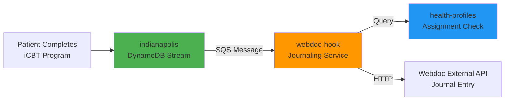
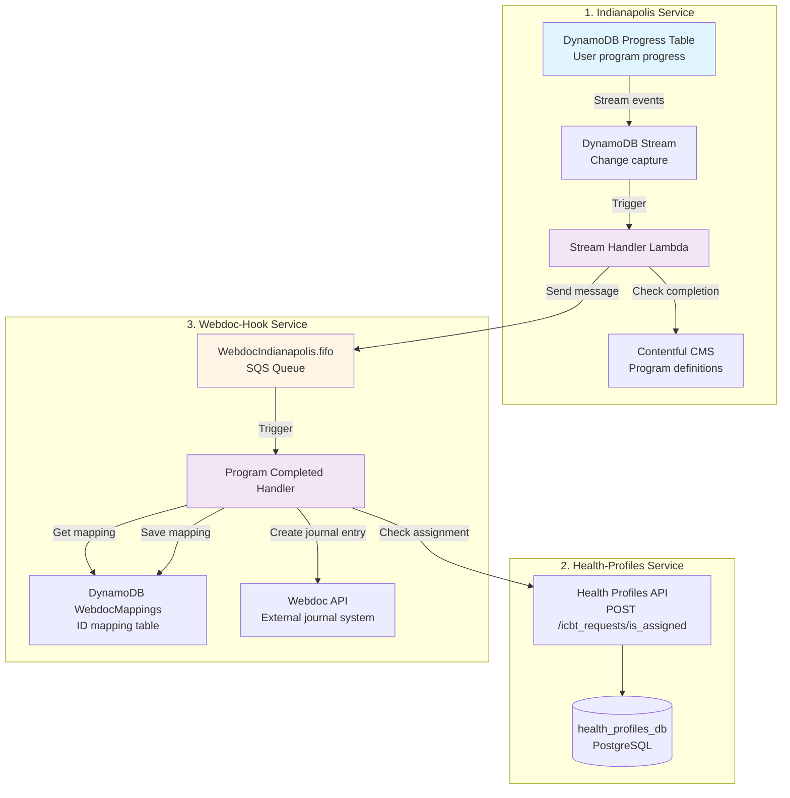
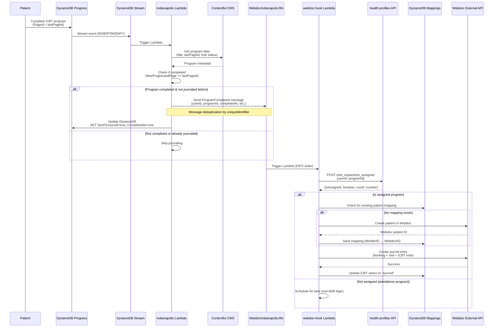
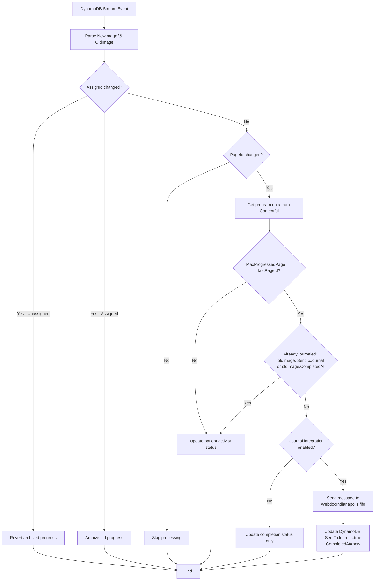
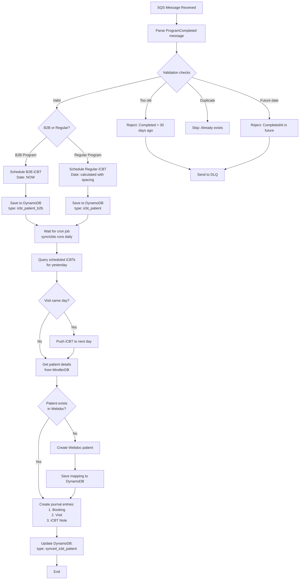
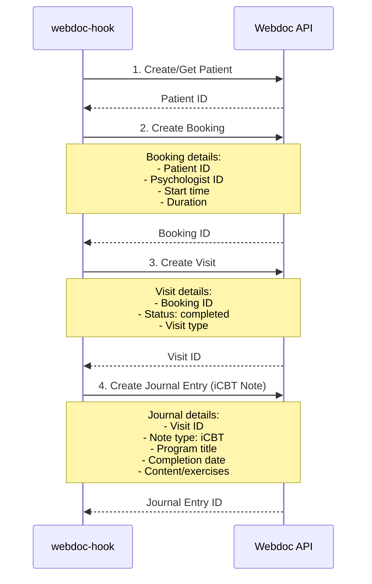
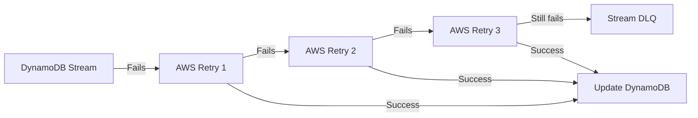
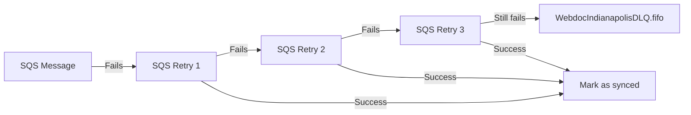

# iCBT Journaling Flow: Complete Architecture

> **Purpose**: How iCBT (Internet-based Cognitive Behavioral Therapy) program completions are journaled to Webdoc
> 
> **Services Involved**: indianapolis, health-profiles, webdoc-hook
> 
> **Last Updated**: 2025-01-06

---

## Overview

When a patient completes an iCBT program, it must be journaled to the external Webdoc system. This involves three microservices working together through event-driven architecture.



---

## Architecture: Three-Service Pattern



---

## Complete Flow: Step by Step



---

## Service 1: Indianapolis (Program Completion Detection)

### Purpose
Detect when patients complete iCBT programs and queue them for journaling.

### DynamoDB Progress Table Schema

```typescript
{
  PK: "USER#123",                    // Patient user ID
  SK: "PROGRAM#abc-def",             // Program ID or STANDALONE_PROGRAM#...
  ProgramId: "abc-def",              // Contentful program ID
  TreatmentId?: "treatment-123",     // Treatment ID (if not standalone)
  PageId: "page-xyz",                // Current page ID
  MaxProgressedPage: "page-xyz",     // Furthest page reached
  CountryCode: "SE",                 // Market
  CompanyName?: "Vitality",          // B2B company (if applicable)
  AssignId?: "assign-uuid",          // Assignment ID from health-profiles
  Completed: true,                   // Calculated: MaxProgressedPage == lastPageId
  CompletedAt?: "2025-01-06T10:30:00Z",  // When completed
  SentToJournal: true,               // Journaling status
  IsFree: false,                     // Should be reimbursed?
  IsStandalone: true,                // Standalone vs treatment program
  ContentLanguageUsed: "sv"          // Language used by patient
}
```

### DynamoDB Stream Handler Logic



### Program Completed Message Schema

```typescript
interface ProgramCompleted {
  uniqueIdentifier: string;  // "userId-programId" or "userId-programId-assignId"
  userId: number;
  programId: string;
  programTitle: string;      // From Contentful (Swedish)
  completedAt: Date;
  companyName?: string;      // B2B company name
  free: boolean;             // From treatment definition
  isAssigned: boolean;       // From health-profiles
  treatmentId: string;
  isStandalone: boolean;
}
```

---

## Service 2: Health-Profiles (Assignment Check)

### Purpose
Determine if the completed program was assigned by a psychologist (vs patient self-starting).

### API Endpoint

**POST** `/icbt_requests/is_assigned`

```typescript
// Request
{
  userId: string,
  programId: string
}

// Response
{
  data: {
    isAssigned: boolean,      // True if psychologist assigned this program
    hasResponseOrIsPending?: boolean,
    count: number             // Number of assignments
  }
}
```

### Database Query

```sql
SELECT COUNT(*) as count
FROM IcbtRequests
WHERE patientUserId = :userId
  AND programId = :programId
  AND status IN ('ASSIGNED', 'IN_PROGRESS')
```

**Logic**:
- `isAssigned = count > 0`
- Assigned programs → Reimbursable, must be journaled
- Non-assigned programs → Patient self-started, different billing

---

## Service 3: Webdoc-Hook (Journal Entry Creation)

### Purpose
Create journal entries in external Webdoc system when iCBT programs are completed.

### SQS Queue Configuration

**Queue Name**: `WebdocIndianapolis.fifo`
- **Type**: FIFO (ordered processing per patient)
- **Message Group ID**: `userId` (ensures order per patient)
- **Deduplication ID**: `uniqueIdentifier` (prevents duplicate journals)
- **DLQ**: `WebdocIndianapolisDLQ.fifo`

### Handler Flow



### DynamoDB Mappings Table

Stores mappings between Mindler IDs and Webdoc IDs.

```typescript
{
  typeId: "icbt#patient#123",           // PK: Composite key
  date: "2025-01-06T00:00:00.000Z",    // SK: Scheduling date
  type: "icbt_patient",                 // Status: icbt_patient, synced_icbt_patient
  exerciseName: "Program Title",        // Display name
  uniqueIdentifier?: "123-abc-def",     // Deduplication key
  companyName?: "Vitality",             // B2B company
  webdocPatientId?: "W12345",           // Webdoc patient ID (after sync)
  webdocBookingId?: "B67890",           // Webdoc booking ID (after sync)
  webdocVisitId?: "V11111"              // Webdoc visit ID (after sync)
}
```

**Type States**:
- `icbt_patient` / `icbt_patient_b2b` → Scheduled, pending sync
- `synced_icbt_patient` / `synced_icbt_patient_b2b` → Successfully journaled
- `deleted_icbt_patient` / `deleted_icbt_patient_b2b` → Deleted
- `synced_error_icbt_patient` → Failed to journal

### Scheduling Logic

**Regular iCBTs** (Non-B2B):
```typescript
// Minimum 7 days between iCBT journal entries per patient
const ICBT_SCHEDULING_INTERVAL = 7; // days

function getICBTSchedulingDate(lastScheduledICBT: Date | null): Date {
  if (!lastScheduledICBT) {
    return new Date(); // First iCBT, schedule immediately
  }
  
  const nextDate = new Date(
    lastScheduledICBT.getTime() + (7 * 24 * 60 * 60 * 1000)
  );
  
  // If calculated date is in the past, schedule today
  if (nextDate < new Date()) {
    return new Date();
  }
  
  // Don't schedule more than 14 days in the future
  const maxFutureDate = new Date(Date.now() + (14 * 24 * 60 * 60 * 1000));
  if (nextDate > maxFutureDate) {
    return new Date(lastScheduledICBT.getTime() + 1); // 1ms later for uniqueness
  }
  
  return nextDate;
}
```

**B2B iCBTs**:
- Always scheduled immediately (no spacing required)
- Journaled right away

### Collision Detection

```typescript
// If patient has a therapy session on the same day as scheduled iCBT,
// push iCBT journal entry to the next day
async function addOneDayIfCollidingVisit(
  icbtDate: Date, 
  lastVisitDate: Date | null
): Promise<Date> {
  if (!lastVisitDate) return icbtDate;
  
  const sameDay = 
    icbtDate.toDateString() === lastVisitDate.toDateString();
  
  if (sameDay) {
    // Push to next day to avoid same-day collision
    return new Date(icbtDate.getTime() + (24 * 60 * 60 * 1000));
  }
  
  return icbtDate;
}
```

### Webdoc API Integration



---

## Key Design Decisions

### 1. Why DynamoDB Stream in Indianapolis?

**Problem**: Need to detect program completion in real-time.

**Solution**: DynamoDB Streams provide change data capture.

**Benefit**:
- Immediate reaction to progress updates
- Decoupled from API layer
- Reliable event delivery

### 2. Why SQS Queue Between Services?

**Problem**: Indianapolis and webdoc-hook are independent services.

**Solution**: FIFO SQS queue for async communication.

**Benefits**:
- Decoupling (services don't call each other directly)
- Resilience (retries with DLQ)
- Ordering (FIFO ensures per-patient order)
- Deduplication (prevents duplicate journal entries)

### 3. Why Check health-profiles for Assignment?

**Problem**: Need to know if psychologist assigned the program.

**Solution**: Query health-profiles API during journaling.

**Reason**:
- Assigned programs are reimbursable
- Different billing logic for assigned vs self-started
- health-profiles owns the assignment data

### 4. Why Schedule iCBTs with Spacing?

**Problem**: Can't journal all completed programs immediately.

**Solution**: 7-day minimum spacing between iCBT journal entries.

**Reason**:
- Reimbursement rules (max frequency per patient)
- Avoid flooding Webdoc with entries
- Collision detection with therapy sessions

### 5. Why DynamoDB Mappings Table?

**Problem**: Need to track Mindler ID → Webdoc ID mappings.

**Solution**: Dedicated DynamoDB table for ID mapping.

**Benefits**:
- Persistent mapping storage
- Fast lookups during sync
- Idempotency (check if already synced)

---

## Error Handling & Retry Logic

### Indianapolis → SQS



**Retry Strategy**:
- Factor: 1.3
- Max retries: 10
- Min timeout: 5 seconds
- Max timeout: 30 seconds
- Total duration: ~5 minutes (lambda timeout)

### SQS → webdoc-hook



**Failure Scenarios**:
- Health-profiles API down → Retry with exponential backoff
- Webdoc API down → Retry, then DLQ
- Duplicate entry → Skip (idempotent)
- Too old (>30 days) → Reject to DLQ

---

## Monitoring & Observability

### Key Metrics

| Metric | Source | Purpose |
|--------|--------|---------|
| `scheduleICBTEvent` count | indianapolis | Programs queued for journaling |
| `scheduleB2BICBTEvent` count | indianapolis | B2B programs queued |
| `numScheduledIcbt` count | webdoc-hook | iCBTs scheduled in DynamoDB |
| `numSyncedIcbt` count | webdoc-hook | iCBTs successfully journaled |
| DLQ message count | CloudWatch | Failed messages requiring manual intervention |

### Log Patterns

```typescript
// Indianapolis
logger.debug("Send program completed with messagedata", { messageData });

// webdoc-hook
logger.info("Synced iCBTs", {
  bookingId: webdocIds.bookingId,
  visitId: webdocIds.visitId,
  patientUserId: patient.userId,
  typeId: icbts[0].typeId
});

// Errors
logger.error("Failed to sync iCBT", getErrorMessage(error), {
  typeId: icbts[0].typeId
});
```

---

## Testing

### Manual Testing (Development)

**1. Trigger program completion in indianapolis DynamoDB**:
```bash
# Update progress to completed
aws dynamodb update-item \
  --table-name Progress_indianapolis \
  --key '{"PK": {"S": "USER#123"}, "SK": {"S": "PROGRAM#abc-def"}}' \
  --update-expression "SET PageId = :lastPage, MaxProgressedPage = :lastPage" \
  --expression-attribute-values '{":lastPage": {"S": "page-final"}}'
```

**2. Send test message to webdoc-hook queue**:
```bash
aws sqs send-message \
  --queue-url http://localhost:9324/000000000000/WebdocIndianapolis.fifo \
  --message-group-id 123 \
  --message-deduplication-id test-123-abc \
  --message-body '{
    "userId": 123,
    "programId": "abc-def",
    "programTitle": "Test Program",
    "completedAt": "2025-01-06T10:00:00.000Z",
    "isAssigned": true,
    "free": false,
    "treatmentId": "treatment-123",
    "isStandalone": false,
    "uniqueIdentifier": "123-abc-def"
  }'
```

**3. Check DynamoDB mappings**:
```bash
aws dynamodb scan \
  --table-name WebdocMappings \
  --filter-expression "typeId = :typeId" \
  --expression-attribute-values '{":typeId": {"S": "icbt#patient#123"}}'
```

---

## Common Issues & Troubleshooting

### Issue: Program completed but not journaled

**Check**:
1. DynamoDB Progress table: `SentToJournal` field set to `true`?
2. SQS queue: Message in `WebdocIndianapolis.fifo` or DLQ?
3. CloudWatch Logs: Errors in indianapolis stream handler?

**Common causes**:
- Journal integration feature flag disabled
- Already journaled before (idempotent check)
- Program completed >30 days ago

### Issue: Duplicate journal entries

**Check**:
- `uniqueIdentifier` field should prevent duplicates
- DynamoDB mappings table for existing entry

**Fix**: SQS deduplication should prevent this, but if occurred:
```typescript
// Query for duplicates
const existing = await getIcbtByUniqueIdAndPatient(
  `icbt#patient#${userId}`,
  uniqueIdentifier
);
```

### Issue: iCBT not showing in Webdoc

**Check**:
1. DynamoDB mapping type: Should be `synced_icbt_patient` (not `icbt_patient`)
2. Webdoc API logs: Did journal entry creation succeed?
3. Patient mapping: Does Mindler patient ID map to Webdoc patient ID?

**Common causes**:
- Webdoc API authentication failure
- Patient not synced to Webdoc (SPAR sync issue)
- Incorrect psychologist ID

---

## Summary: Data Flow

```mermaid
graph TB
    A[Patient completes program<br/>in mobile/web app] --> B[DynamoDB Progress table updated<br/>PageId = lastPageId]
    B --> C[DynamoDB Stream event]
    C --> D[indianapolis Lambda triggered]
    D --> E{Program completed<br/>& not journaled?}
    E -->|No| Z[End]
    E -->|Yes| F[Query Contentful for<br/>program metadata]
    F --> G[Send message to<br/>WebdocIndianapolis.fifo SQS]
    G --> H[Update Progress table<br/>SentToJournal=true]
    H --> I[webdoc-hook Lambda triggered<br/>from SQS]
    I --> J[Query health-profiles<br/>Is assigned?]
    J --> K{Is assigned?}
    K -->|No| L[Schedule as<br/>non-assigned iCBT]
    K -->|Yes| M[Schedule iCBT with<br/>7-day spacing]
    L --> N[Daily cron job:<br/>syncIcbts]
    M --> N
    N --> O[Query DynamoDB for<br/>yesterday's scheduled iCBTs]
    O --> P[Check for visit collision]
    P --> Q{Same day as<br/>therapy session?}
    Q -->|Yes| R[Push to next day]
    Q -->|No| S[Get patient from MindlerDB]
    R --> S
    S --> T{Patient mapped<br/>in Webdoc?}
    T -->|No| U[Create Webdoc patient<br/>Save mapping]
    T -->|Yes| V[Create journal entries:<br/>Booking + Visit + Note]
    U --> V
    V --> W[Update DynamoDB:<br/>type=synced_icbt_patient]
    W --> X[Journal entry visible<br/>in Webdoc system]
    
    style B fill:#e1f5ff
    style G fill:#fff4e6
    style N fill:#f3e5f5
    style V fill:#c8e6c9
```



---

**Related Documentation**:
- [Service Communication Architecture](/docs/service-communication-architecture.md)
- [EventBridge Scheduler Guide](/docs/health-profiles-eventbridge-scheduler.md)
- [indianapolis Service README](/services/indianapolis/README.md)
- [webdoc-hook Service README](/services/webdoc-hook/README.md)
- [health-profiles Service README](/services/health-profiles/README.md)
