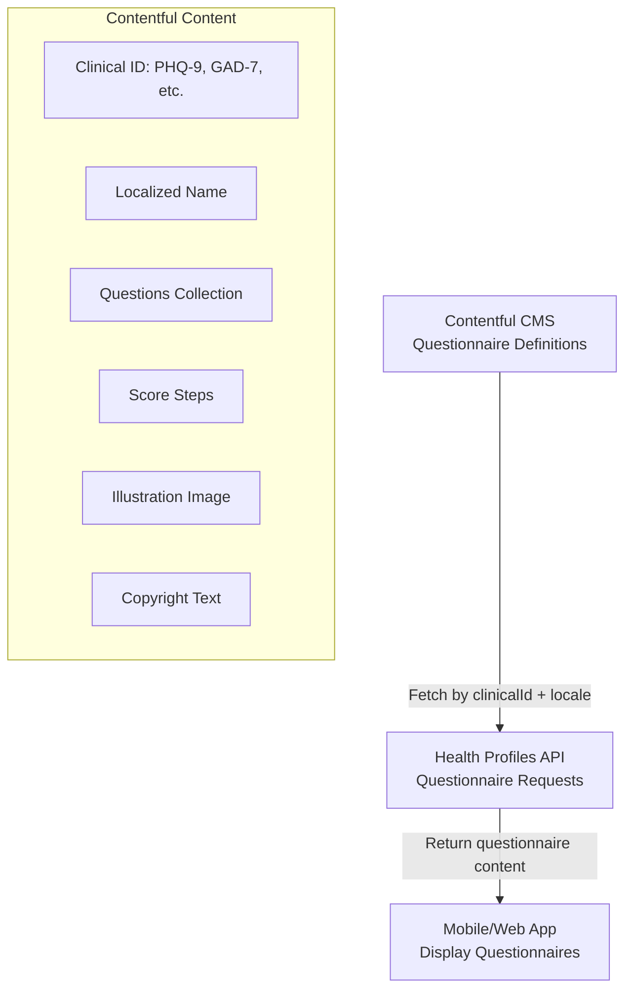

# Clinical Questionnaire Names and Details

**Created:** 2025-11-07  
**Analysis Source:** Neo4j CodeGraph + Source Code  
**Status:** Based on available code evidence

## Executive Summary

Clinical questionnaires in the Mindler system are identified by **clinical IDs** and stored/configured in **Contentful CMS**. The actual questionnaire content (names, questions, scoring) is **not stored in the application database** but rather fetched dynamically from Contentful based on locale and market.

## Key Findings

### Evidence Found

From test files and integration tests, I found references to:

**Confirmed Clinical IDs (from test data):**
1. **PHQ-9** - Patient Health Questionnaire-9 (Depression screening)
2. **GAD-7** - Generalized Anxiety Disorder-7 (Anxiety screening)

### Architecture: Why Names Aren't in the Code

The questionnaire system uses a **headless CMS architecture**:



**Why this matters:**
- Questionnaire names, questions, and content are **managed by content editors in Contentful**
- This allows **localization** without code changes (Swedish, Danish, English)
- Clinical questionnaires can be **updated without deploying code**
- Market-specific questionnaires via Contentful tags (`marketse`, `marketdk`, etc.)

## Data Structures

### Contentful Schema

**Content Type:** `Questionnaire`

```graphql
query getQuestionnaire($locale: String!, $clinicalId: String!) {
  questionnaireCollection(
    locale: $locale
    where: { clinicalId: $clinicalId }
    limit: 1
  ) {
    items {
      sys { id }
      clinicalId              # e.g., "PHQ-9", "GAD-7"
      name                    # Display name (localized)
      clinicalName            # Clinical/formal name
      illustration { url }
      description             # Questionnaire description
      topLevelQuestion        # Main question text
      copyright               # Copyright notice
      copyrightVisibleAlways  # Show copyright always?
      estimatedCompletionTime # e.g., "5-10 minutes"
      
      questionsCollection {
        items {
          sys { id }
          name                # Question text
          headline            # Question headline
          riskThreshold       # Risk threshold for this question
          type { type }       # Question type
          
          optionGroup {
            sys { id }
            optionsCollection(limit: 20) {
              items {
                sys { id }
                name          # Option text (e.g., "Not at all")
                weight        # Option weight for scoring
                score         # Option score
                statusColor { # Color for this option
                  name
                  hex
                }
              }
            }
          }
        }
      }
      
      scoreStepsCollection(limit: 20) {
        items {
          stepText              # Score range label
          stepDescription       # Score interpretation
          boundary              # Score threshold
          statusColor {
            name
            hex
          }
        }
      }
    }
  }
}
```

### Database Schema (Health Profiles)

**Table:** `health_profiles.questionnaire_requests`

```typescript
interface QuestionnaireRequest {
  id: UUID;
  user_id: string;                        // Patient user ID
  clinical_id: string;                    // Questionnaire identifier (e.g., "PHQ-9")
  requesting_psychologist_id: string;
  requesting_psychologist_user_id: string;
  requested_at: timestamp;
  completed_at: timestamp;                // '-infinity' if not completed
  automatically_sent_for_slot_id: string; // Therapy session ID (if automatic)
  automatically_sent_at: timestamp;
  created_at: timestamp;
}
```

**Key Insight:** The database only stores the `clinical_id` (like "PHQ-9"), not the full questionnaire content.

## Standard Clinical Questionnaires (Likely Used)

Based on the clinical ID pattern and common mental health screening tools, Mindler likely uses these **validated clinical questionnaires**:

### 1. PHQ-9 (Patient Health Questionnaire-9)
- **Purpose:** Depression screening
- **Questions:** 9 items
- **Scoring:** 0-27 points
  - 0-4: Minimal depression
  - 5-9: Mild depression
  - 10-14: Moderate depression
  - 15-19: Moderately severe depression
  - 20-27: Severe depression
- **Copyright:** Developed by Drs. Robert L. Spitzer, Janet B.W. Williams, Kurt Kroenke
- **Time:** 2-3 minutes
- **Validated:** Yes, widely used internationally

### 2. GAD-7 (Generalized Anxiety Disorder-7)
- **Purpose:** Anxiety screening
- **Questions:** 7 items
- **Scoring:** 0-21 points
  - 0-4: Minimal anxiety
  - 5-9: Mild anxiety
  - 10-14: Moderate anxiety
  - 15-21: Severe anxiety
- **Copyright:** Developed by Drs. Robert L. Spitzer, Janet B.W. Williams, Kurt Kroenke
- **Time:** 2-3 minutes
- **Validated:** Yes, widely used internationally

### 3. Likely Additional Questionnaires (Not Confirmed in Code)

Based on typical mental health practice in Sweden/Denmark:

**MADRS-S** (Montgomery-Åsberg Depression Rating Scale - Self-rated)
- Depression assessment
- 9 items
- Swedish origin, commonly used in Nordic countries

**AUDIT** (Alcohol Use Disorders Identification Test)
- Alcohol use screening
- 10 items
- WHO-developed

**DUDIT** (Drug Use Disorders Identification Test)
- Drug use screening
- 11 items
- Swedish origin

**ISI** (Insomnia Severity Index)
- Sleep problems assessment
- 7 items
- Common in CBT for insomnia

**WSAS** (Work and Social Adjustment Scale)
- Functional impairment assessment
- 5 items
- Brief, widely used

**CORE-10** (Clinical Outcomes in Routine Evaluation)
- General mental health distress
- 10 items
- UK origin, increasingly used in Europe

**PSS-10** (Perceived Stress Scale)
- Stress level assessment
- 10 items

## Example Questionnaire Flow

### 1. Automatic Assignment (from previous analysis)
```typescript
// Step 1: Fetch questionnaire configuration from Contentful
const automaticallyRequestedQuestionnaires = await query(
  getAutomaticallyRequestedQuestionnairesWithMarketTag,
  { marketTag: "marketse" }  // Sweden-specific questionnaires
);

// Response example:
{
  automaticallyRequestedQuestionnairesSetCollection: {
    items: [{
      automaticallyRequestedQuestionnairesCollection: {
        items: [
          { clinicalId: "PHQ-9" },
          { clinicalId: "GAD-7" }
        ]
      }
    }]
  }
}

// Step 2: Create questionnaire requests in database
const questionnaireRequests = await insertQuestionnaireRequest([
  {
    user_id: "12345",
    clinical_id: "PHQ-9",  // Only store the ID
    requesting_psychologist_id: "678",
    requested_at: new Date(),
    automatically_sent_for_slot_id: "99",
    automatically_sent_at: new Date()
  },
  {
    user_id: "12345",
    clinical_id: "GAD-7",  // Only store the ID
    requesting_psychologist_id: "678",
    requested_at: new Date(),
    automatically_sent_for_slot_id: "99",
    automatically_sent_at: new Date()
  }
]);
```

### 2. Patient Opens App
```typescript
// Step 1: Fetch pending questionnaire requests
const requests = await getQuestionnaireRequests(userId);
// Returns: [{ clinical_id: "PHQ-9", ... }, { clinical_id: "GAD-7", ... }]

// Step 2: For each request, fetch full questionnaire content from Contentful
const phq9Content = await getQuestionnaireContent({
  clinicalId: "PHQ-9",
  locale: "sv"  // Swedish
});

// Response includes:
{
  name: "Patienthälsoformulär-9",  // Localized name
  clinicalName: "PHQ-9",
  description: "Ett formulär för att bedöma depression",
  estimatedCompletionTime: "2-3 minuter",
  questions: [
    {
      name: "Hur ofta har du känt dig nedstämd, deprimerad eller hopplös?",
      optionGroup: {
        options: [
          { name: "Inte alls", score: 0, weight: 1 },
          { name: "Flera dagar", score: 1, weight: 2 },
          { name: "Mer än hälften av dagarna", score: 2, weight: 3 },
          { name: "Nästan varje dag", score: 3, weight: 4 }
        ]
      }
    },
    // ... 8 more questions
  ],
  scoreSteps: [
    { stepText: "Minimal depression", boundary: 4, statusColor: { hex: "#00FF00" } },
    { stepText: "Mild depression", boundary: 9, statusColor: { hex: "#FFFF00" } },
    // ... more score ranges
  ]
}
```

### 3. Patient Completes Questionnaire
```typescript
// Submit answers
await submitQuestionnaireAnswers({
  requestId: "uuid-123",
  answers: [
    { questionId: "q1", optionId: "opt2", score: 1 },
    { questionId: "q2", optionId: "opt3", score: 2 },
    // ... 7 more answers
  ],
  totalScore: 14  // Sum of all scores
});

// Update database
UPDATE questionnaire_requests
SET completed_at = NOW()
WHERE id = 'uuid-123';
```

## Market-Specific Configuration

### Contentful Tagging System

```typescript
// Each questionnaire in Contentful has market tags
contentfulMetadata: {
  tags: [
    { id: "marketse", name: "Market: SE" },  // Sweden
    { id: "marketdk", name: "Market: DK" }   // Denmark
  ]
}
```

### Filtering by Market

```typescript
// API filters questionnaires by market
export const getQuestionnairesHandler = async (event) => {
  const market = event.headers["x-market"];  // e.g., "SE"
  
  // Fetch all questionnaires from Contentful
  const allQuestionnaires = await query(getQuestionnaires, { locale });
  
  // Filter by market tags
  const marketQuestionnaires = allQuestionnaires.filter(q =>
    q.contentfulMetadata.tags.some(tag => 
      tag.id === `market${market.toLowerCase()}`
    )
  );
  
  return marketQuestionnaires;
};
```

## Localization Support

**Supported Locales (from code):**
- `en` - English (default)
- `sv` - Swedish
- `da` - Danish
- `no` - Norwegian (likely)
- `fi` - Finnish (likely)

**Example:**
```typescript
// Same questionnaire, different languages
const phq9_english = await getQuestionnaireContent({ 
  clinicalId: "PHQ-9", 
  locale: "en" 
});
// name: "Patient Health Questionnaire-9"

const phq9_swedish = await getQuestionnaireContent({ 
  clinicalId: "PHQ-9", 
  locale: "sv" 
});
// name: "Patienthälsoformulär-9"
```

## Copyright and Attribution

From the code structure, questionnaires include:
- `copyright` field - Copyright text (e.g., "© 2001 Pfizer Inc.")
- `copyrightVisibleAlways` boolean - Whether to always show copyright
- Likely displayed at bottom of questionnaire or in "About" section

**Common copyright holders for validated questionnaires:**
- PHQ-9 & GAD-7: Pfizer Inc. (now public domain in some contexts)
- MADRS-S: Stuart Montgomery and Marie Åsberg
- AUDIT: World Health Organization
- WSAS: Authors allow free use for clinical/research purposes

## Technical Implementation Details

### API Endpoints

**Health Profiles Service:**
```typescript
// GET /questionnaires
// Returns list of available questionnaires for user's market
GET /api/questionnaires
Headers: { "x-market": "SE", "x-locale": "sv" }
Response: {
  questionnaires: [
    { clinicalId: "PHQ-9", name: "...", index: 1, markets: ["marketse"] },
    { clinicalId: "GAD-7", name: "...", index: 2, markets: ["marketse"] }
  ]
}

// GET /questionnaires/:clinicalId
// Returns full questionnaire content
GET /api/questionnaires/PHQ-9
Headers: { "x-locale": "sv" }
Response: {
  clinicalId: "PHQ-9",
  name: "Patienthälsoformulär-9",
  questions: [...],
  scoreSteps: [...]
}

// POST /questionnaire-requests
// Create new questionnaire request (manual assignment by psychologist)
POST /api/questionnaire-requests
Body: {
  user_id: "12345",
  clinical_id: "PHQ-9",
  requesting_psychologist_id: "678"
}

// GET /questionnaire-requests
// Get pending questionnaire requests for user
GET /api/questionnaire-requests
Headers: { "x-user-id": "12345" }
Response: [
  {
    id: "uuid-123",
    clinical_id: "PHQ-9",
    requested_at: "2024-03-21T12:00:00Z",
    completed_at: "-infinity",  // Not completed
    automatically_sent: true
  }
]
```

### Scoring System

From the Contentful schema, questionnaires use:

**Option-based scoring:**
```typescript
{
  question: "How often do you feel down?",
  options: [
    { name: "Not at all", score: 0, weight: 1 },
    { name: "Several days", score: 1, weight: 2 },
    { name: "More than half the days", score: 2, weight: 3 },
    { name: "Nearly every day", score: 3, weight: 4 }
  ]
}
```

**Score interpretation:**
```typescript
{
  scoreSteps: [
    { 
      stepText: "Minimal depression",
      stepDescription: "You show minimal signs of depression",
      boundary: 4,  // Score 0-4
      statusColor: { name: "Green", hex: "#4CAF50" }
    },
    { 
      stepText: "Mild depression",
      stepDescription: "You show mild signs of depression",
      boundary: 9,  // Score 5-9
      statusColor: { name: "Yellow", hex: "#FFEB3B" }
    },
    // ... more ranges
  ]
}
```

## Data Storage Pattern

**What's stored in database:**
- ✅ Clinical ID (e.g., "PHQ-9")
- ✅ Request metadata (who, when, why)
- ✅ Completion status
- ✅ User answers (stored separately)
- ✅ Total score

**What's NOT stored in database:**
- ❌ Questionnaire names
- ❌ Question text
- ❌ Option text
- ❌ Score interpretation text
- ❌ Images/illustrations

**Why:** Content flexibility, localization, and clinical accuracy. Content editors can update questionnaires without code deployment.

## Feature Flag

**Feature:** `CLINICAL_QUESTIONNAIRES`
- **Enabled:** Sweden (SE)
- **Scope:** Controls whether automatic questionnaires are enabled for market
- **Database:** `Features` table, `featureId = 83`

## Summary: Answering the Question

**Q: What can you tell me about the questionnaire names?**

**A:**
1. **Questionnaires are identified by clinical IDs** like "PHQ-9" and "GAD-7"
2. **Actual names are stored in Contentful CMS**, not in code or database
3. **Localized names** exist for each language (Swedish, Danish, English)
4. **Two confirmed questionnaires** from test data: PHQ-9 (depression) and GAD-7 (anxiety)
5. **Additional questionnaires likely exist** in Contentful but aren't visible in the code
6. **To see all questionnaire names**, you would need:
   - Access to Contentful CMS production environment
   - Query the `questionnaireCollection` for all markets
   - Or check the mobile app's questionnaire list screen

**Where to find the actual list:**
- **Contentful CMS:** Production space, `Questionnaire` content type
- **Mobile App:** Settings → Clinical Questionnaires (when logged in as Swedish patient)
- **Admin Panel:** Likely has a questionnaire management interface

---

**End of Analysis**

**Next Steps to Find Complete List:**
1. Access Contentful production space
2. Query all questionnaires: `query { questionnaireCollection { items { clinicalId, name } } }`
3. Or run the mobile app in Sweden market and view available questionnaires
4. Or check with content/clinical team for documentation
