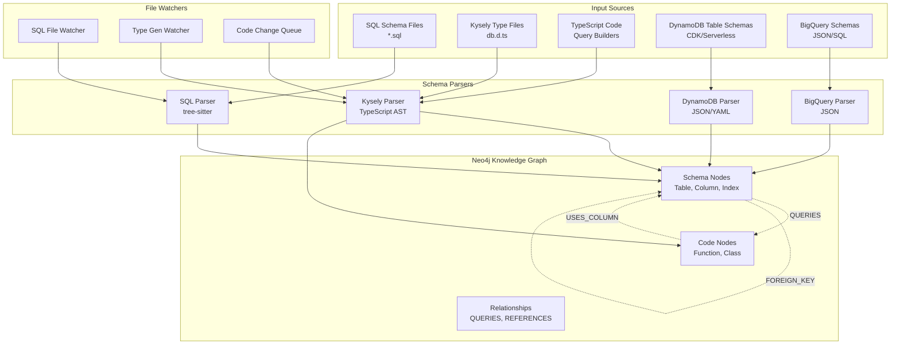
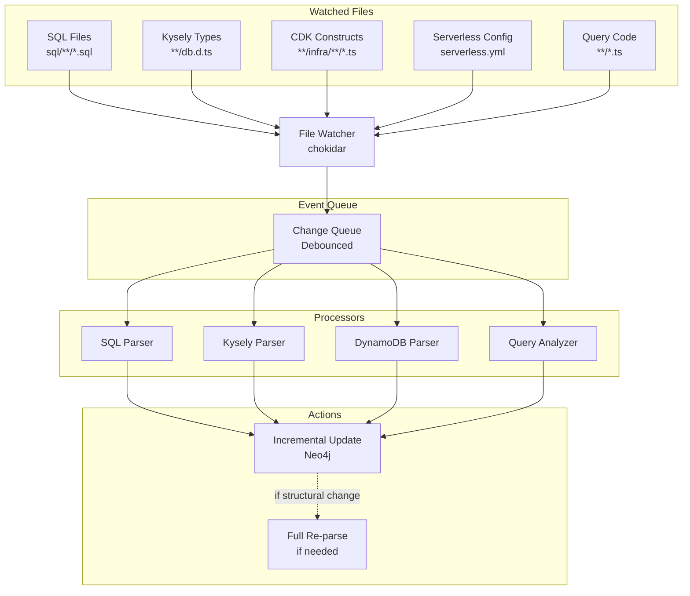

# SQL Integration Plan for CodeGraph

**Created:** 2025-11-07  
**Status:** Planning Phase  
**Version:** 1.0

## Executive Summary

This document outlines a comprehensive plan to integrate SQL database schema analysis into CodeGraph, connecting it with TypeScript query builders (Kysely, Knex) and supporting multiple database systems (MySQL, PostgreSQL, DynamoDB, BigQuery) with live schema change detection via file watchers.

## Table of Contents

1. [Current State Analysis](#current-state-analysis)
2. [Goals and Requirements](#goals-and-requirements)
3. [Architecture Design](#architecture-design)
4. [Database Support Matrix](#database-support-matrix)
5. [Query Builder Integration](#query-builder-integration)
6. [File Watcher Integration](#file-watcher-integration)
7. [Implementation Phases](#implementation-phases)
8. [Neo4j Schema Design](#neo4j-schema-design)
9. [Technical Challenges](#technical-challenges)
10. [Success Metrics](#success-metrics)

---

## Current State Analysis

### What Exists

#### 1. **SQL Parser (Disabled)**
- **Location:** `src/analyzer/parsers/sql-parser.ts`
- **Status:** ✅ Implemented but **temporarily disabled** in `parser.ts:16`
- **Technology:** Tree-sitter for SQL parsing
- **Capabilities:**
  - Parses `CREATE TABLE` statements → extracts tables and columns
  - Parses `CREATE VIEW` statements → extracts views
  - Parses DML statements (SELECT, INSERT, UPDATE, DELETE)
  - Generates Neo4j nodes: `SQLTable`, `SQLColumn`, `SQLView`, `SQLStatement`
  - Generates Neo4j relationships: `DEFINES_TABLE`, `HAS_COLUMN`, `DEFINES_VIEW`

**Key Code Pattern:**
```typescript
const tableNode: SQLTableNode = {
  entityId: generateEntityId('sqltable', qualifiedName),
  kind: 'SQLTable',
  name: simpleTableName,
  properties: { qualifiedName, schema: schemaName }
};
```

#### 2. **SQL Schema File**
- **Location:** `sql/mindler_paynbook_api_20251107.sql`
- **Size:** 1,515 lines
- **Type:** MySQL dump (mysqldump 8.0.43)
- **Database:** `mindler_paynbook_api`
- **Content:**
  - 50+ tables with full schema definitions
  - Foreign key constraints (REFERENCES)
  - Indexes and keys
  - Example tables: `AgreementUrls`, `Agreements`, `Answers`, `Patients`, `Slots`, etc.

**Example Table:**
```sql
CREATE TABLE `AgreementUrls` (
  `agreementUrlId` int NOT NULL AUTO_INCREMENT,
  `agreementId` int NOT NULL,
  `languageId` int NOT NULL,
  `url` varchar(255) COLLATE utf8mb3_unicode_ci NOT NULL,
  PRIMARY KEY (`agreementUrlId`),
  KEY `agreementId` (`agreementId`),
  KEY `languageId` (`languageId`),
  CONSTRAINT `AgreementUrls_ibfk_1` FOREIGN KEY (`agreementId`) 
    REFERENCES `Agreements` (`agreementId`) ON DELETE RESTRICT
) ENGINE=InnoDB;
```

#### 3. **Kysely Usage (Heavy)**
- **Location:** `monorepo-3.0/shared/mindlerDb/`
- **Status:** ✅ **Active and primary query builder**
- **Type-Safety:** Full TypeScript types auto-generated via `kysely-codegen`
  - Generated types: `shared/mindlerDb/kysely/db.d.ts` (50+ table interfaces)
- **Usage Pattern:**
  ```typescript
  // shared/mindlerDb/queries/patient.ts
  const result = await mindlerDb<PatientModel>(patient.table)
    .innerJoin<UserModel>(user.joinAlias, user.p("userId"), patient.p("userId"))
    .select(
      patient.ref(mindlerDb, "patientId"),
      patient.ref(mindlerDb, "phoneNumber"),
      user.ref(mindlerDb, "userId")
    )
    .where(patient.p("userId"), patientUserId)
    .first();
  ```

**Key Insight:** Kysely types are **generated from the live database schema**, providing the ground truth for table/column structure.

#### 4. **Knex Usage (Legacy)**
- **Status:** ⚠️ **Mostly legacy**, used in older services
- **Primary Use:** Database migrations in health-profiles service
- **Example:** `services/health-profiles/infra/db/migrations/20220905064437_enable_pgaudit_extension.ts`

#### 5. **DynamoDB Usage (Extensive)**
- **Occurrences:** 1,098 matches across 202 files
- **Services Using DynamoDB:**
  - `indianapolis` - iCBT progress tracking
  - `webdoc-hook` - Visit and exercise data
  - `bankid` - Authentication sessions
  - `spar` - SPAR data caching
  - `passkey-auth` - Passkey authentication
  - `pseudonymizer` - Pseudonym mapping
  - `invoicing` - Invoice data
  - `consentry` - Consent events
  - `miami` - Messaging system
  - `event-emitter` - Event processing
  - Many more...

**Pattern:** DynamoDB is the **primary NoSQL database** for event-driven and high-throughput services.

#### 6. **BigQuery Usage (Analytics)**
- **Services:**
  - `pseudo-sync` - Syncs pseudonymized data to BigQuery
  - `event-loki` - Event analytics
  - `health-profiles` - Health metrics
  - `gcp-backup` - Data backup to GCP
- **Purpose:** Analytics, data warehouse, compliance reporting

---

## Goals and Requirements

### Primary Goals

1. **Enable SQL Schema Analysis**
   - Parse SQL DDL files (CREATE TABLE, CREATE VIEW, etc.)
   - Extract database schema structure into Neo4j graph
   - Track relationships between tables (foreign keys, references)

2. **Connect Code to Schema**
   - Link TypeScript query builders (Kysely, Knex) to database schema
   - Trace SQL queries to their table/column dependencies
   - Identify which code files access which database entities

3. **Multi-Database Support**
   - MySQL (primary relational DB)
   - PostgreSQL (health-profiles service)
   - DynamoDB (NoSQL, event-driven services)
   - BigQuery (analytics warehouse)

4. **Live Schema Change Detection**
   - Watch SQL schema files for changes
   - Re-parse and update graph automatically
   - Detect schema drift (code vs database)

### Non-Goals (Out of Scope)

- ❌ Database connection/querying at runtime
- ❌ Data migration generation
- ❌ SQL query optimization suggestions
- ❌ Database performance monitoring

---

## Architecture Design

### High-Level Architecture



### Component Breakdown

#### 1. **Schema Parser Layer**

**SQL Parser (MySQL/PostgreSQL)**
- Input: `*.sql` files (DDL statements)
- Technology: `tree-sitter-sql`
- Output: Nodes (`SQLTable`, `SQLColumn`, `SQLView`, `SQLIndex`, `SQLConstraint`)
- Status: ✅ Implemented, needs activation

**Kysely Type Parser**
- Input: `db.d.ts` (Kysely generated types)
- Technology: `ts-morph` (TypeScript AST)
- Output: Enrich existing `SQLTable`/`SQLColumn` nodes with TypeScript type information
- Status: 🆕 New component

**DynamoDB Schema Parser**
- Input: CDK constructs (`new Table(...)`), Serverless YAML
- Technology: Custom parser + YAML parser
- Output: Nodes (`DynamoTable`, `DynamoAttribute`, `DynamoGSI`, `DynamoLSI`)
- Status: 🆕 New component

**BigQuery Schema Parser**
- Input: BigQuery table schemas (JSON API response or SQL DDL)
- Technology: JSON parser or `tree-sitter-sql`
- Output: Nodes (`BQTable`, `BQColumn`, `BQView`)
- Status: 🆕 New component

#### 2. **Query Builder Integration Layer**

**Kysely Query Analyzer**
- Input: TypeScript files using Kysely
- Logic:
  1. Find all Kysely query chains (`.select()`, `.where()`, `.join()`, etc.)
  2. Extract table names from generic types: `mindlerDb<PatientModel>`
  3. Extract column references: `.select(patient.ref(db, "patientId"))`
  4. Create relationships: `Function` → `QUERIES` → `SQLTable`
- Status: 🆕 New component

**Knex Query Analyzer**
- Input: TypeScript files using Knex
- Logic: Similar to Kysely, extract `.table()`, `.select()`, `.where()` calls
- Status: 🆕 New component

**DynamoDB Query Analyzer**
- Input: TypeScript files using AWS SDK DynamoDB
- Logic:
  1. Find `DocumentClient` calls (`.get()`, `.query()`, `.put()`, etc.)
  2. Extract `TableName` parameter
  3. Extract key/attribute references
  4. Create relationships: `Function` → `QUERIES` → `DynamoTable`
- Status: 🆕 New component

#### 3. **File Watcher Integration**

**SQL Schema Watcher**
- Watch: `sql/**/*.sql`
- Trigger: Re-run SQL parser on file change
- Action: Update Neo4j graph with new schema

**Kysely Type Watcher**
- Watch: `**/kysely/db.d.ts` or `**/generated-types.ts`
- Trigger: Re-run Kysely type parser
- Action: Enrich schema nodes with updated types

**DynamoDB Schema Watcher**
- Watch: `**/infra/**/*.ts`, `serverless.yml`
- Trigger: Re-parse DynamoDB table definitions
- Action: Update DynamoDB schema nodes

**Code Query Watcher**
- Watch: All TypeScript files
- Trigger: Re-analyze query builder usage
- Action: Update `QUERIES` relationships

---

## Database Support Matrix

| Database | Type | Primary Use Case | Parser | Query Analyzer | Priority |
|----------|------|------------------|--------|----------------|----------|
| **MySQL** | Relational | Main application DB (`mindler_paynbook_api`) | ✅ tree-sitter-sql | Kysely | 🔴 P0 |
| **PostgreSQL** | Relational | Health profiles service | ✅ tree-sitter-sql | Knex | 🟡 P1 |
| **DynamoDB** | NoSQL (Key-Value) | Event-driven services, high-throughput | 🆕 CDK/Serverless parser | AWS SDK | 🔴 P0 |
| **BigQuery** | Data Warehouse | Analytics, compliance | 🆕 JSON/SQL parser | `@google-cloud/bigquery` | 🟢 P2 |

### MySQL Support (P0)

**Schema Source:** `sql/mindler_paynbook_api_20251107.sql` (1,515 lines)  
**Query Builder:** Kysely (primary)  
**Services:** 15+ services in monorepo-3.0

**Implementation:**
1. Activate existing SQL parser
2. Parse foreign keys → `FOREIGN_KEY` relationships
3. Parse indexes → `SQLIndex` nodes
4. Analyze Kysely queries → `QUERIES` relationships

### PostgreSQL Support (P1)

**Schema Source:** Knex migrations in `services/health-profiles/infra/db/migrations/`  
**Query Builder:** Knex (legacy)  
**Services:** health-profiles

**Implementation:**
1. Reuse SQL parser (PostgreSQL syntax similar to MySQL)
2. Parse Knex migration files as SQL DDL
3. Analyze Knex queries → `QUERIES` relationships

### DynamoDB Support (P0)

**Schema Source:** 
- CDK constructs: `new Table({ tableName, partitionKey, sortKey, ... })`
- Serverless YAML: `resources.Resources.TableName.Type: AWS::DynamoDB::Table`

**Services:** 20+ services (indianapolis, webdoc-hook, bankid, spar, etc.)

**Implementation:**
1. Parse CDK `Table` constructs → extract schema
2. Parse Serverless YAML → extract table definitions
3. Create nodes: `DynamoTable`, `DynamoAttribute`, `DynamoGSI`, `DynamoLSI`
4. Analyze AWS SDK calls → `QUERIES` relationships

**Example CDK Table:**
```typescript
// services/indianapolis/infra/services/dynamodb.ts
new Table(this, 'ProgressTable', {
  tableName: 'icbt-progress',
  partitionKey: { name: 'PK', type: AttributeType.STRING },
  sortKey: { name: 'SK', type: AttributeType.STRING },
  stream: StreamViewType.NEW_AND_OLD_IMAGES,
});
```

**Neo4j Nodes:**
```cypher
(:DynamoTable {
  name: "icbt-progress",
  partitionKey: "PK",
  sortKey: "SK",
  stream: "NEW_AND_OLD_IMAGES"
})
  -[:HAS_ATTRIBUTE]-> (:DynamoAttribute { name: "PK", type: "STRING" })
  -[:HAS_ATTRIBUTE]-> (:DynamoAttribute { name: "SK", type: "STRING" })
```

### BigQuery Support (P2)

**Schema Source:** BigQuery API (JSON schema export)  
**Query Builder:** `@google-cloud/bigquery`  
**Services:** pseudo-sync, event-loki, health-profiles

**Implementation:**
1. Fetch schema from BigQuery API (or parse SQL DDL)
2. Create nodes: `BQTable`, `BQColumn`, `BQView`
3. Analyze BigQuery client calls → `QUERIES` relationships

---

## Query Builder Integration

### Kysely Integration (P0)

**Goal:** Link Kysely queries to MySQL/PostgreSQL tables and columns in the graph.

#### Analysis Strategy

1. **Find Kysely Query Chains**
   ```typescript
   // Detect this pattern:
   mindlerDb<PatientModel>(patient.table)
     .innerJoin<UserModel>(...)
     .select(patient.ref(db, "patientId"))
     .where(patient.p("userId"), patientUserId)
   ```

2. **Extract Table References**
   - Generic type: `mindlerDb<PatientModel>` → table name from type
   - Join calls: `.innerJoin<UserModel>(...)` → joined table
   - Table helper: `patient.table` → direct table reference

3. **Extract Column References**
   - `.select(patient.ref(db, "patientId"))` → column `patientId` on table `Patients`
   - `.where(patient.p("userId"), ...)` → column `userId` on table `Patients`

4. **Create Relationships**
   ```cypher
   (:Function { name: "getPatient" })
     -[:QUERIES { operation: "SELECT" }]-> (:SQLTable { name: "Patients" })
   
   (:Function { name: "getPatient" })
     -[:USES_COLUMN]-> (:SQLColumn { name: "patientId", table: "Patients" })
   ```

#### Implementation Approach

**Parser:** `src/analyzer/parsers/kysely-parser.ts` (new)

```typescript
export class KyselyQueryAnalyzer {
  analyze(sourceFile: SourceFile): KyselyQuery[] {
    const queries: KyselyQuery[] = [];
    
    // Find all mindlerDb calls
    sourceFile.getDescendantsOfKind(SyntaxKind.CallExpression)
      .filter(call => call.getExpression().getText().includes('mindlerDb'))
      .forEach(call => {
        const query = this.analyzeKyselyChain(call);
        queries.push(query);
      });
    
    return queries;
  }
  
  private analyzeKyselyChain(call: CallExpression): KyselyQuery {
    // Extract table from generic type
    const typeArgs = call.getTypeArguments();
    const tableName = this.extractTableName(typeArgs[0]);
    
    // Walk the method chain
    let current = call.getParent();
    const operations: Operation[] = [];
    
    while (current?.isKind(SyntaxKind.CallExpression)) {
      const method = current.getExpression().getText();
      
      if (method === 'select') {
        operations.push(this.analyzeSelect(current));
      } else if (method === 'where') {
        operations.push(this.analyzeWhere(current));
      } else if (method === 'innerJoin') {
        operations.push(this.analyzeJoin(current));
      }
      
      current = current.getParent();
    }
    
    return { tableName, operations };
  }
}
```

### Knex Integration (P1)

Similar approach to Kysely, but detect Knex patterns:

```typescript
// Detect this pattern:
knex('Patients')
  .select('patientId', 'userId')
  .where({ userId: patientUserId })
```

### DynamoDB Integration (P0)

**Goal:** Link AWS SDK DynamoDB calls to DynamoDB tables in the graph.

#### Analysis Strategy

1. **Find DocumentClient Calls**
   ```typescript
   // Detect these patterns:
   documentClient.get({ TableName: 'icbt-progress', Key: { PK, SK } })
   documentClient.query({ TableName: 'icbt-progress', KeyConditionExpression: '...' })
   documentClient.put({ TableName: 'icbt-progress', Item: { ... } })
   ```

2. **Extract Table Name**
   - From `TableName` parameter in call

3. **Extract Operation**
   - Method name: `.get()`, `.query()`, `.put()`, `.update()`, `.delete()`

4. **Extract Key/Attribute References**
   - `Key: { PK: userId, SK: programId }` → attributes `PK`, `SK`
   - `KeyConditionExpression: 'PK = :pk'` → attribute `PK`
   - `UpdateExpression: 'SET #attr = :val'` → attribute from `ExpressionAttributeNames`

5. **Create Relationships**
   ```cypher
   (:Function { name: "getIcbtProgress" })
     -[:QUERIES { operation: "GET", tableName: "icbt-progress" }]-> (:DynamoTable { name: "icbt-progress" })
   
   (:Function { name: "getIcbtProgress" })
     -[:USES_ATTRIBUTE]-> (:DynamoAttribute { name: "PK", table: "icbt-progress" })
   ```

---

## File Watcher Integration

### Goal

Automatically detect and process schema changes without manual re-scanning, using the same file watcher architecture being planned for CodeGraph.

### Architecture



### File Patterns to Watch

| Pattern | Purpose | Parser | Update Strategy |
|---------|---------|--------|-----------------|
| `sql/**/*.sql` | MySQL schema | SQL Parser | Incremental (diff tables) |
| `**/kysely/db.d.ts` | Kysely types | Kysely Type Parser | Full re-parse (fast) |
| `**/infra/**/dynamodb.ts` | DynamoDB CDK | DynamoDB Parser | Incremental |
| `**/serverless.yml` | DynamoDB Serverless | YAML Parser | Incremental |
| `**/*.ts` (all code) | Query usage | Query Analyzer | Incremental (per file) |

### Debouncing Strategy

**Problem:** Schema changes often come in batches (e.g., multiple migration files)

**Solution:** Debounce events with 2-second window

```typescript
// src/watcher/schema-watcher.ts
export class SchemaWatcher {
  private changeQueue = new Map<string, FileChange>();
  private debounceTimer: NodeJS.Timeout | null = null;
  
  onFileChange(filePath: string, eventType: 'add' | 'change' | 'unlink') {
    // Add to queue
    this.changeQueue.set(filePath, { filePath, eventType, timestamp: Date.now() });
    
    // Reset debounce timer
    if (this.debounceTimer) clearTimeout(this.debounceTimer);
    
    // Process after 2 seconds of silence
    this.debounceTimer = setTimeout(() => {
      this.processChangeQueue();
    }, 2000);
  }
  
  private async processChangeQueue() {
    const changes = Array.from(this.changeQueue.values());
    this.changeQueue.clear();
    
    // Group by file type
    const sqlChanges = changes.filter(c => c.filePath.endsWith('.sql'));
    const kyselyChanges = changes.filter(c => c.filePath.includes('db.d.ts'));
    const ddbChanges = changes.filter(c => 
      c.filePath.includes('infra') || c.filePath.includes('serverless.yml')
    );
    
    // Process each group
    if (sqlChanges.length > 0) await this.sqlParser.parse(sqlChanges);
    if (kyselyChanges.length > 0) await this.kyselyParser.parse(kyselyChanges);
    if (ddbChanges.length > 0) await this.ddbParser.parse(ddbChanges);
  }
}
```

### Incremental Update Strategy

**Goal:** Minimize Neo4j writes by only updating changed schema elements.

**Approach:**

1. **Detect Changes**
   - Compare new parsed schema with existing Neo4j nodes
   - Use `entityId` for matching

2. **Delta Operations**
   ```typescript
   interface SchemaDelta {
     added: AstNode[];      // New tables/columns
     modified: AstNode[];   // Changed tables/columns
     removed: string[];     // Deleted entityIds
   }
   ```

3. **Neo4j Updates**
   ```cypher
   // Add new nodes
   UNWIND $added AS node
   CREATE (n:SQLTable {entityId: node.entityId, ...})
   
   // Update modified nodes
   UNWIND $modified AS node
   MATCH (n {entityId: node.entityId})
   SET n += node.properties
   
   // Delete removed nodes
   UNWIND $removed AS entityId
   MATCH (n {entityId: entityId})
   DETACH DELETE n
   ```

4. **Cascading Updates**
   - If table schema changes, re-analyze all queries using that table
   - Update `QUERIES` relationships if column references changed

---

## Implementation Phases

### Phase 1: Activate MySQL Support (Week 1)

**Goal:** Get SQL parser working with existing MySQL schema.

**Tasks:**
1. ✅ Un-comment SQL parser in `parser.ts:16`
2. ✅ Test SQL parser with `sql/mindler_paynbook_api_20251107.sql`
3. 🆕 Enhance SQL parser to extract foreign keys
   - Parse `CONSTRAINT ... FOREIGN KEY ... REFERENCES ...`
   - Create `FOREIGN_KEY` relationships in Neo4j
4. 🆕 Add index extraction
   - Parse `KEY`, `UNIQUE KEY`, `PRIMARY KEY`
   - Create `SQLIndex` nodes
5. 🆕 Verify Neo4j schema creation
   - Run analyzer on SQL file
   - Query Neo4j to verify nodes/relationships

**Acceptance Criteria:**
- SQL parser runs without errors
- All 50+ tables from `mindler_paynbook_api_20251107.sql` are in Neo4j
- Foreign key relationships are correctly linked
- Indexes are captured as separate nodes

**Time Estimate:** 2-3 days

---

### Phase 2: Kysely Query Integration (Week 1-2)

**Goal:** Connect TypeScript code to MySQL schema via Kysely.

**Tasks:**
1. 🆕 Create `KyselyQueryAnalyzer` class
   - Detect `mindlerDb<T>()` calls
   - Extract table names from generic types
   - Walk method chains (`.select()`, `.where()`, `.join()`)
2. 🆕 Extract column references
   - Parse `.select(patient.ref(db, "patientId"))`
   - Parse `.where(patient.p("userId"), value)`
3. 🆕 Create `QUERIES` relationships
   - Link `Function` → `SQLTable`
   - Link `Function` → `SQLColumn`
4. 🆕 Test with real monorepo code
   - Analyze `shared/mindlerDb/queries/patient.ts`
   - Verify relationships in Neo4j

**Acceptance Criteria:**
- All Kysely queries in `shared/mindlerDb/queries/` are analyzed
- `QUERIES` relationships exist between functions and tables
- Can query: "Which functions query the Patients table?"

**Time Estimate:** 3-4 days

---

### Phase 3: DynamoDB Schema Extraction (Week 2)

**Goal:** Extract DynamoDB table schemas from CDK and Serverless configs.

**Tasks:**
1. 🆕 Create `DynamoSchemaParser` class
   - Parse CDK `Table` constructs
   - Parse Serverless YAML `resources.Resources`
2. 🆕 Extract table metadata
   - Table name, partition key, sort key
   - GSIs, LSIs
   - Stream configuration
3. 🆕 Create Neo4j nodes
   - `DynamoTable`, `DynamoAttribute`, `DynamoGSI`, `DynamoLSI`
4. 🆕 Test with indianapolis service
   - Parse `services/indianapolis/infra/services/dynamodb.ts`
   - Verify nodes in Neo4j

**Acceptance Criteria:**
- All DynamoDB tables in monorepo are extracted
- Table schemas match CDK/Serverless definitions
- Can query: "Show all DynamoDB tables with streams enabled"

**Time Estimate:** 3-4 days

---

### Phase 4: DynamoDB Query Integration (Week 3)

**Goal:** Link AWS SDK DynamoDB calls to table schemas.

**Tasks:**
1. 🆕 Create `DynamoQueryAnalyzer` class
   - Detect `DocumentClient` calls
   - Extract `TableName` parameter
   - Extract operation type (get, query, put, etc.)
2. 🆕 Extract attribute references
   - Parse `Key: { PK, SK }`
   - Parse `KeyConditionExpression`
   - Parse `UpdateExpression`
3. 🆕 Create `QUERIES` relationships
   - Link `Function` → `DynamoTable`
   - Link `Function` → `DynamoAttribute`
4. 🆕 Test with indianapolis DynamoDB streams
   - Analyze `services/indianapolis/src/lambdas/dynamoStream/index.ts`
   - Verify relationships

**Acceptance Criteria:**
- All DynamoDB queries in indianapolis are analyzed
- Can query: "Which functions write to icbt-progress table?"
- Can query: "Which attributes are read from icbt-progress?"

**Time Estimate:** 3-4 days

---

### Phase 5: File Watcher Integration (Week 4)

**Goal:** Automatically detect and process schema changes.

**Tasks:**
1. 🆕 Implement `SchemaWatcher` class
   - Watch `sql/**/*.sql`
   - Watch `**/db.d.ts`
   - Watch `**/infra/**/*.ts` and `serverless.yml`
2. 🆕 Implement debounced change queue
   - 2-second debounce window
   - Group changes by file type
3. 🆕 Implement incremental update logic
   - Detect added/modified/removed nodes
   - Update Neo4j with delta operations
4. 🆕 Implement cascading updates
   - Re-analyze queries if table schema changes
5. 🆕 Test full workflow
   - Modify SQL schema file
   - Verify automatic re-parse
   - Verify Neo4j is updated

**Acceptance Criteria:**
- Modifying a SQL file triggers automatic re-parse
- Neo4j is updated within 3 seconds of file change
- No manual re-scan needed
- Incremental updates are faster than full re-parse

**Time Estimate:** 4-5 days

---

### Phase 6: PostgreSQL Support (Week 5)

**Goal:** Support PostgreSQL schemas (health-profiles service).

**Tasks:**
1. 🆕 Test SQL parser with PostgreSQL syntax
   - Parse health-profiles Knex migrations
   - Handle PostgreSQL-specific syntax (extensions, arrays, JSON)
2. 🆕 Create `KnexQueryAnalyzer` class
   - Detect `knex('table')` calls
   - Extract table and column references
3. 🆕 Test with health-profiles service
   - Analyze query usage in health-profiles
   - Verify Neo4j relationships

**Acceptance Criteria:**
- PostgreSQL schemas from health-profiles are in Neo4j
- Knex queries are analyzed and linked to schema
- Can query: "Which functions query the icbt_requests table?"

**Time Estimate:** 2-3 days

---

### Phase 7: BigQuery Support (Week 6)

**Goal:** Support BigQuery schemas (analytics services).

**Tasks:**
1. 🆕 Create `BigQuerySchemaParser` class
   - Fetch schema from BigQuery API
   - Parse JSON schema
2. 🆕 Create `BigQueryQueryAnalyzer` class
   - Detect `@google-cloud/bigquery` usage
   - Extract table references
3. 🆕 Test with pseudo-sync service
   - Analyze BigQuery usage
   - Verify Neo4j relationships

**Acceptance Criteria:**
- BigQuery tables are in Neo4j
- BigQuery queries are analyzed
- Can query: "Which functions write to BigQuery?"

**Time Estimate:** 3-4 days

---

### Phase 8: Schema Drift Detection (Week 7)

**Goal:** Detect mismatches between code and database schema.

**Tasks:**
1. 🆕 Implement schema comparison
   - Compare Kysely types vs. SQL schema
   - Compare DynamoDB CDK vs. actual table schema (optional)
2. 🆕 Generate drift report
   - Tables in code but not in schema
   - Columns in code but not in schema
   - Type mismatches
3. 🆕 Create CLI command
   - `codegraph schema:drift`
   - Output drift report

**Acceptance Criteria:**
- Can detect when code queries non-existent table
- Can detect when code queries non-existent column
- Drift report is actionable

**Time Estimate:** 3-4 days

---

## Neo4j Schema Design

### Node Types

#### SQL Nodes (MySQL/PostgreSQL)

```cypher
(:SQLTable {
  entityId: string,           // "sqltable:mindler_paynbook_api.Patients"
  kind: "SQLTable",
  name: string,               // "Patients"
  qualifiedName: string,      // "mindler_paynbook_api.Patients"
  schema: string | null,      // "mindler_paynbook_api"
  engine: string | null,      // "InnoDB"
  charset: string | null,     // "utf8mb3"
  collation: string | null,   // "utf8mb3_unicode_ci"
  filePath: string,           // "sql/mindler_paynbook_api_20251107.sql"
  createdAt: string
})

(:SQLColumn {
  entityId: string,           // "sqlcolumn:Patients.patientId"
  kind: "SQLColumn",
  name: string,               // "patientId"
  dataType: string,           // "int"
  nullable: boolean,          // false
  defaultValue: string | null,// "NULL"
  autoIncrement: boolean,     // true
  primaryKey: boolean,        // true
  unique: boolean,            // false
  filePath: string,
  parentId: string,           // entityId of parent table
  createdAt: string
})

(:SQLIndex {
  entityId: string,           // "sqlindex:Patients.idx_userId"
  kind: "SQLIndex",
  name: string,               // "idx_userId"
  type: string,               // "INDEX" | "UNIQUE" | "PRIMARY" | "FULLTEXT"
  columns: string[],          // ["userId"]
  filePath: string,
  parentId: string,           // entityId of parent table
  createdAt: string
})

(:SQLView {
  entityId: string,           // "sqlview:PatientSummary"
  kind: "SQLView",
  name: string,               // "PatientSummary"
  queryText: string,          // "SELECT ..."
  filePath: string,
  createdAt: string
})

(:SQLConstraint {
  entityId: string,           // "sqlconstraint:Patients.fk_userId"
  kind: "SQLConstraint",
  name: string,               // "fk_userId"
  type: string,               // "FOREIGN_KEY" | "CHECK" | "UNIQUE"
  expression: string | null,  // "userId IS NOT NULL"
  filePath: string,
  parentId: string,           // entityId of parent table
  createdAt: string
})
```

#### DynamoDB Nodes

```cypher
(:DynamoTable {
  entityId: string,           // "dynamotable:icbt-progress"
  kind: "DynamoTable",
  name: string,               // "icbt-progress"
  partitionKey: string,       // "PK"
  sortKey: string | null,     // "SK"
  billingMode: string,        // "PAY_PER_REQUEST" | "PROVISIONED"
  stream: string | null,      // "NEW_AND_OLD_IMAGES"
  ttlAttribute: string | null,// "expiresAt"
  filePath: string,           // "services/indianapolis/infra/services/dynamodb.ts"
  createdAt: string
})

(:DynamoAttribute {
  entityId: string,           // "dynamoattribute:icbt-progress.PK"
  kind: "DynamoAttribute",
  name: string,               // "PK"
  type: string,               // "STRING" | "NUMBER" | "BINARY"
  isKey: boolean,             // true if partition/sort key
  keyType: string | null,     // "PARTITION" | "SORT"
  filePath: string,
  parentId: string,           // entityId of parent table
  createdAt: string
})

(:DynamoGSI {
  entityId: string,           // "dynamogsi:icbt-progress.UserIdIndex"
  kind: "DynamoGSI",
  name: string,               // "UserIdIndex"
  partitionKey: string,       // "userId"
  sortKey: string | null,     // "programId"
  projectionType: string,     // "ALL" | "KEYS_ONLY" | "INCLUDE"
  projectedAttributes: string[] | null, // ["status", "completedAt"]
  filePath: string,
  parentId: string,           // entityId of parent table
  createdAt: string
})

(:DynamoLSI {
  entityId: string,           // "dynamolsi:icbt-progress.CompletedAtIndex"
  kind: "DynamoLSI",
  name: string,               // "CompletedAtIndex"
  sortKey: string,            // "completedAt"
  projectionType: string,
  projectedAttributes: string[] | null,
  filePath: string,
  parentId: string,
  createdAt: string
})
```

#### BigQuery Nodes

```cypher
(:BQTable {
  entityId: string,           // "bqtable:analytics.user_events"
  kind: "BQTable",
  name: string,               // "user_events"
  dataset: string,            // "analytics"
  projectId: string,          // "mindler-production"
  qualifiedName: string,      // "mindler-production.analytics.user_events"
  description: string | null,
  createdAt: string
})

(:BQColumn {
  entityId: string,           // "bqcolumn:user_events.userId"
  kind: "BQColumn",
  name: string,               // "userId"
  type: string,               // "STRING" | "INTEGER" | "TIMESTAMP" | ...
  mode: string,               // "NULLABLE" | "REQUIRED" | "REPEATED"
  description: string | null,
  parentId: string,
  createdAt: string
})
```

### Relationship Types

```cypher
// Schema relationships
(:SQLTable)-[:HAS_COLUMN]->(:SQLColumn)
(:SQLTable)-[:HAS_INDEX]->(:SQLIndex)
(:SQLTable)-[:HAS_CONSTRAINT]->(:SQLConstraint)
(:SQLTable)-[:FOREIGN_KEY {
  fromColumn: string,         // "userId"
  toColumn: string,           // "userId"
  onDelete: string,           // "CASCADE" | "RESTRICT" | "SET NULL"
  onUpdate: string            // "CASCADE" | "RESTRICT" | "NO ACTION"
}]->(:SQLTable)

(:DynamoTable)-[:HAS_ATTRIBUTE]->(:DynamoAttribute)
(:DynamoTable)-[:HAS_GSI]->(:DynamoGSI)
(:DynamoTable)-[:HAS_LSI]->(:DynamoLSI)

(:BQTable)-[:HAS_COLUMN]->(:BQColumn)

// Code-to-schema relationships
(:Function)-[:QUERIES {
  operation: string,          // "SELECT" | "INSERT" | "UPDATE" | "DELETE" | "GET" | "PUT" | "QUERY"
  tableName: string,          // "Patients"
  queryBuilder: string,       // "kysely" | "knex" | "dynamodb" | "bigquery"
  line: number                // Source line number
}]->(:SQLTable | :DynamoTable | :BQTable)

(:Function)-[:USES_COLUMN {
  operation: string,          // "READ" | "WRITE"
  line: number
}]->(:SQLColumn | :DynamoAttribute | :BQColumn)

(:Function)-[:USES_INDEX {
  line: number
}]->(:SQLIndex | :DynamoGSI | :DynamoLSI)

// File relationships
(:File)-[:DEFINES_TABLE]->(:SQLTable | :DynamoTable | :BQTable)
(:File)-[:DEFINES_VIEW]->(:SQLView)
```

### Example Queries

#### 1. Find all functions that query a specific table

```cypher
MATCH (f:Function)-[r:QUERIES]->(t:SQLTable {name: "Patients"})
RETURN f.name, f.filePath, r.operation, r.line
ORDER BY f.name
```

#### 2. Find all columns used by a function

```cypher
MATCH (f:Function {name: "getPatient"})-[:USES_COLUMN]->(c:SQLColumn)
RETURN c.name, c.dataType, c.parentId
```

#### 3. Find all foreign key relationships

```cypher
MATCH (t1:SQLTable)-[fk:FOREIGN_KEY]->(t2:SQLTable)
RETURN t1.name, fk.fromColumn, t2.name, fk.toColumn, fk.onDelete
```

#### 4. Find schema drift (code queries non-existent table)

```cypher
MATCH (f:Function)-[:QUERIES]->(t:SQLTable)
WHERE NOT exists((file:File)-[:DEFINES_TABLE]->(t))
RETURN f.name, f.filePath, t.name AS missingTable
```

#### 5. Find all DynamoDB tables with streams

```cypher
MATCH (t:DynamoTable)
WHERE t.stream IS NOT NULL
RETURN t.name, t.stream, t.filePath
```

#### 6. Find all functions that write to a DynamoDB table

```cypher
MATCH (f:Function)-[r:QUERIES {operation: "PUT"}]->(t:DynamoTable {name: "icbt-progress"})
RETURN f.name, f.filePath, r.line
```

#### 7. Find unused tables (no code queries them)

```cypher
MATCH (t:SQLTable)
WHERE NOT exists((:Function)-[:QUERIES]->(t))
RETURN t.name, t.filePath
```

#### 8. Find tables with most foreign key relationships

```cypher
MATCH (t:SQLTable)-[fk:FOREIGN_KEY]->(other)
WITH t, count(fk) AS fkCount
ORDER BY fkCount DESC
LIMIT 10
RETURN t.name, fkCount
```

---

## Technical Challenges

### Challenge 1: Kysely Type Resolution

**Problem:** Kysely uses TypeScript generic types to reference tables. Extracting the actual table name from a generic type like `PatientModel` requires resolving the type to the Kysely generated interface.

**Example:**
```typescript
// Code:
mindlerDb<PatientModel>(patient.table)

// Need to resolve PatientModel → Patients (table name)
```

**Solution:**
1. Use `ts-morph` to resolve type aliases
2. Cross-reference with `db.d.ts` to find table name
3. Cache type→table mappings for performance

**Implementation:**
```typescript
// Extract table name from generic type
const typeArg = call.getTypeArguments()[0];
const typeSymbol = typeArg?.getSymbol();
const typeName = typeSymbol?.getName(); // "PatientModel"

// Resolve to actual table name via db.d.ts
const dbTypes = sourceFile.getTypeAlias('DB'); // Kysely DB interface
const tableProperty = dbTypes.getProperty('Patients'); // Find matching property
const tableName = tableProperty?.getName(); // "Patients"
```

### Challenge 2: DynamoDB Schema Extraction from CDK

**Problem:** CDK constructs are TypeScript code, not declarative config. Need to evaluate CDK code to extract table schema.

**Example:**
```typescript
new Table(this, 'ProgressTable', {
  tableName: 'icbt-progress',
  partitionKey: { name: 'PK', type: AttributeType.STRING },
  // ...
});
```

**Solution:**
1. Parse CDK file as TypeScript AST
2. Find all `new Table(...)` constructor calls
3. Extract object literal argument
4. Recursively parse properties to build schema

**Implementation:**
```typescript
// Find Table constructs
sourceFile.getDescendantsOfKind(SyntaxKind.NewExpression)
  .filter(node => node.getExpression().getText() === 'Table')
  .forEach(tableConstruct => {
    // Extract config object (3rd argument)
    const config = tableConstruct.getArguments()[2];
    
    // Parse properties
    const tableName = config.getProperty('tableName')?.getInitializer()?.getText();
    const partitionKey = config.getProperty('partitionKey')?.getInitializer();
    // ...
  });
```

### Challenge 3: DynamoDB Query Expression Parsing

**Problem:** DynamoDB query expressions are strings, not AST. Need to parse expressions like:
- `KeyConditionExpression: "PK = :pk AND SK BEGINS_WITH :sk"`
- `UpdateExpression: "SET #status = :status, #updatedAt = :updatedAt"`

**Solution:**
1. Parse expression strings with regex or simple parser
2. Extract attribute names (direct or via `ExpressionAttributeNames`)
3. Map to `DynamoAttribute` nodes

**Implementation:**
```typescript
// Extract attributes from KeyConditionExpression
const keyExpr = "PK = :pk AND SK BEGINS_WITH :sk";
const attrMatches = keyExpr.match(/[A-Za-z_][A-Za-z0-9_]*/g); // ["PK", "AND", "SK", "BEGINS_WITH", "pk", "sk"]
const attrs = attrMatches.filter(m => !KEYWORDS.includes(m)); // ["PK", "SK", "pk", "sk"]

// Filter out placeholders (start with :)
const realAttrs = attrs.filter(a => !a.startsWith(':')); // ["PK", "SK"]
```

### Challenge 4: Incremental Updates Performance

**Problem:** Re-parsing entire codebase on every schema change is expensive. Need efficient incremental updates.

**Solution:**
1. Track schema checksums (hash of table structure)
2. Only re-analyze functions that query changed tables
3. Use Neo4j transaction batching for bulk updates

**Implementation:**
```typescript
// Compute schema checksum
function schemaChecksum(table: SQLTable): string {
  const columns = table.columns.map(c => `${c.name}:${c.type}`).sort();
  return crypto.createHash('sha256').update(columns.join(',')).digest('hex');
}

// Detect changes
const oldChecksum = await neo4j.getTableChecksum(table.name);
const newChecksum = schemaChecksum(table);

if (oldChecksum !== newChecksum) {
  // Re-analyze all functions querying this table
  const functions = await neo4j.getFunctionsQueryingTable(table.name);
  await queryAnalyzer.reanalyze(functions);
}
```

### Challenge 5: Multi-Dialect SQL Support

**Problem:** MySQL and PostgreSQL have different syntax for some DDL features.

**Examples:**
- Auto-increment: MySQL `AUTO_INCREMENT` vs PostgreSQL `SERIAL` / `GENERATED ALWAYS AS IDENTITY`
- Enum types: MySQL inline vs PostgreSQL `CREATE TYPE`
- JSON columns: MySQL `JSON` vs PostgreSQL `JSONB`

**Solution:**
1. Use dialect-agnostic tree-sitter parsing
2. Normalize syntax differences in post-processing
3. Store dialect-specific info in node properties

**Implementation:**
```typescript
// Detect auto-increment (dialect-agnostic)
if (column.dataType === 'SERIAL' || column.hasAutoIncrement) {
  column.properties.autoIncrement = true;
}

// Normalize enum types
if (column.dataType.startsWith('enum(')) {
  // MySQL inline enum
  column.properties.enumValues = parseEnumValues(column.dataType);
} else if (column.dataType in postgresEnumTypes) {
  // PostgreSQL named enum
  column.properties.enumValues = postgresEnumTypes[column.dataType];
}
```

---

## Success Metrics

### Phase 1-2 (MySQL + Kysely)

- ✅ 100% of tables from `mindler_paynbook_api_20251107.sql` are in Neo4j
- ✅ 100% of foreign keys are captured as relationships
- ✅ 90%+ of Kysely queries in `shared/mindlerDb/queries/` are analyzed
- ✅ Can answer: "Which functions query table X?"

### Phase 3-4 (DynamoDB)

- ✅ 100% of DynamoDB tables from CDK/Serverless are in Neo4j
- ✅ 80%+ of DynamoDB queries in indianapolis are analyzed
- ✅ Can answer: "Which functions write to table X?"

### Phase 5 (File Watchers)

- ✅ Schema file changes trigger automatic re-parse within 3 seconds
- ✅ Incremental updates are 10x faster than full re-parse
- ✅ Zero manual re-scans needed during development

### Phase 6-7 (PostgreSQL + BigQuery)

- ✅ health-profiles PostgreSQL schema is in Neo4j
- ✅ BigQuery tables from pseudo-sync are in Neo4j
- ✅ Can answer: "Which services query BigQuery?"

### Phase 8 (Schema Drift)

- ✅ Drift detection identifies 100% of non-existent table queries
- ✅ Drift report is actionable (file path + line number)
- ✅ Can run drift check in CI/CD pipeline

---

## Next Steps

### Immediate Actions (This Week)

1. **Activate SQL Parser**
   - Un-comment line in `parser.ts`
   - Test with `mindler_paynbook_api_20251107.sql`
   - Verify nodes in Neo4j

2. **Plan Kysely Parser**
   - Design AST traversal strategy
   - Identify test files for validation
   - Create stub implementation

3. **Review with Team**
   - Share this plan with team
   - Get feedback on priorities
   - Adjust timeline if needed

### Questions for Discussion

1. **Priority:** Should we do MySQL+Kysely first, or MySQL+Kysely+DynamoDB in parallel?
2. **Scope:** Should we include Knex support in Phase 1, or defer to Phase 6?
3. **BigQuery:** Is BigQuery support needed in first release, or can it be deferred?
4. **File Watchers:** Should file watchers be in Phase 1, or after all parsers are done?
5. **Testing:** What level of test coverage do we need? (Unit tests, integration tests, e2e tests)

---

## Appendix

### Tree-sitter SQL Grammar Reference

**Relevant Node Types:**
- `create_table_statement`
- `column_definition`
- `create_view_statement`
- `select_statement`
- `insert_statement`
- `update_statement`
- `delete_statement`
- `constraint_definition`
- `foreign_key_constraint`
- `index_definition`

**Field Names:**
- `name` - table/column/constraint name
- `type` - data type
- `query` - view definition query
- `table` - table reference

### Kysely Type File Example

```typescript
// shared/mindlerDb/kysely/db.d.ts
export interface Patients {
  patientId: Generated<number>;
  userId: number;
  phoneNumber: string | null;
  createdAt: Generated<Date>;
  updatedAt: Generated<Date>;
}

export interface DB {
  Patients: Patients;
  Users: Users;
  // ...
}
```

### DynamoDB CDK Example

```typescript
// services/indianapolis/infra/services/dynamodb.ts
new Table(this, 'ProgressTable', {
  tableName: 'icbt-progress',
  partitionKey: { name: 'PK', type: AttributeType.STRING },
  sortKey: { name: 'SK', type: AttributeType.STRING },
  stream: StreamViewType.NEW_AND_OLD_IMAGES,
  billingMode: BillingMode.PAY_PER_REQUEST,
  removalPolicy: RemovalPolicy.RETAIN,
  pointInTimeRecovery: true,
});
```

### DynamoDB Serverless Example

```yaml
# services/webdoc-hook/serverless.yml
resources:
  Resources:
    VisitsTable:
      Type: AWS::DynamoDB::Table
      Properties:
        TableName: ${self:service}-visits-${self:provider.stage}
        AttributeDefinitions:
          - AttributeName: PK
            AttributeType: S
          - AttributeName: SK
            AttributeType: S
        KeySchema:
          - AttributeName: PK
            KeyType: HASH
          - AttributeName: SK
            KeyType: RANGE
        BillingMode: PAY_PER_REQUEST
```

---

**End of SQL Integration Plan**
