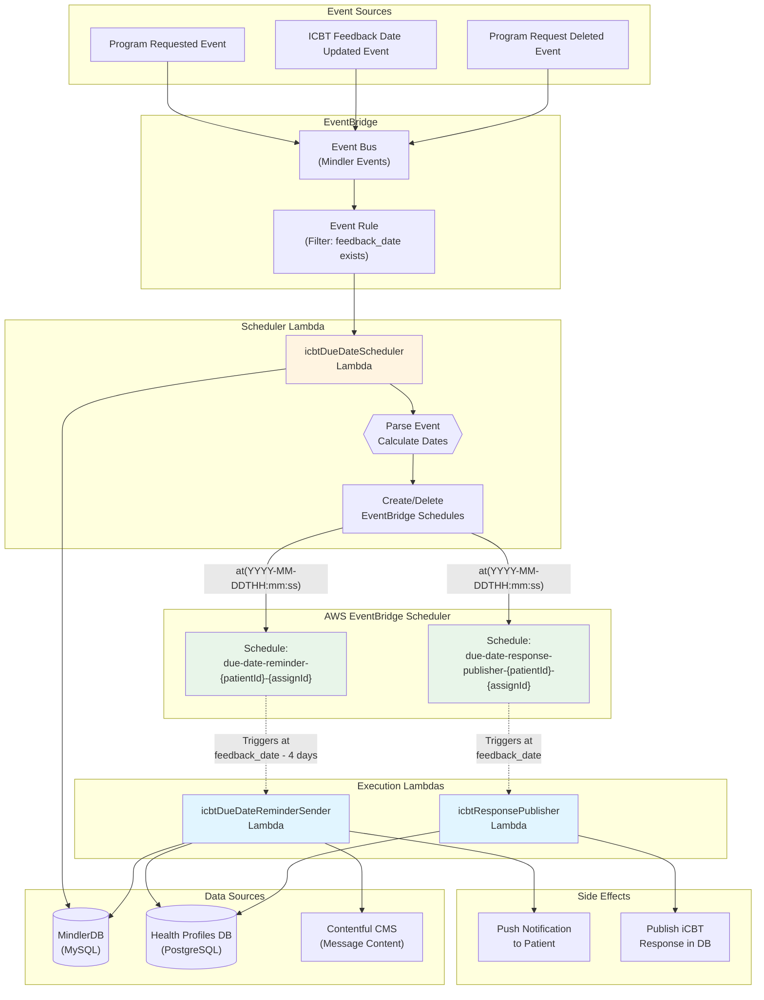
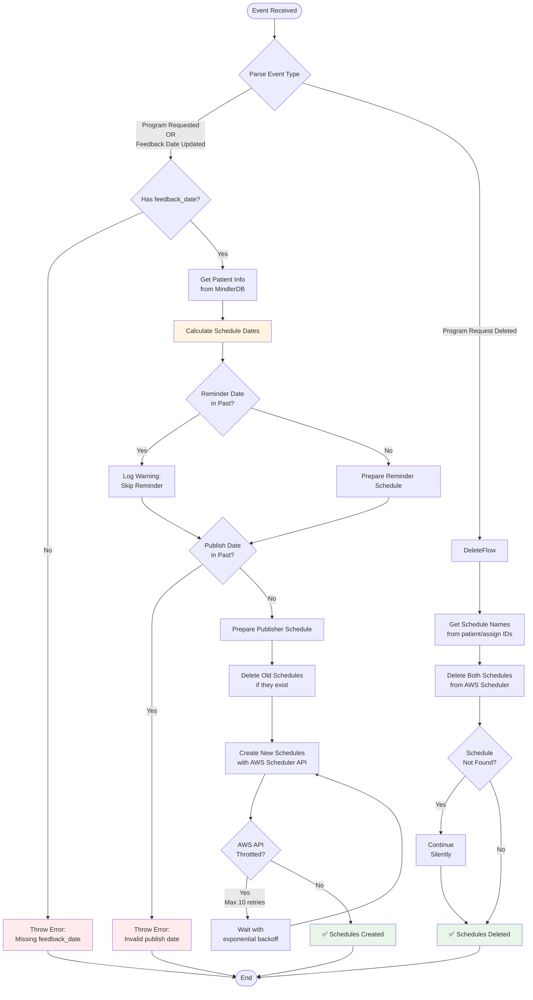
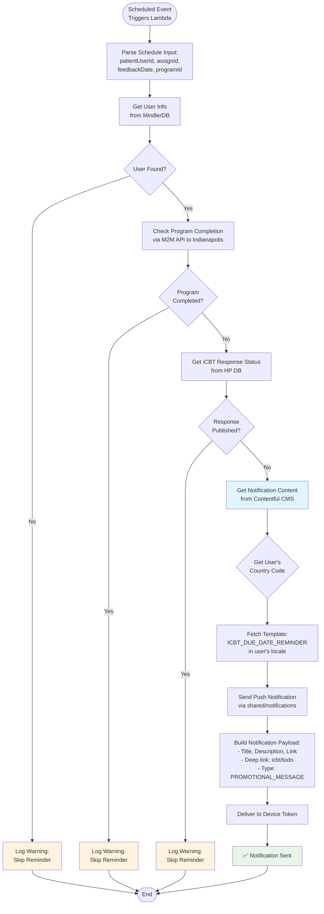
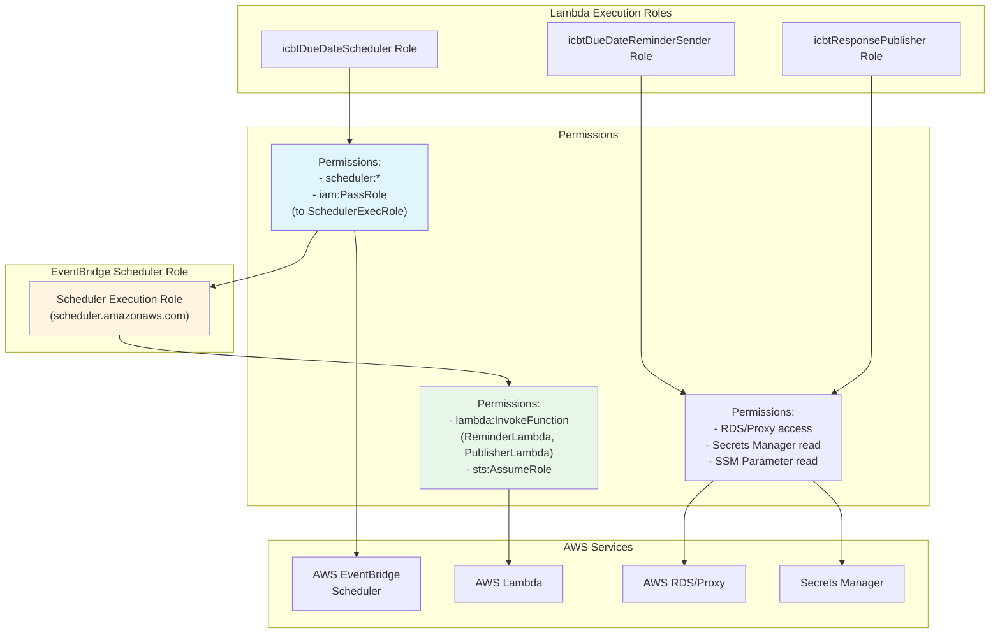
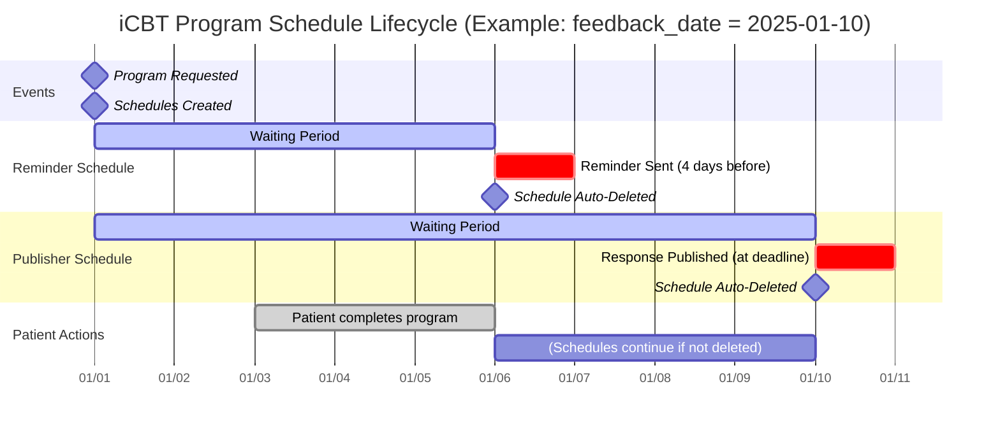
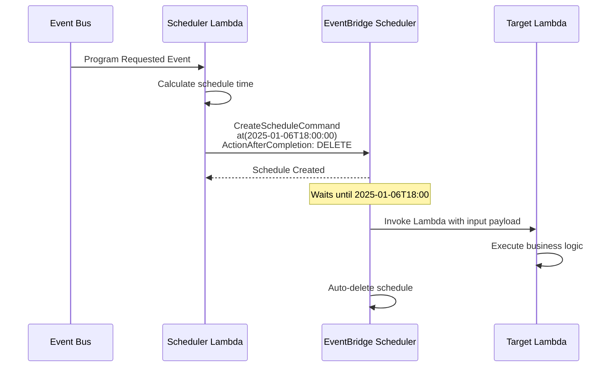
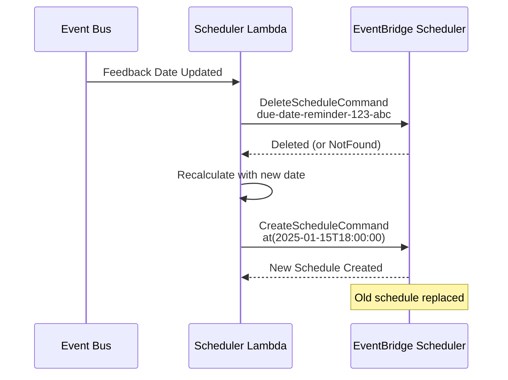

# AWS EventBridge Scheduler Architecture - Health Profiles Service

> **Version:** 1.0  
> **Last Updated:** 2025-11-06  
> **Service:** health-profiles  
> **Purpose:** iCBT (Internet-based Cognitive Behavioral Therapy) program reminders and auto-publishing

---

## Table of Contents

1. [Overview](#overview)
2. [Architecture Diagrams](#architecture-diagrams)
3. [Event Flow](#event-flow)
4. [Key Components](#key-components)
5. [Scheduler Patterns](#scheduler-patterns)
6. [Implementation Details](#implementation-details)

---

## Overview

The health-profiles service uses **AWS EventBridge Scheduler** to create dynamic, patient-specific scheduled tasks for iCBT programs. The scheduler orchestrates two critical workflows:

1. **Due Date Reminders** - Notifies patients 4 days before their program deadline
2. **Auto-Publishing** - Automatically publishes draft responses when the deadline passes

### Key Features

- ✅ **Patient-timezone aware** - Schedules respect patient's local time
- ✅ **Self-cleaning** - Schedules auto-delete after execution
- ✅ **Event-driven** - Triggers from program lifecycle events
- ✅ **Idempotent** - Handles recreate/delete gracefully
- ✅ **Resilient** - Retry logic for AWS API throttling

---

## Architecture Diagrams

### 1. High-Level System Architecture



---

### 2. Scheduler Lambda Decision Flow



---

### 3. Reminder Sender Lambda Flow



---

### 4. Infrastructure - IAM & Permissions



---

### 5. Schedule Lifecycle Timeline



---

## Event Flow

### Event-Driven Triggers

The scheduler is triggered by three event types from the Mindler event bus:

#### 1. Program Requested

```json
{
  "name": "Program Requested",
  "properties": {
    "patientUserId": 12345,
    "assignId": "abc-123",
    "programId": "program-xyz",
    "feedback_date": "2025-01-10T00:00:00Z"
  }
}
```

**Actions**:
- Calculate reminder date: `feedback_date - 4 days at 18:00` (patient timezone)
- Calculate publish date: `feedback_date at 00:00` (UTC)
- Create two EventBridge schedules

---

#### 2. ICBT Feedback Date Updated

```json
{
  "name": "ICBT Feedback Date Updated",
  "properties": {
    "patientUserId": 12345,
    "assignId": "abc-123",
    "programId": "program-xyz",
    "feedback_date": "2025-01-15T00:00:00Z"
  }
}
```

**Actions**:
- Delete existing schedules
- Recalculate dates with new `feedback_date`
- Create new schedules

---

#### 3. Program Request Deleted

```json
{
  "name": "Program Request Deleted",
  "properties": {
    "patientUserId": 12345,
    "assignId": "abc-123"
  }
}
```

**Actions**:
- Delete both schedules:
  - `due-date-reminder-{patientId}-{assignId}`
  - `due-date-response-publisher-{patientId}-{assignId}`

---

## Key Components

### 1. icbtDueDateScheduler Lambda

**File**: `src/lambdas/eventHandlers/scheduling/icbtDueDate/icbtDueDateScheduler.ts`

**Responsibilities**:
- Listen to program lifecycle events
- Calculate schedule dates based on feedback_date
- Create/update/delete EventBridge schedules
- Handle patient timezone resolution

**Schedule Naming Convention**:
```typescript
// Reminder schedule
`due-date-reminder-${patientId}-${assignId}`

// Publisher schedule
`due-date-response-publisher-${patientId}-${assignId}`
```

**Date Calculations**:
```typescript
// Reminder: 4 days before feedback_date at 18:00 patient time
const reminderDate = setMinutes(setHours(subDays(feedbackDate, 4), 18), 0);

// Publisher: Exactly at feedback_date in UTC
const publishDate = feedbackDate;
```

---

### 2. icbtDueDateReminderSender Lambda

**File**: `src/lambdas/eventHandlers/scheduling/icbtDueDate/icbtDueDateReminderSender.ts`

**Responsibilities**:
- Triggered by EventBridge Scheduler at scheduled time
- Check if reminder should still be sent (guards)
- Fetch notification content from Contentful
- Send push notification to patient

**Guard Conditions** (skip if true):
1. User not found
2. Program already completed (check via Indianapolis M2M API)
3. Response already published

**Notification Details**:
- **Type**: `PROMOTIONAL_MESSAGE`
- **Deep Link**: `{APP_DEEP_LINK_URL}icbt/todo`
- **Content**: Fetched from Contentful template `ICBT_DUE_DATE_REMINDER`
- **Localization**: Uses patient's country code (ISO2)

---

### 3. Scheduling Utilities

**File**: `src/lambdas/eventHandlers/scheduling/schedulingUtil.ts`

**Key Functions**:

#### `recreatePatientNotificationSchedule()`
```typescript
async recreatePatientNotificationSchedule({
  client,              // AWS SchedulerClient
  scheduleName,        // Unique schedule identifier
  patientId,           // For timezone resolution
  slotSchedule,        // Target Lambda + schedule time
  timeWindow = {       // Flexible execution window
    Mode: "FLEXIBLE",
    MaximumWindowInMinutes: 15
  }
})
```

**Process**:
1. Delete existing schedule (if exists)
2. Get patient's timezone from MindlerDB
3. Create new schedule with timezone-aware cron expression
4. Set `ActionAfterCompletion: "DELETE"` for auto-cleanup

#### `deletePatientSchedule()`
```typescript
async deletePatientSchedule(client, scheduleName)
```

**Features**:
- Handles `ResourceNotFoundException` gracefully
- Retries on `ConflictException` and `ThrottlingException`
- Max 10 retries with exponential backoff (max 5s)

---

### 4. EventBridge Scheduler Configuration

**Schedule Expression Format**:
```typescript
`at(${format(schedule, "yyyy-MM-dd'T'HH:mm:ss")})`
```

**Example**:
```
at(2025-01-06T18:00:00)
```

**Flexible Time Window**:
- **Reminder**: 15-minute window (Mode: FLEXIBLE)
- **Publisher**: No window (Mode: OFF) for precision

**Timezone Handling**:
- Fetched from patient's country → market → default timezone
- Sweden (SE) → `Europe/Stockholm`
- UK (GB) → `Europe/London`
- Applies to schedule expression automatically

---

## Scheduler Patterns

### Pattern 1: One-Time Scheduled Execution



---

### Pattern 2: Schedule Recreation on Update



---

### Pattern 3: Retry with Exponential Backoff

```typescript
const retryConfig: RetryOptions = {
  retries: 10,
  shouldRetry: (e) =>
    e instanceof ConflictException || 
    e instanceof ThrottlingException,
  maxTimeout: 5000,
};

await pRetry(async () => {
  return await client.send(new CreateScheduleCommand({...}));
}, retryConfig);
```

**Retry Schedule**:
- Attempt 1: Immediate
- Attempt 2: ~500ms
- Attempt 3: ~1s
- Attempt 4: ~2s
- ...
- Attempt 10: ~5s (max)

---

## Implementation Details

### Infrastructure Setup (CDK)

#### 1. Create Scheduler Execution Role

```typescript
const schedulerRole = new Role(this, "SchedulerExecutionRole", {
  assumedBy: new ServicePrincipal("scheduler.amazonaws.com"),
});

// Permission to invoke target Lambdas
schedulerRole.addToPolicy(
  new PolicyStatement({
    actions: ["lambda:InvokeFunction"],
    resources: [
      icbtDueDateReminderSender.functionArn,
      icbtResponsePublisher.functionArn,
    ],
    effect: Effect.ALLOW,
  }),
);

// Permission to assume itself
schedulerRole.addToPolicy(
  new PolicyStatement({
    actions: ["sts:AssumeRole"],
    resources: [schedulerRole.roleArn],
    effect: Effect.ALLOW,
  }),
);
```

---

#### 2. Grant Scheduler Lambda Permissions

```typescript
// Permission to create/delete schedules
const eventBridgeSchedulerPolicy = new PolicyStatement();
eventBridgeSchedulerPolicy.addActions("scheduler:*");
eventBridgeSchedulerPolicy.addAllResources();

// Permission to pass the scheduler execution role
const eventBridgePassRolePolicy = new PolicyStatement();
eventBridgePassRolePolicy.addActions("iam:PassRole");
eventBridgePassRolePolicy.addResources(schedulerRole.roleArn);

schedulerLambda.addToRolePolicy(eventBridgeSchedulerPolicy);
schedulerLambda.addToRolePolicy(eventBridgePassRolePolicy);
```

---

#### 3. Pass Role ARN to Lambda

```typescript
const schedulerLambda = new MindlerLambda(this, "IcbtDueDateScheduler", {
  // ... other config
  functionProps: {
    environment: {
      SCHEDULER_ROLE_ARN: schedulerRole.roleArn,
      ICBT_REMINDER_SENDER_HANDLER_ARN: reminderLambda.functionArn,
      ICBT_RESPONSE_PUBLISHER_HANDLER_ARN: publisherLambda.functionArn,
    },
  },
});
```

---

### Database Queries

#### Get Patient Timezone

```typescript
// From MindlerDB
const foundUser = await client
  .selectFrom("Patients")
  .innerJoin("Users", "Patients.userId", "Users.userId")
  .select(["Users.countryId"])
  .where("Patients.patientId", "=", patientId)
  .executeTakeFirst();

// Map: countryId → market → timezone
const market = getMarketFromCountryId(countryId);
const timezone = getDefaultTimezoneFromMarket(market);
// Returns: "Europe/Stockholm", "Europe/London", etc.
```

---

#### Check iCBT Response Status

```typescript
// From Health Profiles DB
const res = await hpKyselyClient
  .selectFrom("health_profiles.icbt_request_responses")
  .innerJoin(
    "health_profiles.icbt_requests",
    "health_profiles.icbt_requests.id",
    "health_profiles.icbt_request_responses.icbt_request_id",
  )
  .where("health_profiles.icbt_requests.program_id", "=", programId)
  .where("health_profiles.icbt_requests.user_id", "=", String(userId))
  .select("health_profiles.icbt_request_responses.status")
  .executeTakeFirst();

// Returns: "draft" | "published"
```

---

### Error Handling

#### Scenario 1: Feedback Date in Past

```typescript
const reminderDate = setMinutes(setHours(subDays(feedbackDate, 4), 18), 0);

if (isPast(reminderDate)) {
  logger.warning("Feedback date is in the past", { reminderDate, assignId });
  // Schedule with null date → skipped
}
```

---

#### Scenario 2: AWS API Throttling

```typescript
try {
  await client.send(new CreateScheduleCommand({...}));
} catch (e) {
  if (e instanceof ThrottlingException) {
    // Automatically retried by pRetry
    throw e;
  }
  // Other errors
  throw e;
}
```

---

#### Scenario 3: Schedule Already Exists

```typescript
try {
  await client.send(new DeleteScheduleCommand({ Name: scheduleName }));
} catch (e) {
  if (e instanceof ResourceNotFoundException) {
    // No problem, continue to create new one
    return;
  }
  throw e;
}
```

---

## Best Practices

### ✅ DO:

1. **Always set `ActionAfterCompletion: "DELETE"`** - Prevents accumulation of old schedules
2. **Use patient timezone** - Ensures reminders arrive at appropriate local times
3. **Add guard conditions** - Check if action is still needed before executing
4. **Implement retry logic** - AWS Scheduler API can throttle
5. **Use unique schedule names** - Include `patientId` and `assignId` for isolation
6. **Log warnings for skipped actions** - Helps debugging
7. **Pass minimal data in schedule input** - Use IDs, fetch full data at execution time

---

### ❌ DON'T:

1. **Don't forget to delete schedules on event cancellation** - Leads to unwanted executions
2. **Don't use `Mode: OFF` for all schedules** - Can cause DDOS during high traffic
3. **Don't hardcode dates** - Always calculate from event data
4. **Don't skip validation** - Always check `feedback_date` exists
5. **Don't ignore `ResourceNotFoundException`** - It's expected when deleting non-existent schedules
6. **Don't use fixed timezone** - Always resolve patient's timezone
7. **Don't create schedules without checking if date is in past** - Waste of resources

---

## Summary

The health-profiles EventBridge Scheduler architecture provides:

- 🎯 **Precision** - One-time executions at exact times
- 🌍 **Timezone Awareness** - Patient-local scheduling
- 🔄 **Self-Healing** - Auto-cleanup and retry logic
- 📊 **Event-Driven** - Responds to program lifecycle
- 🛡️ **Resilient** - Handles edge cases gracefully
- 🚀 **Scalable** - Per-patient schedule isolation

This pattern can be reused for any time-based patient interactions across Mindler services.

---

**References**:
- AWS EventBridge Scheduler: https://docs.aws.amazon.com/scheduler/latest/UserGuide/
- Code: `/Users/grop/ws/monorepo-3.0/services/health-profiles/src/lambdas/eventHandlers/scheduling/`
- Infrastructure: `/Users/grop/ws/monorepo-3.0/services/health-profiles/infra/service/serviceStack.ts`
